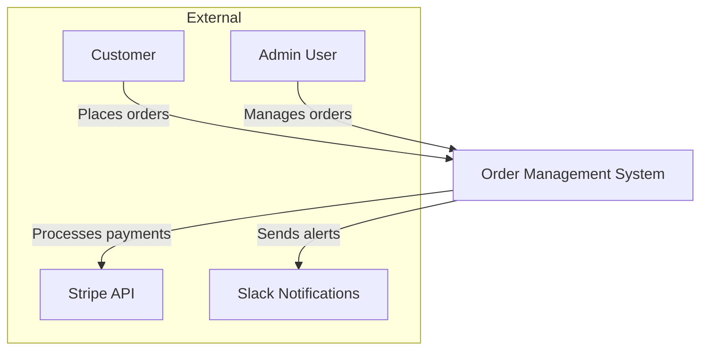
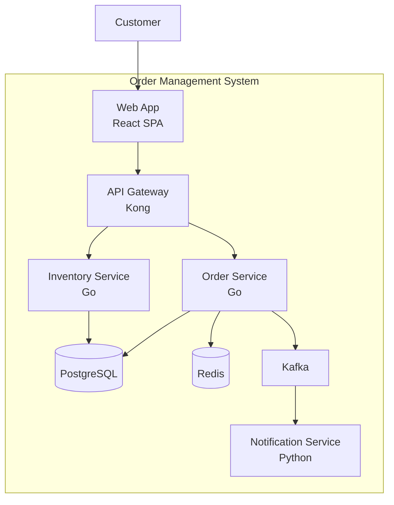
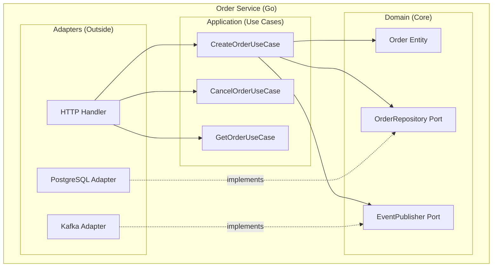
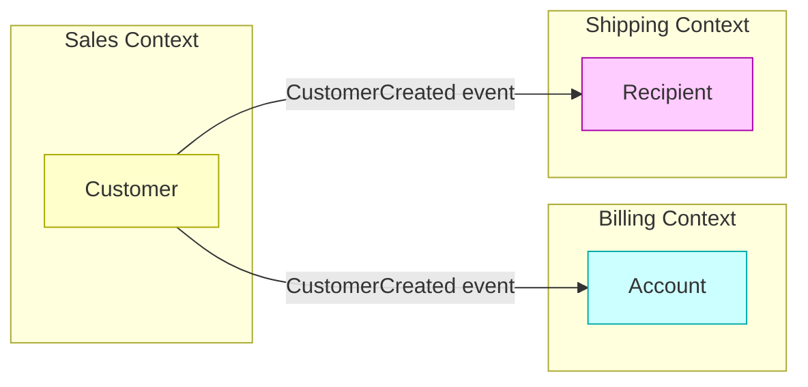

# Clean Architecture & C4 Model: The Google Principal Architect Guide

> **Level**: Google L6+ / Principal Architect / Staff+ Engineer
> **Scope**: Hexagonal Architecture, Ports & Adapters, C4 Diagrams, Dependency Inversion — Production Patterns

> [!CAUTION]
> **The Cardinal Sin**: Drawing architecture diagrams that don't match code. If your diagram shows "Service Layer" but you have no `/services` folder, your diagram is fiction.

---

## 📚 Required Reading

| Book/Resource | Author | Topic |
| :--- | :--- | :--- |
| [Clean Architecture](https://www.oreilly.com/library/view/clean-architecture-a/9780134494272/) | Robert C. Martin | Dependency inversion |
| [C4 Model](https://c4model.com/) | Simon Brown | Diagram hierarchy |
| [Hexagonal Architecture](https://alistair.cockburn.us/hexagonal-architecture/) | Alistair Cockburn | Ports and adapters |

---

## 🎯 The Principal Laws of Clean Architecture

| Law | Statement | Implication |
| :--- | :--- | :--- |
| **Law 1: Dependencies Point Inward** | Core doesn't know about outside | DB, HTTP are details |
| **Law 2: Ports Define Contracts** | Core defines interfaces | Adapters implement |
| **Law 3: Testable Without I/O** | Business logic pure functions | Mocks are easy |
| **Law 4: Diagrams Match Code** | Level 3 = actual folders | No fiction |

---

# Part 1: The Dependency Rule

## 🔄 Traditional vs Clean Architecture

### Traditional (Coupled)
```
┌─────────────────────────────────────────────────────┐
│                    Controller                        │
│                        │                             │
│                        ▼                             │
│                    Service                           │
│                        │                             │
│                        ▼                             │
│              PostgreSQLRepository                    │
│                        │                             │
│                        ▼                             │
│                   PostgreSQL                         │
└─────────────────────────────────────────────────────┘

Problem: Change PostgreSQL → MySQL = rewrite Service
         Service imports PostgreSQLRepository directly
```

### Clean (Decoupled)
```
┌─────────────────────────────────────────────────────┐
│                OUTSIDE (Adapters)                    │
│  ┌───────────┐  ┌──────────────┐  ┌──────────────┐  │
│  │ HTTP API  │  │ PostgreSQL   │  │   Kafka      │  │
│  │ Adapter   │  │  Adapter     │  │  Adapter     │  │
│  └─────┬─────┘  └──────┬───────┘  └──────┬───────┘  │
│        │               │                  │          │
│        │               │                  │          │
│  ┌─────▼───────────────▼──────────────────▼─────┐   │
│  │              INSIDE (Core Domain)             │   │
│  │  ┌────────┐  ┌─────────────┐  ┌────────────┐ │   │
│  │  │ Input  │  │  Business   │  │  Output    │ │   │
│  │  │ Ports  │─►│   Logic     │─►│  Ports     │ │   │
│  │  └────────┘  └─────────────┘  └────────────┘ │   │
│  └──────────────────────────────────────────────┘   │
└─────────────────────────────────────────────────────┘

Dependencies ALWAYS point INWARD.
Core defines interfaces. Adapters implement them.
```

## 📐 Folder Structure (Go Example)

```
order-service/
├── cmd/
│   └── main.go                      # Wire everything together
│
├── internal/
│   ├── domain/                      # CORE (no external imports)
│   │   ├── order.go                 # Entities, Value Objects
│   │   ├── order_service.go         # Business logic
│   │   └── order_repository.go      # PORT: interface for persistence
│   │
│   ├── application/                 # Use Cases (orchestration)
│   │   ├── create_order.go          # CreateOrderUseCase
│   │   └── cancel_order.go          # CancelOrderUseCase
│   │
│   └── adapters/                    # OUTSIDE (implements ports)
│       ├── http/
│       │   ├── handler.go           # HTTP adapter
│       │   └── router.go
│       ├── postgres/
│       │   └── order_repository.go  # Implements domain.OrderRepository
│       └── kafka/
│           └── order_publisher.go   # Implements domain.OrderEventPublisher
│
└── go.mod
```

## 💻 Code Example (Go)

### Domain Layer (Core)
```go
// internal/domain/order.go
package domain

import (
    "errors"
    "time"
)

// Entity
type Order struct {
    ID         string
    CustomerID string
    Items      []OrderItem
    Status     OrderStatus
    Total      Money
    CreatedAt  time.Time
}

// Value Object
type Money struct {
    Amount   int64  // cents
    Currency string
}

// Business rules IN the entity
func (o *Order) Cancel() error {
    if o.Status == OrderStatusShipped {
        return errors.New("cannot cancel shipped order")
    }
    o.Status = OrderStatusCancelled
    return nil
}

// PORT: Interface for persistence (defined in core, implemented outside)
type OrderRepository interface {
    Save(order *Order) error
    FindByID(id string) (*Order, error)
    FindByCustomerID(customerID string) ([]*Order, error)
}

// PORT: Interface for events
type OrderEventPublisher interface {
    PublishOrderCreated(order *Order) error
    PublishOrderCancelled(order *Order) error
}
```

### Application Layer (Use Cases)
```go
// internal/application/create_order.go
package application

import (
    "order-service/internal/domain"
)

type CreateOrderRequest struct {
    CustomerID string
    Items      []domain.OrderItem
}

type CreateOrderUseCase struct {
    repo      domain.OrderRepository
    publisher domain.OrderEventPublisher
}

func NewCreateOrderUseCase(
    repo domain.OrderRepository,
    publisher domain.OrderEventPublisher,
) *CreateOrderUseCase {
    return &CreateOrderUseCase{repo: repo, publisher: publisher}
}

func (uc *CreateOrderUseCase) Execute(req CreateOrderRequest) (*domain.Order, error) {
    // Business logic: create order
    order := domain.NewOrder(req.CustomerID, req.Items)
    
    // Validate (domain rules)
    if err := order.Validate(); err != nil {
        return nil, err
    }
    
    // Persist (via port)
    if err := uc.repo.Save(order); err != nil {
        return nil, err
    }
    
    // Publish event (via port)
    if err := uc.publisher.PublishOrderCreated(order); err != nil {
        // Log but don't fail (event is secondary)
        log.Error("failed to publish event", "error", err)
    }
    
    return order, nil
}
```

### Adapter Layer (Implementations)
```go
// internal/adapters/postgres/order_repository.go
package postgres

import (
    "database/sql"
    "order-service/internal/domain"
)

// Implements domain.OrderRepository
type OrderRepository struct {
    db *sql.DB
}

func NewOrderRepository(db *sql.DB) *OrderRepository {
    return &OrderRepository{db: db}
}

func (r *OrderRepository) Save(order *domain.Order) error {
    _, err := r.db.Exec(
        `INSERT INTO orders (id, customer_id, status, total, currency, created_at)
         VALUES ($1, $2, $3, $4, $5, $6)`,
        order.ID, order.CustomerID, order.Status, order.Total.Amount, order.Total.Currency, order.CreatedAt,
    )
    return err
}

func (r *OrderRepository) FindByID(id string) (*domain.Order, error) {
    row := r.db.QueryRow("SELECT * FROM orders WHERE id = $1", id)
    return scanOrder(row)
}
```

### Wiring (Dependency Injection)
```go
// cmd/main.go
package main

func main() {
    // Create real dependencies
    db := connectPostgres()
    kafka := connectKafka()
    
    // Create adapters
    orderRepo := postgres.NewOrderRepository(db)
    eventPub := kafkaadapter.NewOrderEventPublisher(kafka)
    
    // Create use cases (inject adapters via interfaces)
    createOrder := application.NewCreateOrderUseCase(orderRepo, eventPub)
    
    // Create HTTP handler
    handler := http.NewHandler(createOrder)
    
    // Start server
    server.Run(handler)
}
```

### Testing (No I/O Required)
```go
// internal/application/create_order_test.go
package application_test

type MockOrderRepository struct {
    orders map[string]*domain.Order
}

func (m *MockOrderRepository) Save(order *domain.Order) error {
    m.orders[order.ID] = order
    return nil
}

type MockEventPublisher struct {
    published []*domain.Order
}

func (m *MockEventPublisher) PublishOrderCreated(order *domain.Order) error {
    m.published = append(m.published, order)
    return nil
}

func TestCreateOrder(t *testing.T) {
    // Arrange
    repo := &MockOrderRepository{orders: make(map[string]*domain.Order)}
    pub := &MockEventPublisher{}
    useCase := application.NewCreateOrderUseCase(repo, pub)
    
    // Act
    order, err := useCase.Execute(CreateOrderRequest{
        CustomerID: "cust-123",
        Items:      []domain.OrderItem{{SKU: "ABC", Qty: 2}},
    })
    
    // Assert
    assert.NoError(t, err)
    assert.NotEmpty(t, order.ID)
    assert.Len(t, repo.orders, 1)
    assert.Len(t, pub.published, 1)
}

// No database. No Kafka. No Docker.
// Pure unit test.
```

---

# Part 2: The C4 Model

## 📐 The 4 Levels

```
Level 1: CONTEXT   → "What is this system and who uses it?"
Level 2: CONTAINER → "What are the deployable units?"
Level 3: COMPONENT → "What's inside each container?"
Level 4: CODE      → "What are the classes/functions?"
```

## 🎯 Level 1: System Context Diagram

**Audience**: Product managers, stakeholders, new team members



Rules:
- Show YOUR system as a single box
- Show users (personas)
- Show external systems
- NO technology details

## 🎯 Level 2: Container Diagram

**Audience**: Tech leads, DevOps, security reviewers



Rules:
- Each box is a **separately deployable unit**
- Include technology (Go, React, PostgreSQL)
- Show data flow (arrows)
- Show protocols if relevant (HTTP, gRPC)

## 🎯 Level 3: Component Diagram

**Audience**: Developers on the team



Rules:
- **MUST match actual code structure**
- Show interfaces (ports) and implementations (adapters)
- If box name doesn't match a folder/package, diagram is wrong

## 🎯 Level 4: Code Diagram

**Rule**: Auto-generate or don't maintain at all.

```
Use your IDE's "Go to Definition" and "Find References".
Don't manually draw class diagrams.
They WILL become stale.
```

---

# Part 3: DDD Strategic Patterns

## 🏛️ Bounded Contexts

```
The word "Customer" means different things:

Sales Context:
  Customer = Lead with opportunity score, sales rep, pipeline stage

Billing Context:
  Customer = Account with payment methods, invoices, credit limit

Shipping Context:
  Customer = Delivery address, shipping preferences, timezone

Each context has its OWN Customer model.
No shared "God Object" Customer.
```

### Context Mapping


## 🔤 Ubiquitous Language

```
WRONG:
- Developer: "The UserEntity has a status field"
- PM: "When a person becomes active..."
- Designer: "The member profile shows..."

Three different terms for the same thing.

RIGHT:
- Everyone: "When a Customer becomes Active, 
             the Customer Profile shows their status."

The code:
  type Customer struct {
      Status CustomerStatus  // Active, Inactive, Suspended
  }
  
  func (c *Customer) Activate() { ... }
  
  type CustomerProfile struct {
      Status CustomerStatus
  }
```

---

## ✅ Principal Architect Checklist

| # | Item | Verification |
| :--- | :--- | :--- |
| 1 | Domain has no external imports | Check import statements |
| 2 | Ports defined in domain layer | Interfaces exist |
| 3 | Adapters implement ports | Check implements |
| 4 | Tests don't need Docker | Unit tests are pure |
| 5 | C4 L3 matches folder structure | Compare diagram to `tree` |
| 6 | Bounded contexts identified | No shared "God Objects" |
| 7 | Ubiquitous language documented | Glossary exists |
| 8 | Diagrams have legends | Shapes explained |

---

## 🔗 Related Documents
*   [Architecture Hard Parts](./hard-parts.md) — Trade-off analysis.
*   [Evolutionary Architecture](./evolutionary-architecture-guide.md) — Fitness functions.
*   [Saga Pattern](../distributive-backend/database/saga/saga-pattern-guide.md) — Cross-boundary transactions.
