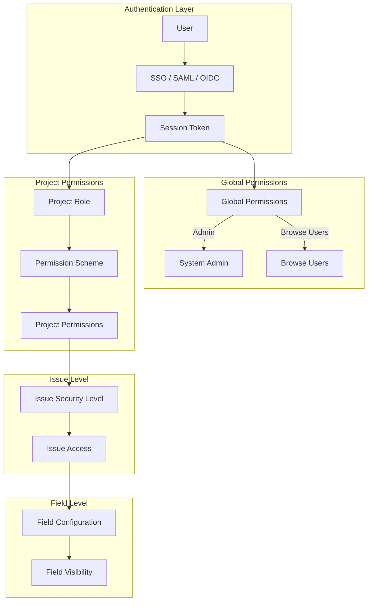
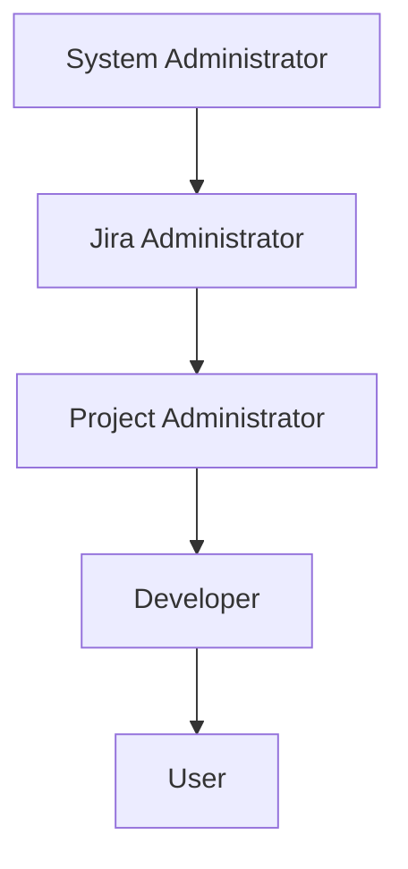
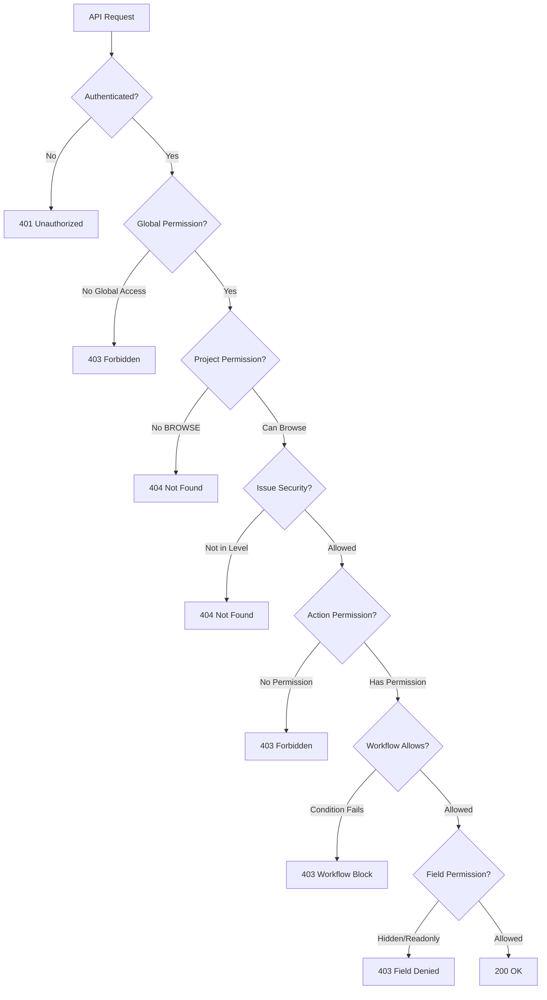

# Atlassian JIRA Authorization: The Principal Architect Guide

> **Level**: Principal Architect / Lead Security Engineer (Enterprise-scale)
> **Scope**: Authentication, RBAC, ReBAC, PBAC, Permission Schemes, Roles, Advanced Schema Design (EAV, Inheritance), and API Authorization.

> [!CAUTION]
> **The Cardinal Sin**: Treating JIRA permissions as "simple RBAC". JIRA uses a **layered permission model** with Global → Project → Issue Level → Field Level controls. Miss one layer and you leak data.

---

## 🎯 JIRA's Authorization Model Overview

JIRA uses a **hybrid authorization model** combining:
1. **RBAC (Role-Based Access Control)**: Global roles, Project roles.
2. **ReBAC (Relationship-Based Access Control)**: Reporter, Assignee, Watcher relationships.
3. **PBAC (Policy-Based Access Control)**: Permission schemes, workflows, validators.
4. **ABAC (Attribute-Based Access Control)**: Issue security levels, JQL-based rules.
5. **Resource-Based PBAC**: Permissions bound to specific resources, not just roles.



---

## 🔐 Authentication (AuthN)

### Atlassian Cloud (OAuth 2.0 / OIDC)
```
1. User clicks "Login with Atlassian" in your app.
2. Redirect to: https://auth.atlassian.com/authorize
3. User authenticates (SSO, password, etc.).
4. Atlassian redirects back with `authorization_code`.
5. Exchange code for tokens:
   - access_token (1 hour)
   - refresh_token (90 days)
6. Include token in API calls: Authorization: Bearer <token>
```

### JIRA Data Center (Session / Basic / PAT)
| Method | Use Case | Expiry |
| :--- | :--- | :--- |
| Session Cookie | Browser-based, after password login. | Configurable (default 5 hours). |
| Basic Auth | Legacy integrations (DEPRECATED). | N/A (Password in header). |
| Personal Access Token (PAT) | API access, CI/CD. | 1 year max. |
| OAuth 1.0a | Legacy apps. | Long-lived. |

### API Authentication (Cloud)
```bash
# Get accessible resources (sites)
curl -X GET https://api.atlassian.com/oauth/token/accessible-resources \
  -H "Authorization: Bearer <access_token>"

# Response
[
  {
    "id": "a1b2c3d4-...",
    "url": "https://your-site.atlassian.net",
    "name": "Your Site",
    "scopes": ["read:jira-work", "write:jira-work", ...]
  }
]

# JIRA API call
curl -X GET "https://api.atlassian.com/ex/jira/<cloud_id>/rest/api/3/myself" \
  -H "Authorization: Bearer <access_token>"
```

---

## 🎭 RBAC: Roles in JIRA

### Global Roles
| Role | Description | Key Permissions |
| :--- | :--- | :--- |
| **Jira Administrators** | Full system access. | Manage projects, users, global config. |
| **Jira System Administrators** | Super admin. | Access logs, plugins, database. |
| **Jira Software Administrators** | Software-specific config. | Board config, Agile settings. |
| **Jira Service Management Administrators** | JSM config. | Queues, SLAs, portals. |
| **users-jira** | Default group for all JIRA users. | Login, basic access. |

### Default Project Roles
| Role | Description | Typical Permissions |
| :--- | :--- | :--- |
| **Administrators** | Project admins. | Edit project, manage versions/components. |
| **Developers** | Contributors. | Create, edit, transition issues. |
| **Users** | Read-only or limited. | View issues, add comments. |

### Custom Project Roles
```bash
# Create custom role
POST /rest/api/3/role
{
  "name": "QA Engineers",
  "description": "Quality Assurance team members"
}

# Add user to project role
POST /rest/api/3/project/{projectIdOrKey}/role/{roleId}
{
  "user": ["accountId1", "accountId2"]
}
```

### API: Get Project Roles
```bash
# Get all roles for a project
curl -X GET "https://your-site.atlassian.net/rest/api/3/project/PROJ/role" \
  -H "Authorization: Bearer <token>"

# Response
{
  "Administrators": "https://your-site.atlassian.net/rest/api/3/project/PROJ/role/10002",
  "Developers": "https://your-site.atlassian.net/rest/api/3/project/PROJ/role/10001",
  "Users": "https://your-site.atlassian.net/rest/api/3/project/PROJ/role/10000"
}
```

---

## 📋 Permission Schemes

A **Permission Scheme** defines WHO can do WHAT at the project level.

### Permission Matrix (Complete)
| Permission | Description | Grantable To | Risk Level |
| :--- | :--- | :--- | :--- |
| **BROWSE_PROJECTS** | View project and issues. | Group, Role, User, Anyone. | Low |
| **CREATE_ISSUES** | Create new issues. | Group, Role, User. | Low |
| **EDIT_ISSUES** | Edit any issue field. | Group, Role, User, Reporter, Assignee. | Medium |
| **EDIT_OWN_WORKLOGS** | Edit own worklogs. | Group, Role, User. | Low |
| **EDIT_ALL_WORKLOGS** | Edit any worklog. | Admin only. | High |
| **TRANSITION_ISSUES** | Move through workflow. | Group, Role, User. | Medium |
| **ASSIGN_ISSUES** | Change assignee. | Group, Role, User. | Medium |
| **ASSIGNABLE_USER** | Can BE assigned. | Group, Role, User. | Low |
| **RESOLVE_ISSUES** | Mark as resolved. | Group, Role, User. | Medium |
| **CLOSE_ISSUES** | Mark as closed. | Group, Role, User. | Medium |
| **DELETE_ISSUES** | Permanently delete. | Admin only. | **Critical** |
| **DELETE_OWN_COMMENTS** | Delete own comments. | Group, Role, User. | Low |
| **DELETE_ALL_COMMENTS** | Delete any comment. | Admin only. | High |
| **MOVE_ISSUES** | Move to another project. | Admin. | High |
| **SCHEDULE_ISSUES** | Set due dates. | Group, Role, User. | Low |
| **LINK_ISSUES** | Create issue links. | Group, Role, User. | Low |
| **SET_ISSUE_SECURITY** | Apply security levels. | Group, Role, User. | High |
| **CREATE_ATTACHMENTS** | Add attachments. | Group, Role, User. | Low |
| **DELETE_OWN_ATTACHMENTS** | Delete own attachments. | Group, Role, User. | Low |
| **DELETE_ALL_ATTACHMENTS** | Delete any attachment. | Admin only. | High |
| **MANAGE_WATCHERS** | Add/remove watchers. | Group, Role, User. | Low |
| **VIEW_VOTERS_AND_WATCHERS** | See who voted/watching. | Group, Role, User. | Low |
| **ADD_COMMENTS** | Comment on issues. | Group, Role, User. | Low |
| **EDIT_OWN_COMMENTS** | Edit own comments. | Group, Role, User. | Low |
| **EDIT_ALL_COMMENTS** | Edit any comment. | Admin only. | High |
| **WORK_ON_ISSUES** | Log time. | Group, Role, User. | Low |
| **ADMINISTER_PROJECTS** | Manage project settings. | Admin Role. | **Critical** |
| **VIEW_DEV_TOOLS** | See dev panel (commits, builds). | Group, Role, User. | Medium |
| **VIEW_READONLY_WORKFLOW** | See workflow but not edit. | Group, Role, User. | Low |

### Permission Scheme Structure
```json
{
  "id": 10000,
  "name": "Engineering Permission Scheme",
  "description": "For engineering projects",
  "permissions": [
    {
      "permission": "BROWSE_PROJECTS",
      "holder": { "type": "projectRole", "parameter": "Users" }
    },
    {
      "permission": "CREATE_ISSUES",
      "holder": { "type": "projectRole", "parameter": "Developers" }
    },
    {
      "permission": "EDIT_ISSUES",
      "holder": { "type": "reporter" }
    },
    {
      "permission": "ASSIGN_ISSUES",
      "holder": { "type": "projectRole", "parameter": "Developers" }
    },
    {
      "permission": "DELETE_ISSUES",
      "holder": { "type": "projectRole", "parameter": "Administrators" }
    },
    {
      "permission": "ADMINISTER_PROJECTS",
      "holder": { "type": "projectRole", "parameter": "Administrators" }
    }
  ]
}
```

### API: Check User Permissions
```bash
# Check if current user has specific permissions on a project
curl -X GET "https://your-site.atlassian.net/rest/api/3/mypermissions?projectKey=PROJ&permissions=BROWSE_PROJECTS,CREATE_ISSUES,EDIT_ISSUES,DELETE_ISSUES" \
  -H "Authorization: Bearer <token>"

# Response
{
  "permissions": {
    "BROWSE_PROJECTS": { "id": "10", "key": "BROWSE_PROJECTS", "havePermission": true },
    "CREATE_ISSUES": { "id": "11", "key": "CREATE_ISSUES", "havePermission": true },
    "EDIT_ISSUES": { "id": "12", "key": "EDIT_ISSUES", "havePermission": false },
    "DELETE_ISSUES": { "id": "25", "key": "DELETE_ISSUES", "havePermission": false }
  }
}
```

---

## 🔗 ReBAC: Relationship-Based Access Control

### Built-in Relationships
| Relationship | Description | Use Case | Schema Column |
| :--- | :--- | :--- | :--- |
| **Reporter** | User who created the issue. | Edit own issues. | `jiraissue.reporter` |
| **Assignee** | User assigned to the issue. | Transition, resolve. | `jiraissue.assignee` |
| **Watcher** | User watching the issue. | Notifications. | `userassociation.SINK_NODE_ENTITY='Issue'` |
| **Voter** | User who voted on issue. | Show interest. | `userassociation.ASSOCIATION_TYPE='VoteIssue'` |
| **Component Lead** | Lead of the issue's component. | Component permissions. | `component.lead` |
| **Project Lead** | Lead of the project. | Elevated access. | `project.lead` |

### Permission Grant Types (ReBAC)
```json
{
  "permission": "EDIT_ISSUES",
  "holder": { "type": "reporter" }
},
{
  "permission": "RESOLVE_ISSUES",
  "holder": { "type": "assignee" }
},
{
  "permission": "ASSIGN_ISSUES",
  "holder": { "type": "projectLead" }
},
{
  "permission": "BROWSE_PROJECTS",
  "holder": { "type": "componentLead" }
}
```

### JQL: Finding Issues by Relationship
```jql
-- Issues I reported
reporter = currentUser()

-- Issues assigned to me
assignee = currentUser()

-- Issues I'm watching
watcher = currentUser()

-- Issues I voted on
voter = currentUser()

-- Issues in my team's component
component in componentsLeadByUser(currentUser())

-- Issues in projects I lead
project in projectsLeadByUser(currentUser())

-- Combining relationships
reporter = currentUser() OR assignee = currentUser() OR watcher = currentUser()
```

---

## 🏢 Resource-Based PBAC

JIRA binds policies to **specific resources**, not just abstract permissions.

### Resource Hierarchy
```
Organization (Cloud)
  └── Site
       └── Product (Jira Software, JSM, etc.)
            └── Project
                 └── Board / Queue
                 └── Component
                 └── Version
                 └── Issue Type
                      └── Issue
                           └── SubTask
                           └── Attachment
                           └── Comment
                           └── Worklog
                           └── Custom Field
```

### Resource-Specific Policies
| Resource | Policy Layer | Schema/API |
| :--- | :--- | :--- |
| **Project** | Permission Scheme | `nodeassociation` + `permissionscheme` |
| **Issue Type** | Issue Type Scheme | `issuetypescheme` + `issuetypescreen` |
| **Workflow** | Workflow Scheme | `workflowscheme` + `jiraworkflows` |
| **Field** | Field Configuration Scheme | `fieldconfigscheme` + `fieldconfiguration` |
| **Screen** | Screen Scheme | `screenscheme` + `fieldscreen` |
| **Board** | Board Admins | `boardpermission` (Jira Software) |
| **Filter** | Filter Permissions | `searchrequest` + `sharededentity` |
| **Dashboard** | Dashboard Permissions | `portalpage` + `sharededentity` |

### Board-Level Permissions (Jira Software)
```bash
# Get board admins
GET /rest/agile/1.0/board/{boardId}/admins

# Add board admin
PUT /rest/agile/1.0/board/{boardId}/admins
{
  "users": ["accountId1"],
  "groups": ["developers"]
}
```

### Filter/Dashboard Sharing
```json
{
  "id": 10000,
  "name": "My Sprint Filter",
  "owner": "user123",
  "sharePermissions": [
    { "type": "global" },                              // Everyone
    { "type": "group", "group": { "name": "dev-team" } },
    { "type": "project", "project": { "id": "10001" } },
    { "type": "projectRole", "project": { "id": "10001" }, "role": { "id": "10002" } },
    { "type": "user", "user": { "accountId": "abc123" } }  // Specific user
  ]
}
```

---

## 🏗️ Advanced Schema Design: God Mode

### JIRA's Actual Database Schema (Data Center)

#### Core Tables
```sql
-- Projects
CREATE TABLE project (
    id BIGINT PRIMARY KEY,
    pkey VARCHAR(255) UNIQUE NOT NULL,      -- "PROJ"
    pname VARCHAR(255),
    lead VARCHAR(255),                       -- User key
    projecttype VARCHAR(255),
    originalkey VARCHAR(255)
);

-- Issues
CREATE TABLE jiraissue (
    id BIGINT PRIMARY KEY,
    pkey VARCHAR(255),                       -- Denormalized project key
    issuenum BIGINT,
    project BIGINT REFERENCES project(id),
    reporter VARCHAR(255),
    assignee VARCHAR(255),
    issuetype VARCHAR(255),                  -- FK to issuetype
    summary VARCHAR(255),
    description TEXT,
    priority VARCHAR(255),
    resolution VARCHAR(255),
    issuestatus VARCHAR(255),
    created TIMESTAMP,
    updated TIMESTAMP,
    security BIGINT                          -- FK to issue security level
);
```

#### The Node Association Pattern (Polymorphic Relationships)
```sql
-- The magic table that connects ANYTHING to ANYTHING
CREATE TABLE nodeassociation (
    source_node_id BIGINT NOT NULL,
    source_node_entity VARCHAR(60) NOT NULL,    -- e.g., 'Project', 'Issue', 'User'
    sink_node_id BIGINT NOT NULL,
    sink_node_entity VARCHAR(60) NOT NULL,      -- e.g., 'PermissionScheme', 'Workflow'
    association_type VARCHAR(60) NOT NULL,      -- e.g., 'ProjectScheme', 'IssueComponent'
    sequence INT
);

CREATE INDEX idx_na_source ON nodeassociation(source_node_entity, source_node_id);
CREATE INDEX idx_na_sink ON nodeassociation(sink_node_entity, sink_node_id);
CREATE INDEX idx_na_assoc ON nodeassociation(association_type);
```

**Usage Examples:**
```sql
-- Project → Permission Scheme
INSERT INTO nodeassociation VALUES (10001, 'Project', 10100, 'PermissionScheme', 'ProjectScheme', 0);

-- Project → Workflow Scheme
INSERT INTO nodeassociation VALUES (10001, 'Project', 10200, 'WorkflowScheme', 'ProjectScheme', 0);

-- Issue → Component
INSERT INTO nodeassociation VALUES (50001, 'Issue', 300, 'Component', 'IssueComponent', 0);

-- User → Issue (Watcher)
INSERT INTO nodeassociation VALUES (123, 'User', 50001, 'Issue', 'WatchIssue', 0);
```

---

## 📦 EAV Pattern (Entity-Attribute-Value)

JIRA uses EAV for **Custom Fields** to allow unlimited user-defined fields without schema changes.

### Custom Field Schema
```sql
-- Custom Field Definition
CREATE TABLE customfield (
    id BIGINT PRIMARY KEY,
    customfieldtypekey VARCHAR(255),         -- 'com.atlassian.jira.plugin.system.customfieldtypes:textfield'
    customfieldsearcherkey VARCHAR(255),
    cfname VARCHAR(255),                      -- Display name
    description TEXT,
    isactive CHAR(1) DEFAULT 'Y',
    islocked CHAR(1) DEFAULT 'N',
    isshared BOOLEAN DEFAULT FALSE
);

-- Custom Field Values (The EAV Table)
CREATE TABLE customfieldvalue (
    id BIGINT PRIMARY KEY,
    issue BIGINT REFERENCES jiraissue(id),
    customfield BIGINT REFERENCES customfield(id),
    
    -- Polymorphic value storage (only one populated per row)
    stringvalue VARCHAR(255),
    numbervalue NUMERIC(18,6),
    textvalue TEXT,                           -- For large text
    datevalue TIMESTAMP,
    
    -- For multi-select/cascading
    parentkey VARCHAR(255)
);

CREATE INDEX idx_cfv_issue ON customfieldvalue(issue);
CREATE INDEX idx_cfv_field ON customfieldvalue(customfield);
CREATE INDEX idx_cfv_string ON customfieldvalue(customfield, stringvalue);
CREATE INDEX idx_cfv_number ON customfieldvalue(customfield, numbervalue);
```

### Querying Custom Fields (The Pain)
```sql
-- Get all custom field values for an issue
SELECT 
    i.pkey || '-' || i.issuenum AS issue_key,
    cf.cfname AS field_name,
    COALESCE(cfv.stringvalue, cfv.textvalue, cfv.numbervalue::TEXT, cfv.datevalue::TEXT) AS value
FROM jiraissue i
JOIN customfieldvalue cfv ON cfv.issue = i.id
JOIN customfield cf ON cf.id = cfv.customfield
WHERE i.id = 50001;

-- Search issues by custom field value (SLOW without index)
SELECT i.*
FROM jiraissue i
JOIN customfieldvalue cfv ON cfv.issue = i.id
WHERE cfv.customfield = 10100                 -- 'Sprint' field
  AND cfv.stringvalue = 'Sprint 42';
```

### EAV Trade-offs
| Advantage | Disadvantage |
| :--- | :--- |
| Unlimited custom fields | Queries are JOINs, not column access |
| No schema migrations | No column-level constraints |
| User-defined at runtime | Indexing is complex |
| Multi-tenant friendly | Reporting is painful |

### Optimizing EAV Queries
```sql
-- Materialize custom fields into a JSON column for fast reads (Hacky but efficient)
ALTER TABLE jiraissue ADD COLUMN custom_fields JSONB;

-- Trigger to update JSON on custom field change
CREATE OR REPLACE FUNCTION sync_custom_fields() RETURNS TRIGGER AS $$
BEGIN
    UPDATE jiraissue SET custom_fields = (
        SELECT jsonb_object_agg(cf.cfname, 
            COALESCE(cfv.stringvalue, cfv.textvalue, cfv.numbervalue::TEXT)
        )
        FROM customfieldvalue cfv
        JOIN customfield cf ON cf.id = cfv.customfield
        WHERE cfv.issue = NEW.issue
    )
    WHERE id = NEW.issue;
    RETURN NEW;
END;
$$ LANGUAGE plpgsql;

CREATE TRIGGER trg_sync_cf AFTER INSERT OR UPDATE ON customfieldvalue
FOR EACH ROW EXECUTE FUNCTION sync_custom_fields();

-- Now you can query:
SELECT * FROM jiraissue 
WHERE custom_fields->>'Sprint' = 'Sprint 42';
```

---

## 🧬 Inheritance Patterns

### Role Inheritance


### Schema: Role Hierarchy
```sql
CREATE TABLE role_hierarchy (
    parent_role_id BIGINT REFERENCES projectrole(id),
    child_role_id BIGINT REFERENCES projectrole(id),
    PRIMARY KEY (parent_role_id, child_role_id)
);

-- Example: Project Admin inherits from Developer
INSERT INTO role_hierarchy VALUES (10002, 10001);  -- Admin → Developer
INSERT INTO role_hierarchy VALUES (10001, 10000);  -- Developer → User
```

### Recursive Permission Check
```sql
-- Get all inherited roles for a user
WITH RECURSIVE role_tree AS (
    -- Base: Direct role memberships
    SELECT pra.projectroleid AS role_id, pr.name AS role_name, 0 AS depth
    FROM projectroleactor pra
    JOIN projectrole pr ON pr.id = pra.projectroleid
    WHERE pra.roletypeparameter = 'target_user'
      AND pra.pid = 10001  -- Project ID
    
    UNION
    
    -- Recursive: Inherited roles
    SELECT rh.parent_role_id, pr.name, rt.depth + 1
    FROM role_tree rt
    JOIN role_hierarchy rh ON rh.child_role_id = rt.role_id
    JOIN projectrole pr ON pr.id = rh.parent_role_id
    WHERE rt.depth < 10  -- Prevent infinite recursion
)
SELECT DISTINCT role_id, role_name FROM role_tree;
```

### Permission Scheme Inheritance
```sql
-- Default Permission Scheme (parent)
-- Engineering Permission Scheme (child, overrides some permissions)

CREATE TABLE permissionscheme_inheritance (
    child_scheme_id BIGINT PRIMARY KEY REFERENCES permissionscheme(id),
    parent_scheme_id BIGINT REFERENCES permissionscheme(id)
);

-- Get effective permissions (child overrides parent)
WITH parent_perms AS (
    SELECT sp.permission_key, sp.perm_type, sp.perm_parameter, 1 AS priority
    FROM schemepermissions sp
    WHERE sp.scheme = (SELECT parent_scheme_id FROM permissionscheme_inheritance WHERE child_scheme_id = 10000)
),
child_perms AS (
    SELECT sp.permission_key, sp.perm_type, sp.perm_parameter, 2 AS priority
    FROM schemepermissions sp
    WHERE sp.scheme = 10000
)
SELECT DISTINCT ON (permission_key) *
FROM (SELECT * FROM parent_perms UNION ALL SELECT * FROM child_perms) all_perms
ORDER BY permission_key, priority DESC;
```

---

## 🔧 Hacky But Efficient Schema Patterns

### Pattern 1: Denormalized Project Key
```sql
-- ❌ Normalized (requires JOIN)
SELECT p.pkey, i.issuenum FROM jiraissue i
JOIN project p ON p.id = i.project;

-- ✅ Denormalized (fast)
SELECT pkey, issuenum FROM jiraissue;  -- pkey stored directly
```

### Pattern 2: Composite Issue Key Index
```sql
-- Fast lookup by issue key (PROJ-123)
CREATE UNIQUE INDEX idx_issue_key ON jiraissue(pkey, issuenum);

-- Query:
SELECT * FROM jiraissue WHERE pkey = 'PROJ' AND issuenum = 123;
```

### Pattern 3: Bit Flags for Permissions (High Performance)
```sql
-- Instead of rows per permission, use a bitmask
CREATE TABLE user_project_perms_fast (
    user_id BIGINT,
    project_id BIGINT,
    perms_bitmask BIGINT,  -- Each bit = one permission
    PRIMARY KEY (user_id, project_id)
);

-- Permission bit positions
-- Bit 0: BROWSE_PROJECTS
-- Bit 1: CREATE_ISSUES
-- Bit 2: EDIT_ISSUES
-- Bit 3: DELETE_ISSUES
-- ...

-- Check if user has EDIT_ISSUES (bit 2)
SELECT * FROM user_project_perms_fast
WHERE user_id = 123 AND project_id = 10001
  AND (perms_bitmask & (1 << 2)) != 0;

-- Grant EDIT_ISSUES
UPDATE user_project_perms_fast
SET perms_bitmask = perms_bitmask | (1 << 2)
WHERE user_id = 123 AND project_id = 10001;

-- Revoke EDIT_ISSUES
UPDATE user_project_perms_fast
SET perms_bitmask = perms_bitmask & ~(1 << 2)
WHERE user_id = 123 AND project_id = 10001;
```

### Pattern 4: Materialized Permission Cache
```sql
-- Compute and cache effective permissions
CREATE TABLE user_effective_perms (
    user_id BIGINT,
    project_id BIGINT,
    issue_id BIGINT,  -- NULL for project-level
    permissions TEXT[],
    computed_at TIMESTAMP DEFAULT NOW(),
    PRIMARY KEY (user_id, project_id, COALESCE(issue_id, 0))
);

-- Refresh cache on permission change
CREATE OR REPLACE FUNCTION refresh_user_perms(p_user_id BIGINT, p_project_id BIGINT) 
RETURNS VOID AS $$
BEGIN
    DELETE FROM user_effective_perms WHERE user_id = p_user_id AND project_id = p_project_id;
    
    INSERT INTO user_effective_perms (user_id, project_id, issue_id, permissions)
    SELECT 
        p_user_id,
        p_project_id,
        NULL,
        ARRAY_AGG(DISTINCT sp.permission_key)
    FROM schemepermissions sp
    -- Complex join logic to compute effective permissions
    WHERE /* user matches holder via role/group/etc */;
END;
$$ LANGUAGE plpgsql;

-- Fast permission check
SELECT EXISTS (
    SELECT 1 FROM user_effective_perms
    WHERE user_id = 123 AND project_id = 10001
      AND 'EDIT_ISSUES' = ANY(permissions)
);
```

### Pattern 5: Closure Table for Hierarchy
```sql
-- For issue parent/child relationships (Epic → Story → Subtask)
CREATE TABLE issue_closure (
    ancestor_id BIGINT REFERENCES jiraissue(id),
    descendant_id BIGINT REFERENCES jiraissue(id),
    depth INT NOT NULL,
    PRIMARY KEY (ancestor_id, descendant_id)
);

-- Populate on insert
-- Self-reference
INSERT INTO issue_closure VALUES (50001, 50001, 0);

-- When Story 50002 is child of Epic 50001
INSERT INTO issue_closure 
SELECT ancestor_id, 50002, depth + 1 FROM issue_closure WHERE descendant_id = 50001;
INSERT INTO issue_closure VALUES (50002, 50002, 0);

-- Get all descendants of Epic 50001
SELECT descendant_id FROM issue_closure WHERE ancestor_id = 50001 AND depth > 0;

-- Get all ancestors of Subtask 50003
SELECT ancestor_id FROM issue_closure WHERE descendant_id = 50003 AND depth > 0;
```

### Pattern 6: Tenant Isolation (Multi-Tenancy)
```sql
-- Row-Level Security for SaaS (like Atlassian Cloud)
ALTER TABLE jiraissue ENABLE ROW LEVEL SECURITY;

CREATE POLICY tenant_isolation ON jiraissue
    USING (tenant_id = current_setting('app.current_tenant')::BIGINT);

-- Set tenant before queries
SET app.current_tenant = '12345';
SELECT * FROM jiraissue;  -- Only sees tenant 12345's issues
```

---

## 🛡️ Issue Security Levels

### Security Scheme Structure
```sql
CREATE TABLE issuesecurityscheme (
    id BIGINT PRIMARY KEY,
    name VARCHAR(255),
    description TEXT
);

CREATE TABLE schemeissuesecuritylevels (
    id BIGINT PRIMARY KEY,
    scheme BIGINT REFERENCES issuesecurityscheme(id),
    name VARCHAR(255),
    description TEXT
);

CREATE TABLE schemeissuesecurities (
    id BIGINT PRIMARY KEY,
    scheme BIGINT,
    security BIGINT REFERENCES schemeissuesecuritylevels(id),
    sec_type VARCHAR(255),        -- 'projectrole', 'group', 'reporter', 'assignee', 'user'
    sec_parameter VARCHAR(255)    -- Role name, group name, or user key
);
```

### Query: Check Issue Security Access
```sql
-- Can user X see issue Y?
SELECT EXISTS (
    SELECT 1 FROM jiraissue i
    LEFT JOIN schemeissuesecuritylevels sisl ON sisl.id = i.security
    LEFT JOIN schemeissuesecurities sis ON sis.security = sisl.id
    WHERE i.id = 50001
      AND (
        -- No security level (visible to project members)
        i.security IS NULL
        
        -- User is in security level via group
        OR (sis.sec_type = 'group' AND EXISTS (
            SELECT 1 FROM cwd_membership m
            WHERE m.child_user_id = 'target_user_key'
              AND m.parent_name = sis.sec_parameter
        ))
        
        -- User is in security level via project role
        OR (sis.sec_type = 'projectrole' AND EXISTS (
            SELECT 1 FROM projectroleactor pra
            WHERE pra.roletypeparameter = 'target_user_key'
              AND pra.pid = i.project
              AND pra.projectroleid = (SELECT id FROM projectrole WHERE name = sis.sec_parameter)
        ))
        
        -- User is reporter
        OR (sis.sec_type = 'reporter' AND i.reporter = 'target_user_key')
        
        -- User is assignee
        OR (sis.sec_type = 'assignee' AND i.assignee = 'target_user_key')
      )
);
```

---

## ⚙️ PBAC: Workflow-Based Authorization

### Workflow Transition Conditions
| Condition | Description | ScriptRunner Check |
| :--- | :--- | :--- |
| **Only Reporter** | Only reporter can trigger. | `issue.reporter == currentUser` |
| **Only Assignee** | Only assignee can trigger. | `issue.assignee == currentUser` |
| **User In Group** | User in specific group. | `currentUser in 'approvers'` |
| **User In Project Role** | User in specific role. | `hasProjectRole('Developers')` |
| **Sub-Tasks Done** | All subtasks resolved. | `issue.subtasks.every { it.statusId == 10001 }` |
| **Permission** | User has permission. | `hasPermission('RESOLVE_ISSUES')` |
| **Custom Condition** | Any Groovy logic. | Full Groovy script. |

### ScriptRunner: Complex Transition Condition
```groovy
import com.atlassian.jira.component.ComponentAccessor
import com.atlassian.jira.issue.Issue

def issue = issue as Issue
def currentUser = ComponentAccessor.jiraAuthenticationContext.loggedInUser
def groupManager = ComponentAccessor.groupManager
def projectRoleManager = ComponentAccessor.getComponent(
    com.atlassian.jira.security.roles.ProjectRoleManager
)

// Condition: Senior Engineers OR Project Lead
def isSeniorEngineer = groupManager.isUserInGroup(currentUser, 'senior-engineers')
def projectLead = issue.projectObject.lead
def isProjectLead = currentUser.key == projectLead.key

// Must have RESOLVE_ISSUES permission
def permManager = ComponentAccessor.permissionManager
def hasResolve = permManager.hasPermission(
    com.atlassian.jira.permission.ProjectPermissions.RESOLVE_ISSUES,
    issue,
    currentUser
)

return (isSeniorEngineer || isProjectLead) && hasResolve
```

---

## 🔍 Authorization Decision Flow



---

## 🧪 Production SQL Queries (Data Center)

### Query 1: Get User's Effective Permissions on a Project
```sql
WITH user_groups AS (
    SELECT parent_name AS group_name
    FROM cwd_membership
    WHERE child_user_id = 'target_user'
),
user_roles AS (
    SELECT pra.projectroleid AS role_id, pr.name AS role_name
    FROM projectroleactor pra
    JOIN projectrole pr ON pr.id = pra.projectroleid
    WHERE pra.pid = (SELECT id FROM project WHERE pkey = 'PROJ')
      AND (
        (pra.roletype = 'atlassian-user-role-actor' AND pra.roletypeparameter = 'target_user')
        OR (pra.roletype = 'atlassian-group-role-actor' AND pra.roletypeparameter IN (SELECT group_name FROM user_groups))
      )
)
SELECT DISTINCT
    sp.permission_key,
    sp.perm_type,
    sp.perm_parameter,
    CASE 
        WHEN sp.perm_type = 'group' THEN 'via group: ' || sp.perm_parameter
        WHEN sp.perm_type = 'projectRole' THEN 'via role: ' || sp.perm_parameter
        WHEN sp.perm_type = 'reporter' THEN 'as reporter'
        WHEN sp.perm_type = 'assignee' THEN 'as assignee'
        ELSE sp.perm_type
    END AS grant_reason
FROM schemepermissions sp
JOIN permissionscheme ps ON sp.scheme = ps.id
JOIN nodeassociation na ON na.sink_node_id = ps.id
    AND na.sink_node_entity = 'PermissionScheme'
    AND na.association_type = 'ProjectScheme'
JOIN project p ON p.id = na.source_node_id
WHERE p.pkey = 'PROJ'
  AND (
    sp.perm_type = 'anyone'
    OR (sp.perm_type = 'group' AND sp.perm_parameter IN (SELECT group_name FROM user_groups))
    OR (sp.perm_type = 'projectRole' AND sp.perm_parameter IN (SELECT role_name FROM user_roles))
    OR sp.perm_type IN ('reporter', 'assignee', 'projectLead', 'componentLead')
  )
ORDER BY sp.permission_key;
```

### Query 2: Find All Issues User Can Access (Issue Security)
```sql
WITH user_groups AS (
    SELECT parent_name FROM cwd_membership WHERE child_user_id = 'target_user'
),
user_roles AS (
    SELECT pra.projectroleid, pr.name AS role_name, pra.pid
    FROM projectroleactor pra
    JOIN projectrole pr ON pr.id = pra.projectroleid
    WHERE (pra.roletype = 'atlassian-user-role-actor' AND pra.roletypeparameter = 'target_user')
       OR (pra.roletype = 'atlassian-group-role-actor' AND pra.roletypeparameter IN (SELECT parent_name FROM user_groups))
)
SELECT i.pkey || '-' || i.issuenum AS issue_key, i.summary, i.security AS security_level
FROM jiraissue i
WHERE i.project IN (
    -- User has BROWSE_PROJECTS on these projects
    SELECT p.id FROM project p
    JOIN nodeassociation na ON na.source_node_id = p.id AND na.association_type = 'ProjectScheme'
    JOIN schemepermissions sp ON sp.scheme = na.sink_node_id
    WHERE sp.permission_key = 'BROWSE_PROJECTS'
      AND (
        sp.perm_type = 'anyone'
        OR (sp.perm_type = 'group' AND sp.perm_parameter IN (SELECT parent_name FROM user_groups))
        OR (sp.perm_type = 'projectRole' AND sp.perm_parameter IN (SELECT role_name FROM user_roles WHERE pid = p.id))
      )
)
AND (
    -- No security level
    i.security IS NULL
    -- Or user passes security check
    OR EXISTS (
        SELECT 1 FROM schemeissuesecurities sis
        WHERE sis.security = i.security
          AND (
            (sis.sec_type = 'reporter' AND i.reporter = 'target_user')
            OR (sis.sec_type = 'assignee' AND i.assignee = 'target_user')
            OR (sis.sec_type = 'group' AND sis.sec_parameter IN (SELECT parent_name FROM user_groups))
            OR (sis.sec_type = 'projectrole' AND sis.sec_parameter IN (
                SELECT role_name FROM user_roles WHERE pid = i.project
            ))
          )
    )
);
```

---

## ✅ Principal Architect Checklist

| # | Item | Verification |
| :--- | :--- | :--- |
| 1 | Global Admins are < 5 users. | `GET /rest/api/3/group/member?groupname=jira-administrators` |
| 2 | System Admins are < 3 users. | Same for `jira-system-administrators`. |
| 3 | No "Anyone" on sensitive permissions. | Audit permission schemes. |
| 4 | Issue Security on HR/Finance projects. | Check security scheme assignment. |
| 5 | PATs have expiry < 90 days. | Audit PAT policies. |
| 6 | OAuth scopes are minimal. | Review connected apps. |
| 7 | Workflow conditions block unauthorized transitions. | Audit workflow XML/Groovy. |
| 8 | Bulk Change is restricted. | Check global permissions. |
| 9 | Delete Issues restricted to Admins. | Review permission schemes. |
| 10 | EAV custom field indexes exist. | Check `customfieldvalue` indexes. |
| 11 | Materialized permissions cached. | Check cache refresh triggers. |
| 12 | Audit log enabled. | Atlassian Audit Log. |

---

## 🔗 Related Documents
*   [OAuth & OIDC](./oauth-oidc-guide.md) — Authentication protocols.
*   [RDBMS Internals](../database/rdbms-internals-guide.md) — Indexing for permission queries.
*   [NoSQL Architecture](../database/nosql-architecture-guide.md) — DynamoDB for permission caching.
*   [Multi-Timezone & DST](../database/multi-timezone-dst-guide.md) — Timestamp handling in audit.
