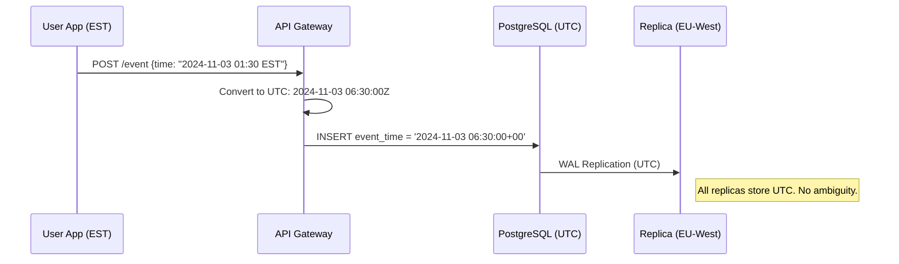

# Multi-Timezone & DST: The Principal Architect Guide

> **Level**: Principal Architect / Lead DBA (Google-scale)
> **Scope**: UTC Storage, Temporal Data Types, DST Pitfalls, Production Queries (SQL + NoSQL), and Multi-Region Replication.

> [!CAUTION]
> **The Cardinal Sin**: Storing local time without timezone information. You **will** have data corruption during DST transitions. Every production outage story starts here.

---

## 🎯 The Principal Laws of Time

| Law | Rule | Consequence |
| :--- | :--- | :--- |
| **Law 1: Store in UTC** | All `created_at`, `updated_at`, `event_time` columns MUST be UTC. | No ambiguity. Ever. |
| **Law 2: Timezone is Presentation** | Convert to user's local timezone **only** at the API/UI layer. | Decouples storage from display. |
| **Law 3: Never Trust Client Time** | Clients can be in any timezone, with wrong clocks. Use server-side `NOW()`. | Prevents temporal corruption. |
| **Law 4: Store Timezone Separately** | If you need to know the *user's original intent* (e.g., "3pm in *their* timezone"), store `TIMESTAMPTZ + IANA Timezone ID`. | Supports rescheduling, DST handling. |

---

## 📅 Data Types: The Correct Choice

| Database | Store Absolute Time | Store User's Intent | Store Date-Only |
| :--- | :--- | :--- | :--- |
| **PostgreSQL** | `TIMESTAMPTZ` (UTC) | `TIMESTAMP` + `TEXT (IANA tz)` | `DATE` |
| **MySQL** | `DATETIME` (UTC) + `SET time_zone = '+00:00'` | `DATETIME` + `VARCHAR(64)` | `DATE` |
| **MongoDB** | `ISODate` (UTC) | `{ ts: ISODate, tz: "America/New_York" }` | `String (YYYY-MM-DD)` |
| **DynamoDB** | `String (ISO8601 UTC)` | `{ scheduled_utc: S, user_tz: S }` | `String (YYYY-MM-DD)` |
| **Cassandra** | `TIMESTAMP` (UTC) | `TIMESTAMP` + `TEXT` | `DATE` |
| **BigQuery** | `TIMESTAMP` (UTC) | `DATETIME` + `STRING` | `DATE` |
| **Spanner** | `TIMESTAMP` (UTC) | `TIMESTAMP` + `STRING` | `DATE` |

> [!IMPORTANT]
> **PostgreSQL `TIMESTAMPTZ`**: Does NOT store the timezone. It converts the input to UTC on write and converts back on read using session `timezone`. It's a misnomer—think of it as "UTC timestamp".

---

## ⚠️ DST: The Failure Modes

### 1. The "Lost Hour" (Spring Forward)
*   **Example (US)**: 2024-03-10, 2:00 AM → 3:00 AM.
*   **Failure**: Scheduling a meeting at "2:30 AM America/New_York" — **this time does not exist**.
*   **Mitigation**: Validate scheduled times against the IANA database. Reject or shift to the next valid time.

### 2. The "Repeated Hour" (Fall Back)
*   **Example (US)**: 2024-11-03, 2:00 AM → 1:00 AM (happens twice).
*   **Failure**: Billing cycles counting the 1 AM hour twice. Duplicate events.
*   **Mitigation**: When storing local time, store UTC offset explicitly (e.g., `1:30 AM -04:00` vs `1:30 AM -05:00`).

### 3. Multi-Region Replication
*   **Failure**: Node A (US-East) writes an event at `2024-11-03 01:30:00 local`, Node B (EU-West) receives it. What's the actual time?
*   **Mitigation**: **Always replicate in UTC**. The `timezone` column is for presentation, not replication.



---

## 🔥 Common Pitfalls & Production Bugs

### Pitfall 1: Using CURRENT_DATE Instead of CURRENT_TIMESTAMP
```sql
-- ❌ BUG: CURRENT_DATE uses session timezone. At 11 PM UTC, it's already "tomorrow" in Asia.
SELECT * FROM orders WHERE order_date = CURRENT_DATE;

-- ✅ FIX: Use UTC explicitly
SELECT * FROM orders 
WHERE order_date = (CURRENT_TIMESTAMP AT TIME ZONE 'UTC')::DATE;
```

### Pitfall 2: Comparing DATE and TIMESTAMPTZ
```sql
-- ❌ BUG: Implicit cast. '2024-01-15' becomes '2024-01-15 00:00:00' in SESSION timezone.
-- If session is 'Asia/Kolkata', this is actually '2024-01-14 18:30:00+00'.
SELECT * FROM events WHERE event_time > '2024-01-15';

-- ✅ FIX: Always use full timestamp with offset
SELECT * FROM events WHERE event_time > '2024-01-15 00:00:00+00';
```

### Pitfall 3: The GROUP BY Day Mismatch
```sql
-- ❌ BUG: Grouping by UTC day. Events at 11 PM New York (4 AM UTC next day) counted on wrong day.
SELECT DATE(event_time) AS day, COUNT(*) 
FROM events GROUP BY 1;

-- ✅ FIX: Convert to target timezone BEFORE truncating
SELECT DATE(event_time AT TIME ZONE 'America/New_York') AS day_in_ny, COUNT(*)
FROM events GROUP BY 1;
```

### Pitfall 4: Midnight Boundary Errors
```sql
-- ❌ BUG: Off-by-one. This misses events at exactly midnight.
SELECT * FROM events 
WHERE event_time > '2024-01-15 00:00:00+00' 
  AND event_time < '2024-01-16 00:00:00+00';

-- ✅ FIX: Use >= and < (half-open interval)
SELECT * FROM events 
WHERE event_time >= '2024-01-15 00:00:00+00' 
  AND event_time < '2024-01-16 00:00:00+00';
```

### Pitfall 5: The "Yesterday" Query During DST
```sql
-- ❌ BUG: Subtracting 24 hours during DST transition gives wrong day.
-- March 10 has only 23 hours in US Eastern.
SELECT * FROM events 
WHERE event_time >= NOW() - INTERVAL '24 hours';

-- ✅ FIX: Use calendar math, not duration
SELECT * FROM events 
WHERE event_time >= (CURRENT_DATE AT TIME ZONE 'America/New_York' - INTERVAL '1 day') 
                     AT TIME ZONE 'America/New_York';
```

### Pitfall 6: Window Function Time Gaps
```sql
-- ❌ BUG: LAG() with ORDER BY event_time may skip DST gap, causing incorrect gaps.
SELECT event_time, 
       event_time - LAG(event_time) OVER (ORDER BY event_time) AS gap
FROM events;
-- Gap of 1 hour between 1:59 AM and 3:00 AM shows as 0 minutes (it's actually 1 minute).

-- ✅ FIX: Always calculate in UTC
SELECT event_time, 
       EXTRACT(EPOCH FROM event_time) - 
       EXTRACT(EPOCH FROM LAG(event_time) OVER (ORDER BY event_time)) AS gap_seconds
FROM events;
```

---

## 🐘 PostgreSQL: Production Queries

### Query 1: Get Events in User's Local Day (DST-Safe)
```sql
-- Parameters: $1 = user_timezone (e.g., 'America/Los_Angeles'), $2 = local_date (e.g., '2024-03-10')
WITH local_bounds AS (
    SELECT 
        ($2::DATE || ' 00:00:00')::TIMESTAMP AT TIME ZONE $1 AS day_start_utc,
        ($2::DATE || ' 00:00:00')::TIMESTAMP AT TIME ZONE $1 + INTERVAL '1 day' AS day_end_utc
)
SELECT e.*
FROM events e, local_bounds lb
WHERE e.event_time >= lb.day_start_utc
  AND e.event_time < lb.day_end_utc;
```

### Query 2: Aggregate by Hour in User's Timezone
```sql
SELECT 
    date_trunc('hour', event_time AT TIME ZONE 'Europe/London') AS hour_in_london,
    COUNT(*) AS event_count
FROM events
WHERE event_time >= '2024-01-01 00:00:00+00'
  AND event_time < '2024-02-01 00:00:00+00'
GROUP BY 1
ORDER BY 1;
```

### Query 3: Find Events During DST Transition (Debugging)
```sql
-- Find all events that occurred during the "ambiguous hour" (Fall Back)
-- In 2024, US Eastern falls back on Nov 3 at 2 AM -> 1 AM
SELECT *
FROM events
WHERE event_time >= '2024-11-03 05:00:00+00'  -- 1:00 AM EDT (UTC-4)
  AND event_time < '2024-11-03 07:00:00+00';  -- 2:00 AM EST (UTC-5)
-- This 2-hour UTC window = the 1 AM hour that happens TWICE.
```

### Query 4: Scheduled Events with DST Adjustment
```sql
CREATE TABLE scheduled_events (
    id BIGSERIAL PRIMARY KEY,
    title TEXT NOT NULL,
    scheduled_local TIMESTAMP NOT NULL,          -- User's wall clock time
    user_tz TEXT NOT NULL,                        -- IANA timezone
    scheduled_utc TIMESTAMPTZ GENERATED ALWAYS AS (
        scheduled_local AT TIME ZONE user_tz
    ) STORED,
    created_at TIMESTAMPTZ DEFAULT NOW()
);

CREATE INDEX idx_scheduled_utc ON scheduled_events(scheduled_utc);

-- Get upcoming events for next 24 hours
SELECT id, title, scheduled_local, user_tz,
       scheduled_utc AT TIME ZONE user_tz AS display_time
FROM scheduled_events
WHERE scheduled_utc >= NOW()
  AND scheduled_utc < NOW() + INTERVAL '24 hours'
ORDER BY scheduled_utc;
```

### Query 5: Detect Invalid Scheduled Times (DST Gap)
```sql
-- This query finds scheduled times that fall in a DST gap (don't exist)
SELECT *
FROM scheduled_events
WHERE scheduled_utc IS NULL  -- Generated column returns NULL for invalid times
   OR scheduled_utc != (scheduled_local AT TIME ZONE user_tz);
```

---

## 🍃 MongoDB: Production Queries

### Schema: Events Collection
```javascript
{
  _id: ObjectId("..."),
  event_type: "purchase",
  event_time: ISODate("2024-01-15T10:30:00.000Z"),  // UTC
  user_id: "user_123",
  user_context: {
    local_time: "2024-01-15T16:00:00",  // User's perceived time (IST)
    timezone: "Asia/Kolkata"             // IANA ID
  },
  amount: 99.99
}
```

### Query 1: Get Events by User's Local Date
```javascript
// User is in 'America/New_York'. Get events for 2024-03-10 local.
// Note: March 10 has 23 hours due to DST.

const userTz = "America/New_York";
const localDate = "2024-03-10";

// Calculate UTC bounds
const startLocal = new Date(`${localDate}T00:00:00`);
const endLocal = new Date(`${localDate}T00:00:00`);
endLocal.setDate(endLocal.getDate() + 1);

// Convert to UTC using Intl (or moment-timezone in Node.js)
// For simplicity, assuming you've pre-calculated:
const startUtc = ISODate("2024-03-10T05:00:00Z");  // 00:00 EST = 05:00 UTC
const endUtc = ISODate("2024-03-11T04:00:00Z");    // 00:00 EDT = 04:00 UTC (DST started)

db.events.find({
  event_time: { $gte: startUtc, $lt: endUtc }
});
```

### Query 2: Aggregate by Day in User's Timezone
```javascript
db.events.aggregate([
  {
    $match: {
      event_time: {
        $gte: ISODate("2024-01-01T00:00:00Z"),
        $lt: ISODate("2024-02-01T00:00:00Z")
      }
    }
  },
  {
    $project: {
      day_in_ist: {
        $dateToString: {
          format: "%Y-%m-%d",
          date: "$event_time",
          timezone: "Asia/Kolkata"
        }
      },
      amount: 1
    }
  },
  {
    $group: {
      _id: "$day_in_ist",
      total_amount: { $sum: "$amount" },
      count: { $sum: 1 }
    }
  },
  { $sort: { _id: 1 } }
]);
```

### Query 3: Find Events in DST Transition Window
```javascript
// Find events during the ambiguous hour (Nov 3, 2024, 1-2 AM Eastern happens twice)
db.events.find({
  event_time: {
    $gte: ISODate("2024-11-03T05:00:00Z"),  // 1 AM EDT
    $lt: ISODate("2024-11-03T07:00:00Z")    // 2 AM EST
  }
}).hint({ event_time: 1 });  // Force index usage
```

---

## ⚡ DynamoDB: Production Patterns

### Table Design: Events
```
PK: USER#<userId>
SK: EVENT#<eventTimeUtc>#<eventId>

Attributes:
- event_time_utc: "2024-01-15T10:30:00Z"  (String, ISO8601)
- user_local_time: "2024-01-15T16:00:00"  (String)
- user_tz: "Asia/Kolkata"                  (String, IANA)
- event_type: "purchase"
- amount: 99.99

GSI1:
- PK: DATE#<dateInUtc>   (e.g., DATE#2024-01-15)
- SK: <eventTimeUtc>#<userId>
```

### Query 1: Get User Events for a UTC Date Range
```python
import boto3
from datetime import datetime, timezone

dynamodb = boto3.resource('dynamodb')
table = dynamodb.Table('Events')

# Query events for user_123 in January 2024
response = table.query(
    KeyConditionExpression='PK = :pk AND SK BETWEEN :start AND :end',
    ExpressionAttributeValues={
        ':pk': 'USER#user_123',
        ':start': 'EVENT#2024-01-01T00:00:00Z',
        ':end': 'EVENT#2024-01-31T23:59:59Z'
    }
)
```

### Query 2: Scan by Local Date (Anti-Pattern Example)
```python
# ❌ ANTI-PATTERN: This requires a Scan
response = table.scan(
    FilterExpression='begins_with(user_local_time, :date)',
    ExpressionAttributeValues={':date': '2024-01-15'}
)

# ✅ SOLUTION: Store a GSI with local date as partition key
# GSI2: PK = LOCAL_DATE#<tz>#<date>, SK = event_time_utc
# This requires knowing the user's timezone upfront and denormalizing.
```

---

## 🗺️ Cassandra: Production Patterns

### Table Design: Events by Day
```cql
CREATE TABLE events_by_day (
    year_month TEXT,                    -- Partition key: "2024-01"
    day_utc DATE,                        -- Clustering key
    event_time_utc TIMESTAMP,            -- Clustering key
    event_id UUID,
    user_id UUID,
    user_tz TEXT,
    event_type TEXT,
    PRIMARY KEY ((year_month), day_utc, event_time_utc, event_id)
) WITH CLUSTERING ORDER BY (day_utc DESC, event_time_utc DESC);

CREATE INDEX idx_user_id ON events_by_day (user_id);
```

### Query 1: Get Events for a Specific UTC Day
```cql
SELECT * FROM events_by_day
WHERE year_month = '2024-01'
  AND day_utc = '2024-01-15';
```

### Query 2: Get Events in a Time Range (UTC)
```cql
SELECT * FROM events_by_day
WHERE year_month = '2024-01'
  AND day_utc >= '2024-01-10'
  AND day_utc <= '2024-01-15';
```

### Anti-Pattern: Querying by User's Local Time
```cql
-- ❌ NEVER DO THIS: ALLOW FILTERING = full table scan
SELECT * FROM events_by_day
WHERE user_tz = 'Asia/Kolkata'
ALLOW FILTERING;

-- ✅ SOLUTION: Create a separate table partitioned by (user_tz, local_date)
CREATE TABLE events_by_tz_date (
    user_tz TEXT,
    local_date DATE,
    event_time_utc TIMESTAMP,
    event_id UUID,
    ...
    PRIMARY KEY ((user_tz, local_date), event_time_utc, event_id)
);
```

---

## 🛠️ IANA Timezone Database: The Source of Truth

*   **Never use fixed offsets** (`+05:30`). Use IANA IDs (`Asia/Kolkata`).
*   **Why?** Offsets change. India has always been +05:30, but it proposed DST in 2009 (rejected). Other countries change DST rules frequently (e.g., Morocco, Egypt).
*   **Update Cadence**: IANA releases updates 10-20 times/year.

### PostgreSQL: Check & Update tzdata
```sql
-- Check current tzdata version
SHOW timezone;
SELECT * FROM pg_timezone_names WHERE name = 'America/New_York';

-- The abbrev and utc_offset will show if DST is active
```

```bash
# Debian/Ubuntu: Update tzdata
sudo apt update && sudo apt install tzdata
sudo systemctl reload postgresql
```

### Go: Using time.LoadLocation
```go
import "time"

func parseUserTime(localTimeStr, userTz string) (time.Time, error) {
    loc, err := time.LoadLocation(userTz)  // e.g., "America/New_York"
    if err != nil {
        return time.Time{}, err
    }
    
    // Parse as local time in that zone
    t, err := time.ParseInLocation("2006-01-02 15:04:05", localTimeStr, loc)
    if err != nil {
        return time.Time{}, err
    }
    
    // Convert to UTC for storage
    return t.UTC(), nil
}
```

### Python: Using pytz
```python
from datetime import datetime
import pytz

def to_utc(local_time_str: str, user_tz: str) -> datetime:
    tz = pytz.timezone(user_tz)
    local_dt = datetime.strptime(local_time_str, "%Y-%m-%d %H:%M:%S")
    
    # localize() handles DST correctly
    local_dt = tz.localize(local_dt, is_dst=None)  # Raise error for ambiguous/missing
    
    return local_dt.astimezone(pytz.UTC)

# Example
utc_time = to_utc("2024-01-15 16:00:00", "Asia/Kolkata")
# Returns: 2024-01-15 10:30:00+00:00
```

---

## 🚀 Google-Scale Patterns

### Spanner's TrueTime
Google Spanner uses GPS + Atomic clocks to get a globally consistent timestamp with bounded uncertainty (`[earliest, latest]`).

```sql
-- Spanner: Get consistent snapshot at a specific time
SELECT * FROM events
WHERE event_time < TIMESTAMP("2024-01-15T10:30:00Z")
-- Spanner guarantees this reads a consistent state as of that timestamp.
```

### CockroachDB's Hybrid Logical Clocks (HLC)
An alternative to TrueTime. Combines physical time with logical counters.

```sql
-- CockroachDB: Use AS OF SYSTEM TIME for time-travel queries
SELECT * FROM events 
AS OF SYSTEM TIME '2024-01-15 10:30:00+00:00';
```

---

## 🗄️ Audit Logging: The Temporal Trail

### PostgreSQL Audit Schema
```sql
CREATE TABLE audit_log (
    id BIGSERIAL PRIMARY KEY,
    user_id BIGINT NOT NULL,
    event_time_utc TIMESTAMPTZ NOT NULL DEFAULT NOW(),
    user_local_time TIMESTAMP NOT NULL,
    user_tz TEXT NOT NULL,
    action TEXT NOT NULL,
    resource_type TEXT NOT NULL,
    resource_id BIGINT,
    old_value JSONB,
    new_value JSONB,
    client_ip INET,
    request_id UUID
);

CREATE INDEX idx_audit_time ON audit_log(event_time_utc);
CREATE INDEX idx_audit_user ON audit_log(user_id, event_time_utc);
CREATE INDEX idx_audit_resource ON audit_log(resource_type, resource_id, event_time_utc);
```

### Query: Audit Trail for Compliance
```sql
-- Get all actions by a user in their local timezone
SELECT 
    event_time_utc,
    event_time_utc AT TIME ZONE user_tz AS user_perceived_time,
    user_tz,
    action,
    resource_type,
    resource_id
FROM audit_log
WHERE user_id = 123
  AND event_time_utc >= '2024-01-01 00:00:00+00'
  AND event_time_utc < '2024-02-01 00:00:00+00'
ORDER BY event_time_utc;
```

---

## ✅ Principal Architect Checklist

| # | Item | Verification Query / Action |
| :--- | :--- | :--- |
| 1 | All timestamp columns are UTC. | `SELECT column_name, data_type FROM information_schema.columns WHERE data_type LIKE 'timestamp%';` |
| 2 | No hardcoded offsets in codebase. | `grep -r "+05:30" --include="*.go" --include="*.py" --include="*.java"` |
| 3 | Scheduled events store local + tz + computed UTC. | Schema review. |
| 4 | Queries use sargable UTC ranges. | `EXPLAIN ANALYZE` all slow queries. |
| 5 | tzdata updated quarterly. | `apt-cache policy tzdata` |
| 6 | Audit logs capture both UTC and user context. | Schema review. |
| 7 | DST validation exists for scheduled events. | Code review for gap/overlap handling. |
| 8 | No `CURRENT_DATE` without explicit timezone. | `grep -r "CURRENT_DATE" --include="*.sql"` |
| 9 | No implicit DATE to TIMESTAMP casts. | `EXPLAIN` queries with DATE filters. |
| 10 | Multi-region replication uses UTC. | Verify WAL/CDC uses UTC. |

---

## 🔗 Related Documents
*   [RDBMS Internals](./rdbms-internals-guide.md) — Indexing strategies.
*   [NoSQL Architecture](./nosql-architecture-guide.md) — DynamoDB, Cassandra patterns.
*   [Replication & Consistency](./replication-consistency-guide.md) — Multi-region replication.
*   [TSDB Architecture](./tsdb-architecture-guide.md) — Time-series specific patterns.
