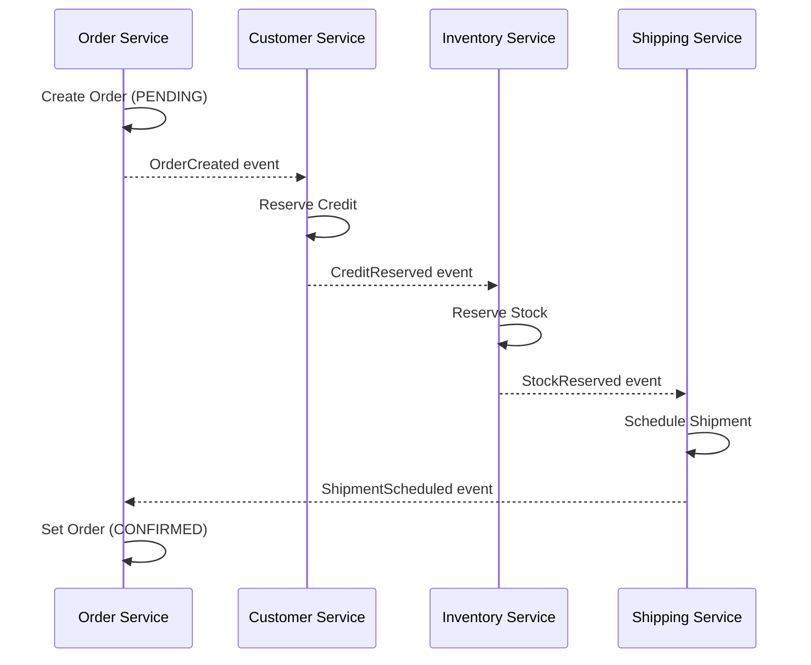
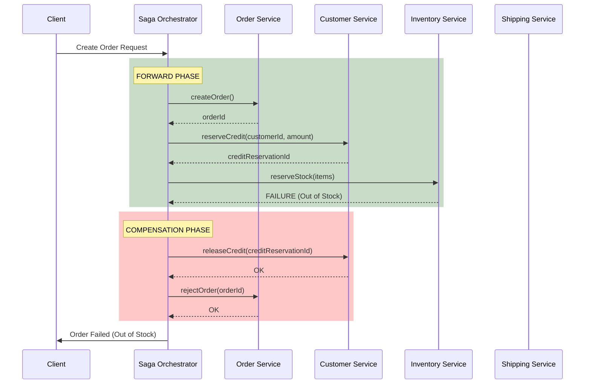

# Saga Pattern: The Google Principal Architect Guide

> **Level**: Google L6+ / Principal Architect / Staff+ DBA
> **Scope**: Distributed Transactions, Orchestration vs Choreography, Outbox Pattern, Idempotency — Production Patterns

> [!CAUTION]
> **The Cardinal Sin**: Using 2PC (Two-Phase Commit) in microservices. It's a distributed lock that doesn't scale and creates a single point of failure. Use Sagas instead.

---

## 📚 Required Reading

| Paper/Resource | Topic |
| :--- | :--- |
| [Sagas (Garcia-Molina, 1987)](https://www.cs.cornell.edu/andru/cs711/2002fa/reading/sagas.pdf) | Original saga paper |
| [Microservices Patterns (Chris Richardson)](https://microservices.io/patterns/data/saga.html) | Modern interpretation |
| [Outbox Pattern (Debezium)](https://debezium.io/blog/2019/02/19/reliable-microservices-data-exchange-with-the-outbox-pattern/) | Reliable event publishing |

---

## 🎯 The Principal Laws of Sagas

| Law | Statement | Implication |
| :--- | :--- | :--- |
| **Law 1: No ACID Across Services** | Distributed transactions don't exist | Design for eventual consistency |
| **Law 2: Compensations are Mandatory** | Every forward step needs an undo | Write the rollback before the happy path |
| **Law 3: Idempotency is Essential** | Retries will happen | Every operation must be safe to repeat |
| **Law 4: Isolation is Lost** | Intermediate states are visible | Use semantic locking or versioning |

---

# Part 1: Saga Coordination Patterns

## 🎭 Choreography (Event-Driven)



### Pros & Cons
```
✅ Loose coupling (services only know events)
✅ No single point of failure
✅ Easy to add new services

❌ Hard to understand the flow (distributed logic)
❌ Cyclic dependency risk
❌ No centralized monitoring
❌ Debugging nightmares ("which service failed?")
```

### When to Use Choreography
```
- Simple flows (2-3 services)
- Independent microservices with clear boundaries
- Team autonomy is critical
```

## 🎼 Orchestration (Centralized Coordinator)



### Orchestrator State Machine
```python
from enum import Enum
from dataclasses import dataclass
from typing import Optional

class SagaState(Enum):
    STARTED = "started"
    ORDER_CREATED = "order_created"
    CREDIT_RESERVED = "credit_reserved"
    STOCK_RESERVED = "stock_reserved"
    SHIPMENT_SCHEDULED = "shipment_scheduled"
    COMPLETED = "completed"
    COMPENSATING = "compensating"
    CREDIT_RELEASED = "credit_released"
    ORDER_REJECTED = "order_rejected"
    FAILED = "failed"

@dataclass
class SagaExecution:
    saga_id: str
    state: SagaState
    order_id: Optional[str] = None
    credit_reservation_id: Optional[str] = None
    stock_reservation_id: Optional[str] = None
    shipment_id: Optional[str] = None
    failure_reason: Optional[str] = None
    created_at: int = 0
    updated_at: int = 0

class OrderSagaOrchestrator:
    def __init__(self, saga_repo, order_service, customer_service, inventory_service, shipping_service):
        self.saga_repo = saga_repo
        self.order = order_service
        self.customer = customer_service
        self.inventory = inventory_service
        self.shipping = shipping_service
    
    async def execute(self, saga: SagaExecution):
        try:
            # Step 1: Create Order
            if saga.state == SagaState.STARTED:
                saga.order_id = await self.order.create_order(saga.saga_id)
                saga.state = SagaState.ORDER_CREATED
                await self.saga_repo.save(saga)
            
            # Step 2: Reserve Credit
            if saga.state == SagaState.ORDER_CREATED:
                saga.credit_reservation_id = await self.customer.reserve_credit(
                    saga.customer_id, saga.amount
                )
                saga.state = SagaState.CREDIT_RESERVED
                await self.saga_repo.save(saga)
            
            # Step 3: Reserve Stock
            if saga.state == SagaState.CREDIT_RESERVED:
                saga.stock_reservation_id = await self.inventory.reserve_stock(saga.items)
                saga.state = SagaState.STOCK_RESERVED
                await self.saga_repo.save(saga)
            
            # Step 4: Schedule Shipment
            if saga.state == SagaState.STOCK_RESERVED:
                saga.shipment_id = await self.shipping.schedule(saga.order_id, saga.items)
                saga.state = SagaState.SHIPMENT_SCHEDULED
                await self.saga_repo.save(saga)
            
            # Step 5: Confirm Order
            if saga.state == SagaState.SHIPMENT_SCHEDULED:
                await self.order.confirm(saga.order_id)
                saga.state = SagaState.COMPLETED
                await self.saga_repo.save(saga)
                
        except Exception as e:
            saga.failure_reason = str(e)
            await self.compensate(saga)
    
    async def compensate(self, saga: SagaExecution):
        saga.state = SagaState.COMPENSATING
        await self.saga_repo.save(saga)
        
        # Reverse order of forward steps
        if saga.shipment_id:
            await self.shipping.cancel(saga.shipment_id)
        
        if saga.stock_reservation_id:
            await self.inventory.release(saga.stock_reservation_id)
            saga.state = SagaState.CREDIT_RELEASED
            await self.saga_repo.save(saga)
        
        if saga.credit_reservation_id:
            await self.customer.release_credit(saga.credit_reservation_id)
        
        if saga.order_id:
            await self.order.reject(saga.order_id, saga.failure_reason)
            saga.state = SagaState.ORDER_REJECTED
            await self.saga_repo.save(saga)
        
        saga.state = SagaState.FAILED
        await self.saga_repo.save(saga)
```

---

# Part 2: Transactional Outbox Pattern

## 💀 The Dual-Write Problem

```
WRONG:
1. db.insert(order)              ← Succeeds
2. kafka.publish(OrderCreated)   ← Broker down, FAILS

Result: Order in DB, no event published
        Downstream services never know about the order
        Data is permanently inconsistent
```

## 📤 The Outbox Pattern (Solution)

```sql
-- Same transaction: order + outbox event
BEGIN;

INSERT INTO orders (id, customer_id, total, status)
VALUES ('order-123', 'cust-456', 99.99, 'PENDING');

INSERT INTO outbox_events (
    id, 
    aggregate_type, 
    aggregate_id, 
    event_type, 
    payload,
    created_at
) VALUES (
    'evt-789',
    'Order',
    'order-123',
    'OrderCreated',
    '{"orderId": "order-123", "customerId": "cust-456", "total": 99.99}',
    NOW()
);

COMMIT;

-- Now both are atomic. Either both exist or neither.
```

### Outbox Table Schema
```sql
CREATE TABLE outbox_events (
    id UUID PRIMARY KEY DEFAULT gen_random_uuid(),
    aggregate_type VARCHAR(100) NOT NULL,  -- 'Order', 'Customer', 'Payment'
    aggregate_id VARCHAR(100) NOT NULL,
    event_type VARCHAR(100) NOT NULL,      -- 'OrderCreated', 'PaymentProcessed'
    payload JSONB NOT NULL,
    
    -- Processing status
    status VARCHAR(20) DEFAULT 'pending',   -- pending, published, failed
    published_at TIMESTAMPTZ,
    retry_count INT DEFAULT 0,
    last_error TEXT,
    
    created_at TIMESTAMPTZ DEFAULT NOW()
);

-- Index for polling (if not using CDC)
CREATE INDEX idx_outbox_pending 
ON outbox_events(created_at) 
WHERE status = 'pending';

-- Partition by day for cleanup
-- Old events can be dropped entirely
```

### Message Relay Options

| Method | How | Pros | Cons |
| :--- | :--- | :--- | :--- |
| **Polling** | Query outbox table periodically | Simple | Latency, load on DB |
| **CDC (Debezium)** | Tail transaction log | Real-time, low load | Complex setup |
| **Listen/Notify** | PostgreSQL NOTIFY | Real-time, simple | Only PostgreSQL |

### Debezium CDC Configuration
```json
{
  "name": "outbox-connector",
  "config": {
    "connector.class": "io.debezium.connector.postgresql.PostgresConnector",
    "database.hostname": "postgres",
    "database.port": "5432",
    "database.user": "debezium",
    "database.password": "secret",
    "database.dbname": "orders",
    "table.include.list": "public.outbox_events",
    
    "transforms": "outbox",
    "transforms.outbox.type": "io.debezium.transforms.outbox.EventRouter",
    "transforms.outbox.table.field.event.key": "aggregate_id",
    "transforms.outbox.table.field.event.type": "event_type",
    "transforms.outbox.table.field.event.payload": "payload",
    "transforms.outbox.route.topic.replacement": "${routedByValue}.events"
  }
}
```

---

# Part 3: Idempotency

## 🔁 The Retry Problem

```
Network timeout: Did the request succeed or fail?
Saga retries: releaseCredit() called twice
Result: Customer gets double refund!
```

## 🔑 Idempotency Keys

```python
import hashlib
from datetime import datetime, timedelta

class IdempotencyStore:
    def __init__(self, redis):
        self.redis = redis
        self.ttl = timedelta(hours=24)
    
    def is_duplicate(self, key: str) -> tuple[bool, any]:
        """Returns (is_duplicate, cached_result)"""
        cached = self.redis.get(f"idempotency:{key}")
        if cached:
            return True, json.loads(cached)
        return False, None
    
    def store_result(self, key: str, result: any):
        self.redis.setex(
            f"idempotency:{key}",
            self.ttl,
            json.dumps(result)
        )

# Usage in compensation
async def release_credit(self, reservation_id: str, idempotency_key: str):
    # Check for duplicate
    is_dup, cached = self.idempotency.is_duplicate(idempotency_key)
    if is_dup:
        return cached  # Return same result as before
    
    # Execute operation
    result = await self.customer_repo.release_credit(reservation_id)
    
    # Store result
    self.idempotency.store_result(idempotency_key, result)
    return result
```

### Database-Level Idempotency
```sql
-- Use unique constraint on business key
CREATE TABLE credit_releases (
    id UUID PRIMARY KEY,
    reservation_id UUID NOT NULL UNIQUE,  -- Natural idempotency key
    amount NUMERIC(12,2),
    released_at TIMESTAMPTZ DEFAULT NOW()
);

-- Insert with ON CONFLICT
INSERT INTO credit_releases (id, reservation_id, amount)
VALUES ($1, $2, $3)
ON CONFLICT (reservation_id) DO NOTHING
RETURNING *;

-- If row already exists, returns nothing (no double-release)
```

---

# Part 4: Isolation Countermeasures

## 👀 The Dirty Read Problem

```
Timeline:
T1: Saga starts, creates Order (PENDING)
T2: User queries Order → sees PENDING
T3: Saga fails, compensates, Order → REJECTED
T4: User confused: "I saw it was PENDING!"

Worse:
T1: Saga reserves credit ($100)
T2: Another saga reads balance → sees reserved $100 as used
T3: First saga fails, releases $100
T4: Second saga made decision based on wrong balance
```

## 🔐 Semantic Locking

```sql
-- Use status states that indicate "in-progress"
CREATE TYPE order_status AS ENUM (
    'PENDING_CREATION',     -- Saga started
    'CREDIT_RESERVED',      -- Credit locked, awaiting stock
    'STOCK_RESERVED',       -- Stock locked, awaiting shipment
    'CONFIRMED',            -- Saga complete
    'PENDING_CANCELLATION', -- Compensation started
    'CANCELLED',            -- Compensation complete
    'REJECTED'              -- Saga failed
);

-- Other sagas check for stable states only
SELECT * FROM orders 
WHERE id = $1 
  AND status IN ('CONFIRMED', 'CANCELLED', 'REJECTED');

-- If status is 'PENDING_*', the order is being processed
-- Wait or retry later
```

## 📊 Version-Based Concurrency

```sql
-- Add version column
ALTER TABLE customer_credits ADD COLUMN version INT DEFAULT 0;

-- Optimistic locking on update
UPDATE customer_credits
SET available = available - $1,
    reserved = reserved + $1,
    version = version + 1
WHERE customer_id = $2
  AND version = $3  -- Only succeed if version matches
  AND available >= $1;

-- If rows_affected = 0, either:
-- 1. Version changed (concurrent update) → Retry
-- 2. Insufficient balance → Fail saga
```

---

# Part 5: Production DDL

## 📋 Saga Execution Log
```sql
CREATE TABLE saga_executions (
    saga_id UUID PRIMARY KEY,
    saga_type VARCHAR(100) NOT NULL,  -- 'OrderSaga', 'PaymentSaga'
    state VARCHAR(50) NOT NULL,
    
    -- Correlation IDs for each step
    step_results JSONB DEFAULT '{}',
    
    -- Failure handling
    failure_step VARCHAR(50),
    failure_reason TEXT,
    compensation_started_at TIMESTAMPTZ,
    
    -- Audit
    created_at TIMESTAMPTZ DEFAULT NOW(),
    updated_at TIMESTAMPTZ DEFAULT NOW(),
    completed_at TIMESTAMPTZ
) PARTITION BY RANGE (created_at);

CREATE INDEX idx_saga_state ON saga_executions(state) 
WHERE state NOT IN ('COMPLETED', 'FAILED');

-- Saga step log for debugging
CREATE TABLE saga_step_log (
    id BIGINT GENERATED ALWAYS AS IDENTITY,
    saga_id UUID NOT NULL REFERENCES saga_executions(saga_id),
    step_name VARCHAR(100) NOT NULL,
    step_type VARCHAR(20) NOT NULL,  -- 'forward', 'compensation'
    status VARCHAR(20) NOT NULL,     -- 'started', 'succeeded', 'failed'
    request_payload JSONB,
    response_payload JSONB,
    error TEXT,
    started_at TIMESTAMPTZ DEFAULT NOW(),
    completed_at TIMESTAMPTZ,
    PRIMARY KEY (id, saga_id)
) PARTITION BY HASH (saga_id);

CREATE INDEX idx_saga_step_log_saga ON saga_step_log(saga_id);
```

---

## ✅ Principal Architect Checklist

| # | Item | Verification |
| :--- | :--- | :--- |
| 1 | Every forward step has compensation | Code review |
| 2 | Outbox pattern for all events | Check for dual-writes |
| 3 | All operations are idempotent | Retry with same key, same result |
| 4 | Saga state is persisted | Survives process restart |
| 5 | Semantic locking for isolation | No dirty reads in other services |
| 6 | Dead letter queue for failures | Monitor DLQ depth |
| 7 | Saga timeout configured | Detect stuck sagas |
| 8 | Monitoring dashboards | Track success/failure rates |

---

## 🔗 Related Documents
*   [Replication & Consistency](./replication-consistency-guide.md) — Consensus protocols.
*   [Schema Registry](./schema-registry/schema-registry-guide.md) — Event schema evolution.
*   [NoSQL Architecture](./nosql-architecture-guide.md) — DynamoDB for saga state.
