Resource: https://youtu.be/6w6E_B55p0E

# Scaling Push Messaging for Millions of Devices @Netflix

Based on the transcript provided, here is an accurate, comprehensive extraction of the presentation "Scaling Push Messaging for Millions of Devices @Netflix" by Susheel Aroskar.

### Introduction: The Case for Push Messaging
The speaker begins by setting a scene: it is Friday night, and a user opens Netflix. They see a personalized homepage, one of 125 million unique versions customized to user tastes. However, most users do not watch immediately; they spend time browsing. During this browsing window (10 or 20 minutes), Netflix’s personalization algorithms in the cloud may generate better recommendations. The challenge is getting this new list to the user immediately.

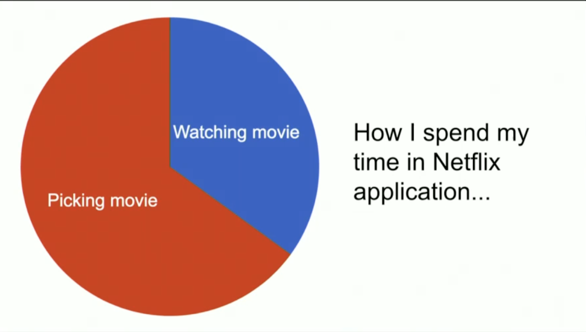

Historically, the Netflix application polled servers periodically to check for updates. This approach had two major flaws:
1.  **Latency and Efficiency Conflict:** To get high UI freshness, one must increase polling frequency, which overloads servers. Decreasing frequency saves the server but hurts UI freshness.
2.  **Resource Waste:** Moving from polling to push messaging reduced requests to the website cluster by **12%** at a scale of 1 million requests per second.

### Defining Push Messaging
Push messaging differs from the standard request-response paradigm in two key ways:
1.  **Persistent Connection:** A connection between the client and server remains open for the entirety of the client's lifetime.
2.  **Server-Initiated Transfer:** The server initiates the data transfer rather than waiting for the client to ask for it.

Netflix built a system called **Zuul Push** to handle this. It works across all devices (laptops, game consoles, Smart TVs) using standard open web protocols: **WebSockets** or **Server-Sent Events (SSE)**.

### Zuul Push Architecture
The infrastructure is composed of several decoupled components:

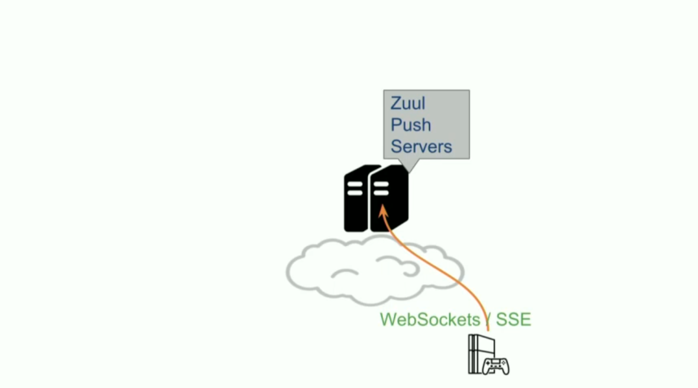

1.  **Zuul Push Servers:** Located at the network edge, these accept incoming client connections (WebSocket or SSE). Clients maintain a persistent connection here.
2.  **Push Registry:** A backend component that keeps track of which client is connected to which specific Zuul Push Server.
    
    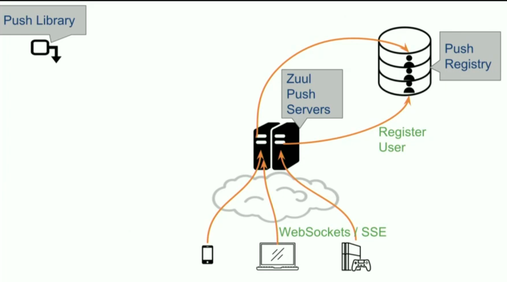

3.  **Push Message Senders:** Backend microservices that generate messages. They use a "Zuul Push Library" to make a simple asynchronous `sendMessage` call, hiding the infrastructure complexity.

    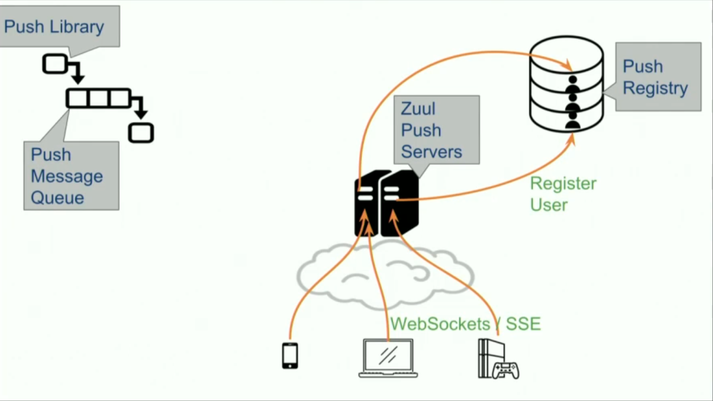

4.  **Message Queue:** Senders dump messages here. This decouples senders from receivers and acts as a buffer to absorb traffic spikes.
5.  **Message Processor:** Reads messages from the queue. It looks up the target client in the Push Registry:
    *   If found, it connects to the specific Zuul Push Server and hands over the message.
    *   If the client is not found (offline), the message is dropped.

    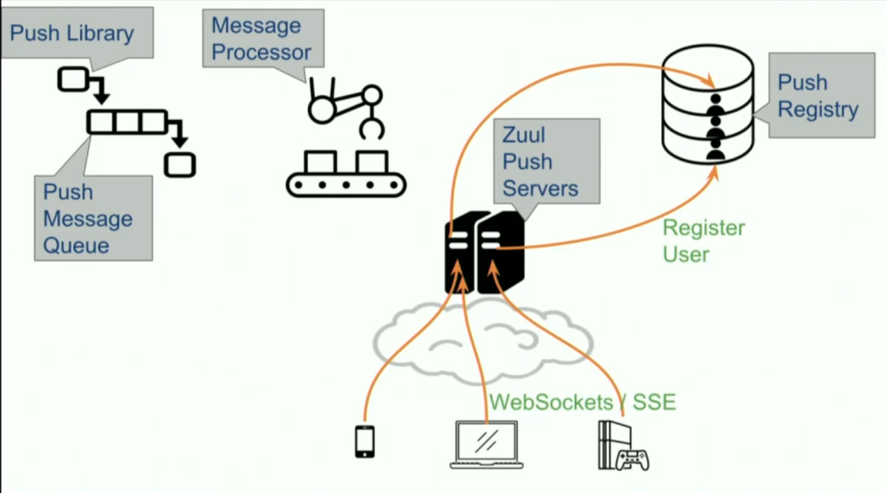
    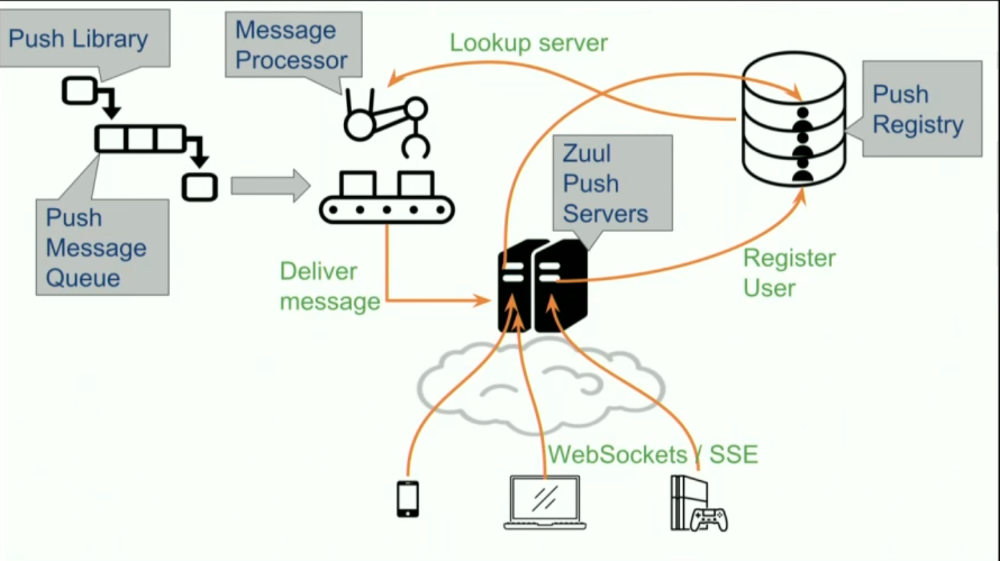

### Deep Dive: Zuul Push Server and Scaling
The Zuul Push Server handles over **10 million persistent connections** at peak. It is based on the **Zuul Cloud Gateway** (which handles standard HTTP traffic) but was rewritten to use **non-blocking asynchronous I/O** to meet the **C10k challenge** (handling 10,000 concurrent connections).

**The Problem with Traditional Blocking I/O:**
Creating a new thread for every connection consumes too much memory (stack allocation) and CPU (context switching) to scale to millions of connections.

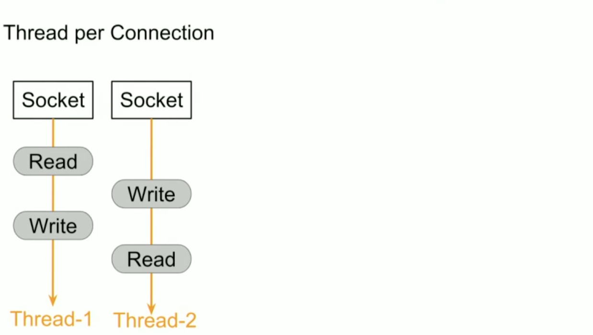

**The Solution: Async I/O (Netty):**
Netflix uses **Netty**, a battle-proven Java library used by Cassandra and Hadoop. It utilizes OS-level multiplexing primitives (like `kqueue`, `epoll`, or IO completion ports) to register callbacks for read/write operations. This allows a single thread to manage thousands of connections.

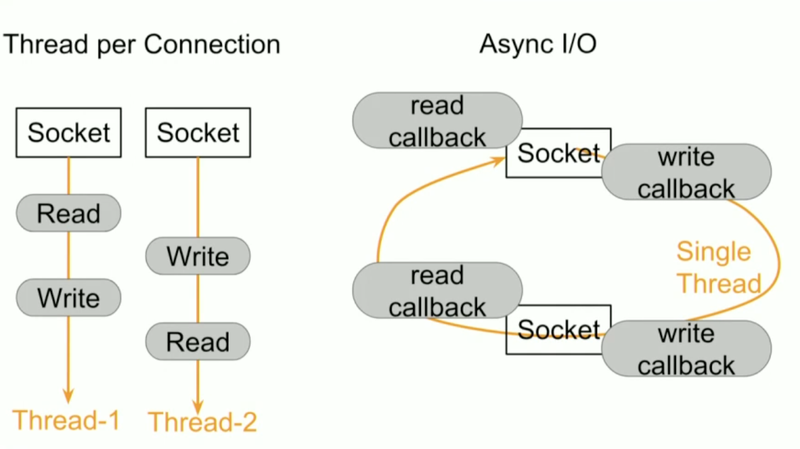
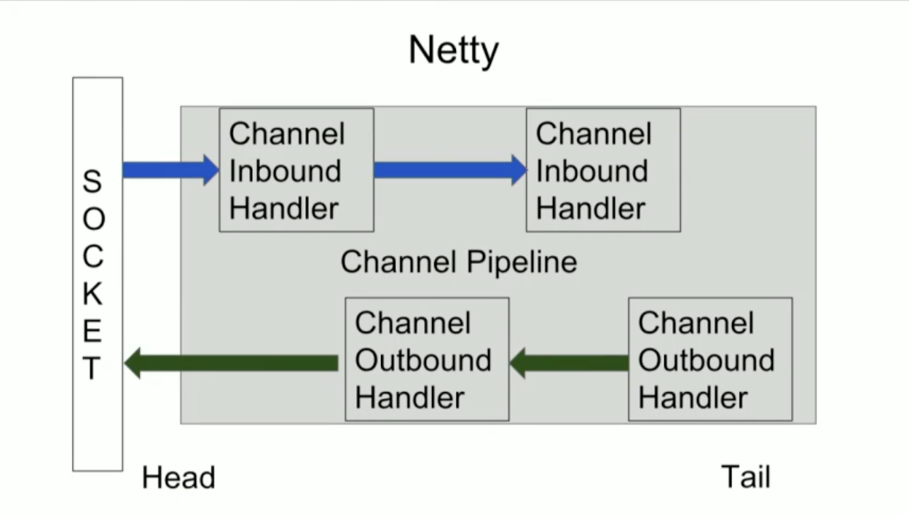
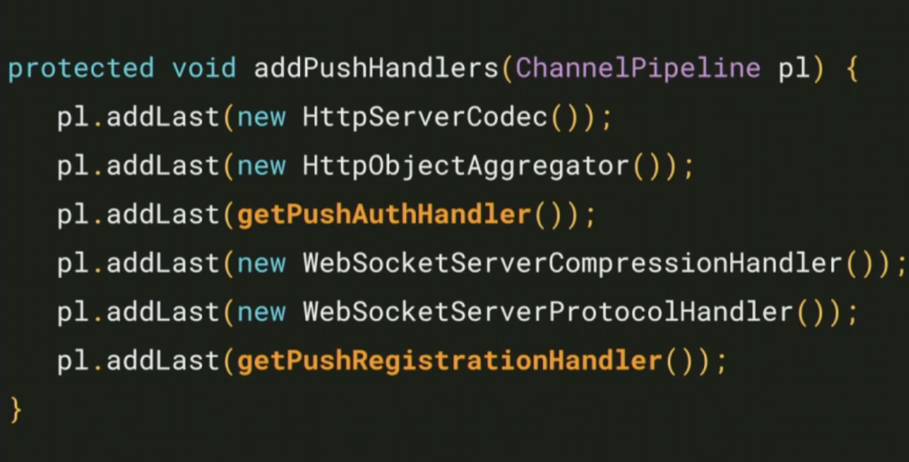

**Customization:**
*   **Authentication:** Developers can override the `PushAuthHandler` class. This provides access to the HTTP handshake request (cookies, headers) to implement custom auth.
    
    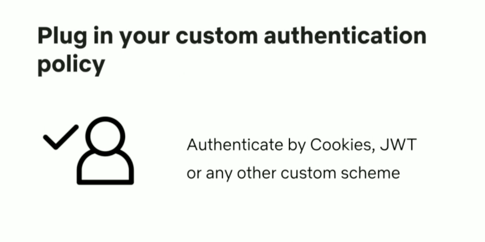

*   **Registration:** Developers can override the `PushRegistrationHandler` to determine how client-to-server mapping is stored.

### Push Registry Requirements
The data store used for the registry must have:
*   **Low Read Latency:** Records are written once (on connect) but read frequently (every message send).
*   **TTL (Time To Live) Support:** Essential for cleaning up "phantom registrations" left behind if a server or client crashes without a clean disconnect.
    
    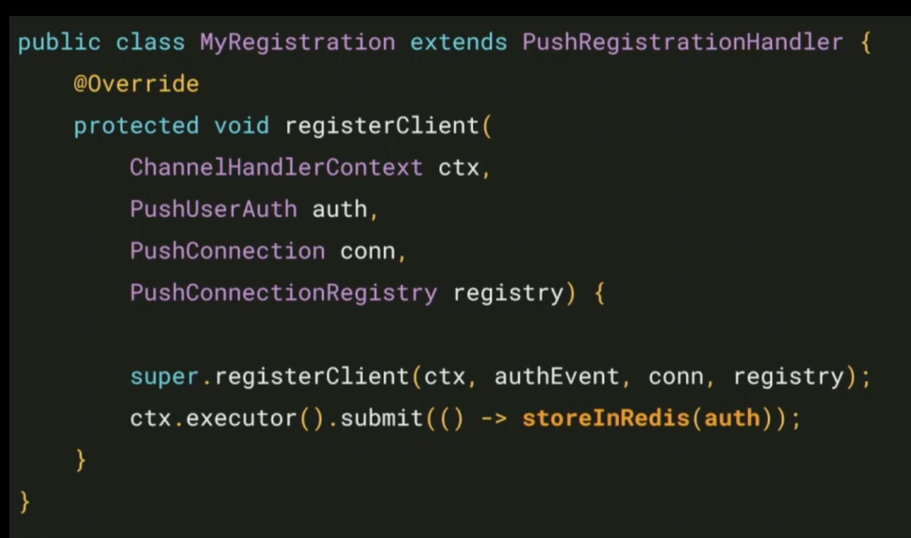

*   **Netflix’s Choice:** They use **Dynomite**, a Netflix open-source project that wraps Redis, adding auto-sharding and cross-region replication.

### Message Processing Infrastructure
*   **Kafka:** Used for the message queue. It replicates messages across three AWS regions to ensure delivery regardless of which region the client is connected to.
*   **Priority Queues:** To prevent "priority inversion" (urgent messages waiting behind low-priority ones), different queues can be used for different message priorities.
*   **Mantis:** A stream processing engine (similar to Apache Flink) used for the Message Processors. It auto-scales the number of processor instances based on the queue size (backlog).

### Operational Challenges and Solutions
Operating stateful, persistent connections required different tactics than stateless REST services.

**1. The Deployment/Rollback Problem:**
Because connections are persistent, clients do not automatically migrate to new code deployments. Forcefully terminating an old cluster causes a **"Thundering Herd,"** where all clients try to reconnect simultaneously, swamping the new cluster.

**2. Solution: Connection Life Cycling:**
*   **Limit Lifetime:** Netflix auto-closes connections after a set period (25–30 minutes). Clients are programmed to reconnect automatically.
*   **Randomization:** The lifetime is randomized (e.g., +/- 2 minutes). This disperses the reconnect attempts over time, dampening the Thundering Herd curve.

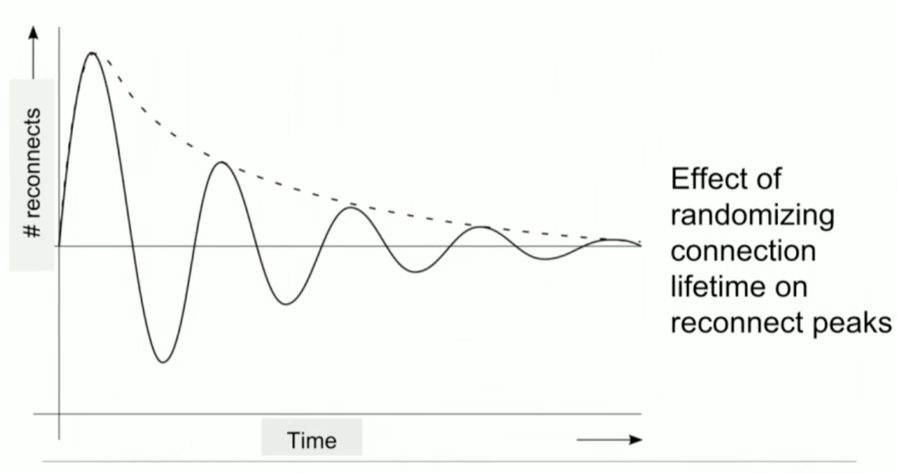

**3. Server-Initiated Close Optimization:**
Netflix configured the *server* to send a close message to the client, asking the *client* to close the connection.
*   **Reason:** TCP connection termination leaves the initiator in a `TIME_WAIT` state, occupying a file descriptor for up to two minutes. Server file descriptors are more valuable than client file descriptors.
*   **Safeguard:** If a client ignores the request, the server forcefully closes the connection after a timer expires.

**4. Sizing and Instance Strategy:**
*   **Initial Failure:** They initially used massive instances packed with max connections. When one failed, the resulting Thundering Herd was unmanageable.
    
    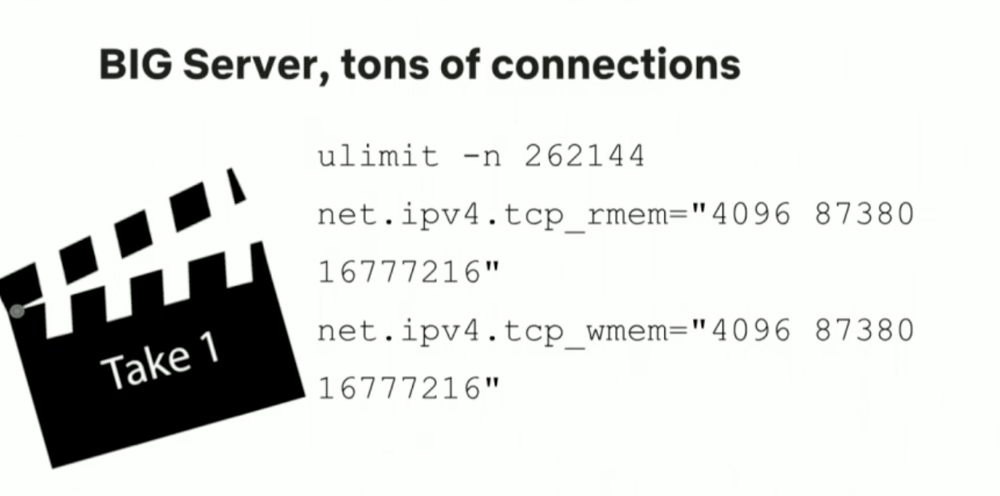

*   **"Goldilocks" Strategy:** They moved to medium-sized instances (**Amazon m4.large**: 8GB RAM, 2 vCPUs).
*   **Capacity:** Each server handles roughly **84,000 concurrent connections** (operating around 72k for headroom).
*   **Lesson:** Optimize for total cost of operation, not just low server count. More small servers are better than fewer large servers for resilience.

    

**5. Auto-Scaling:**
Standard metrics like requests per second (RPS) or CPU load do not apply because idle connections consume very little CPU. They scale based on the **Number of Open Connections**, a custom metric exported to CloudWatch.

**6. Load Balancing:**
AWS Elastic Load Balancers (ELB) do not natively understand the WebSocket upgrade request (Layer 7).
*   **Workaround:** Run ELBs in **TCP Mode (Layer 4)**. This proxies packets without parsing HTTP, keeping the WebSocket handshake intact. (Note: The newer AWS Application Load Balancer supports WebSockets, but Netflix had already built this workaround).

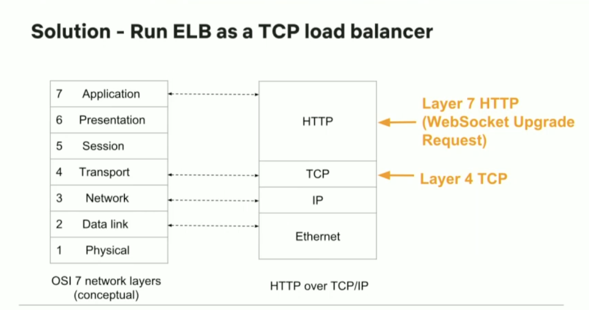

### Future Use Cases
Beyond recommendations, Netflix plans to use push for:
*   **On-demand Diagnostics:** Detecting misbehaving devices and pushing a command to upload logs.
*   **Remote Recovery:** Sending commands to restart applications remotely to fix errors.

### Conclusion
The speaker invites the audience to use the open-source Zuul project available on GitHub, which includes a "toy" server for testing. He concludes that "Push can make you rich, thin, and happy".

### Q&A Session Extraction
*   **Testing:** They use A/B testing (enabling push for a small percentage first). They verify success by tracking if the client performs the action (e.g., downloading the list) triggered by the push.
*   **Comparison to Apple (APNS):** Apple likely uses XMPP/Erlang. Netflix chose WebSockets/SSE because they are open web protocols compatible with their diverse device ecosystem.
*   **Protocol:** They currently use JSON but support binary frames if needed.
*   **Upstream Communication:** While technically possible for clients to send data *up* the WebSocket, Netflix avoids it to keep upstream API traffic stateless and cacheable via standard HTTP.
*   **Message Delivery Guarantees:** Delivery is "best effort" (like APNS). If a client is offline, the message is dropped.
*   **Handover:** For critical continuity, they use "hand-over-hand" transfer: a client opens a second connection before closing the first. The registry treats "last write wins" as the active connection.
*   **Registry State:** The registry stores only the mapping (Client ID -> Server IP). It is immutable unless the client disconnects or crashes. If the registry is wrong (phantom record), the server is the source of truth and will reject the message, triggering a registry cleanup.
*   **Deduplication:** Handled on the client side using unique message GUIDs.