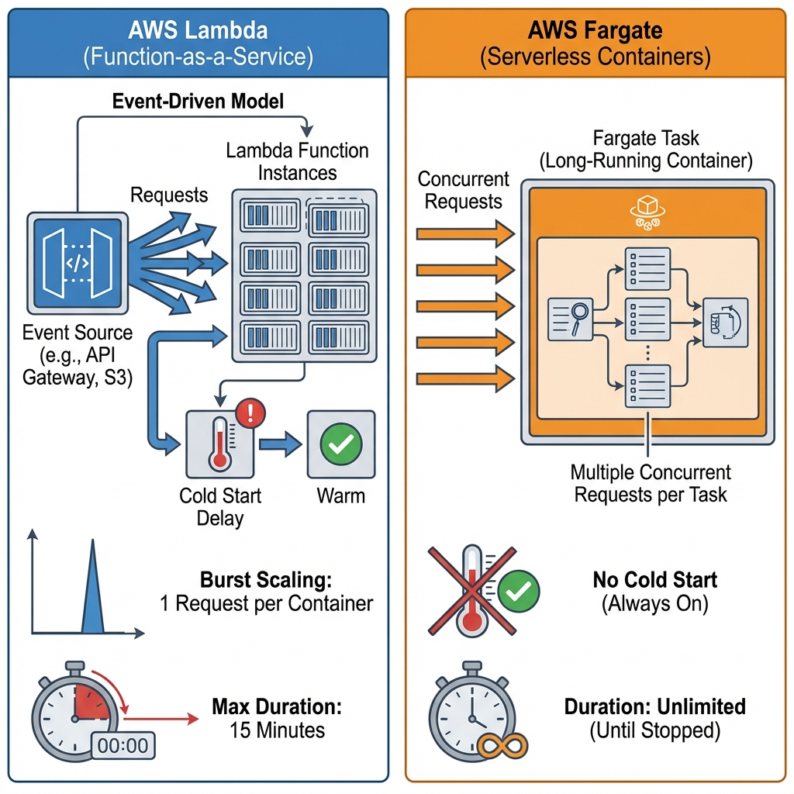

# Serverless Architecture: The Principal Architect Guide

> **Level**: Principal Architect / SDE-3
> **Scope**: AWS Lambda, Fargate, Knative, and Event-Driven Scaling.

> [!IMPORTANT]
> **The Paradigm Shift**: Serverless is not "No Servers". It is **"Service-full"**. The goal is to minimize custom code by leveraging managed services (EventBridge, Step Functions) for routing, filtering, and retries. Code should only contain **Business Logic**, not "Glue Code".

---

## 🎯 Compute Choice: Lambda vs. Fargate vs. Knative

Choosing the right runtime is the first step.

| Feature | AWS Lambda | AWS Fargate (Serverless Containers) | Knative (K8s Serverless) |
| :--- | :--- | :--- | :--- |
| **Model** | Functions (FaaS) | Containers (CaaS) | Containers (CaaS) + Events |
| **Duration** | Max 15 mins | Unlimited | Unlimited |
| **Scaling** | FAST (1000s / sec) | SLOW (Minutes) | Medium (Seconds) |
| **Cold Start** | Yes (50-200ms) | No (Always warm) | Yes (Scale to Zero) |
| **State** | Stateless | Stateless | Stateless |
| **Best For** | APIs, Event Processing, Bursty workloads | Background Workers, WebSockets, Long tasks | Private Cloud, Vendor Neutrality |

> [!TIP]
> **Rule of Thumb**:
> *   **Lambda**: Standard APIs, async event processing (`S3 -> Lambda`), bursts.
> *   **Fargate**: Long-running processors (>15m), WebSocket servers (need persistent connection), consistent high load (cheaper).
> *   **Knative**: When you need Serverless DX on Kubernetes (On-prem / Hybrid).



---

## 🏗️ The "Service-Full" Pattern

Don't write Lambda functions just to call another AWS service. Use **Direct Integrations**.

### ❌ The Glue Code Anti-Pattern
```typescript
// Lambda Function
exports.handler = async (event) => {
  // 1. Parse Event
  // 2. Filter logic (if type == 'ORDER')
  // 3. Transform structure
  // 4. Call API Destination
}
```
*   **Cost**: Paying for 100ms of idle wait time.
*   **Latency**: Cold starts.

### ✅ The Native Integration Pattern
**DynamoDB Stream** -> **EventBridge Pipes** -> **API Destination**
*   **EventBridge Pipes**: Filters (`source == 'ORDER'`) and Transforms (JSON path) for free/cheap.
*   **Result**: Zero code, zero cold starts, lower latency.

---

## ⚡ Performance Tuning

### 1. Memory = Power
In Lambda, Memory is the **only** knob. cpu/network scales linearly with memory.
*   **1.8 GB**: Where single-thread performance peaks.
*   **10 GB**: Use for multi-threading (6 vCPUs).

### 2. Cold Starts
*   **SnapStart (Java/Python)**: Initializes JVM/Runtime at build time. resumed in <10ms.
*   **Provisioned Concurrency**: Keeps instances warm (Costs $$$).

### 3. Connection Reuse
Initialize database connections **outside the handler**.
```javascript
// ✅ GOOD: Reused across invocations
const db = new DatabaseConnection();

exports.handler = async (event) => {
  return db.query(...);
}
```

---

## 🛡️ Reliability Patterns

### 1. The DLQ + Redrive Pattern (Standard)
Lambda fails -> Retry (3x) -> DLQ (SQS) -> Human/Script review.

### 2. The Knative Eventing Scheduler (Advanced)
For Kubernetes-based Serverless, simple scaling isn't enough. You need **Intelligent Placement**.
*   **Problem**: "Scale to Zero" is great, but "Scale from Zero" causes lag.
*   **Solution**: The Eventing Scheduler places pods across Availability Zones *before* load peaks if predictable, or uses **KEDA** (Kubernetes Event Driven Autoscaling) to scale on queue depth.

### 3. Idempotency
Serverless is **At-Least-Once**.
*   **Scenario**: Lambda processes payment. Network timeout sending response. Client retries.
*   **Fix**: Check `transaction_id` in DynamoDB/Redis before processing.

---

## ✅ Principal Architect Checklist

1.  **Observability is Mandatory**: Use **Structured Logging** (JSON). Text logs are useless at scale.
    `{"level": "INFO", "order_id": "123", "msg": "Payment processed"}`
2.  **Step Functions for Orchestration**: Never chain Lambdas (`Lambda A -> Lambda B -> Lambda C`). This is a "Distributed Monolith". Use Step Functions state machines.
3.  **Security Boundaries**: Each Function gets its own IAM Role. Never share a "God Role" across all functions.
4.  **Cost Awareness**: Calculate the "Break-even point". High-traffic APIs might be cheaper on Fargate/EC2 than API Gateway + Lambda.

---

## 🔗 Related Documents
*   [Event-Driven Architecture](../event-driven-architecture-guide.md) — The foundation of Serverless.
*   [Message Brokers](../message-broker-architecture-guide.md) — SQS/Kafka integrations.

## Principal Architect's Q&A

**Q: Is "Cold Start" still a problem in 2025?**

**A:** On legacy runtimes (Java/DotNet on Lambda), yes. But the paradigm is shifting to **Wasm (WebAssembly)** and **Edge Computing**.
1.  **Wasm Cold Starts are Microsends**: Platforms like Cloudflare Workers (V8 Isolates) or Fermyon Spin use Wasm to start functions in under 5ms. This essentially eliminates the "Cold Start" problem.
2.  **The Rise of Stateful Serverless**: We are moving from "Stateless Functions" to "Durable Entities" (Microsoft Orleans, Cloudflare Durable Objects). You don't need to load state from DB every time; the logic lives *with* the data in memory.
3.  **Cost**: Using Lambda for high-traffic sync APIs (10k RPS) is still "FinOps Suicide". At scale, containers (Fargate/Kubernetes) or Wasm-at-Edge are significantly cheaper per request.
