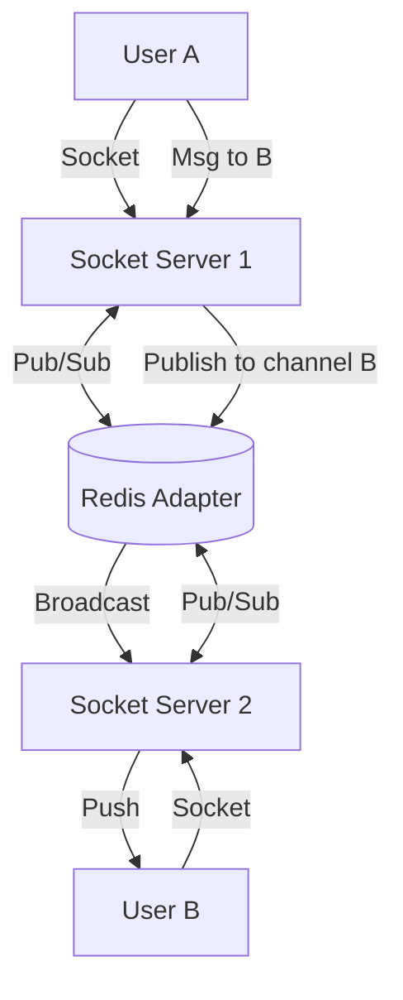
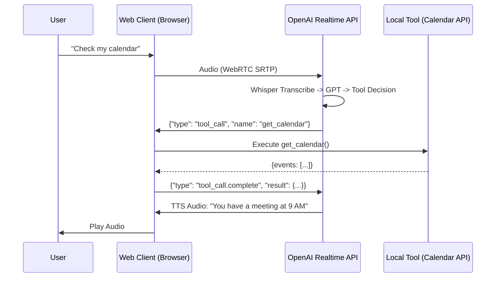
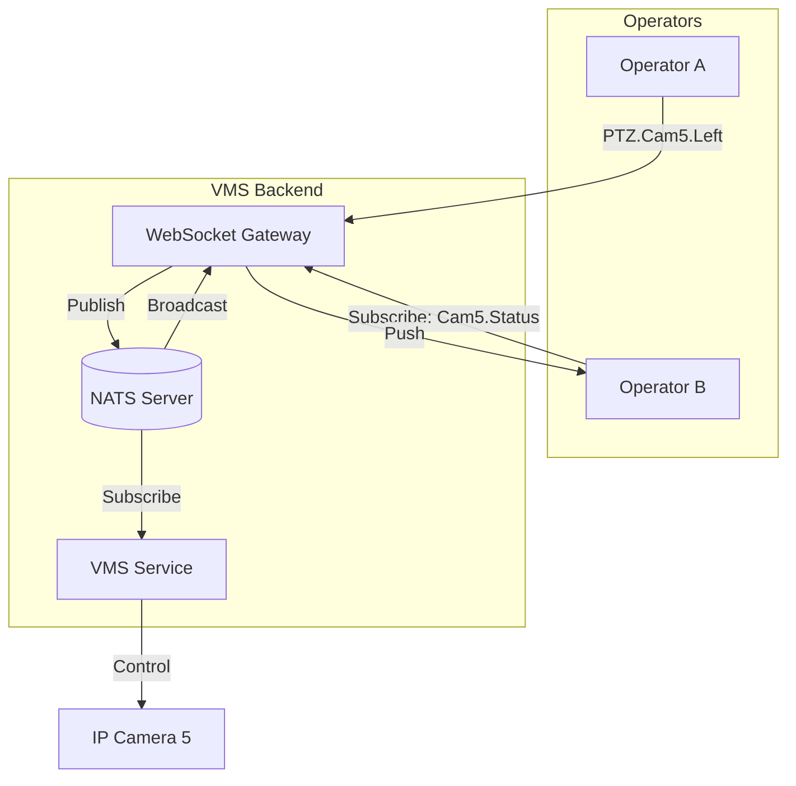

# WebSocket & Real-Time Architecture: The Principal Architect Guide

> **Level**: Principal Architect / SDE-3
> **Scope**: WebSockets, Long-Polling, SSE, and CPaaS Strategies.

> [!IMPORTANT]
> **The Principal Challenge**: WebSockets are **Stateful**. You cannot just "Round Robin" requests. You must maintain a persistent TCP connection. Scaling requires **Horizontal Stickiness** and **Back-channel Synchronization** (Pub/Sub).

---

## 🏗️ The Scaling Problem

### Stateless (HTTP) vs Stateful (WebSocket)
*   **HTTP**: Request comes in, App handles it, Response sent. App forgets client.
*   **WebSocket**: Connection opens. App *remembers* client (Socket ID). Connection stays open for hours.

### The Problem: Broadcasting
User A is on Server 1. User B is on Server 2. User A sends a message "Hello B".
*   Server 1 knows User A.
*   Server 1 *does not* know User B.
*   **Result**: Message lost.

### The Solution: Redis Pub/Sub Adapter
We need a "Backplane" to sync messages across servers.



> **Technology Stack**:
> *   **Node.js**: `Socket.io` with `@socket.io/redis-adapter`.
> *   **Go**: `Gorilla/websocket` with Redis Pub/Sub.

---

## 🛠️ Load Balancing Strategy

You cannot use standard Round-Robin for the *handshake* if you use long-polling fallback (Socket.io).

1.  **Sticky Sessions (Session Affinity)**: The Load Balancer MUST route all requests from ClientID_X to Server_Y for the duration of the session.
    *   *Nginx*: `ip_hash`.
    *   *AWS ALB*: Enable "Stickiness" cookies.
2.  **Pure WebSocket**: If using pure WS (no HTTP fallback), stickiness is less critical for the handshake, but `ConnectionID` mapping is still needed for routing.

---

## 📡 Emerging Standards: WebTransport

WebSockets suffer from **Head-of-Line Blocking** (TCP). If packet 5 is lost, packet 6 waits.
**WebTransport** (over HTTP/3 QUIC) solves this. It allows reliable streams AND unreliable datagrams (UDP-like) over a single connection.
*   **Use Case**: Real-time Gaming, Stock Tickers, Live Video.
*   **Status**: W3C Working Draft (Supported in Chrome/Edge, coming to others).

---

## 📞 Build vs. Buy: The CPaaS Decision

Should you build your own WebSocket/WebRTC clusters?

| Feature | Build (Socket.io / Janus) | Buy (Pusher / Vonage / Ably) |
| :--- | :--- | :--- |
| **Cost** | Low (Infrastructure only) | High (Per message/minute) |
| **Control** | Full (Custom protocols, no limits) | Limited (Vendor APIs) |
| **Maintenance** | High (Scaling, Security, Updates) | Zero |
| **Reliability** | Depends on your SRE team | 99.999% SLA |
| **Time to Market** | Months | Days |

### Real-World Case: Vonage CPaaS
Leveraging vendors like Vonage provides resilience.
*   **Multi-Channel Fallback**: If WebSocket/Video fails (poor 4G), automatically fall back to **PSTN Voice** or **SMS**.
*   **Context Persistence**: Users switch from WhatsApp -> In-App Chat -> Video Call. CPaaS maintains the "Conversation Context".

---

## 🤖 OpenAI WebRTC Realtime API: Client-Side Tool Calling

> **The Paradigm Shift**: OpenAI's Realtime API allows AI agents to execute "Tool Calls" (Function Calls) triggered by voice or text, with sub-second latency over WebRTC.

### How It Works
1.  **Client establishes WebRTC session** with OpenAI's Realtime API endpoint.
2.  **User speaks**: "Check my calendar for tomorrow."
3.  **OpenAI Server** (via Whisper) transcribes, runs LLM, and decides a `tool_call` is needed.
4.  **Server sends `response.tool_call` event** over the WebRTC DataChannel (JSON).
5.  **Client executes the tool locally** (e.g., calls Google Calendar API).
6.  **Client sends `response.tool_call.complete`** with the result.
7.  **Server synthesizes voice response**: "You have a meeting at 9 AM."

### Principal Architecture Pattern



### Why WebRTC for Tool Calling?
*   **Sub-Second Latency**: The entire loop (Voice -> Tool -> Response) must complete in <1s for conversational UX. HTTP polling is too slow.
*   **Bidirectional DataChannel**: WebRTC DataChannels allow JSON messages *alongside* audio/video streams without opening new connections.
*   **NAT Traversal**: WebRTC's ICE/STUN/TURN handles corporate firewalls automatically.

---

## 🌐 NATS: The Lightweight Signaling Layer

> **When to use NATS over Redis/Kafka?**
> NATS is designed for **lightweight, ephemeral signaling**. Redis is for Pub/Sub with persistence. Kafka is for durable event logs.

### NATS in Video Surveillance (VMS)

| Use Case | Why NATS? |
| :--- | :--- |
| **PTZ Control Commands** | "Pan Camera 5 Left". Fire-and-forget. No durability needed. |
| **Presence Updates** | "Operator X is viewing Camera Y". Ephemeral. |
| **WebRTC Signaling (SDP/ICE)** | Exchange SDP offers/answers. Must be instant (<100ms). |

### The Architecture



### NATS vs Redis Pub/Sub vs Kafka

| Feature | NATS | Redis Pub/Sub | Kafka |
| :--- | :---: | :---: | :---: |
| **Latency** | ✅ <1ms | ✅ <5ms | ⚠️ 10-50ms |
| **Durability** | ❌ Ephemeral | ❌ Ephemeral | ✅ Persistent |
| **QoS** | At-most-once | At-most-once | At-least-once |
| **Clustering** | ✅ Native | ⚠️ Sentinel | ✅ Native |
| **Use Case** | Signaling, Commands | Chat, Presence | Event Sourcing |

> [!TIP]
> **The Principal Pattern**: Use **NATS for Commands** (ephemeral), **Redis for Presence** (cached), **Kafka for Events** (durable).

---

## 🔥 Firewalls & WebRTC: The NAT Traversal Problem

> **The Brutal Truth**: 60% of WebRTC connections fail on the first attempt due to **Symmetric NAT** and **Corporate Firewalls**.

### The ICE Maze

1.  **STUN (Session Traversal Utilities for NAT)**: Discovers your public IP. Works for ~80% of home NATs.
2.  **TURN (Traversal Using Relays around NAT)**: Relays all traffic through a server. Works for 100% of cases but is **expensive** (bandwidth cost).
3.  **ICE (Interactive Connectivity Establishment)**: Tries STUN first, falls back to TURN.

### The Corporate Firewall Problem

| Firewall Type | STUN Works? | TURN Works? | Solution |
| :--- | :---: | :---: | :--- |
| **Home NAT** | ✅ Yes | ✅ Yes | — |
| **Symmetric NAT** | ❌ No | ✅ Yes | TURN Relay |
| **Enterprise (Port 443 only)** | ❌ No | ⚠️ Maybe | TURN over TLS (Port 443) |
| **Deep Packet Inspection (DPI)** | ❌ No | ❌ No | WebSocket Fallback |

### The Google-Scale Solution: TURN over TLS on Port 443

```mermaid
graph LR
    Client[Browser] -->|HTTPS (443)| Firewall[Corporate Firewall]
    Firewall -->|"Looks like HTTPS"| TURN[TURN Server (coturn)]
    TURN -->|DTLS-SRTP| Peer[Remote Peer]
```

*   **Why Port 443?** Firewalls almost never block HTTPS.
*   **Why TLS?** DPI cannot distinguish TURN-over-TLS from regular HTTPS traffic.
*   **Tool**: `coturn` (open-source TURN server) with `--tls-listening-port=443`.

> [!WARNING]
> **The Cost Trap**: TURN relays **all** video through your server. At 4K (20 Mbps), 100 concurrent calls = **2 Gbps** bandwidth. Budget for this.

---

## ✅ Principal Architect Checklist

1.  **Heartbeats (Ping/Pong)**: Mandatory. Load Balancers (AWS ALB) kill idle connections (usually after 60s). App must send "Ping" every 30s.
2.  **Maximum File Descriptors**: A server can only handle 65k open ports by default (ephemeral ports). Tune `ulimit -n` to support 100k+ concurrent connections.
3.  **Presence System**: "Who is online?" Do NOT query the DB. Use **Redis Sets** or **Bloom Filters** for efficient presence.
4.  **Ack Strategy**: Fire-and-forget is dangerous. Implement "Client Acks" (Client confirms receipt) for reliability.

---

## 🔗 Related Documents
*   [Event-Driven Architecture](../event-driven-architecture-guide.md) — Async backend patterns.
*   [Serverless Architecture](../serverless-architecture-guide.md) — Using Fargate for WebSocket servers.
