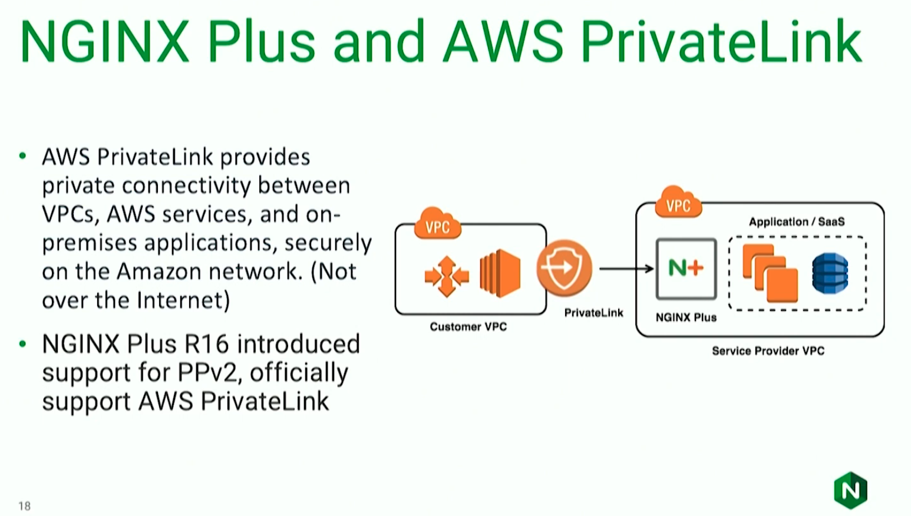
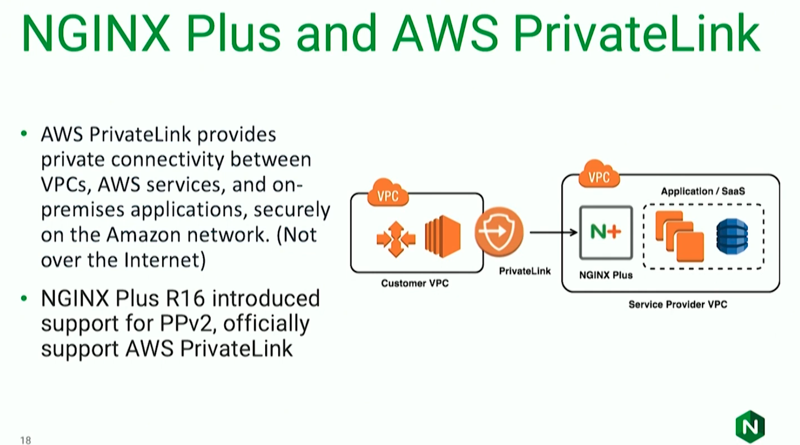
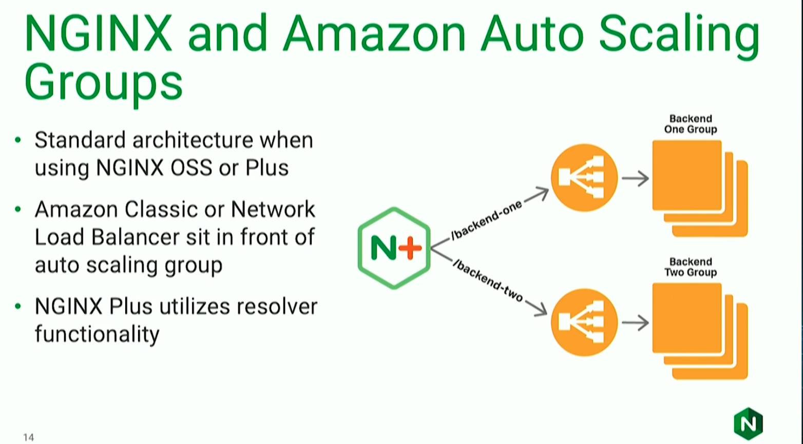
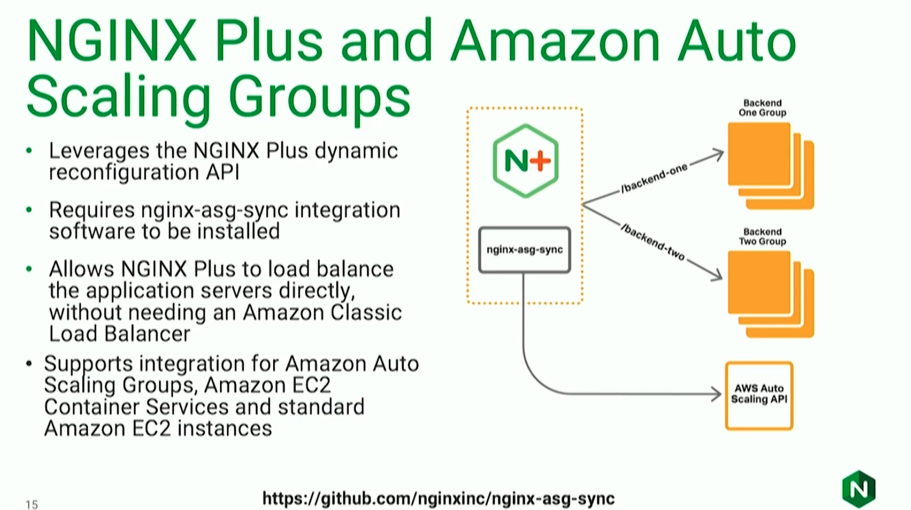
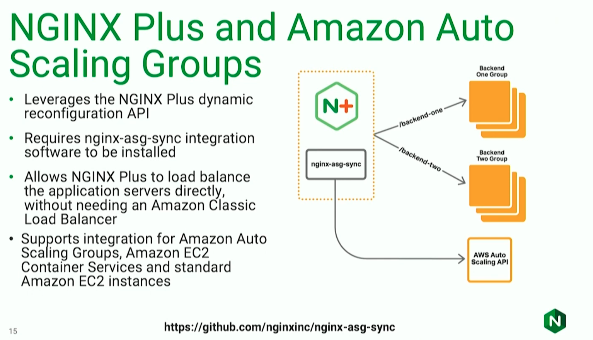
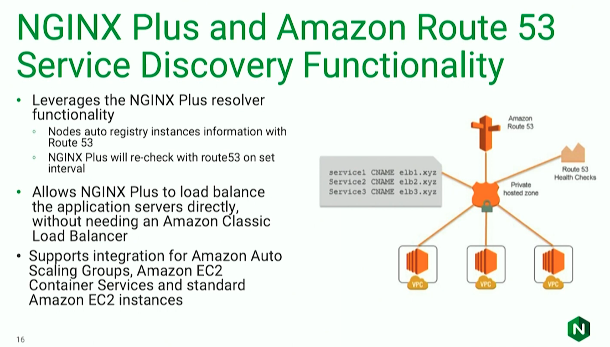

Resource: https://youtu.be/0ChKZmHmu8E?list=PLGz_X9w9raXe_Vc708VKvr5KJ4gnf1WxS

Based on the transcript provided, here is an accurate chronological account of the conversation between Damien Curry (NGINX) and Juan Villa (AWS) regarding scaling web applications.

### Introduction and AWS QuickStart
The presentation begins with introductions by Damien Curry, Technical Manager for Business Development at NGINX, and Juan Villa, a Solutions Architect with AWS. Their discussion focuses on building and scaling web applications using NGINX and AWS.

They introduce an "AWS QuickStart," which serves as a high-level reference architecture for a best-case scenario environment. This architecture includes:
*   **NGINX Plus:** Handles application-level intelligent routing and load balancing.
*   **NGINX Open Source:** Acts as the application web servers on the backend.
*   **Amazon Auto Scaling Groups:** Scales both the NGINX Plus load balancers and the application servers.
*   **Load Balancers & Networking:** Uses Amazon Classic or Network Load Balancers for cross-Availability Zone (AZ) routing, Route 53 for global load balancing, and Amazon VPCs.

They note that this QuickStart is publicly available on the AWS website, allowing users to deploy, customize, and learn from the architecture directly in their own accounts,.

### Deep Dive: NGINX Plus and AWS Load Balancers
The speakers compare three approaches to load balancing on AWS:

1.  **Classic Load Balancer (CLB):** Described as the oldest option, the CLB is simple and HTTP-aware (Layer 4) but lacks Layer 7 routing capabilities (path-awareness). It is traditionally used for simple applications requiring basic round-robin distribution,.
2.  **Application Load Balancer (ALB):** A newer, Layer 7-aware balancer capable of path-based and host-based routing. It is commonly used for microservices architectures (e.g., containers on ECS), though it may lack specific customization options required by some applications.
3.  **NGINX Plus with Network Load Balancer (NLB):** The NLB operates at the TCP layer (not HTTP aware) and forwards connections to NGINX Plus. NGINX Plus then handles the HTTP layer, providing powerful Layer 7 routing and data transformation. This topology is typical for "cloud scale" SaaS solutions serving millions of requests,.

Juan Villa emphasizes using "the right tool for the right job." While AWS load balancers are fully managed, NGINX Plus provides granular configuration and performance benefits that can optimize costs, such as header-based routing,.

**Specific NGINX Plus features mentioned include:**
*   Full gRPC load balancing support.
*   JWT authentication offloading (handling auth at the load balancer so the app doesn't have to).
*   Advanced monitoring and proactive issue tracking.
*   Logic for setting or blocking specific headers.

Using an NLB in front of NGINX masks the complexity of managing IP allocations and horizontal scaling, removing the need for traditional "heartbeat" mechanisms.

### Global Scaling with Route 53
The conversation moves to global server load balancing using AWS Route 53. To improve performance, customers often deploy active-active multi-region configurations (e.g., hosting in the US, Ireland, and Japan simultaneously) to keep applications close to users.

**Route 53 capabilities discussed:**
*   **Latency-based routing:** Directs customers to the region providing the fastest response.
*   **Health checks and failover:** Automatically redirects traffic if a region fails due to application or geographic disasters.
*   **"Pilot Light" Strategy:** For disaster recovery, customers may run a passive "pilot light" region with reduced capacity to save costs (as running two full regions is expensive). Traffic is redirected and the region scaled up only during a failure,.

### Auto Scaling Groups and NGINX Integration
Juan explains that Auto Scaling Groups (ASGs) solve the traditional IT problem of waiting weeks for hardware. ASGs allow users to define templates and scaling bounds based on metrics like latency,. Crucially, ASGs allow infrastructure to scale down during low-traffic periods to save costs.

**The NGINX Sync Tool:**
A traditional setup places a Classic Load Balancer in front of the ASG, which adds a "hop" and hides backend server details from NGINX. To solve this, NGINX developed an **Auto Scaling Group sync tool**:
*   A daemon runs on the NGINX server and queries the AWS SDK.
*   As AWS adds/removes servers, the daemon updates the NGINX Plus configuration via API.
*   This removes the need for an intermediate load balancer and gives NGINX visibility into individual upstream servers, enabling advanced load balancing algorithms like "least time",.

### Service Discovery
The speakers discuss modern architectures (like Docker/Kubernetes) where infrastructure is treated like "cattle, not pets"—instances are ephemeral with changing IPs and ports,.

AWS launched a **Route 53 Service Discovery** feature integrated with ECS. NGINX Plus leverages this by using its resolver functionality to query DNS SRV records. This allows NGINX to dynamically discover the IPs and ports of services without static configuration. This functionality works with Route 53 as well as other discovery tools like Consul,.

### AWS PrivateLink and NGINX Plus

- EXTRACTED from notebookLLM

The final technical feature discussed is **AWS PrivateLink**, which allows services to connect privately without traversing the public internet—critical for regulated industries (banking, medical) and SaaS providers,.

**The Challenge:** Connecting VPCs often leads to overlapping IP address spaces. AWS solves this with **Proxy Protocol v2**, which carries connection information.
**The Solution:** NGINX Plus (specifically release R16) implemented support to handle Proxy Protocol v2. NGINX can ingest this protocol, decrypt the information, and attach it as standard HTTP headers for the backend application, ensuring the app doesn't need to implement complex protocol logic.

- MANUAL EXTRACTION

- This privateLink existed before and it was not something that you could leverage in your infrastructure to connect your own services together it used to be called VPC endpoint e.g. create a VPC endpoint to S3 which meant that from you VPC you didn't have to go over the public internet to get to S3 you could stay within the AWS network and access S3 privately and securely. But you couldn't use that to connect your own services together for example if you had two VPCs and you wanted to connect them together you couldn't use VPC endpoint to do that. So you had to use things like VPNs or direct connects to connect your VPCs together and that was a more complex and expensive way of doing things.

- So, when you are working in a tighly regulated environment like banking, healthcare, etc. they have some limitations over the internet for very obvious reasons thus you need to be able to connect your services together privately and securely and that's where PrivateLink comes in. It allows you to connect your services together privately and securely and it's a lot cheaper than using VPNs or direct connects.

- So, it is all about connection to AWS services securely with a private network with its own encryption of the traffic (e.g. a typical usecase for this would be perhaps if you are a SAAS provider and providing some service let's say you are in customerm billing industry and you have a SAAS platform that collects customers bills and aggegates them and can send out payments and whatnot you've buildt a whole staff and customers pay you per month and you have an API and you want other customers of yours to integrate with your platform so they can consume what they're paying you but this can expose your SaaS to those other customers whose are also running on AWS via a privateLink so now they've the ability to coomunicate and talk to this SaaS that you've built almost like a sharde services VPC runing in the customers own AWS accound because you have that ability to basically make a private connectionthat does not go over the internet and you still have complete power over what your IP addresss is within your VPC so there's no way to gurantee that two people's VPC aren't going to overlapping address space which creates all sorts of networking issues but AWS fixed that using a proxy protocol v2 implemantion that includes infomration about VPC and a bunch of magic that happens the problem here was there no solution to allow layer 7 load balancing from AWS or anyone with this proxy protocol v2 infromation so we (NGINX team) has worked to actually implement this in NGINX PLUS so that when that request comes in if youare a SaaS provider, you can have NGINX behind there and make routing decisions based on what the customer isthat's coming in and be able to take that info and more importnalty than making routing decsions be able to take that info out of a proxy protocol v2 header encrypted an NGINX and attach iit as regular header that your application can understand so again you are having to go ahead and implement the proxy protocol v2 in your application to be able to take advantage of this but NGINX PLUS does it for you), 

rules and such. So, the trffic will flow with a gurantee that this traffic does not flow over the public internet. which in turn hlpes to meet the regulatory requirements.

### More into NGINX and AWS auto scalling groups

With AWS auto scalling group (which often name as template) that defines the EC2 instance type that you want to use and any start up information or scripts essentially that you want to provide to it and then define what you scalling bounds ares generally you start with some minimal amount of scalling then you have an automated trigger that will automatically scale that group based on some metric and that metric is left up to you this is not like automatically done, most of our customers will scale on things like `latency` so when you have an application that's serving API like requests it's usally doing backend operations like query in your database if the applications getting overloaded it's very common to see the `latency` of those requests go up so many people uses `latency` as a metric to scale their applications then AWS automatically adds EC2 instances and now even more important is scalling down to reduce costs  - when there is no huge traffic it should be able to scale down so therefore there should be way to dynamicallly add or remove the application servers from auto scalling group - which AWS has done so. Now infront of that auto scalling group you can put NGINX OSS or NGINX PLUS using them as upstream servers and so this is more of the traditional architecture - you'll see an atuo scalling group usually by default has a classic load balancer associated with it so those instances get brought online they get added to that load balancer this is adding another hop it's adding slighly more complexity and it's also hiding the backend servers from NGINX so NGINX doesn't know about the individual backend servers it only knows about the load balancer and so this is a more traditional way of doing things but it's not the only way of doing things and it's not always the best way of doing things.

So, what we (at NGIXN team) came up with (refer to above image) is an `auto scalling group sync tool` that works with NGINX Plus - it's a daemon that runs on NGINX server and it's communicating with the AWS SDK endpoint and it's querying it and as the AWS endpoint is adding or removing servers - it's making API to the `dynmaic reconfiguration` API of NGINX PLUS to add or remove those servers from the upstream group so NGINX Plus is always aware of what servers are available in the auto scalling group and it can load balance traffic to those servers directly without the need of an intermediate load balancer. 

N.B: But still using a load balancer in front of NGINX Plus is a good idea for high availability and fault tolerance. But off course, it depends on the use case and the requirements.

- While this tool relies on a daemon that runs on your node with NGINX and ishandling that communication there's also functionality that has been created by AWS that allows us to leverage another resolver function in NGINX that is the service discovery functinality built into Route 53 and it has been integrated with other AWS services such as ECS so what this actually does is e.g. if you have an ECS cluster and you have a group of containers defined as a service then when those come up you can actually register those containers with Route 53 and then NGINX can use Route 53 service discovery where this service is located what port is running on what IP addressis running on when - you must be using something like docker or using something that sits on top of dokcer like kubernetes and you are dealing with things called pdds right at that point you are treating you infrastructure like cattle they are not pets. You don't give them names you don't know what they are going to be called because you don't care you just know that you have a hunder an fify-six of something and it's performing with 156 have a different port and a different IP and that can change based on availablity hosts going up and down -> that's where service discovery comes in and when those services regise who they are and where they are ar at and how they can be reached with Route 53 then you have NGINX to query this service discovery and basically ask it "I need to know IP address and port of the notification service" instances that are running in the K8 cluster which could be 5 or that are running across three different hosts across six different ports - that's really the power of that integration in that combination any you will service discovery quite often with  microservices 

- NGINX has other features than service discovery like console which gives the ability so when you are defining an upstream group instead of creating a list of IP addresses and port numbers, you are defining a DNS name and as well as a resolver to query that DNS name and how often you want it to be queried and then on that schedule NGINX PLUS will go return that SRV record - what info is clused in that and then adjust its running configuration to match so it's handling all on-the-fly and we've built this in such a way that it's not just for Route 53 - it integrates with console, and with all the service discovery that that used those SRV records to share info between nodes and for those who are unfamilliar when you are working with DNS servers you have different types of records like CNAME, TXT, A, AAAA, MX, NS, PTR, SOA, SRV, and etc and here SRV is just another of such record within a DNS server that can contain not just an information about the host name but also information about the port number and other information. 

### Conclusion
The video concludes by summarizing these technologies as "building blocks" that can be combined (e.g., using NLB, NGINX, and Route 53 together). Juan notes that customers often choose NGINX to decouple complex logic (like security headers, HSTS, or authentication) from the application code, making it easier to maintain and deploy distributed applications. The speakers thank the audience and invite questions.

