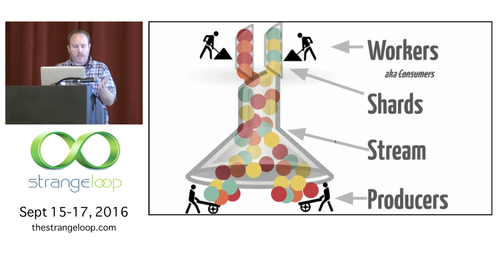
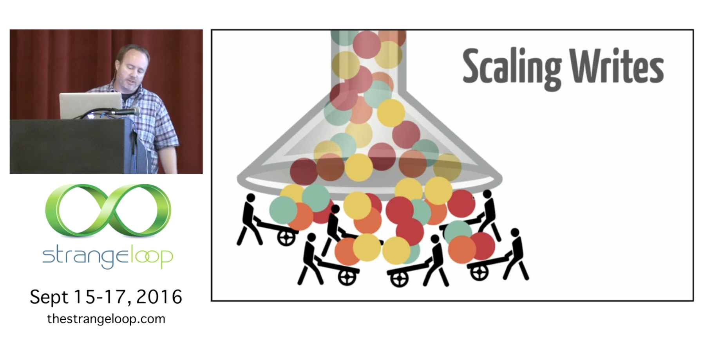
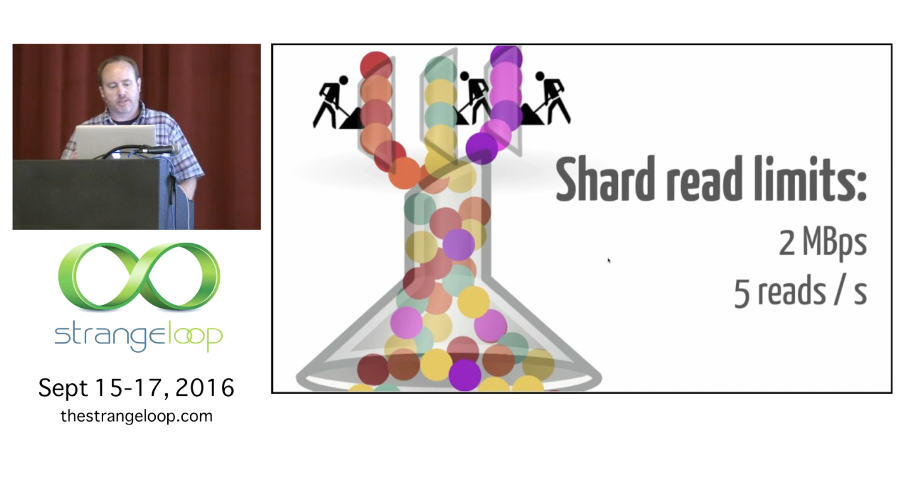
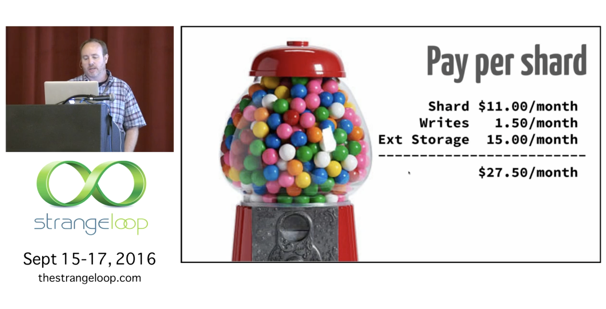
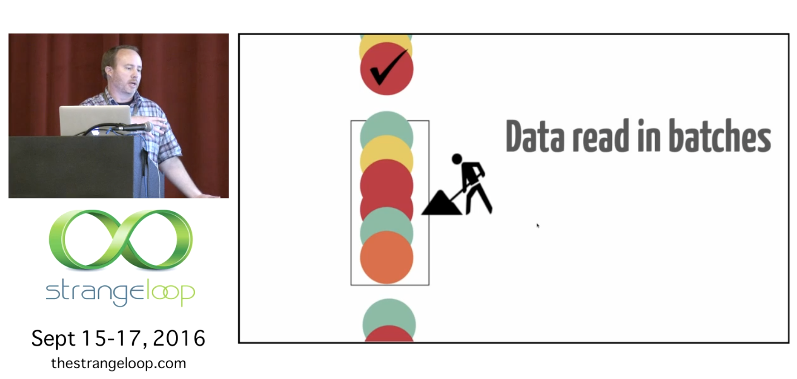

Resource: https://youtu.be/X2g0FFOV2e0 (how distributed commit log works? must watch)

at the bottom it scales easily with something AWS kinesis , as you use many producers all at once

Based on the transcript of the video "Distributed Commit Log: Application Techniques for Transaction Processing" by David McNeil at the Strange Loop Conference, here is an accurate and comprehensive extraction of the presentation from start to end.

### **Introduction and Context**
David McNeil, a developer at Lano Cloud, introduces the topic of building cloud application infrastructure using Amazon Web Services (AWS), specifically focusing on the Amazon Kinesis service.

**Initial Perception vs. Reality:**
*   McNeil notes that a year and a half prior, looking at the marketing page for Kinesis (mentioning clickstream data and pipes) made it difficult to understand.
*   He eventually learned it was essentially a "hosted Kafka," which led him to the technical concept of a **Distributed Commit Log**.

**Goals and Scope:**
*   **Goal:** To share a mental model of how a distributed commit log works and provide patterns (not necessarily "best practices") for using it in transaction processing.
*   **Differentiation:** unlike many use cases that focus on "sloshing" data about for trending analysis (where spilling data is acceptable), his application required accounting for *every* event systematically.
*   **Disclaimer:** While Kinesis and Kafka are similar, he speaks specifically about Kinesis. The patterns presented have trade-offs and are not universal rules.

### **The Commit Log Concept**
McNeil explains the core concept of a commit log, which he describes as deceptively simple.

**Writing:**
*   It is a log of everything that happened.
*   You go to the end of the log and immutably write a record in an append-only fashion.

**Reading:**
*   **Sequential Read:** You start at a point and read forward.
*   **Non-Destructive Read:** You do not consume (delete) records; you merely observe them. This allows multiple applications to observe the same data.
*   **Retention Window:** In Kinesis, data acts like a buffer. Records stay for 24 hours by default, or up to 7 days if you pay more. You must read them before they disappear.

**Iterators:**
There are three ways to open an iterator to read:
1.  **Oldest:** Start at the beginning of the log.
2.  **Newest:** Skip existing data and only read new items.
3.  **Sequence Number:** Start at a specific point. This is crucial for restarting where you left off after a crash.

### **Record Structure**
A record consists of three fields:
1.  **Key:** Provided by the user. Associates records together (e.g., an Account ID).
2.  **Data:** The payload provided by the user.
3.  **Sequence Number:** Added by Kinesis. Identifies the order in which items were received.

**Visual Model:**
McNeil uses a colored ball notation where the color represents the Key, the ball contains the Payload, and the vertical position represents the Sequence Number (time flows top to bottom).

### **Kinesis Architecture**
**Ingestion:**
Producers send "bucket fulls" of records. Kinesis "slurps" them up, resolves race conditions regarding arrival time, and produces a canonical sequence.

**Sharding:**
*   The output is not a single stream but is **sharded by key range**.
*   All records of a specific color (Key) end up in the same Shard.
*   **Ordering Guarantee:** Records are ordered by Key, not globally.
*   Workers process these shards in parallel.

**Scale and Cost:**
*   **Write Limits:** 50,000 writes per second to a stream (aggregate).
*   **Read Limits:** 2 MB/sec or **5 reads per second** per shard. This read limit is a critical restriction.
*   **Cost:** ~$11/month per shard, plus usage costs.

### **The Kinesis Client Library (KCL)**
To manage the distributed nature of reading, Amazon provides the Kinesis Client Library (KCL).
*   **Coordination:** It coordinates which workers read which shards by assigning "leases" (locks) to shards.
*   **Infrastructure:** It uses DynamoDB to store lease and checkpoint information (no Zookeeper required).
*   **Load Balancing:** If you have 3 shards and 1 worker, that worker holds all 3 leases. If you have 5 workers, 2 will remain idle.

### **Reading Mechanics and Patterns**
**Batch Processing:**
Reads return batches of records. Workers process a batch and then update a **Checkpoint** (stored in DynamoDB) to mark progress.

**At-Least-Once Delivery (Handling Duplicates):**
McNeil emphasizes that you *will* get duplicates.
*   **Causes:** A worker might crash after processing but before checkpointing, or a "zombie worker" (who lost its lease but doesn't know it yet) might keep processing.
*   **Mental Model:** You must be paranoid and assume you are seeing messages for the "Nth" time while others process them simultaneously.

**Pattern 1: Idempotency**
Make record processing idempotent so that applying side effects repeatedly yields the same result. This requires careful design.

**Pattern 2: Tracking Sequence Numbers by Key**
*   The KCL checkpoint is just a lower/upper bound.
*   **Technique:** Keep application state that tracks the last sequence number processed *per Key*.
*   **Benefit:** Even if processing is idempotent, re-processing is expensive. Tracking the sequence number allows the application to skip previously processed records efficiently.

**Pattern 3: Parallelizing within a Shard**
*   To scale processing without adding shards, a worker can read a batch and then partition it locally into subsequences by Key.
*   These subsequences are farmed out to a thread pool.
*   **Result:** This preserves the ordering-by-key invariant while allowing parallel processing within a single worker node. This resembles a distributed actor/agent model.

### **Error Handling Patterns**
In transaction processing, you cannot simply drop failed records; the "assembly line" must keep moving.

**Heuristics:**
McNeil suggests categorizing errors using heuristics:
1.  **Intrinsic:** The message itself is poison.
2.  **Environmental:** Network or database issues.
3.  **"It might be me":** The worker itself is the problem.

**Techniques:**
*   **Retry:** Retry environmental errors within limits.
*   **Error Counting:** If an entire batch fails, it is likely environmental. If only one message fails while others succeed, it is likely intrinsic.
*   **Surrender:** If a worker decides "it might be me," it should surrender its leases to let another worker take over.

### **Handling Multiple Applications**
Since reads are non-destructive, multiple applications can read the same stream. However, the limit of **5 reads per second per shard** applies to the shard, not the application.
*   **The Problem:** If two apps read the same shard, they must split the 5 reads/sec capacity. This doubles the latency (e.g., from 200ms to 400ms).

**Pattern 4: Composite Workers**
*   **Technique:** Create a single worker that performs the read from Kinesis.
*   **Implementation:** This worker hands copies of the batch to multiple internal applications (Composite Application).
*   **Trade-offs:** Complexity in checkpointing (what if one internal app fails?) and "yoking" applications together (the slowest app governs the speed of the whole).

### **Dynamic Sharding and State Management**
Shards are not static; they split and merge over time.
*   **Processing Order:** You must process parent shards before their children (after a split) to maintain order. KCL helps with this.

**Pattern 5: State Management by Partition Key**
*   **Problem:** If a worker maintains state (e.g., account balances) for a shard, splitting that state when the shard splits is difficult.
*   **Technique:** Track state by **Partition Key** (e.g., Account ID) rather than Shard ID.
*   **Benefit:** When shards split or merge, the state is already keyed correctly in the storage (e.g., DynamoDB). The new worker simply accesses the state for the keys it now owns.

### **Q&A Session**
*   **Local Testing:** Amazon does not provide a local Kinesis version. McNeil's team built a lightweight in-memory data stream for local testing but validates frequently against AWS.
*   **Poison Events:** If an event is truly poison, shunt it to a "side" queue for manual inspection so the main assembly line can proceed.
*   **Producer Duplicates:** To handle duplicates generated by producers retrying sends, include a unique ID in the payload to distinguish them downstream.
*   **Serialization:** JSON is used for development/readability, but other formats may be used for production.
*   **Monitoring:** The most important metric is "milliseconds behind," provided by CloudWatch.
*   **Composite Workers:** McNeil confirms that composite workers do yoke applications, meaning the slowest one limits the overall rate.