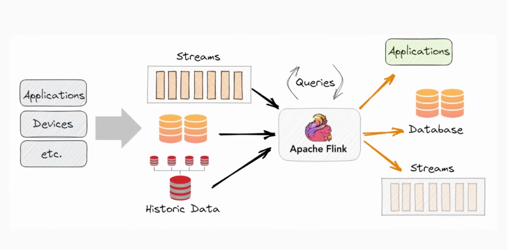
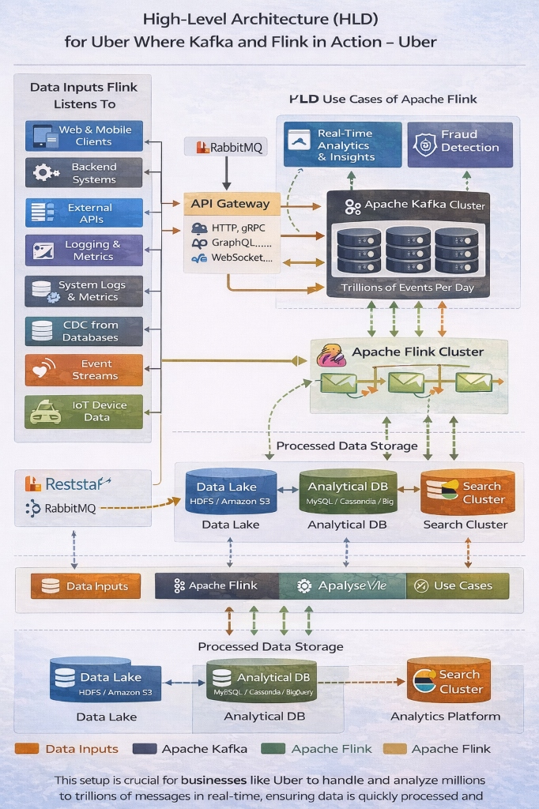

# Apache Flink: The Principal Architect Guide

> **Level**: Principal Architect / SDE-3
> **Scope**: Stream Processing Internals, Stateful Computation, Exactly-Once Semantics, and Production Patterns.

> [!IMPORTANT]
> **The Principal Law**: **Flink is a Compute Engine, not Storage.** It reads from Sources (Kafka, S3), processes data in-flight, and writes to Sinks (Databases, APIs). Think of it as a "Real-Time ETL" that never stops.

---

## 🎯 When Exactly Flink? (The Principal Decision Matrix)

| Requirement | Apache Flink | Kafka Streams | Apache Spark Streaming | AWS Lambda |
| :--- | :---: | :---: | :---: | :---: |
| **True Real-Time** (<100ms) | ✅ Yes | ⚠️ Yes (Library) | ❌ Micro-batch | ❌ Trigger-based |
| **Stateful Processing** (Windows, CEP) | ✅ Best-in-class | ✅ RocksDB | ⚠️ Limited | ❌ No |
| **Exactly-Once Semantics** | ✅ Chandy-Lamport | ✅ With Kafka Only | ⚠️ Micro-batch | ❌ At-Least-Once |
| **Cluster Deployment** (YARN/K8s) | ✅ Native | ❌ Library | ✅ Native | ❌ Serverless |
| **SQL Interface** | ✅ Flink SQL | ❌ No | ✅ Spark SQL | ❌ No |
| **Machine Learning** | ⚠️ FlinkML | ❌ No | ✅ MLlib | ❌ No |

### When to Use Flink
1.  **Complex Event Processing (CEP)**: Detecting patterns in real-time (e.g., Fraud detection: "3 failed logins followed by a password reset within 5 minutes").
2.  **Real-Time Analytics**: Aggregating millions of events per second with stateful windows.
3.  **Stream-Table Joins**: Enriching streaming data with static lookup tables.
4.  **Unified Batch & Stream**: Running the same code for batch (historical) and stream (real-time) data.

---

## 🏗️ High-Level Architecture





```mermaid
graph TD
    subgraph "Sources (Inputs)"
        Kafka[(Kafka Topic)]
        S3[(S3 / HDFS)]
        CDC[(PostgreSQL CDC)]
    end
    
    subgraph "Flink Cluster"
        JM[JobManager (Coordinator)]
        TM1[TaskManager 1]
        TM2[TaskManager 2]
        TMn[TaskManager N]
    end
    
    subgraph "Sinks (Outputs)"
        ES[(Elasticsearch)]
        Redis[(Redis)]
        KafkaOut[(Kafka Topic)]
    end
    
    Kafka --> TM1
    S3 --> TM2
    CDC --> TMn
    
    JM --> TM1
    JM --> TM2
    JM --> TMn
    
    TM1 --> ES
    TM2 --> Redis
    TMn --> KafkaOut
```

### Core Components
| Component | Role |
| :--- | :--- |
| **JobManager** | The "Brain". Schedules tasks, manages checkpoints, and coordinates recovery. |
| **TaskManager** | The "Muscle". Executes the actual operators (map, filter, window). Each TM has "Slots" (CPU cores). |
| **Checkpoint** | Periodic snapshot of operator state to durable storage (S3, HDFS) for fault tolerance. |

---

## 🔌 The Connector Ecosystem

### Sources (Where Flink Reads From)
| Category | Connectors |
| :--- | :--- |
| **Streaming** | Apache Kafka, AWS Kinesis, Google PubSub, Apache Pulsar, RabbitMQ |
| **Filesystems** | S3, HDFS, GCS, Azure Blob, MinIO (via `FileSource`) |
| **Databases (CDC)** | PostgreSQL, MySQL, MongoDB, Oracle, SQL Server (via Flink CDC / Debezium) |
| **Databases (JDBC)** | Any JDBC-compliant database (Polling, not recommended for real-time) |
| **Custom** | TCP Socket, HTTP (via Async I/O) |

### Sinks (Where Flink Writes To)
| Category | Connectors |
| :--- | :--- |
| **Streaming** | Apache Kafka, AWS Kinesis, Google PubSub |
| **Filesystems** | S3, HDFS, GCS (Parquet, Avro, CSV, JSON formats) |
| **Databases (JDBC)** | PostgreSQL, MySQL, SQL Server, Snowflake, ClickHouse |
| **NoSQL** | Elasticsearch, OpenSearch, Cassandra, DynamoDB, Redis, MongoDB |
| **Data Warehouses** | Apache Iceberg, Apache Hudi, Delta Lake |
| **Custom** | HTTP REST API, SMTP (Email), Slack Webhooks |

> [!TIP]
> **The Connector Rule**: If Flink doesn't have a native connector, you can write a custom one by implementing `SourceFunction` (for Sources) or `SinkFunction` (for Sinks).

---

## 🧠 Core Concepts (Deep Dive)

### 1. Event Time vs Processing Time
| Time Semantics | Definition | Use Case |
| :--- | :--- | :--- |
| **Event Time** | Timestamp embedded in the event itself (e.g., `order_placed_at`). | Accurate analytics (Handle late arrivals). |
| **Processing Time** | Timestamp when Flink processes the event. | Low-latency, less accuracy. |
| **Ingestion Time** | Timestamp when Flink receives the event. | Rarely used. |

### 2. Windowing
| Window Type | Description | Example |
| :--- | :--- | :--- |
| **Tumbling** | Fixed-size, non-overlapping. | "Count orders per 1 minute." |
| **Sliding** | Fixed-size, overlapping. | "Count orders in last 5 min, updated every 1 min." |
| **Session** | Gap-based. Closes after inactivity timeout. | "Group user clicks until 30s of no activity." |
| **Global** | Single window for all data. | Rarely used (requires custom triggers). |

### 3. State Management
Flink is **Stateful**. It remembers things between events.
*   **Keyed State**: State partitioned by a key (e.g., `mapState<UserId, OrderCount>`).
*   **Operator State**: State shared across all events (e.g., Kafka partition offsets).
*   **Backend**: Stored in `RocksDB` (on disk) or `HashMap` (in memory).

### 4. Checkpointing (Exactly-Once Guarantee)
*   **Mechanism**: Flink uses **Chandy-Lamport Snapshots**. It periodically injects "Barrier" markers into the stream. When a TaskManager sees a barrier, it snapshots its state to durable storage (S3).
*   **Recovery**: If a node crashes, Flink restarts from the last checkpoint.
*   **Config**: `checkpointInterval: 10s`, `checkpointTimeout: 60s`.

---

## 🛠️ Code Examples (DataStream API)

### Kafka Source to Elasticsearch Sink
```java
import org.apache.flink.api.common.eventtime.WatermarkStrategy;
import org.apache.flink.connector.elasticsearch.sink.Elasticsearch7SinkBuilder;
import org.apache.flink.connector.kafka.source.KafkaSource;
import org.apache.flink.streaming.api.datastream.DataStream;
import org.apache.flink.streaming.api.environment.StreamExecutionEnvironment;

public class KafkaToElasticsearch {
    public static void main(String[] args) throws Exception {
        StreamExecutionEnvironment env = StreamExecutionEnvironment.getExecutionEnvironment();
        
        // 1. Define Source (Kafka)
        KafkaSource<String> kafkaSource = KafkaSource.<String>builder()
            .setBootstrapServers("broker:9092")
            .setTopics("user-events")
            .setGroupId("flink-consumer")
            .setValueOnlyDeserializer(new SimpleStringSchema())
            .build();
        
        DataStream<String> stream = env.fromSource(kafkaSource, WatermarkStrategy.noWatermarks(), "Kafka Source");
        
        // 2. Transform (Parse JSON, Enrich)
        DataStream<UserEvent> events = stream
            .map(json -> parseJson(json))
            .filter(event -> event.getType().equals("PURCHASE"))
            .keyBy(UserEvent::getUserId);
        
        // 3. Define Sink (Elasticsearch)
        events.sinkTo(
            new Elasticsearch7SinkBuilder<UserEvent>()
                .setBulkFlushMaxActions(1000)
                .setHosts(new HttpHost("elasticsearch", 9200, "http"))
                .setEmitter((event, context, indexer) ->
                    indexer.add(new IndexRequest("user-purchases")
                        .id(event.getUserId())
                        .source(Map.of("userId", event.getUserId(), "amount", event.getAmount())))
                )
                .build()
        );
        
        env.execute("Kafka to Elasticsearch Pipeline");
    }
}
```

### Windowed Aggregation
```java
// Count orders per user per 5-minute window
DataStream<OrderCount> counts = orders
    .keyBy(Order::getUserId)
    .window(TumblingEventTimeWindows.of(Time.minutes(5)))
    .aggregate(new OrderCountAggregate());

// Output: { userId: "123", count: 15, windowEnd: "2024-01-01T10:05:00" }
```

### Complex Event Processing (CEP)
```java
// Detect pattern: 3 failed logins followed by password reset within 10 minutes
Pattern<LoginEvent, ?> fraudPattern = Pattern.<LoginEvent>begin("failures")
    .where(event -> event.getStatus().equals("FAILED"))
    .times(3)
    .followedBy("reset")
    .where(event -> event.getType().equals("PASSWORD_RESET"))
    .within(Time.minutes(10));

PatternStream<LoginEvent> patternStream = CEP.pattern(loginEvents, fraudPattern);

patternStream.select((Map<String, List<LoginEvent>> pattern) -> {
    return new FraudAlert(pattern.get("failures").get(0).getUserId());
}).addSink(alertSink);
```

---

## 📊 Flink SQL (The Declarative Approach)

For simpler pipelines, you can use SQL instead of Java.

```sql
-- Create a Kafka Source Table
CREATE TABLE user_events (
    user_id STRING,
    event_type STRING,
    event_time TIMESTAMP(3),
    WATERMARK FOR event_time AS event_time - INTERVAL '5' SECOND
) WITH (
    'connector' = 'kafka',
    'topic' = 'user-events',
    'properties.bootstrap.servers' = 'broker:9092',
    'format' = 'json'
);

-- Create an Elasticsearch Sink Table
CREATE TABLE user_activity_summary (
    user_id STRING,
    purchase_count BIGINT,
    window_end TIMESTAMP(3),
    PRIMARY KEY (user_id) NOT ENFORCED
) WITH (
    'connector' = 'elasticsearch-7',
    'hosts' = 'http://elasticsearch:9200',
    'index' = 'user-activity'
);

-- The Streaming Query
INSERT INTO user_activity_summary
SELECT
    user_id,
    COUNT(*) AS purchase_count,
    TUMBLE_END(event_time, INTERVAL '5' MINUTE) AS window_end
FROM user_events
WHERE event_type = 'PURCHASE'
GROUP BY user_id, TUMBLE(event_time, INTERVAL '5' MINUTE);
```

---

## 🎯 The Final Takeaway: Flink's Role

| Layer | Technology | Role |
| :--- | :--- | :--- |
| **Storage (Logger)** | Apache Kafka | Durable, ordered log of events. "The Memory." |
| **Compute (Processor)** | Apache Flink | Real-time transformations, aggregations, CEP. "The Brain." |
| **Delivery (Sink)** | Elasticsearch, Redis, S3 | Where processed data lands for queries/APIs. "The Hand." |

> **Analogy (Extended)**:
> *   **Kafka** is the **Library Bookshelf** (Stores the books).
> *   **Flink** is the **Researcher** (Reads, thinks, writes a summary).
> *   **Source Connector** is the **Glasses** (Reads from different sources).
> *   **Sink Connector** is the **Pen & Paper** (Writes to different destinations).
> *   **Checkpoint** is the **Bookmark** (Saves progress so you don't start from scratch if you fall asleep).

---

## 🏭 Production Deployment

### Kubernetes (Flink Operator)
```yaml
apiVersion: flink.apache.org/v1beta1
kind: FlinkDeployment
metadata:
  name: fraud-detection-job
spec:
  image: flink:1.17
  flinkVersion: v1_17
  flinkConfiguration:
    taskmanager.numberOfTaskSlots: "4"
    state.checkpoints.dir: s3://my-bucket/checkpoints
  serviceAccount: flink
  jobManager:
    resource:
      memory: "2048m"
      cpu: 1
  taskManager:
    replicas: 3
    resource:
      memory: "4096m"
      cpu: 2
  job:
    jarURI: s3://my-bucket/flink-jobs/fraud-detection.jar
    parallelism: 12
    upgradeMode: stateful
```

---

This guide provides the architectural understanding and practical patterns for building production-grade real-time data pipelines with Apache Flink.

Q: This architecture is from five years ago. Has it changed? Is it still scallable? What would the architecture look like today?

A:
**Has it changed?**
Flink has evolved significantly. The **Unified Batch and Stream** architecture is now mature.

**Is it scalable?**
**Yes.**

**What would the architecture look like today?**
1.  **Flink SQL:** We would write 90% of our pipelines in **Flink SQL** rather than Java/Scala, as it lowers the barrier to entry and allows for easier "Platform" management.
2.  **Paimon / Hudi:** We would sink data into a **Streaming Data Lake** (Apache Paimon or Hudi) to allow for efficient updates/deletes in the lake, rather than just appending Parquet files.
