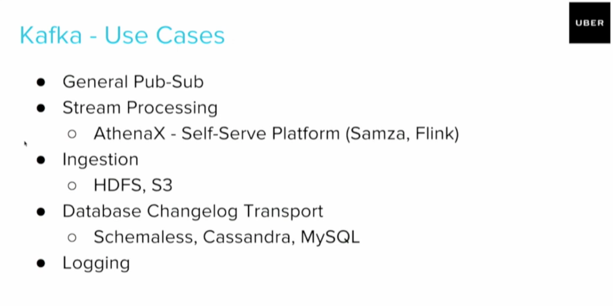

# Apache Kafka: The Principal Architect Guide

> **Level**: Principal Architect / SDE-3
> **Scope**: Internals (Zero Copy, PageCache), Reliability (ISR, ACKs), and Production Patterns.

> [!IMPORTANT]
> **The Principal Law**: **Kafka is a Log, not a Queue**. It doesn't "push" messages; consumers "pull". This inversion of control is why it scales to millions of messages/sec.

> **Source**: [Kafka Summit Keynotes](https://kafka-summit.org)

## Overview

Apache Kafka is a distributed event streaming platform that enables building real-time data pipelines and streaming applications. This comprehensive guide covers Kafka architecture, configuration, performance tuning, monitoring, and enterprise patterns for high-throughput, fault-tolerant messaging systems.

---

## 🎯 When Exactly Kafka? (The Principal Decision Matrix)

> [!IMPORTANT]
> **The Principal Rule**: Kafka is **NOT** a queue. It is a **Distributed Commit Log**. If you don't need **replayability**, **ordering**, or **stream processing**, you probably don't need Kafka.

### The Decision Matrix

| Requirement | Kafka | SQS | SNS | EventBridge | RabbitMQ |
| :--- | :---: | :---: | :---: | :---: | :---: |
| **Replayability** (Re-process old events) | ✅ Yes | ❌ No | ❌ No | ❌ No | ❌ No |
| **Ordering** (Partition-level FIFO) | ✅ Yes | ⚠️ FIFO Queue | ❌ No | ⚠️ Partition Key | ⚠️ Per-Queue |
| **High Throughput** (100k+ msg/sec) | ✅ Yes | ⚠️ Batching | ⚠️ Fanout | ❌ No | ⚠️ Cluster |
| **Stream Processing** (Kafka Streams/Flink) | ✅ Native | ❌ No | ❌ No | ❌ No | ❌ No |
| **Schema Enforcement** (Avro/Protobuf) | ✅ Registry | ❌ No | ❌ No | ❌ No | ⚠️ Manual |
| **Serverless / Zero Ops** | ❌ No | ✅ Yes | ✅ Yes | ✅ Yes | ❌ No |
| **AWS Native Integration** | ⚠️ MSK | ✅ Yes | ✅ Yes | ✅ Yes | ❌ No |
| **Multi-Consumer (Fan-out)** | ✅ Consumer Groups | ❌ No | ✅ Yes | ✅ Yes | ⚠️ Exchange |

### When to Use Each

#### Use **Kafka** When:
1.  **Event Sourcing**: You need to replay events to rebuild state (CQRS).
2.  **Stream Processing**: Real-time aggregation, joins, windowing (Kafka Streams, Flink).
3.  **High Volume**: Millions of events/day with retention for weeks/months.
4.  **Multi-DC Replication**: MirrorMaker for disaster recovery.

#### Use **SQS** When:
1.  **Simple Job Queue**: Worker picks up task, processes, deletes. No replay needed.
2.  **Serverless**: Lambda triggered by SQS is the simplest decoupling pattern.
3.  **Guaranteed Delivery**: Dead Letter Queues for failed messages.

#### Use **SNS** When:
1.  **Fan-Out to Multiple Subscribers**: One event → Email + SMS + Lambda + SQS.
2.  **Push-Based**: You don't want consumers to poll.

#### Use **EventBridge** When:
1.  **AWS Service Integration**: Route S3 events to Step Functions.
2.  **Content-Based Routing**: Filter events by JSON payload (`$.detail.status == "PAID"`).
3.  **SaaS Events**: Receive events from Zendesk, Auth0, etc.

#### Use **RabbitMQ** When:
1.  **Complex Routing**: Exchanges (Direct, Topic, Fanout, Headers) for routing logic.
2.  **Legacy Integration**: AMQP protocol compatibility.
3.  **Priority Queues**: Process VIP customers first.

### The "Event Bus" vs "Message Queue" Confusion

| Term | Definition | Examples |
| :--- | :--- | :--- |
| **Message Queue** | Point-to-point. One producer, one consumer. Message is deleted after consumption. | SQS, RabbitMQ Queue |
| **Pub/Sub** | One producer, many consumers. Each consumer gets a copy. | SNS, Kafka Topic, Redis Pub/Sub |
| **Event Bus** | A **logical abstraction** that routes events based on rules. Implementation varies. | EventBridge (Serverless), Kafka (Log), NServiceBus (.NET) |

> **Kafka is a Pub/Sub system implemented as a Commit Log.** EventBridge is an Event Bus implemented as a serverless router.

---

## 🧠 God Mode: Kafka Internals

Why is Kafka so fast? It's not magic; it's **Operating System physics**.

### 1. Zero Copy (sendfile)
Kafka doesn't copy data into User Space.
*   **Standard Way**: Disk -> Kernel Buffer -> User Buffer (App) -> Kernel Buffer (Socket) -> NIC. (4 Copies).
*   **Kafka Way**: Disk -> Kernel Buffer --(sendfile)--> NIC Buffer. (1 Copy).
*   **Result**: CPU usage is near zero for data transfer. Kafka is **Network Bound**, not CPU bound.

### 2. Sequential I/O & PageCache
*   **Random I/O**: slow (100 IOPS on HDD).
*   **Sequential I/O**: Fast (100MB/s on HDD).
*   Kafka **always appends** to the end of the file (Log).
*   **Linux PageCache**: Kafka relies entirely on the OS file cache. If you have 64GB RAM, and Kafka Heap is 4GB, the other 60GB is automatically used for caching hot data. **Do not set Heap too high!**

### 3. Controller Failover & KRaft
*   **Old Way (ZooKeeper)**: The Controller writes metadata to ZK. Failover takes seconds/minutes.
*   **New Way (KRaft)**: The Controller *is* a Raft consensus group. Metadata is stored in a topic (`__cluster_metadata`). Failover is instant (<200ms).

---

## Core Architecture

### Components
- **Producer**: Applications that publish events to Kafka topics
- **Consumer**: Applications that subscribe to topics and process events
- **Broker**: Kafka servers that store and serve events
- **ZooKeeper**: Manages cluster metadata and coordination
- **Topic**: Logical channel for organizing events
- **Partition**: Unit of parallelism within a topic
- **Consumer Group**: Group of consumers that coordinate processing

### Topic and Partition Model
```bash
# Create topic with partitions and replication
kafka-topics --create \
  --topic user-events \
  --partitions 3 \
  --replication-factor 3 \
  --bootstrap-server localhost:9092

# Describe topic
kafka-topics --describe \
  --topic user-events \
  --bootstrap-server localhost:9092
```

## Producer Configuration

### Java Producer
```java
import org.apache.kafka.clients.producer.*;
import org.apache.kafka.common.serialization.StringSerializer;
import java.util.Properties;

public class KafkaProducerExample {
    private final KafkaProducer<String, String> producer;

    public KafkaProducerExample() {
        Properties props = new Properties();
        props.put(ProducerConfig.BOOTSTRAP_SERVERS_CONFIG, "localhost:9092");
        props.put(ProducerConfig.KEY_SERIALIZER_CLASS_CONFIG, StringSerializer.class.getName());
        props.put(ProducerConfig.VALUE_SERIALIZER_CLASS_CONFIG, StringSerializer.class.getName());

        // Reliability settings
        props.put(ProducerConfig.ACKS_CONFIG, "all");
        props.put(ProducerConfig.RETRIES_CONFIG, 3);
        props.put(ProducerConfig.RETRY_BACKOFF_MS_CONFIG, 100);

        // Performance settings
        props.put(ProducerConfig.BATCH_SIZE_CONFIG, 16384);
        props.put(ProducerConfig.LINGER_MS_CONFIG, 5);
        props.put(ProducerConfig.BUFFER_MEMORY_CONFIG, 33554432);

        // Idempotence for exactly-once semantics
        props.put(ProducerConfig.ENABLE_IDEMPOTENCE_CONFIG, true);
        props.put(ProducerConfig.TRANSACTIONAL_ID_CONFIG, "user-events-producer");

        this.producer = new KafkaProducer<>(props);
    }

    public void sendMessage(String topic, String key, String value) {
        ProducerRecord<String, String> record = new ProducerRecord<>(topic, key, value);

        producer.send(record, (metadata, exception) -> {
            if (exception != null) {
                System.err.println("Failed to send message: " + exception.getMessage());
            } else {
                System.out.printf("Message sent to topic=%s partition=%d offset=%d%n",
                    metadata.topic(), metadata.partition(), metadata.offset());
            }
        });
    }

    public void sendMessageTransactional(String topic, String key, String value) {
        producer.beginTransaction();

        try {
            ProducerRecord<String, String> record = new ProducerRecord<>(topic, key, value);
            producer.send(record);

            // Send to another topic as part of the transaction
            ProducerRecord<String, String> auditRecord =
                new ProducerRecord<>("audit-events", key, "User event: " + value);
            producer.send(auditRecord);

            producer.commitTransaction();
        } catch (Exception e) {
            producer.abortTransaction();
            throw e;
        }
    }

    public void close() {
        producer.close();
    }
}
```

### Node.js Producer
```javascript
const { Kafka, Partitioners } = require('kafkajs');

class KafkaProducer {
    constructor() {
        this.kafka = new Kafka({
            clientId: 'user-service',
            brokers: ['localhost:9092', 'localhost:9093', 'localhost:9094']
        });

        this.producer = this.kafka.producer({
            createPartitioner: Partitioners.LegacyPartitioner,
            idempotent: true,
            transactionalId: 'user-events-producer'
        });
    }

    async connect() {
        await this.producer.connect();
    }

    async sendMessage(topic, key, value, headers = {}) {
        try {
            const result = await this.producer.send({
                topic,
                messages: [{
                    key,
                    value: JSON.stringify(value),
                    headers
                }]
            });

            console.log('Message sent:', result);
            return result;
        } catch (error) {
            console.error('Failed to send message:', error);
            throw error;
        }
    }

    async sendBatch(topic, messages) {
        try {
            const result = await this.producer.send({
                topic,
                messages: messages.map(msg => ({
                    key: msg.key,
                    value: JSON.stringify(msg.value),
                    headers: msg.headers || {}
                }))
            });

            return result;
        } catch (error) {
            console.error('Failed to send batch:', error);
            throw error;
        }
    }

    async disconnect() {
        await this.producer.disconnect();
    }
}

// Usage
async function example() {
    const producer = new KafkaProducer();
    await producer.connect();

    // Send single message
    await producer.sendMessage('user-events', 'user-123', {
        type: 'USER_CREATED',
        userId: '123',
        email: 'user@example.com',
        timestamp: new Date().toISOString()
    });

    // Send batch
    await producer.sendBatch('user-events', [
        { key: 'user-124', value: { type: 'USER_UPDATED', userId: '124' } },
        { key: 'user-125', value: { type: 'USER_DELETED', userId: '125' } }
    ]);

    await producer.disconnect();
}
```

## Consumer Configuration

### Java Consumer
```java
import org.apache.kafka.clients.consumer.*;
import org.apache.kafka.common.serialization.StringDeserializer;
import java.time.Duration;
import java.util.Collections;
import java.util.Properties;

public class KafkaConsumerExample {
    private final KafkaConsumer<String, String> consumer;

    public KafkaConsumerExample(String groupId) {
        Properties props = new Properties();
        props.put(ConsumerConfig.BOOTSTRAP_SERVERS_CONFIG, "localhost:9092");
        props.put(ConsumerConfig.GROUP_ID_CONFIG, groupId);
        props.put(ConsumerConfig.KEY_DESERIALIZER_CLASS_CONFIG, StringDeserializer.class.getName());
        props.put(ConsumerConfig.VALUE_DESERIALIZER_CLASS_CONFIG, StringDeserializer.class.getName());

        // Consumer behavior
        props.put(ConsumerConfig.AUTO_OFFSET_RESET_CONFIG, "earliest");
        props.put(ConsumerConfig.ENABLE_AUTO_COMMIT_CONFIG, false);

        // Performance settings
        props.put(ConsumerConfig.MAX_POLL_RECORDS_CONFIG, 100);
        props.put(ConsumerConfig.FETCH_MIN_BYTES_CONFIG, 1024);
        props.put(ConsumerConfig.FETCH_MAX_WAIT_MS_CONFIG, 500);

        // Exactly-once processing
        props.put(ConsumerConfig.ISOLATION_LEVEL_CONFIG, "read_committed");

        this.consumer = new KafkaConsumer<>(props);
    }

    public void subscribeAndConsume(String topic) {
        consumer.subscribe(Collections.singletonList(topic));

        try {
            while (true) {
                ConsumerRecords<String, String> records = consumer.poll(Duration.ofMillis(100));

                for (ConsumerRecord<String, String> record : records) {
                    processMessage(record);
                }

                // Manual commit after successful processing
                consumer.commitSync();
            }
        } finally {
            consumer.close();
        }
    }

    private void processMessage(ConsumerRecord<String, String> record) {
        System.out.printf("Consumed message: topic=%s, partition=%d, offset=%d, key=%s, value=%s%n",
            record.topic(), record.partition(), record.offset(), record.key(), record.value());

        // Process the message (e.g., update database, send email, etc.)
        // If processing fails, the offset won't be committed
    }

    public void consumeWithManualPartitionAssignment() {
        // Manually assign partitions for more control
        TopicPartition partition0 = new TopicPartition("user-events", 0);
        TopicPartition partition1 = new TopicPartition("user-events", 1);

        consumer.assign(Arrays.asList(partition0, partition1));
        consumer.seek(partition0, 1000); // Start from offset 1000

        while (true) {
            ConsumerRecords<String, String> records = consumer.poll(Duration.ofMillis(100));

            for (ConsumerRecord<String, String> record : records) {
                processMessage(record);
            }

            consumer.commitSync();
        }
    }
}
```

### Node.js Consumer
```javascript
const { Kafka } = require('kafkajs');

class KafkaConsumer {
    constructor(groupId) {
        this.kafka = new Kafka({
            clientId: 'user-service-consumer',
            brokers: ['localhost:9092', 'localhost:9093', 'localhost:9094']
        });

        this.consumer = this.kafka.consumer({
            groupId,
            sessionTimeout: 30000,
            heartbeatInterval: 3000,
            rebalanceTimeout: 60000,
            maxBytesPerPartition: 1048576, // 1MB
            maxBytes: 5242880 // 5MB
        });
    }

    async connect() {
        await this.consumer.connect();
    }

    async subscribe(topic, fromBeginning = true) {
        await this.consumer.subscribe({
            topic,
            fromBeginning
        });
    }

    async consume(onMessage) {
        await this.consumer.run({
            eachMessage: async ({ topic, partition, message }) => {
                try {
                    const key = message.key?.toString();
                    const value = JSON.parse(message.value.toString());
                    const headers = message.headers;

                    await onMessage({
                        topic,
                        partition,
                        offset: message.offset,
                        key,
                        value,
                        headers,
                        timestamp: message.timestamp
                    });

                    // Manual commit after successful processing
                    await this.consumer.commitOffsets([{
                        topic,
                        partition,
                        offset: (parseInt(message.offset) + 1).toString()
                    }]);
                } catch (error) {
                    console.error('Error processing message:', error);
                    // Handle error (retry, dead letter queue, etc.)
                }
            }
        });
    }

    async seek(topic, partition, offset) {
        await this.consumer.seek({ topic, partition, offset });
    }

    async disconnect() {
        await this.consumer.disconnect();
    }
}

// Usage
async function example() {
    const consumer = new KafkaConsumer('user-service-group');
    await consumer.connect();
    await consumer.subscribe('user-events');

    await consumer.consume(async (message) => {
        console.log('Received message:', message);

        // Process message based on type
        switch (message.value.type) {
            case 'USER_CREATED':
                await handleUserCreated(message.value);
                break;
            case 'USER_UPDATED':
                await handleUserUpdated(message.value);
                break;
            case 'USER_DELETED':
                await handleUserDeleted(message.value);
                break;
        }
    });
}

async function handleUserCreated(userData) {
    // Create user in database
    console.log('Creating user:', userData.userId);
}

async function handleUserUpdated(userData) {
    // Update user in database
    console.log('Updating user:', userData.userId);
}

async function handleUserDeleted(userData) {
    // Delete user from database
    console.log('Deleting user:', userData.userId);
}
```

## Stream Processing with Kafka Streams

### Java Streams API
```java
import org.apache.kafka.streams.*;
import org.apache.kafka.streams.kstream.*;
import java.util.Properties;

public class UserEventProcessor {
    public static void main(String[] args) {
        Properties props = new Properties();
        props.put(StreamsConfig.APPLICATION_ID_CONFIG, "user-event-processor");
        props.put(StreamsConfig.BOOTSTRAP_SERVERS_CONFIG, "localhost:9092");
        props.put(StreamsConfig.DEFAULT_KEY_SERDE_CLASS_CONFIG, Serdes.String().getClass());
        props.put(StreamsConfig.DEFAULT_VALUE_SERDE_CLASS_CONFIG, Serdes.String().getClass());

        StreamsBuilder builder = new StreamsBuilder();

        // Stream of user events
        KStream<String, String> userEvents = builder.stream("user-events");

        // Filter for user creation events
        KStream<String, String> userCreations = userEvents
            .filter((key, value) -> {
                try {
                    JSONObject event = new JSONObject(value);
                    return "USER_CREATED".equals(event.getString("type"));
                } catch (Exception e) {
                    return false;
                }
            });

        // Count user creations by hour
        KTable<Windowed<String>, Long> hourlyCounts = userCreations
            .groupByKey()
            .windowedBy(TimeWindows.of(Duration.ofHours(1)))
            .count();

        // Write results to topic
        hourlyCounts.toStream()
            .map((windowedKey, count) -> {
                String key = windowedKey.key() + ":" + windowedKey.window().start();
                return KeyValue.pair(key, count.toString());
            })
            .to("user-creation-hourly-counts");

        // User activity aggregation
        KTable<String, Long> userActivity = userEvents
            .groupByKey()
            .count()
            .filter((userId, count) -> count > 10); // Active users

        userActivity.toStream().to("active-users");

        KafkaStreams streams = new KafkaStreams(builder.build(), props);
        streams.start();

        // Graceful shutdown
        Runtime.getRuntime().addShutdownHook(new Thread(streams::close));
    }
}
```

### ksqlDB for SQL-like Stream Processing
```sql
-- Create stream from topic
CREATE STREAM user_events (
    user_id VARCHAR KEY,
    event_type VARCHAR,
    timestamp VARCHAR,
    metadata MAP<VARCHAR, VARCHAR>
) WITH (
    KAFKA_TOPIC = 'user-events',
    VALUE_FORMAT = 'JSON',
    TIMESTAMP = 'timestamp',
    TIMESTAMP_FORMAT = 'yyyy-MM-dd''T''HH:mm:ss.SSSZ'
);

-- Create table for user profiles
CREATE TABLE user_profiles (
    user_id VARCHAR PRIMARY KEY,
    email VARCHAR,
    name VARCHAR,
    last_active BIGINT,
    event_count BIGINT
) WITH (
    KAFKA_TOPIC = 'user-profiles',
    VALUE_FORMAT = 'JSON'
);

-- Aggregate user activity
CREATE TABLE user_activity AS
SELECT
    user_id,
    LATEST_BY_OFFSET(email) AS email,
    LATEST_BY_OFFSET(name) AS name,
    MAX(ROWTIME) AS last_active,
    COUNT(*) AS event_count
FROM user_events
GROUP BY user_id
EMIT CHANGES;

-- Real-time alerts for high activity
CREATE STREAM high_activity_alerts AS
SELECT
    user_id,
    event_count,
    'HIGH_ACTIVITY' AS alert_type,
    ROWTIME AS alert_timestamp
FROM user_activity
WHERE event_count > 100
EMIT CHANGES;

-- Time-windowed aggregations
CREATE TABLE hourly_user_events AS
SELECT
    user_id,
    WINDOWSTART AS window_start,
    WINDOWEND AS window_end,
    COUNT(*) AS event_count
FROM user_events
WINDOW HOPPING (SIZE 1 HOUR, ADVANCE BY 15 MINUTES)
GROUP BY user_id
EMIT CHANGES;
```

## Schema Registry and Avro

### Avro Schema Definition
```json
{
  "type": "record",
  "name": "UserEvent",
  "namespace": "com.example.events",
  "fields": [
    {
      "name": "userId",
      "type": "string"
    },
    {
      "name": "eventType",
      "type": {
        "type": "enum",
        "name": "EventType",
        "symbols": ["USER_CREATED", "USER_UPDATED", "USER_DELETED"]
      }
    },
    {
      "name": "timestamp",
      "type": "long",
      "logicalType": "timestamp-millis"
    },
    {
      "name": "metadata",
      "type": ["null", {
        "type": "map",
        "values": "string"
      }],
      "default": null
    }
  ]
}
```

### Java Producer with Schema Registry
```java
import io.confluent.kafka.serializers.KafkaAvroSerializer;
import org.apache.avro.Schema;
import org.apache.avro.generic.GenericData;
import org.apache.avro.generic.GenericRecord;

public class AvroProducer {
    private final KafkaProducer<String, GenericRecord> producer;

    public AvroProducer() {
        Properties props = new Properties();
        props.put(ProducerConfig.BOOTSTRAP_SERVERS_CONFIG, "localhost:9092");
        props.put(ProducerConfig.KEY_SERIALIZER_CLASS_CONFIG, StringSerializer.class.getName());
        props.put(ProducerConfig.VALUE_SERIALIZER_CLASS_CONFIG, KafkaAvroSerializer.class.getName());
        props.put("schema.registry.url", "http://localhost:8081");

        this.producer = new KafkaProducer<>(props);
    }

    public void sendUserEvent(String userId, String eventType, Map<String, String> metadata) {
        // Create Avro record
        Schema schema = getUserEventSchema();
        GenericRecord record = new GenericData.Record(schema);
        record.put("userId", userId);
        record.put("eventType", eventType);
        record.put("timestamp", System.currentTimeMillis());
        record.put("metadata", metadata);

        ProducerRecord<String, GenericRecord> producerRecord =
            new ProducerRecord<>("user-events", userId, record);

        producer.send(producerRecord, (metadata, exception) -> {
            if (exception != null) {
                System.err.println("Failed to send Avro message: " + exception.getMessage());
            } else {
                System.out.println("Avro message sent successfully");
            }
        });
    }

    private Schema getUserEventSchema() {
        // Load schema from Schema Registry or define inline
        String schemaString = "{...}"; // Avro schema JSON
        return new Schema.Parser().parse(schemaString);
    }
}
```

## Cluster Management and Operations

### Topic Management
```bash
# List topics
kafka-topics --list --bootstrap-server localhost:9092

# Create topic with configurations
kafka-topics --create \
  --topic orders \
  --partitions 6 \
  --replication-factor 3 \
  --config retention.ms=604800000 \
  --config segment.bytes=1073741824 \
  --bootstrap-server localhost:9092

# Alter topic configurations
kafka-configs --alter \
  --entity-type topics \
  --entity-name orders \
  --add-config retention.ms=2592000000 \
  --bootstrap-server localhost:9092

# Delete topic
kafka-topics --delete --topic old-topic --bootstrap-server localhost:9092

# Topic partitions management
kafka-topics --alter \
  --topic orders \
  --partitions 8 \
  --bootstrap-server localhost:9092
```

### Consumer Group Management
```bash
# List consumer groups
kafka-consumer-groups --list --bootstrap-server localhost:9092

# Describe consumer group
kafka-consumer-groups --describe \
  --group user-service-group \
  --bootstrap-server localhost:9092

# Reset consumer group offsets
kafka-consumer-groups --reset-offsets \
  --group user-service-group \
  --topic user-events \
  --to-earliest \
  --execute \
  --bootstrap-server localhost:9092

# Delete consumer group
kafka-consumer-groups --delete \
  --group old-group \
  --bootstrap-server localhost:9092
```

### Monitoring and Metrics
```bash
# Check broker metrics
kafka-run-class kafka.tools.JmxTool \
  --jmx-url service:jmx:rmi:///jndi/rmi://localhost:9092/jmxrmi \
  --one-time true

# Consumer lag monitoring
kafka-consumer-groups --describe \
  --group user-service-group \
  --bootstrap-server localhost:9092 | \
  awk 'BEGIN{print "Topic Partition Current-Offset Log-End-Offset Lag"}
       /^TOPIC/{print $2 " " $3 " " $4 " " $5 " " ($5-$4)}'
```

## Performance Tuning

### Producer Tuning
```properties
# producer.properties
bootstrap.servers=localhost:9092
key.serializer=org.apache.kafka.common.serialization.StringSerializer
value.serializer=org.apache.kafka.common.serialization.StringSerializer

# Reliability
acks=all
retries=3
max.in.flight.requests.per.connection=1
enable.idempotence=true

# Performance
batch.size=16384
linger.ms=5
buffer.memory=33554432
compression.type=lz4

# Partitioning
partitioner.class=org.apache.kafka.clients.producer.internals.DefaultPartitioner
```

### Consumer Tuning
```properties
# consumer.properties
bootstrap.servers=localhost:9092
group.id=user-service-group
key.deserializer=org.apache.kafka.common.serialization.StringDeserializer
value.deserializer=org.apache.kafka.common.serialization.StringDeserializer

# Consumption behavior
auto.offset.reset=earliest
enable.auto.commit=false
isolation.level=read_committed

# Performance
max.poll.records=100
fetch.min.bytes=1024
fetch.max.wait.ms=500
max.partition.fetch.bytes=1048576

# Rebalancing
session.timeout.ms=30000
heartbeat.interval.ms=3000
```

### Broker Tuning
```properties
# server.properties
# Network
num.network.threads=3
num.io.threads=8
socket.send.buffer.bytes=102400
socket.receive.buffer.bytes=102400
socket.request.max.bytes=104857600

# Log
num.partitions=1
num.recovery.threads.per.data.dir=1
log.retention.hours=168
log.segment.bytes=1073741824
log.retention.check.interval.ms=300000

# Replication
default.replication.factor=3
min.insync.replicas=2
unclean.leader.election.enable=false

# Performance
message.max.bytes=1000012
replica.fetch.max.bytes=1048576
```

## Security

### SSL/TLS Encryption
```properties
# Producer SSL configuration
security.protocol=SSL
ssl.truststore.location=/path/to/truststore.jks
ssl.truststore.password=truststore-password
ssl.keystore.location=/path/to/keystore.jks
ssl.keystore.password=keystore-password
ssl.key.password=key-password

# Consumer SSL configuration (same as producer)
security.protocol=SSL
ssl.truststore.location=/path/to/truststore.jks
ssl.truststore.password=truststore-password
```

### SASL Authentication
```properties
# SASL/PLAIN
security.protocol=SASL_SSL
sasl.mechanism=PLAIN
sasl.jaas.config=org.apache.kafka.common.security.plain.PlainLoginModule required \
  username="kafka-user" \
  password="kafka-password";

# SASL/GSSAPI (Kerberos)
security.protocol=SASL_SSL
sasl.mechanism=GSSAPI
sasl.kerberos.service.name=kafka
sasl.jaas.config=com.sun.security.auth.module.Krb5LoginModule required \
  useKeyTab=true \
  storeKey=true \
  keyTab="/etc/security/keytabs/kafka.keytab" \
  principal="kafka/kafka.example.com@EXAMPLE.COM";
```

### Authorization with ACLs
```bash
# Create ACLs
kafka-acls --authorizer-properties zookeeper.connect=localhost:2181 \
  --add --allow-principal User:kafka-user \
  --operation Read --operation Write \
  --topic user-events

# List ACLs
kafka-acls --authorizer-properties zookeeper.connect=localhost:2181 \
  --list --topic user-events

# Remove ACLs
kafka-acls --authorizer-properties zookeeper.connect=localhost:2181 \
  --remove --allow-principal User:kafka-user \
  --operation Read --topic user-events
```

## Monitoring with Kafka Tools

### Burrow - Consumer Lag Monitoring
```yaml
# burrow.cfg
[zookeeper]
servers=[localhost:2181]
timeout=6
[client-id]
name=burrow-client
[cluster.local]
class=burrow.Cluster
servers=[localhost:9092]
client-id=burrow-client
offsets-topic=burrow-local
```

### Cruise Control - Cluster Balancing
```bash
# Get cluster load
curl -X GET "http://localhost:9090/kafkacruisecontrol/get_cluster_load?json=true"

# Rebalance cluster
curl -X POST "http://localhost:9090/kafkacruisecontrol/rebalance?json=true"

# Add broker
curl -X POST "http://localhost:9090/kafkacruisecontrol/add_broker?brokerid=4&json=true"
```

### Kafka Manager (CMAK)
```yaml
# application.conf
kafka-manager.zkhosts="localhost:2181"
kafka-manager.clusters=[
  {
    name="local",
    zkHosts="localhost:2181",
    kafkaVersion="2.8.0"
  }
]
```

## Docker and Kubernetes Deployment

### Docker Compose
```yaml
version: '3.8'
services:
  zookeeper:
    image: confluentinc/cp-zookeeper:7.0.0
    environment:
      ZOOKEEPER_CLIENT_PORT: 2181
      ZOOKEEPER_TICK_TIME: 2000

  kafka:
    image: confluentinc/cp-kafka:7.0.0
    depends_on:
      - zookeeper
    environment:
      KAFKA_BROKER_ID: 1
      KAFKA_ZOOKEEPER_CONNECT: zookeeper:2181
      KAFKA_LISTENER_SECURITY_PROTOCOL_MAP: PLAINTEXT:PLAINTEXT,PLAINTEXT_INTERNAL:PLAINTEXT
      KAFKA_ADVERTISED_LISTENERS: PLAINTEXT://localhost:9092,PLAINTEXT_INTERNAL://kafka:29092
      KAFKA_OFFSETS_TOPIC_REPLICATION_FACTOR: 1
      KAFKA_TRANSACTION_STATE_LOG_MIN_ISR: 1
      KAFKA_TRANSACTION_STATE_LOG_REPLICATION_FACTOR: 1

  schema-registry:
    image: confluentinc/cp-schema-registry:7.0.0
    depends_on:
      - kafka
    environment:
      SCHEMA_REGISTRY_HOST_NAME: schema-registry
      SCHEMA_REGISTRY_KAFKASTORE_BOOTSTRAP_SERVERS: kafka:29092

  kafka-ui:
    image: provectuslabs/kafka-ui:latest
    depends_on:
      - kafka
      - schema-registry
    environment:
      KAFKA_CLUSTERS_0_NAME: local
      KAFKA_CLUSTERS_0_BOOTSTRAPSERVERS: kafka:29092
      KAFKA_CLUSTERS_0_SCHEMAREGISTRY: http://schema-registry:8081
    ports:
      - "8080:8080"
```

### Kubernetes Deployment
```yaml
apiVersion: apps/v1
kind: StatefulSet
metadata:
  name: kafka
spec:
  serviceName: kafka
  replicas: 3
  selector:
    matchLabels:
      app: kafka
  template:
    metadata:
      labels:
        app: kafka
    spec:
      containers:
      - name: kafka
        image: confluentinc/cp-kafka:7.0.0
        ports:
        - containerPort: 9092
        env:
        - name: KAFKA_BROKER_ID
          valueFrom:
            fieldRef:
              fieldPath: metadata.name
        - name: KAFKA_ZOOKEEPER_CONNECT
          value: zookeeper:2181
        - name: KAFKA_ADVERTISED_LISTENERS
          value: PLAINTEXT://$(KAFKA_BROKER_ID).kafka:9092
---
apiVersion: v1
kind: Service
metadata:
  name: kafka
spec:
  selector:
    app: kafka
  ports:
  - port: 9092
  clusterIP: None
```

## Common Patterns and Use Cases

### Event Sourcing
```java
public class EventSourcedAggregate {
    private String aggregateId;
    private List<DomainEvent> uncommittedEvents = new ArrayList<>();

    public void applyEvent(DomainEvent event) {
        // Apply event to aggregate state
        apply(event);
        uncommittedEvents.add(event);
    }

    public List<DomainEvent> getUncommittedEvents() {
        return uncommittedEvents;
    }

    public void markEventsAsCommitted() {
        uncommittedEvents.clear();
    }

    private void apply(DomainEvent event) {
        // Update aggregate state based on event
        if (event instanceof UserCreatedEvent) {
            // Apply user creation logic
        }
    }
}
```

### CQRS Pattern
```java
// Command side
public class UserCommandService {
    private final KafkaTemplate<String, String> kafkaTemplate;

    public void createUser(CreateUserCommand command) {
        // Validate command
        // Create event
        UserCreatedEvent event = new UserCreatedEvent(
            command.getUserId(),
            command.getEmail(),
            command.getName()
        );

        // Send to Kafka
        kafkaTemplate.send("user-events", command.getUserId(),
            objectMapper.writeValueAsString(event));
    }
}

// Query side
public class UserQueryService {
    private final UserRepository userRepository;

    public UserView getUser(String userId) {
        return userRepository.findById(userId);
    }

    @KafkaListener(topics = "user-events")
    public void handleUserEvent(String message) {
        // Update read model
        UserEvent event = objectMapper.readValue(message, UserEvent.class);

        if (event instanceof UserCreatedEvent) {
            UserView userView = new UserView(
                event.getUserId(),
                event.getEmail(),
                event.getName()
            );
            userRepository.save(userView);
        }
    }
}
```

### Saga Pattern for Distributed Transactions
```java
public class OrderSaga {
    private final KafkaTemplate<String, String> kafkaTemplate;

    public void startOrderSaga(Order order) {
        // Step 1: Reserve inventory
        InventoryReservationCommand reserveCmd = new InventoryReservationCommand(
            order.getOrderId(),
            order.getItems()
        );

        kafkaTemplate.send("inventory-commands", order.getOrderId(),
            objectMapper.writeValueAsString(reserveCmd));
    }

    @KafkaListener(topics = "inventory-events")
    public void handleInventoryReserved(String message) {
        InventoryReservedEvent event = objectMapper.readValue(message, InventoryReservedEvent.class);

        // Step 2: Process payment
        PaymentProcessingCommand paymentCmd = new PaymentProcessingCommand(
            event.getOrderId(),
            event.getTotalAmount()
        );

        kafkaTemplate.send("payment-commands", event.getOrderId(),
            objectMapper.writeValueAsString(paymentCmd));
    }

    @KafkaListener(topics = "payment-events")
    public void handlePaymentProcessed(String message) {
        PaymentProcessedEvent event = objectMapper.readValue(message, PaymentProcessedEvent.class);

        // Step 3: Complete order
        OrderCompletionCommand completionCmd = new OrderCompletionCommand(
            event.getOrderId()
        );

        kafkaTemplate.send("order-commands", event.getOrderId(),
            objectMapper.writeValueAsString(completionCmd));
    }

    @KafkaListener(topics = "inventory-events")
    public void handleInventoryReservationFailed(String message) {
        InventoryReservationFailedEvent event = objectMapper.readValue(message, InventoryReservationFailedEvent.class);

        // Compensate: Cancel order
        OrderCancellationCommand cancelCmd = new OrderCancellationCommand(
            event.getOrderId(),
            "Inventory reservation failed"
        );

        kafkaTemplate.send("order-commands", event.getOrderId(),
            objectMapper.writeValueAsString(cancelCmd));
    }
}
```

## 🏭 Real World Production Patterns (Uber Case Study)

> **Context**: Uber operates one of the largest Kafka clusters in the world (trillions of messages/day).



### The 5 Core Use Cases
1.  **General Pub-Sub**: Decoupling microservices (e.g., Trip created -> Pricing Service, Fraud Service, Dispatch Service).
2.  **Stream Processing (AthenaX)**:
    *   Self-serve platform built on **Apache Flink** and Samza.
    *   Used for dynamic pricing (Surge), ETA calculation, and fraud detection in real-time.
3.  **Ingestion (Data Lake)**:
    *   High-throughput pipeline to dump raw events into **HDFS/S3** for offline analytics (Hive/Presto).
    *   Kafka acts as the "buffer" to prevent overwhelming the storage layer during peak load.
4.  **Database Changelog Transport (CDC)**:
    *   Capturing changes from MySQL/Cassandra (via Debezium/Schemaless) and streaming them to derived data stores.
    *   Ensures cache consistency and search index updates.
5.  **Logging**: The original use case. Centralized log aggregation (ELK/Splunk) without blocking application threads.

---

## 🌊 Apache Flink Integration (The Principal's Choice)

Why do Principal Architects prefer **Kafka + Flink** over Kafka Streams?

| Feature | Kafka Streams | Apache Flink |
| :--- | :--- | :--- |
| **Deployment** | Library (embedded in App) | Cluster (Standalone/YARN/K8s) |
| **State Management** | RocksDB (Local) | RocksDB (Distributed Snapshotting) |
| **Scaling** | Add instances | Rescale operators independently |
| **Windowing** | Event Time | Advanced (Session, Global, Custom) |
| **Use Case** | Microservices, ETL | Complex Event Processing (CEP), ML |

### Flink + Kafka Pattern
Flink treats Kafka as a **unbounded log source**. It uses **Chandy-Lamport Snapshots** to guarantee Exactly-Once Processing even if a node crashes.

```java
// Flink DataStream API with Kafka Source
StreamExecutionEnvironment env = StreamExecutionEnvironment.getExecutionEnvironment();

KafkaSource<String> source = KafkaSource.<String>builder()
    .setBootstrapServers("brokers:9092")
    .setTopics("input-topic")
    .setGroupId("my-group")
    .setStartingOffsets(OffsetsInitializer.earliest())
    .setValueOnlyDeserializer(new SimpleStringSchema())
    .build();

DataStream<String> stream = env.fromSource(source, WatermarkStrategy.noWatermarks(), "Kafka Source");

// Complex Processing (Windowing -> State -> ML)
stream
    .keyBy(value -> extractKey(value))
    .window(TumblingEventTimeWindows.of(Time.seconds(10)))
    .process(new FraudDetectorFunction())  // <--- State kept in RocksDB
    .sinkTo(KafkaSink.<String>builder()    // <--- Sink back to Kafka
        .setBootstrapServers("brokers:9092")
        .setRecordSerializer(KafkaRecordSerializationSchema.builder()
            .setTopic("fraud-alerts")
            .setValueSerializationSchema(new SimpleStringSchema())
            .build()
        )
        .build()
    );

env.execute("Flink Kafka Fraud Detection");
```

> **The Principal Law**: **Kafka is the storage layer; Flink is the compute layer.** They are decoupled. You can replay the last 7 days of Kafka history into a *new* Flink job to backfill data or train a model, without affecting the production consumers.

---

---

## 🧩 Conceptual Clarity: The "Plain English" Flow

**"Where exactly does Flink sit? Is it a Database?"**

Here is the step-by-step lifecycle of a "Real-Time Message" at Uber-scale.

### Step 1: The Client (Synchronous World)
Your phone sends an **HTTP/gRPC/WebSocket** request.
*   *Action*: "Request a Ride".
*   *Recipient*: **Driver Service (API)**.
*   *Experience*: The app shows a spinner. It waits for an `ACK` (Acknowledgement).

### Step 2: The Producer (The Handoff)
The Driver Service doesn't calculate the price or match a driver *instantly*. That takes too long.
*   *Action*: It validates the request and **Produces** an event to Kafka.
*   *Topic*: `trip_requests`
*   *Response*: Returns "200 OK" to your phone ("We are finding a driver...").
*   *Role of Kafka*: It acts as the **Shock Absorber**. If 1 million people request a ride at New Year's Eve, Kafka queues them up without crashing. The API is fast because it just dumps data into Kafka and returns.

### Step 3: Stream Processing (The "Brain")
This is where **Apache Flink** (or Samza) lives. It is **NOT** a database. It is a **Processor**.
*   *Input*: Flink subscribes to `trip_requests`.
*   *Logic*: Flink holds a "Window" of data in memory (e.g., "All drivers in 5km radius updated in last 10s").
*   *Action*: It creates a match: `User A` + `Driver B`.
*   *Output*: It writes the result to a **New Kafka Topic** (`trip_matches`).

### Step 4: The Consumer (The Action)
A separate service (Notification Service) listens to `trip_matches`.
*   *Action*: Sees the match event.
*   *Output*: Pushes a WebSocket message to your phone: "Driver Found!".

### Step 5: Where does CDC fit?
CDC (Change Data Capture) is just **another Producer**.
*   Instead of an API sending an event, the **Database** sends an event.
*   *Scenario*: You update your Profile in the PostgreSQL DB.
*   *Debezium*: Reads the Postgres WAL (Write Ahead Log) and pushes `UserUpdatedEvent` to Kafka.
*   *Flink*: Sees `UserUpdatedEvent` and updates the Fraud Model in real-time.

```mermaid
graph TD
    Client[📱 Client (HTTP/WS)] -->|1. Request| API[API Service]
    API -->|2. Produce| KafkaIn[(Kafka: trip_requests)]
    
    subgraph "Stream Processing (The Brain)"
        Flink[⚡ Flink/Samza]
    end
    
    KafkaIn -->|3. Consume| Flink
    Flink -->|4. Logic (Match)| KafkaOut[(Kafka: trip_matches)]
    
    subgraph "CDC Flow (Parallel)"
        DB[(PostgreSQL)] -->|CDC| KafkaCDC[(Kafka: db_changes)]
        KafkaCDC --> Flink
    end
    
    KafkaOut -->|5. Consume| Notify[🔔 Notification Service]
    Notify -->|6. Push| Client
```

---

## 🔌 The Connector Ecosystem: What can Flink/Samza "Listen" To?

You asked: *"What are all such services, providers, external things they can take input from?"*

Unlike AWS Lambda (which is triggered by specific AWS events), **Flink and Samza are agnostic**. They run on their own protocols and have a massive library of **Connectors**.

### 1. The "Big Three" Sources (Production Standard)
These are the inputs for 95% of real-world use cases.
*   **Apache Kafka**: The gold standard for infinite execution.
*   **AWS Kinesis / Google PubSub**: The cloud-managed alternatives to Kafka.
*   **Apache Pulsar**: Newer, cloud-native messaging.

### 2. Filesystems (Batch & Stream)
Flink monitors these buckets. When a new file lands, Flink ingests it immediately.
*   **Object Storage**: AWS S3, Google GCS, Azure Blob Storage (via `FileSource`).
*   **HDFS**: Hadoop Distributed File System (Legacy on-prem).

### 3. Databases (Direct & CDC)
*   **CDC (Change Data Capture)**: Flink listens to the *transaction log* of databases.
    *   *Supported*: PostgreSQL, MySQL, MongoDB, Oracle, SQL Server (via **Flink CDC Connectors**).
    *   *Mechanism*: It pretends to be a "Replica" node.
*   **JDBC (Polling)**: Flink queries `SELECT * FROM table WHERE updated_at > last_check`. (Slower, not recommended for real-time).

### 4. Custom & Network Protocols
*   **Socket**: Raw TCP/UDP ports (e.g., IoT devices sending raw bytes).
*   **HTTP**: You can expose Flink as an HTTP endpoint (using `Async I/O` or specialized ingesters), but typically you put an API Gateway + Kafka in front (See *Conceptual Clarity* section).

### 5. The "Sink" (Where does it go?)
After Flink thinks, where can it write?
*   **To Databases**: Elasticsearch, JDBC (Postgres/MySQL), Cassandra, DynamoDB, Redis.
*   **To Files**: Write Parquet/Avro files to S3 (Data Lake).
*   **To Streams**: Back to Kafka (for the next microservice).

---

## 🎯 The Final Takeaway: Storage vs Compute

You have hit the nail on the head. To pass the Principal Architect scrutiny, keep this mental model:

### 1. Apache Kafka = "Distributed Stream Logger"
*   **Role**: Storage (The Hard Drive).
*   **Job**: To remember everything that happened, in order, forever (or until retention expires).
*   **Intelligence**: None. It is dumb and fast. It just writes to a log.

### 2. Apache Flink / Samza = "Distributed Stream Processor"
*   **Role**: Compute (The CPU).
*   **Job**: To read the log, do the math (Join, Aggregate, Filter), and write the answer.
*   **Intelligence**: High. It handles state, windowing, and complex logic.

### 3. Connectors = "Universal Adapters" (Sources & Sinks)
*   **Role**: Connectivity (Input & Output).
*   **Job**: As long as a **Connector** exists, Flink can "plug in" to anything to **Read (Source)** or **Write (Sink)**.
    *   **Source**: S3, Postgres, Kafka, TCP.
    *   **Sink**: Elasticsearch, Snowflake, Redis, Email API.
    *   **Abstraction**: Connectors abstract the system so Flink deals with *Records*, not sockets/files.

> **Analogy**:
> *   **Kafka** is the **Library Bookshelf** (It stores the books).
> *   **Flink** is the **Researcher** (It reads the books, thinks, and writes a summary).
> *   **Connector (Source)** is the **Glasses** (Allows reading different languages).
> *   **Connector (Sink)** is the **Pen & Paper** (Allows writing the summary to a shared notebook, email, or sticky note).

---
