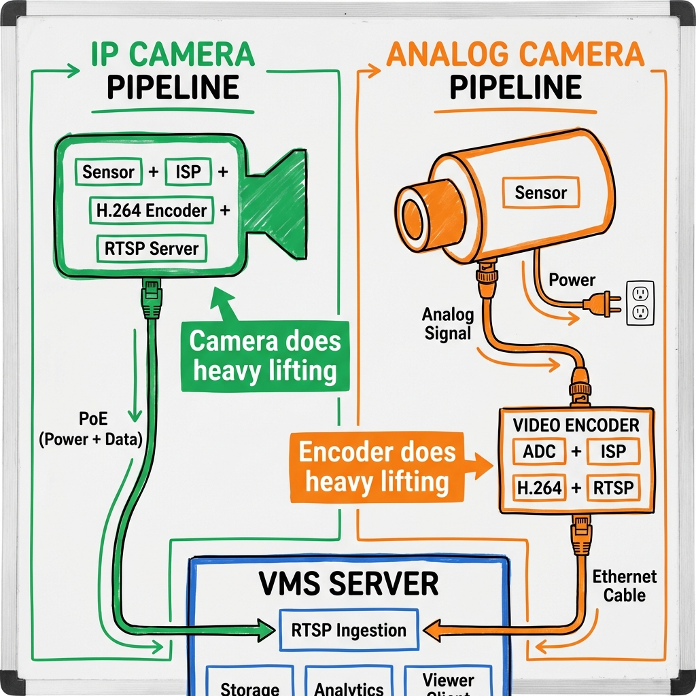
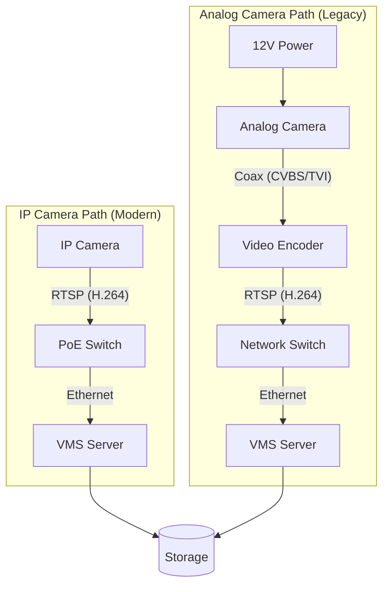
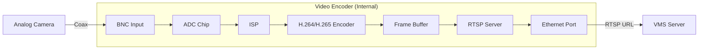

# Analog Camera Integration: The Principal Architect Guide

> **Level**: Principal Engineer / SDE-3
> **Scope**: Analog-to-IP conversion, Video Encoders, HD-Analog standards, and Legacy Migration.

> [!IMPORTANT]
> **The One-Liner**: VMS engineering starts at RTSP ingestion. For analog cameras, a **Video Encoder** provides that RTSP.



---

## 🎯 IP vs Analog: The Core Difference

### IP Camera (Modern)

```
┌─────────────── IP CAMERA ───────────────────────┐
│  Everything happens INSIDE the camera:          │
│                                                  │
│  [Sensor] → [ISP] → [H.264 Encoder] → [RTSP]   │
│                                                  │
│  Camera IS the edge compute device.             │
└──────────────────────│──────────────────────────┘
                       │
              Ethernet (PoE) ← Power + Data
                       │
                       ▼
              ┌─────────────┐
              │ VMS Server  │ ← Engineering starts here
              └─────────────┘
```

### Analog Camera (Legacy)

```
┌─────────────── ANALOG CAMERA ───────────────────┐
│  Camera is DUMB - just a sensor:                │
│                                                  │
│  [Sensor] → [Analog Signal]                     │
│                                                  │
│  NO compression, NO RTSP, NO network.           │
└──────────────────────│──────────────────────────┘
                       │
              Coaxial Cable (BNC) ← Video only
              + Separate Power Cable
                       │
                       ▼
┌─────────────── VIDEO ENCODER ───────────────────┐
│  (Axis, Hikvision, Dahua - External Device)     │
│                                                  │
│  [ADC] → [ISP] → [H.264 Encoder] → [RTSP]       │
│                                                  │
│  Encoder does what IP cameras do internally.    │
└──────────────────────│──────────────────────────┘
                       │
              Ethernet ← Now it's IP!
                       │
                       ▼
              ┌─────────────┐
              │ VMS Server  │ ← Engineering starts here (same!)
              └─────────────┘
```

---

## 📊 Side-by-Side Comparison

| Step | IP Camera | Analog Camera |
| :--- | :--- | :--- |
| **1. Sensor** | ✅ Camera | ✅ Camera |
| **2. ISP (Image Processing)** | ✅ Camera | ✅ Encoder (external) |
| **3. Compression (H.264/H.265)** | ✅ Camera | ✅ Encoder (external) |
| **4. RTSP Server** | ✅ Camera | ✅ Encoder (external) |
| **5. Cable to VMS** | Ethernet (PoE) | Coax + Power → Encoder → Ethernet |
| **6. Power** | PoE (single cable) | Separate 12V/24V |
| **7. VMS Ingestion** | RTSP from camera | RTSP from encoder |

### The Bottom Line

| | IP Camera | Analog + Encoder |
| :--- | :--- | :--- |
| **Who compresses?** | Camera | Encoder |
| **Who runs RTSP?** | Camera | Encoder |
| **Your engineering starts at?** | RTSP from Camera | RTSP from Encoder |
| **For VMS, it looks like?** | IP stream | **Same!** IP stream |

---

## 🏗️ System Architecture (HLD)



---

## 🔧 Video Encoder Details

### What a Video Encoder Does

| Component | Function |
| :--- | :--- |
| **ADC (Analog-to-Digital)** | Converts analog video signal to digital pixels |
| **ISP (Image Signal Processor)** | Color correction, deinterlacing |
| **Encoder** | Compresses to H.264/H.265 |
| **RTSP Server** | Serves stream over network (same as IP camera) |

### Popular Video Encoder Models

| Vendor | Model | Channels | Output | ONVIF |
| :--- | :--- | :--- | :--- | :--- |
| **Axis** | M7104 | 4 | H.264/H.265 | ✅ Yes |
| **Hikvision** | DS-6700 Series | 1-16 | H.264 | ✅ Yes |
| **Dahua** | DH-PFT1200 | 4 | H.264 | ✅ Yes |
| **Hanwha (Samsung)** | SPE-400 | 4 | H.264 | ✅ Yes |

### Encoder LLD (Low-Level Design)



---

## 📺 Analog Video Standards

### Legacy (SD - Standard Definition)

| Standard | Resolution | Region |
| :--- | :--- | :--- |
| **CVBS/Composite** | 480i/576i | Global |
| **PAL** | 576i | Europe, Asia |
| **NTSC** | 480i | Americas, Japan |

### HD-Analog (Modern Analog over Coax)

| Standard | Max Resolution | Developer | Notes |
| :--- | :--- | :--- | :--- |
| **HD-TVI** | 8MP (4K) | Hikvision | Most popular |
| **HD-CVI** | 8MP (4K) | Dahua | Competes with TVI |
| **AHD** | 8MP (4K) | Nextchip | Open standard |
| **HD-SDI** | 1080p | Broadcast | Uncompressed, expensive |

> [!TIP]
> **HD-TVI/CVI/AHD cameras are still "analog"** in that they output over coax, but they support up to 4K resolution. They still need an encoder or compatible DVR to convert to RTSP.

---

## 🛠️ Integration Patterns

### Pattern 1: Single Encoder per Camera

```
[Analog Cam] ──coax──> [1-Ch Encoder] ──ethernet──> [VMS]
```

**Use when**: Few analog cameras, need ONVIF per camera.

### Pattern 2: Multi-Channel Encoder

```
[Analog Cam 1] ──coax──┐
[Analog Cam 2] ──coax──┼──> [4-Ch Encoder] ──ethernet──> [VMS]
[Analog Cam 3] ──coax──┤
[Analog Cam 4] ──coax──┘
```

**Use when**: Many analog cameras in one location.

### Pattern 3: Hybrid DVR

```
[Analog Cam 1] ──coax──┐
[Analog Cam 2] ──coax──┼──> [Hybrid DVR] ──ethernet──> [VMS]
[IP Cam 1] ──ethernet──┤
[IP Cam 2] ──ethernet──┘
```

**Use when**: Mixed camera inventory, gradual migration.

---

## ⚠️ Gotchas & Best Practices

### 1. Latency

| Path | Latency |
| :--- | :--- |
| **IP Camera → VMS** | ~100ms |
| **Analog Camera → Encoder → VMS** | ~100-200ms (encoder adds delay) |

### 2. PTZ Control

- **Analog PTZ**: Uses RS-485 (Pelco-D/P protocol) over separate wire.
- **Encoder must support**: RS-485 passthrough to convert to ONVIF PTZ.

### 3. Power

- **IP Camera**: PoE (single cable).
- **Analog Camera**: Separate 12V/24V power supply.
- **Encoder**: Needs its own power (usually 12V or PoE).

### 4. Quality Loss

| Input | Quality |
| :--- | :--- |
| **CVBS (SD)** | 480p - Too low for AI analytics |
| **HD-TVI/CVI** | Up to 4K - AI works |

---

## ✅ Principal Architect Checklist

1.  **Audit Existing Cameras**: Count analog vs IP. Plan encoder capacity.
2.  **Choose ONVIF Encoders**: Ensures VMS treats them as IP cameras.
3.  **Power Budget**: Analog cameras + encoders need separate power planning.
4.  **PTZ Wiring**: If analog PTZ exists, encoder must support RS-485.
5.  **Migration Plan**: Phase out analog; encoders are temporary.

---

## 🔗 Related Documents
*   [VMS Architecture](./vms-architecture-guide.md) — Full VMS/VSAAS guide.
*   [Video Streaming Protocols](./video-streaming-protocols.md) — RTSP, HLS, WebRTC.
