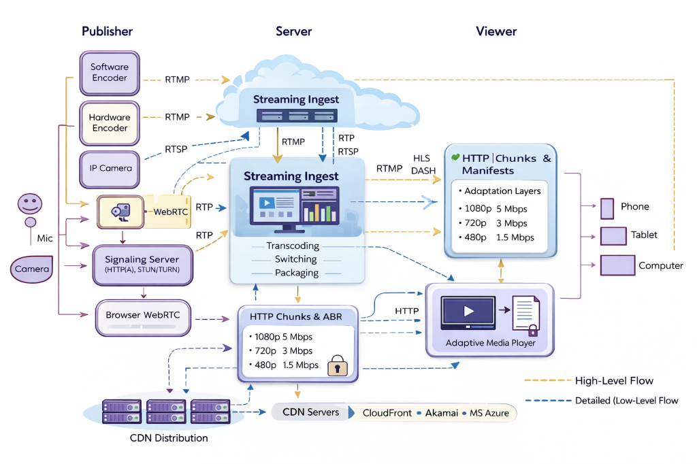

# Live Streaming Architecture: Principal Architect's Guide

> **Level**: Principal Engineer / SDE-3
> **Scope**: LL-HLS, CMAF, QUIC, Edge Compute, and Scale-out Strategies.




> [!IMPORTANT]
> **The Core Tension**: Global Scale vs. Sub-Second Latency.
> **The Solution**: Hybrid Architecture (WebRTC for <500ms, LL-HLS for <3s, HLS for >10s).

---

## 📹 The Source Options: How Does Video Enter the Pipeline?

> **The Principal Question**: "Before we scale, what are we scaling *from*?"

The "Contribution" layer (First Mile) has four distinct source types, each with different trade-offs.

### 1. Software Encoder (OBS, Wirecast)
*   **Hardware**: High-powered desktop/laptop.
*   **Camera Input**: HDMI, USB, or IP camera via **Capture Card**.
*   **Audio**: Mic input, I/O card, or USB interface.
*   **Output Protocol**: **RTMP** (most common), **SRT** (modern).
*   **Use Case**: Streamers, podcasters, virtual events.
*   **Pro**: Flexible, cheap, can stream pre-recorded media files.
*   **Con**: CPU-intensive encoding, relies on internet stability.

### 2. Hardware Encoder (Matrox, AJA, LiveU Solo)
*   **Hardware**: Dedicated appliance (2-button simple operation).
*   **Camera Input**: **HDMI** (direct), no capture card needed.
*   **Audio**: 3.5mm audio input. Local recording to USB.
*   **Output Protocol**: **RTMP** or **SRT**.
*   **Use Case**: Professional broadcast, field production.
*   **Pro**: Reliable, hardware H.264/HEVC encoding, bonded cellular (LiveU).
*   **Con**: **Cannot stream pre-recorded media files** (no file playback).

### 3. IP / Pro Camera with Built-in RTMP
*   **Hardware**: Professional IP camera (Canon, Sony PTZ).
*   **Connection**: Connects **directly to Wowza/Server** via RTMP.
*   **Audio**: XLR inputs (Pro cameras), 3.5mm (Prosumer).
*   **Recording**: On-camera recording to SD card (if HDMI output).
*   **Use Case**: Houses of Worship, Studios, Fixed installations.
*   **Pro**: No capture card, no computer needed in the loop.
*   **Con**: **Cannot stream pre-recorded media files**.

### 4. WebRTC (Browser-Based)
*   **Hardware**: Desktop, Laptop, Mobile (Chrome, Safari).
*   **Camera Input**: USB webcam or HDMI via capture card.
*   **Audio**: Mic input, I/O card, USB interface.
*   **Output Protocol**: **WebRTC** (WHIP for ingest).
*   **Use Case**: User-Generated Content (UGC), Crowdsourced streams (Twitch Clips).
*   **Pro**: Zero-install, works in any browser.
*   **Con**: Limited quality control, **cannot stream pre-recorded media files** (browser security).

### Summary Matrix

| Source Type | Flexibility | Quality Ceiling | Pre-Recorded Files? | Complexity |
| :--- | :---: | :---: | :---: | :---: |
| **Software Encoder (OBS)** | ✅ High | ⚠️ CPU Limited | ✅ Yes | ⚠️ Medium |
| **Hardware Encoder** | ⚠️ Medium | ✅ High (4K60) | ❌ No | ✅ Low |
| **IP Camera (RTMP)** | ❌ Low | ✅ High | ❌ No | ✅ Low |
| **WebRTC (Browser)** | ✅ High | ⚠️ 1080p30 typical | ❌ No | ✅ Very Low |

## 🏗️ The Latency Pyramid (Protocol Selection)

| Latency Budget | Protocol | Transport | Use Case | Scale Limit |
| :--- | :--- | :--- | :--- | :--- |
| **< 500ms** | **WebRTC** | UDP/SRTP | Betting, Bidding, VoIP | High Cost ($$$) |
| **2 - 5s** | **LL-HLS / DASH** | HTTP/2 or 3 | Sports, "Social Parity" | Infinite ($) |
| **10 - 30s** | **Standard HLS** | HTTP/1.1+ | Linear TV, Events | Infinite ($) |

> **"Social Parity"**: The requirement that a stream is not slower than strict broadcast TV (approx. 6-8s delay) or Twitter/X text updates.

---

## 🧩 The Missing Link: Packaging & Origin Storage

> **User Question**: "After ABR, how does chunking happen? Do we send it directly to the consumer or store it?"

**The Answer**: We **NEVER** send directly to the consumer from the Encoder. That stops scaling. We use a **Packager** and an **Origin**.

### 1. The Packager (The Knife)
The Transcoder outputs a continuous stream. The **Packager** cuts it.
*   **Static Packaging**: Write full files to disk. (Old school).
*   **JIT Packaging (Just-in-Time)**: Store one high-quality "Mezzanine" file. When a user asks for HLS, the Packager chops it *on demand*.

### 2. The Origin (The Warehouse)
Where do the chunks go?
*   **Ramdisk / Ephemeral SSD**: For Live. We only need to keep the last 2 minutes.
*   **S3 / Object Storage**: For DVR/VOD.
*   **Origin Shield**: A caching layer (Nginx/Varnish) that protects the Storage from the CDN.

### 3. The Flow (Principal View)

| Component | Input | Action | Output | Destination |
| :--- | :--- | :--- | :--- | :--- |
| **Encoder** | Raw Video | Compress (H.264) | RTMP Stream | **Transcoder** |
| **Transcoder** | RTMP | ABR (Create 5 bitrates) | 5x Streams | **Packager** |
| **Packager** | 5x Streams | **CHUNKING HAPPENS HERE** | .ts / .m4s Files | **Origin Storage** |
| **CDN** | HTTP Request | Pulls File (Cache Miss) | Cached File | **Viewer** |
| **Viewer** | URL | Switches Bitrate | Playback | **Retina** |

> [!TIP]
> **God Mode**: **Do we store it?** Yes, but for Live visualization, we treat storage as a **Ring Buffer**. We write file 1, 2, 3... 100, then overwrite file 1. This keeps storage costs constant (O(1)) regardless of stream duration.

---

## ⚡ Low-Latency HLS (LL-HLS) Internals

Apple's extension to HLS (2019) enables <3s latency at CDN scale.

### 1. The Mechanics of Speed
*   **Partial Segments**: Instead of waiting for a full 6s segment to generate, the encoder publishes 200ms "parts" (`.m4s`).
*   **HTTP/2 Push** (Deprecated) → **H2/H3 Preload Hints**: The server hints to the client "The next part is coming here, request it now."
*   **Blocking Playlist Reloads**: The client asks for the *next* update. The Edge Server holds the request open (Long Polling) until the playlist changes.

### 2. The Delta Playlist
To reduce overhead, the server sends only the *changes* (Deltas) to the playlist, not the full 1MB manifest every 200ms.

```http
GET /playlist.m3u8?_HLS_msn=100&_HLS_part=2
```
*   `_HLS_msn`: Media Sequence Number (wait until segment 100 exists).
*   `_HLS_part`: Part Number (wait until part 2 exists).

---

## 📦 CMAF & Chunked Transfer Encoding

**Common Media Application Format (CMAF)** allows *single-encoding* for both HLS (Apple) and DASH (Android/Web), but its real power is **Chunked Transfer**.

### The "ULL" (Ultra Low Latency) Pipeline

```mermaid
graph LR
    Encoder -->|Chunk 1 (200ms)| Packager
    Packager -->|Chunk 1| CDN
    CDN -->|Chunk 1| Player
    
    Encoder -->|Chunk 2 (200ms)| Packager
    Packager -->|Chunk 2| CDN
    CDN -->|Chunk 2| Player
```

*   **Standard**: Encoder generates 4s segment → Uploads to CDN → CDN available. (Latency ~6s)
*   **Chunked**: Encoder generates 200ms chunk → Writes to HTTP Response stream immediately.
    *   The Player begins decoding frame 1 of the segment *while frame 30 is still being generated* by the encoder.
    *   **Header**: `Transfer-Encoding: chunked`

---

## 🚀 HTTP/3 (QUIC): Killing Head-of-Line Blocking

**Problem**: In TCP (HTTP/1.1 & H2), one lost packet stalls *all* streams until retransmitted (Head-of-Line Blocking).
**Solution**: QUIC (UDP) treats streams independently.

### Impact on Video
*   **Rebuffering**: Drops by 20-30% on weak networks (mobile).
*   **Startup Time**: 0-RTT handshakes mean faster video start.
*   **Live Edge**: Allows players to stay closer to the "live edge" without stalling.

> [!TIP]
> **Implementation**: Enable `h3` on your CDN (Cloudflare/Fastly/CloudFront). Ensure your players (ExoPlayer, AVPlayer, hls.js) prioritize http/3.

---


## ⚖️ Scaling Strategies: The Video Paradox

> **User Question**: "Do I add more servers (Horizontal) or bigger servers (Vertical)?"

**The Answer**: You do **BOTH**, but at different stages.

### 1. Vertical Scaling (Scale UP) -> HEADEND
**Target**: **Transcoders / Encoders**.
*   **Why**: Video encoding is an "atomic" heavy-lift operation.
*   **The Problem**: Splitting *one* live stream across *two* weak servers is an engineering nightmare (sync issues, race conditions).
*   **The Strategy**: Use **Massive Instances** (e.g., AWS `c7g.16xlarge` or GPU `g5.12xlarge`). It is far better to have one beast handling 50 streams than 50 tiny servers handling 1 stream each.

### 2. Horizontal Scaling (Scale OUT) -> DELIVERY
**Target**: **Edge / CDN / Origin**.
*   **Why**: Serving segments (`.ts` files) is a stateless "Read-Only" operation.
*   **The Strategy**: This is the "Read Replica" problem. You can spin up 1,000 Nginx nodes behind a Load Balancer.
*   **Auto-Scaling**: If viewer count spikes from 1k to 1M, you auto-scale the **Edge Fleet**, NOT the Transcoder Fleet.

---

---

## 🏗️ The Build vs Buy Dilemma: Edge vs CDN

> **User Question**: "When do I use a commercial CDN (Cloudflare/Akamai) vs building my own Edge Servers?"

**The Principal's Answer**: It depends on "Smart" vs "Dumb".

### 1. The Core Distinction
*   **Commercial CDN (The "Dumb" Pipe)**:
    *   **Best For**: Bulk delivery of static segments (`.ts`, `.m4s`).
    *   **Pros**: Infinite scale, DDoS protection, Global reach instantly.
    *   **Cons**: "Dumb" caching. Hard to run complex custom logic. High "Tax" at scale ($0.05/GB adds up).
*   **Proprietary Edge (The "Smart" Node)**:
    *   **Best For**: Low-latency signaling (WebRTC), Custom Manifest Manipulation (SSAI), DRM Handshakes.
    *   **Pros**: Zero marginal cost per GB (you own the metal), sub-second control.
    *   **Cons**: High Ops load. You are now an ISP.

### 2. The Cost Trap (CapEx vs OpEx)
*   **Startup Phase**: **Buy CDN**.
    *   *Why*: Paying $100/month for Cloudflare is cheaper than hiring a DevOps engineer ($150k/year) to manage an Edge Fleet.
*   **Netflix/YouTube Phase**: **Build Edge**.
    *   *Why*: At 1 Pbps, CDN bills would be billions. Buying hard drives (CapEx) causes the cost-per-GB to drop to near zero.

### 3. The Hybrid Strategy (Google Standard)
Don't choose one. Use **Both**.
1.  **Smart Layer (Own Edge)**: Serve the **Manifests (.m3u8)** and handle **DRM/Auth** from your own servers. (Low Bandwidth, High Logic).
2.  **Dumb Layer (CDN)**: Serve the **Video Segments (.ts)** via Akamai/Cloudfront. (High Bandwidth, Zero Logic).

---

---

## 🧱 The CDN Protocol Wall: Why RTSP Fails

> **User Question**: "Does regular CDN work with RTSP? What if I don't use HLS/DASH?"

**The Hard Truth**: Standard CDNs (Cloudflare, Akamai, CloudFront) **DO NOT** speak RTSP, RTMP, or WebRTC. They are **HTTP-Only**.

### 1. The "Stateful" Problem
*   **CDNs** are designed for **Stateless Files** (Images, CSS, HLS Segments). They cache a file and serve it.
*   **RTSP/RTMP** are **Stateful Pipes**. They require a persistent, open socket connection. You cannot "cache" a live socket.

### 2. The "What Then?" Solution
If you have an RTSP camera stream, you have two choices:

#### Option A: Transmuxing (The Standard Way)
You convert the stateful RTSP stream into stateless HTTP segments.
*   **Flow**: Camera (RTSP) -> **Your Server (Transmuxer)** -> HLS (.ts) -> **CDN** -> Player.
*   **Pros**: Cheap, standard CDN pricing.
*   **Cons**: Adds latency (2-5 seconds).

#### Option B: The "WebRTC CDN" (The Premium Way)
You pay for a specialized Real-Time Network (Agora, Millicast, Phenix).
*   **Architecture**: These aren't HTTP caches. They are a fleet of **Relay Servers** that ingest WebRTC/RTSP and "fan out" unique UDP connections to every viewer.
*   **Pros**: <500ms latency.
*   **Cons**: **Extremely Expensive** ($0.50 - $1.00 per GB vs $0.05 for HTTP CDN).

---

## 🧠 Edge Server Architecture & Optimization

Moving logic to the edge (Cloudflare Workers, AWS Lambda@Edge) solves complex scale problems. But first, the **Physical Layout**:

### 1. The 3-Tier Delivery Chain
1.  **Origin (The Source)**: S3 or NVMe Storage. (Single Point of Truth).
2.  **Origin Shield (The Bodyguard)**: A dedicated caching layer (Varnish/Nginx) that protects the Origin.
    *   *Rule*: The Edge nodes talk to the Shield. They **NEVER** talk to the Origin directly.
3.  **The Edge (The Point of Presence - PoP)**: Thousands of small servers physically close to the user (ISP Peering).

### 2. The Magic of Connect: Geo-DNS & Anycast
> **User Question**: "How does the player know which Edge server to connect to?"

Your understanding is **100% Accurate**. The "Scaling" magic happens at the **DNS Layer**.
1.  **Single URL**: You give every player the same URL: `https://live.example.com/stream.m3u8`.
2.  **The Resolution**:
    *   **User A (London)** asks DNS: "Where is live.example.com?" -> AWS Route53 sees IP is UK -> Returns **London Edge IP**.
    *   **User B (Tokyo)** asks DNS: "Where is live.example.com?" -> AWS Route53 sees IP is Japan -> Returns **Tokyo Edge IP**.
3.  **The Result**: You publish ONCE to the Origin. The CDN uses DNS to trick millions of users into connecting to local servers.

### 3. Edge Logic: Personalized Manifests (SSAI)
Server-Side Ad Insertion (SSAI) manipulates the manifest per-user.
*   **Edge Logic**: Inject `ad_segment_01.ts` into the m3u8 for User A, but `ad_segment_02.ts` for User B.
*   **Benefit**: Bypasses ad-blockers, seamless transition (no client-side flickering).

### 3. Request Collapsing (The "Thundering Herd" Shield)
1M users request `segment_100.ts` at the exact same second.
*   **Without Edge**: 1M requests hit the Origin. Origin dies.
*   **With Edge**: Edge holds 999,999 requests, fetches once from Shield, serves all from cache.

---

## 🎬 Real-World Architecture: "The Dual-Path Strategy"

For Sports/Betting apps, we implement a Hybrid approach.

```mermaid
graph TD
    Source[Live Feed] --> Encoder[Encoder]
    
    Encoder -->|Path A: WebRTC| SFU[SFU Network]
    Encoder -->|Path B: LL-HLS| Packager
    
    SFU -->|Sub-second (Premium)| UserVIP[VIP / Better]
    Packager -->|CDN (Scale)| UserFree[Free Viewer / 3s Delay]
    
    subgraph "Failover Logic"
        UserVIP -.->|Network Poor| UserFree
    end
```

```

### 📡 The Fan-Out Architecture: Restreaming (Simulcasting)

> **User Goal**: "I want to stream to my custom app AND YouTube, Twitch, and Facebook at the same time."

This is known as **Restreaming** or **Simulcasting**.

#### 1. The Protocol: RTMP Push (The Standard)
Even if your app uses WebRTC or SRT for low latency, YouTube and Twitch **require** RTMP.
**The Pattern**: Your server acts as a client. It "pushes" the stream to their ingest endpoints.

#### 2. The Architecture (1-to-N)
```mermaid
graph LR
    Source[OBS / Camera] -->|Input Stream (5 Mbps)| Ingest[Your Server]
    
    Ingest -->|Transcode/HLS| App[Your App Users]
    Ingest -->|RTMP Push| YT[YouTube Live]
    Ingest -->|RTMP Push| FB[Facebook Live]
    Ingest -->|RTMP Push| TW[Twitch]
```

#### 3. The Principal Challenge: Bandwidth Multiplication
Restreaming is expensive on **Upload Bandwidth**.

*   **Ingress**: You receive **5 Mbps**.
*   **Egress (Fan-Out)**:
    *   YouTube: 5 Mbps
    *   Facebook: 5 Mbps
    *   Twitch: 5 Mbps
*   **Total Upload Required**: **15 Mbps** just for restreaming.

> [!WARNING]
> **Don't kill your Origin**.
> Do not do this on your main Ingest/Transcoder node. Use a dedicated **Relay Service** (Nginx-RTMP or a simple Go/Rust forwarder) that sits *beside* your pipeline solely for pushing to external RTMP endpoints.

---

### The "Dead Zone" Problem
Switching from WebRTC (Live) to HLS (DVR/Rewind) creates a timeline gap.
*   **WebRTC**: T=0
*   **HLS**: T=-4s
*   **The Jump**: When a user clicks "Rewind", they jump back 4 seconds. The UI must handle this gracefully (e.g., "Catch up to Live" button jumps back to WebRTC).

---

## ✅ Principal Architect Checklist

1.  **Enable IPv6 & QUIC**: Free performance wins on all major CDNs.
2.  **Tune TCP Windows**: For Origin servers, increase `initcwnd` (Initial Congestion Window) to allow larger bursts (essential for 4K segments).
3.  **GOP Alignment**: Ensure Keyframes align perfectly across all bitrates. If they don't, ABR switching will fail (player stalls).
4.  **CMAF**: Standardize on CMAF to halve storage costs (one container for HLS & DASH).
5.  **Origin Shield**: Never expose your Encoder/Origin directly to the internet. Always put a Shield Tier (Nginx/Varnish) in between.

---

## 🔗 Related Documents
*   [WebRTC Scaling Architecture](./webrtc-scaling-architecture-guide.md) — For the sub-second path.
*   [Video Security Architecture](./video-streaming-security-architecture.md) — DRM and Watermarking.

