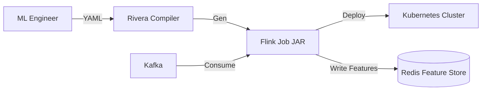

Resource: https://youtu.be/u6AjSr58h6g?list=TLGGAyr6rvw-G5UyNTAxMjAyNg

# DoorDash's Iguazu: The "God Mode" Architecture Guide

> **Level**: Principal Architect / Distinguished Engineer
> **Scope**: Real-Time Analytics, Kafka Ingestion, and Automation Workflows.

> [!IMPORTANT]
> **The Principal Law**: **The Platform Must Be Invisible.**
> If a Product Engineer has to write a Helm Chart to deploy a Kafka Consumer, you have failed. DoorDash built "Minions" to make streaming infrastructure "Click-Ops" simple.
> **The Scale**: 100 Billion Events/Day. Mobile-First Ingest.

---

## 🏛️ The "Heterogeneous" Ingestion Problem

Uber had 3k services. DoorDash has that + millions of Mobile Phones.
*   **The Problem**: You cannot embed the official Java Kafka Client in an iOS app.
*   **The constraint**: The "Network is the bottleneck".
*   **The Solution**: **Iguazu (The Kafka Proxy)**.

### The Iguazu Proxy (REST on Steroids)
DoorDash built a custom **REST Proxy** (similar to Uber) but tuned for **Analytics** (lossy) vs **Transactions** (lossless).
1.  **Async "Fire and Forget"**:
    *   App sends HTTP POST.
    *   Proxy responds `200 OK` **immediately** (before writing to Kafka).
    *   **Risk**: If the Proxy crashes 1ms later, data is lost.
    *   **Reward**: Client latency is 5ms. No backpressure.
    *   **Math**: < 0.001% data loss is acceptable for "Button Click" events.
2.  **Smart Batching**:
    *   The Proxy buffers events in RAM.
    *   Writes to Kafka only when Buffer > 1MB or Time > 500ms.
    *   **God Mode**: This reduces IOPS on the Kafka Brokers by 100x compared to per-message writes.

---

## 🧠 The Brain: Flink & "Rivera"

Raw Kafka is useless to a Data Scientist. They need SQL.
DoorDash chose **Apache Flink** as the standard processing engine.

### The Abstraction Ladder
1.  **Level 1 (Hard)**: **Flink DataStream API** (Java). For Core Infra teams.
2.  **Level 2 (Medium)**: **Flink SQL**. For Data Engineers.
3.  **Level 3 (God Mode)**: **Rivera (DSL)**.
    *   **What is it?**: A YAML-based DSL for ML Engineers.
    *   **Input**: "I want the count of orders for Store X in the last 15 minutes."
    *   **Output**: Rivera compiles this YAML into a Flink Job, deploys it to K8s, and wires the output to Redis.
    *   **Impact**: Development time dropped from **2 weeks** to **1 hour**.

---

## 🤖 Automation: The "Minions" (Cadence)

How do you manage 1,000 Flink jobs without 1,000 Ops tickets?
**Cadence (Temporal ancestor)**.

*   **The Minion Service**: A Workflow Orchestrator.
*   **The Flow**:
    1.  User clicks "Create Pipeline" in UI.
    2.  Minion triggers a Cadence Workflow.
    3.  Step 1: Create Kafka Topic (Terraform).
    4.  Step 2: Register Schema (Schema Registry).
    5.  Step 3: Deploy Flink Job.
    6.  Step 4: Configure Snowpipe.
*   **Result**: Infrastructure as Code, but generated by Robots, not Humans.

---

## ❄️ The Storage: Snowpipe Integration

The goal: Get data from Mobile Phone -> Snowflake in < 1 minute.
*   **The Pipeline**: Flink -> S3 (Parquet) -> SQS -> Snowpipe -> Snowflake.
*   **Why S3 Middleman?**:
    *   **Decoupling**: If Snowflake goes down, Flink keeps writing to S3. No backpressure.
    *   **Cost**: S3 is cheap. Snowflake Compute is expensive. We batch heavily in S3 before alerting Snowpipe.

---

## ⚖️ Protocols & Schemas: The Strict Gatekeeper

DoorDash enforced **Protobuf** everywhere.
*   **Why?**: gRPC support. Smaller payload than JSON/Avro.
*   **The Build-Time Check**:
    *   CI/CD Pipeline checks: "Is this schema backward compatible?"
    *   If No -> **Block Pull Request**.
    *   **Principal Rule**: specificy Schema Validation at *Build Time*, not *Runtime*. Runtime errors cause data loss; Build time errors cause annoys developers (which is fine).

---

## 🔮 The Modern Perspective (2025 Update)

What would we change today?

### 1. Open Table Formats (Iceberg)
We sink to S3 -> Snowflake.
*   **2025 Approach**: Sink to **Apache Iceberg** tables on S3.
*   **Why**: Snowflake can read Iceberg External Tables directly (Zero Copy).
*   **Cost**: Massive reduction in "Ingestion" costs. You pay for storage (S3), not compute (Snowpipe).

### 2. Redpanda / WarpStream
Kafka + Zookeeper is heavy.
*   **Redpanda** (C++): Drops latency/CPU usage.
*   **WarpStream** (S3-native): Infinite retention at S3 cost. No disk management. Perfect for "Log Analytics" pipelines where 99% of data is cold.

### 3. Temporal (Successor to Cadence)
DoorDash used Cadence (built by Uber).
*   **Today**: **Temporal** is the commercial successor. Better UI, Cloud offering. The pattern ("Infrastructure as Workflow") remains the gold standard.

---

## 🏁 Conclusion

DoorDash's Iguazu proves that **Usability is an Infrastructure Concern**.
They didn't just build a Kafka Cluster; they built a **Product** (Rivera + Minions) that made the infrastructure accessible.
*   **Junior Ops**: "I scaled the Kafka Brokers."
*   **Principal Ops**: "I built a self-serve portal so I never have to touch a Kafka Broker again."