# Twitter Real-Time Timeline Architecture: Engineering Case Study

> **Source**: "Timelines at Scale" Presentation (Twitter Engineering)
> **Level**: Staff Engineer / System Architect
> **Core Pattern**: Fanout-on-Write, Hybrid Push/Pull, Eventual Consistency

> [!IMPORTANT]
> **The Problem Definition**: Twitter is not a social network; it is a **Real-Time Information Delivery Network**. The challenge is not storing tweets (easy); it is delivering 26 Billion tweets per day to timelines with <50ms latency.

---

## 🏗️ High-Level Architecture

The system is designed around the **Fanout-on-Write** principle to optimize for read latency (99% reads, 1% writes).

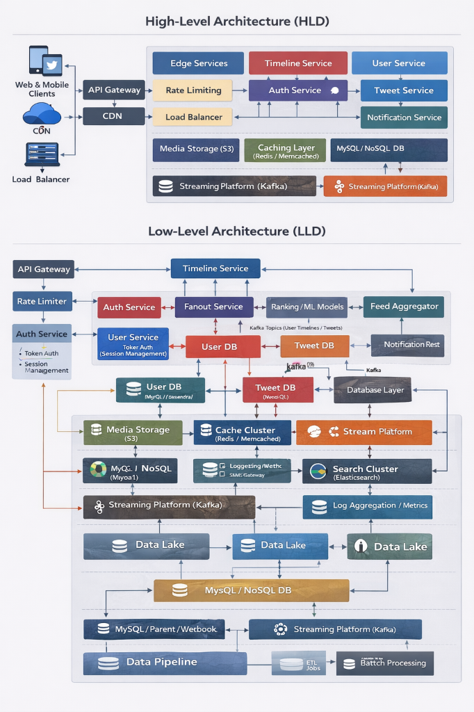

```mermaid
graph TD
    User[User A (Author)] -->|Tweet| API[Write API]
    API -->|Async| Fanout[Fanout Service]

    subgraph "Redis Cluster (Timeline Cache)"
        List1[User B Timeline]
        List2[User C Timeline]
        ListN[User N Timeline]
    end

    Fanout -->|Push| List1
    Fanout -->|Push| List2
    Fanout -->|Push| ListN

    API -->|Ack (50ms)| User
```

// ... (existing content) ...

## 4. Search Architecture (Pull-Based)
Search is the inverse of Timelines.
*   **Timelines**: Expensive Write, Cheap Read.
*   **Search**: Cheap Write, Expensive Read.

```mermaid
graph LR
    Tweet --> Ingest[Ingester Service]
    Ingest -->|Tokenize| EB[Early Bird (Lucene Shards)]
    
    User[Search Query] --> Blender[Blender Service]
    Blender -->|Scatter-Gather| EB
    EB -->|Results| Blender
    Blender -->|Merge & Rank| User
```

**Architecture**:
1.  **Ingester**: Tokenizes tweets.
2.  **Early Bird (Lucene)**: In-memory inverted index (sharded).
3.  **Blender**: Scatter-gather query service. Queries all Early Bird shards, merges, ranks by social signals.

---

## 5. The "Celebrity" Problem (Lady Gaga Effect)

**The Issue**: Fanout works for 99% of users. It fails for users with 50 Million followers. Writing to 50M Redis lists takes too long, causing **Timeline Lag** (Tweet shows up minutes later).

**Hybrid Solution**:
*   **Normal Users**: Push (Fanout to Redis).
*   **Celebrities (High-Follower Count)**: Pull (Don't Fanout).
*   **Read-Time Merge**: When you view your timeline, the system fetches your Redis list (Normal friends) AND queries the "Celebrity Tweet Cache" (recent tweets from Lady Gaga etc) and merges them in the browser/API.

> [!WARNING]
> **Trade-off**: This makes reads slightly more expensive (two queries instead of one) but saves massive write resources.

---

## 6. Push Infrastructure (Hosebird)
How to maintain open connections for millions of devices?

*   **Problem**: 1 Million open TCP connections pushing data.
*   **Solution**: **Hosebird** (Cascading Cluster).
    *   **Level 1**: Receives full firehose.
    *   **Level 2-4**: Splits stream to edge nodes.
    *   **Edge**: Handles actual client TCP connection filtering.
*   **Throughput**: Public tweets = ~25 MB/sec.

---

## 7. Key Engineering Stats

| Metric | Value | Implications |
| :--- | :--- | :--- |
| **Tweet Volume** | 4,000 - 10,000 / sec | Manageable (Medium Load) |
| **Fanout Load** | **300,000 / sec** | The real bottleneck (Write Amplification) |
| **Delivery Volume** | **26 Billion / day** | Massive egress bandwidth |
| **Redis Latency** | 4 ms (p99) | Critical for "Real-Time" feel |

---

## 8. Principal Architect's Critique & Analysis

This section explores the deeper engineering trade-offs not explicitly stated in the general overview.

### 8.1 Write Amplification vs Read Latency
The core trade-off here is **Write Amplification**. 
*   **Input**: ~4,000 tweets/sec.
*   **Output (Fanout)**: ~300,000 deliveries/sec.
*   **Factor**: ~75x amplification.
*   *Critique*: This architecture is extremely expensive on the write side. It trades **Compute/Storage (Write)** for **Latency (Read)**. It assumes that reads (Timeline views) happen much more frequently than writes, which is true for consumption-heavy platforms.

### 8.2 The "Thundering Herd" Risk
The 3-second penalty for Inactive Users (Scenario B) is a critical risk.
*   **Risk**: If a major event happens (e.g., "World Cup Final") and millions of inactive users log in simultaneously to check the score...
*   **Impact**: The "Reconstruction" path (querying Social Graph + merging) will overload the DBs, potentially cascading into a system-wide outage since Redis is bypassed.
*   **Mitigation**: Likely rate-limiting reconstruction or serving stale/empty timelines under load.

### 8.3 CAP Theorem Placement
This system is strictly **AP (Available + Partition Tolerant)**.
*   **Consistency**: Eventual. The "Fanout" takes time.
*   **Scenario**: If User A tweets, User B might see it in 1ms (same Redis shard), while User C sees it in 2s (different shard / celebrity lag). The system guarantees *Delivery* (eventually), not *Simultaneity*.

### 8.4 Memory Cost Analysis
Storing 26 Billion deliveries/day in RAM (Redis) is non-trivial.
*   **Optimization**: Storing `[TweetID, Bits]` vs `[Full JSON]`.
*   **Cost**: Even 20 bytes * 26 Billion = ~500 GB of *new data per day* just for IDs.
*   **Retention**: This implies strict retention policies (e.g., "Only keep last 800 IDs in Redis"). Older data must be fetched from disk (SQL/Manhattan), which is slower but acceptable for pagination.

---

## 📚 Visual Reference (Original Slides)

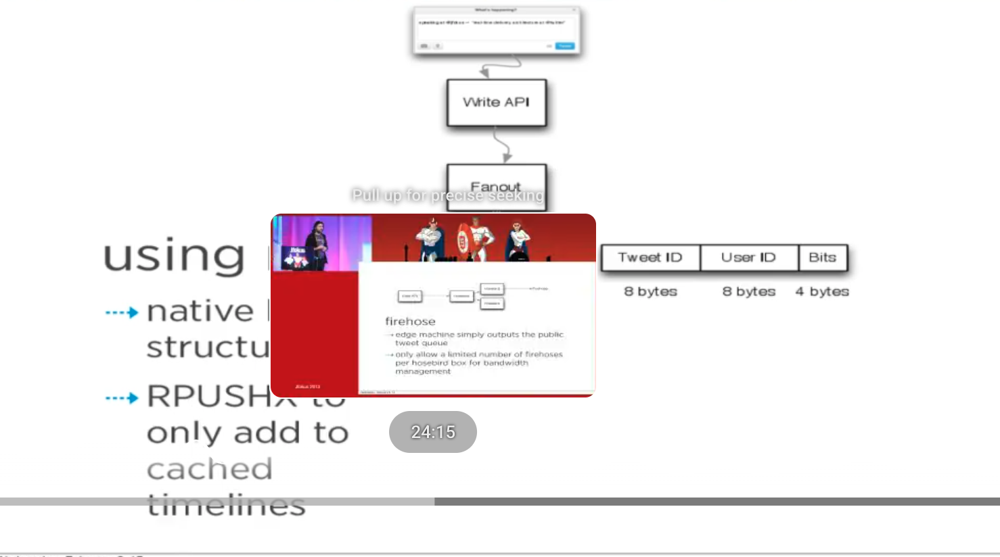
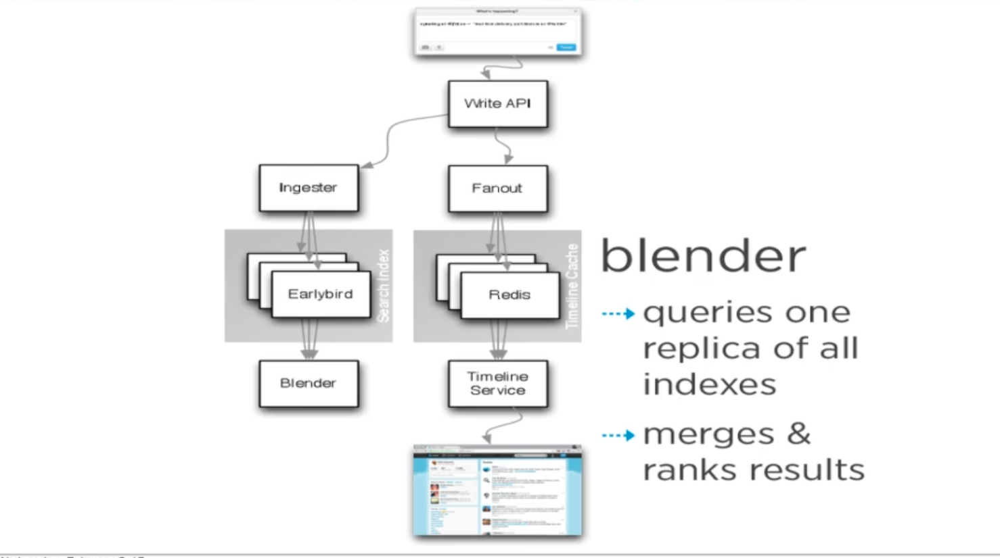
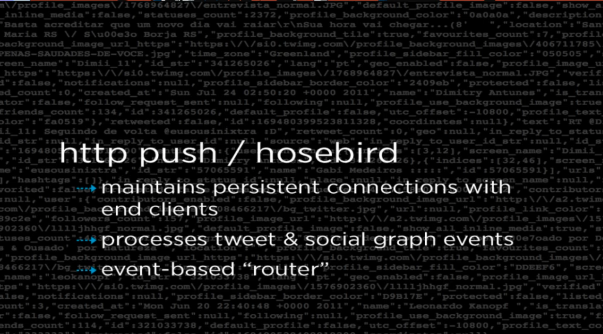
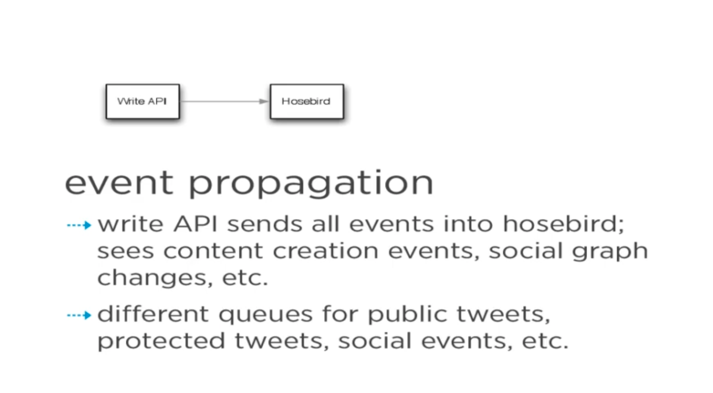
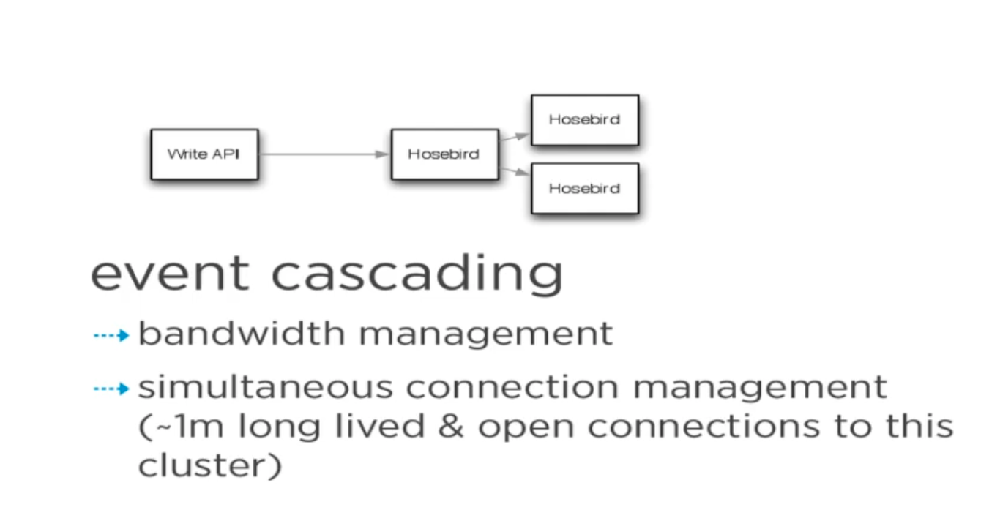
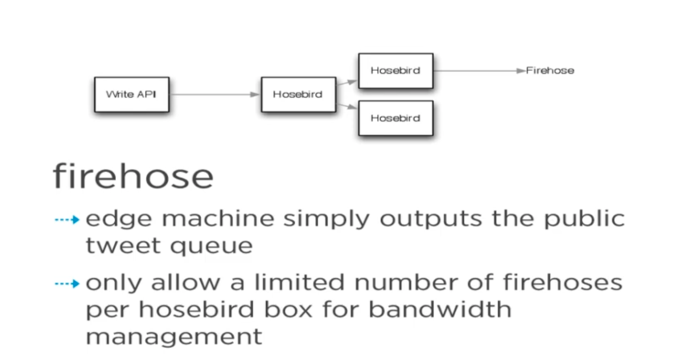
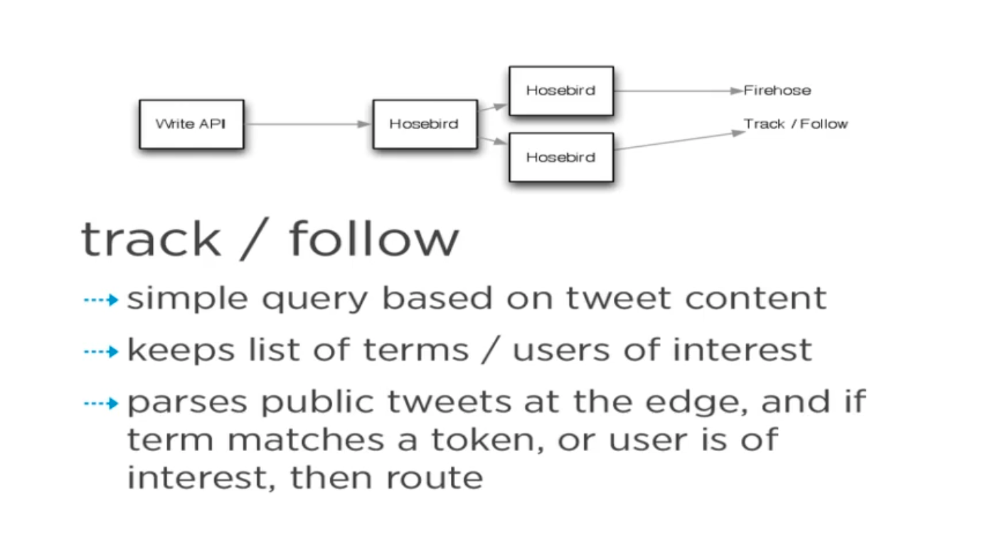
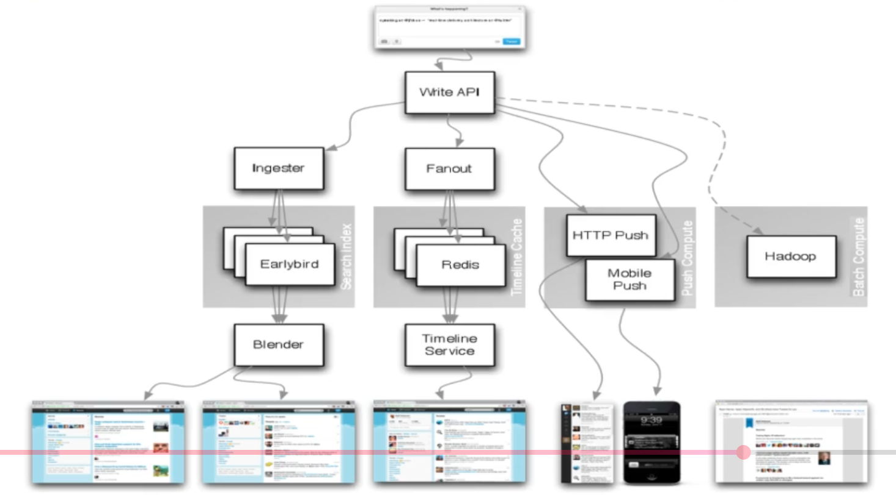
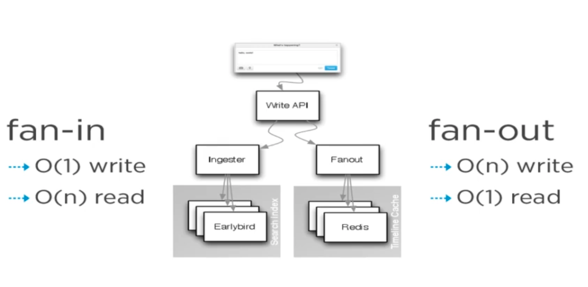
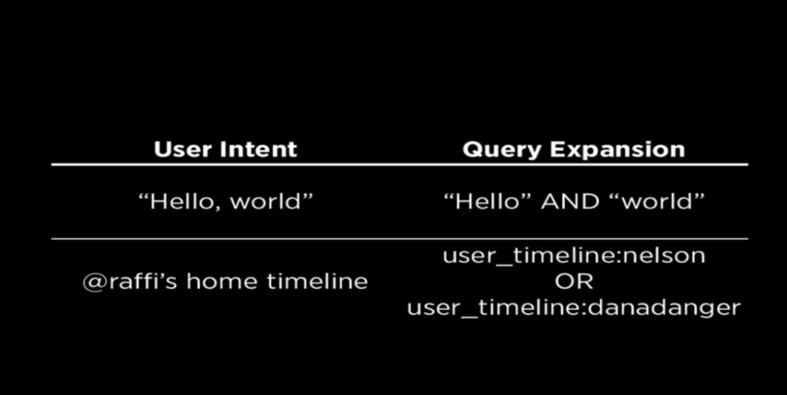
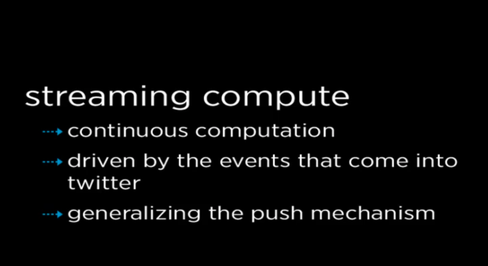
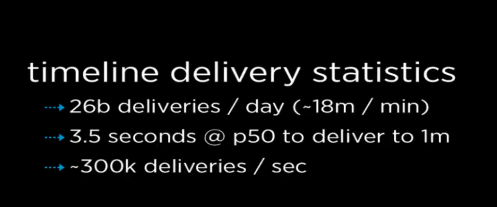
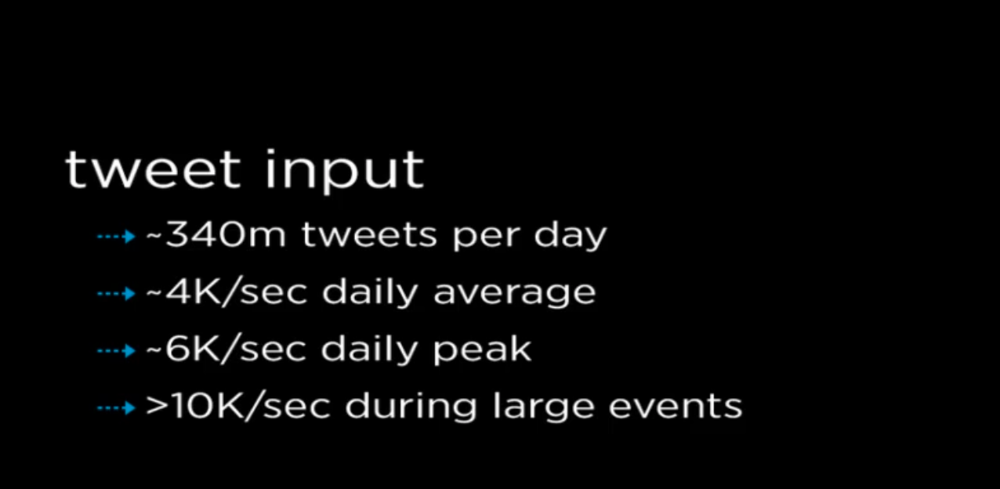