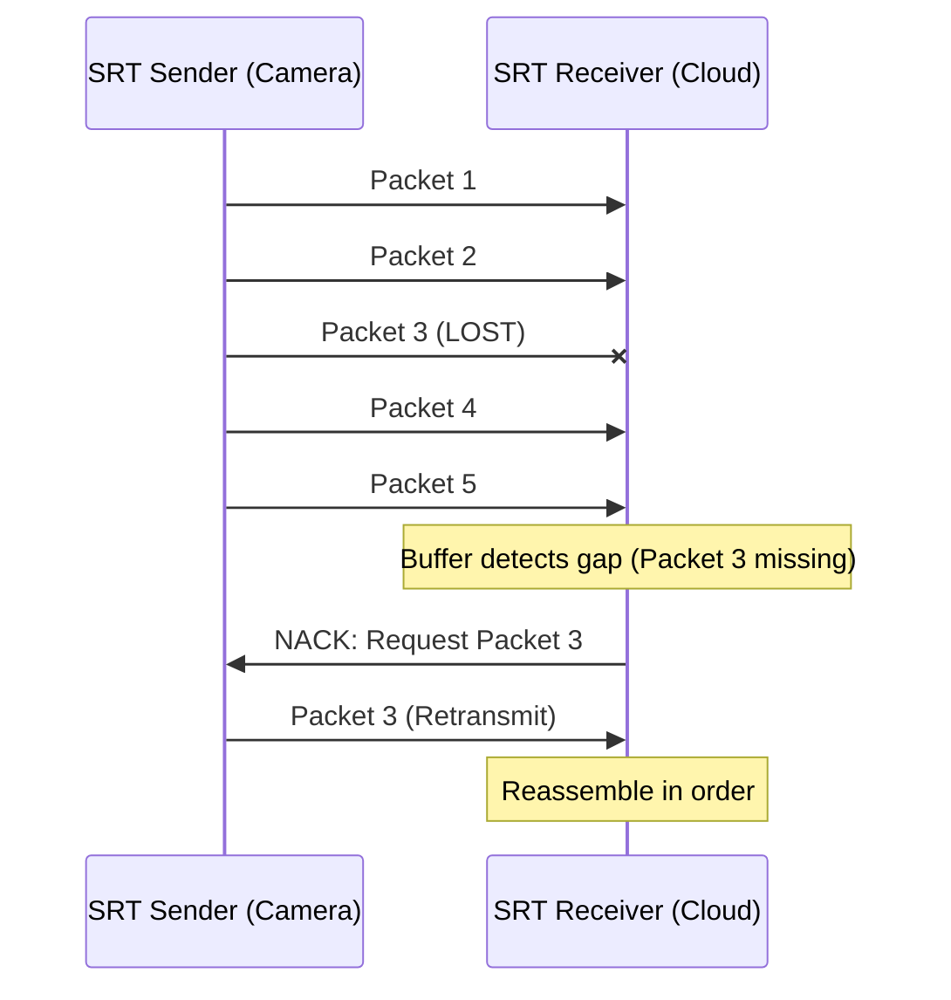

# SRT (Secure Reliable Transport): The Principal Architect Guide

> **Level**: Principal Architect / SDE-3
> **Scope**: When SRT, RTMP vs SRT, ARQ vs FEC, and Production Deployment.

> [!IMPORTANT]
> **The Principal Rule**: SRT is **RTMP's successor** for live video contribution over the public internet.
> **The Problem It Solves**: RTMP is TCP-based. Packet loss = stalls. SRT is UDP-based with ARQ-based recovery.

---

## 🎯 When Exactly SRT?

### The Decision Matrix

| Scenario | Use SRT? | Why? |
| :--- | :---: | :--- |
| **Live Sports Contribution** (Stadium → Cloud) | ✅ Yes | Lossy internet, needs recovery. |
| **Remote Production** (Home Studio → Broadcast) | ✅ Yes | Low latency, encryption. |
| **Surveillance Camera Ingestion** | ⚠️ Maybe | RTSP is native to cameras. SRT for WAN. |
| **CDN Delivery to Viewers** | ❌ No | Use HLS/DASH. SRT is 1:1, not scalable. |
| **WebRTC Calls** | ❌ No | WebRTC is bidirectional, SRT is unidirectional. |

### SRT vs RTMP vs RIST vs WebRTC

| Factor | SRT | RTMP | RIST | WebRTC |
| :--- | :--- | :--- | :--- | :--- |
| **Transport** | UDP | TCP | UDP | UDP |
| **Latency** | ~200ms - 2s | ~2s - 5s | ~200ms - 2s | ~50ms - 500ms |
| **Packet Loss Recovery** | ✅ ARQ (Selective Retransmit) | ❌ TCP Retransmit (Slow) | ✅ ARQ | ✅ NACK |
| **Encryption** | ✅ AES-128/256 | ❌ TLS Wrapper Needed | ✅ DTLS | ✅ DTLS/SRTP |
| **Firewall Traversal** | ⚠️ Port Forward / Rendezvous | ✅ Easy (HTTP) | ⚠️ Port Forward | ✅ ICE/STUN/TURN |
| **Use Case** | Contribution (Point-to-Point) | Legacy Ingest | Contribution | Interactive (2-way) |

---

## 🧠 God Mode: ARQ (Automatic Repeat Request)

### The Problem with TCP
*   TCP retransmits lost packets.
*   Retransmit ordering = **Head-of-Line Blocking**. The entire stream stalls.

### The SRT Solution
*   SRT uses UDP + ARQ.
*   Lost packets are **selectively retransmitted** without blocking other packets.
*   The receiver buffers packets (configurable latency) and requests retransmits for gaps.



### The Latency Buffer
*   **Setting**: `SRTO_LATENCY` (milliseconds).
*   Higher latency = more time to retransmit.
*   **Rule of Thumb**: Set latency to `4 x RTT` (Round Trip Time).

---

## 🔒 Encryption

SRT has built-in AES encryption.
*   **Modes**: AES-128-CTR, AES-256-CTR.
*   **Key Exchange**: PBKDF2 derived from a passphrase.
*   **No TLS**: Unlike RTMPS, encryption is in the SRT layer itself.

```bash
# Sender (OBS / FFmpeg)
ffmpeg -i input.mp4 -c copy -f mpegts "srt://receiver.example.com:9000?passphrase=mysecretkey"

# Receiver
ffmpeg -i "srt://:9000?passphrase=mysecretkey&mode=listener" -c copy output.ts
```

---

## 🏗️ Deployment Modes

### 1. Caller / Listener (Client / Server)
*   **Listener**: Opens port, waits for connection.
*   **Caller**: Initiates connection.
*   **Firewall**: Listener needs port forwarding.

### 2. Rendezvous (Peer-to-Peer)
*   Both sides act as Caller.
*   Both connect to a known "meeting point" IP.
*   **Firewall**: Works through symmetric NATs (sometimes).

---

## ✅ Principal Architect Checklist

1.  **Set Latency Appropriately**: Don't set 20ms latency over a 100ms RTT link. You'll drop packets.
2.  **Use Encrypted Streams**: `passphrase` is mandatory for WAN transport.
3.  **Monitor Retransmit Rate**: If retransmit % > 5%, your link or latency setting is wrong.
4.  **Don't Use SRT for Distribution**: SRT is 1:1. For 1:Many, use SRT → Encoder → HLS/CDN.
5.  **Consider RIST**: If your encoder doesn't support SRT, RIST is an alternative with similar goals (ARQ, encryption).

---

## 🔗 Related Documents
*   [Live Streaming Architecture](../video-streaming/live-streaming-architecture-guide.md) — LL-HLS, CMAF for distribution.
*   [VMS Architecture](../video-streaming/vms-architecture-guide.md) — Camera ingestion protocols.
