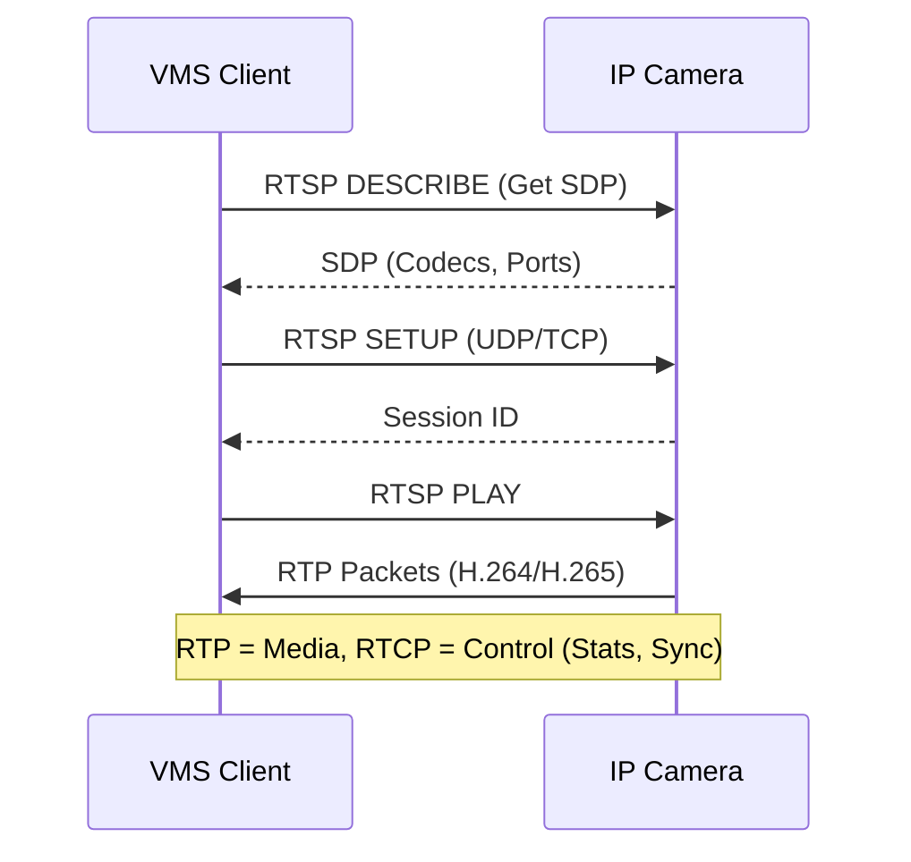
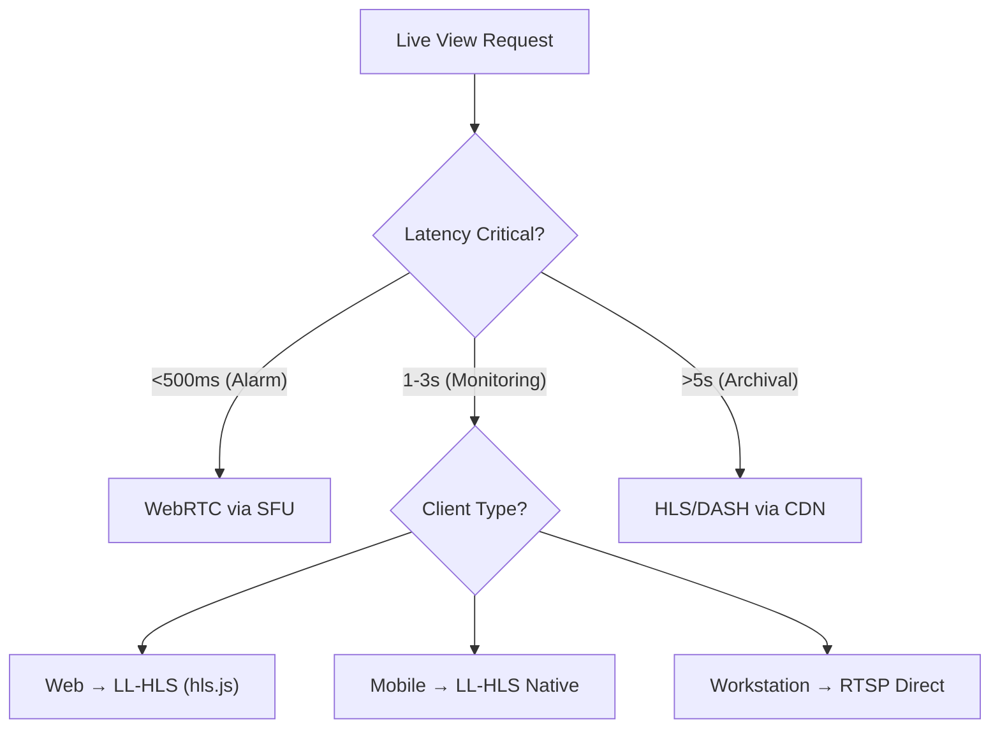
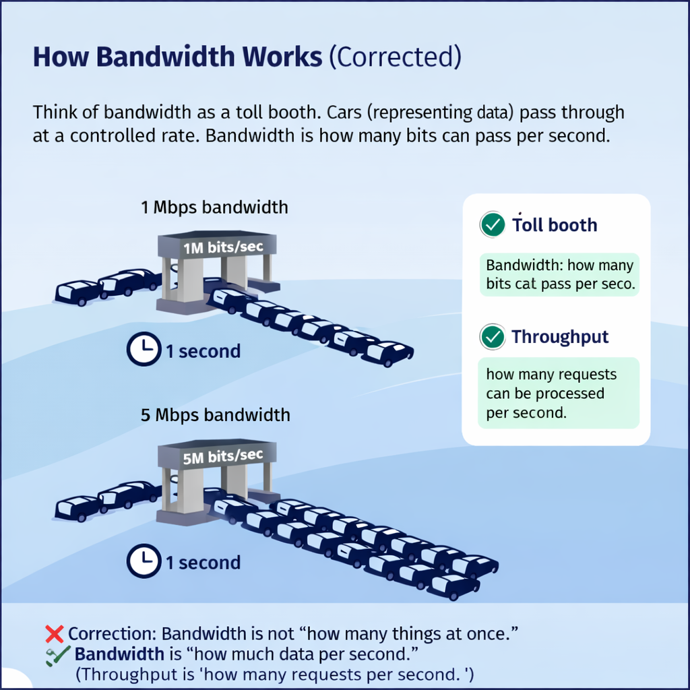
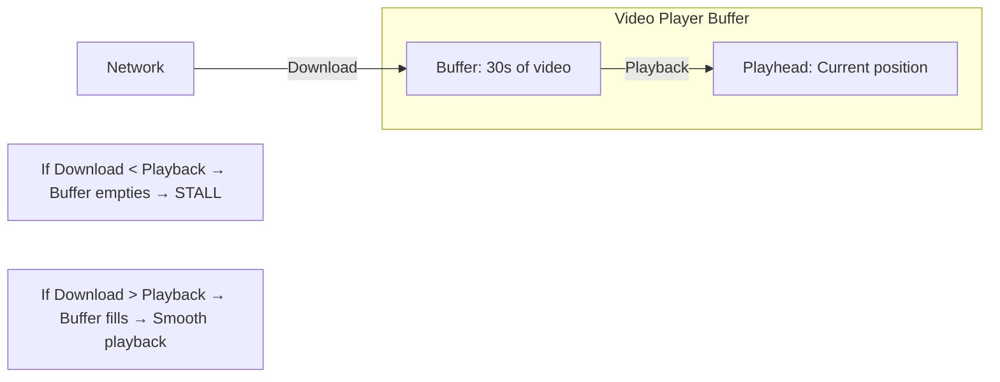
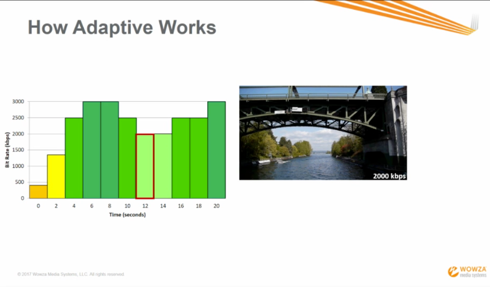
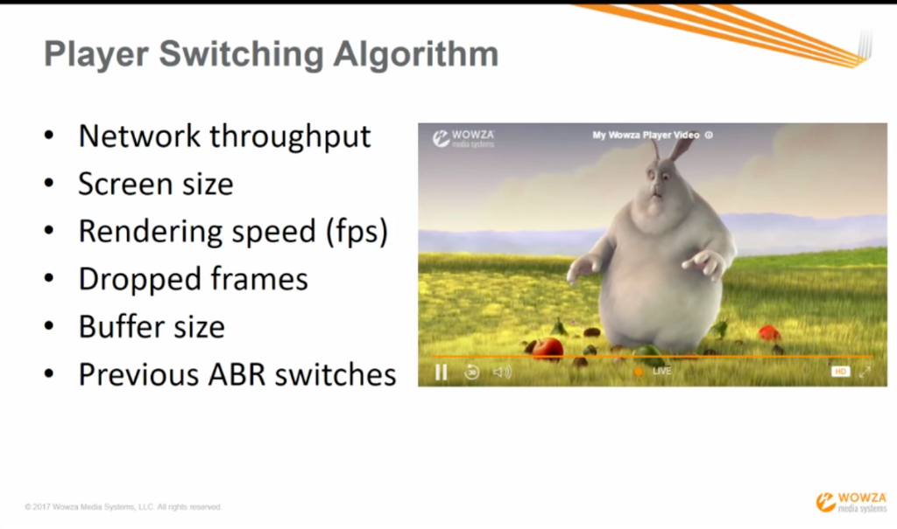

# Video Streaming Protocols: The Principal Architect Guide

> **Level**: Principal Engineer / SDE-3
> **Scope**: RTSP, RTMP, HLS, DASH, WebRTC, SRT, STOMP, and Protocol Selection.

> [!IMPORTANT]
> **The Principal Law**: **Protocol choice is use-case driven**. There is no "best" protocol.
> - **Surveillance/VMS**: RTSP (control) + RTP (media)
> - **Live Ingest**: RTMP (legacy) → SRT (modern)
> - **Distribution to Viewers**: HLS/DASH
> - **Ultra-Low Latency**: WebRTC
> - **Event Push**: WebSocket + STOMP

### Industry Terminology

| Stage | Term | Direction | Protocols |
| :--- | :--- | :--- | :--- |
| Camera → Server | **Contribution (First Mile)** | Inbound | RTSP, SRT, RTMP |
| Server → Viewers | **Distribution (Last Mile)** | Outbound | HLS, DASH, WebRTC |

---

## 🎯 Protocol Selection Matrix

| Protocol | Transport | Latency | Scalability | Browser Support | Use Case |
| :--- | :--- | :--- | :--- | :--- | :--- |
| **RTSP/RTP** | UDP/TCP | ~100ms | Low (1:1) | ❌ None | Surveillance, IP Cameras |
| **RTMP** | TCP | ~1-3s | Medium | ❌ Flash Deprecated | Live Ingest to Server |
| **SRT** | UDP | ~200ms-2s | Low (1:1) | ❌ None | Contribution over WAN |
| **HLS** | HTTP | 6-30s (LL: 2-4s) | ✅ Excellent (CDN) | ✅ All | VOD, Live Distribution |
| **DASH** | HTTP | 4-20s (LL: 2-4s) | ✅ Excellent (CDN) | ✅ Most | Premium OTT, DRM |
| **WebRTC** | UDP/DTLS | ~50-500ms | ⚠️ SFU Required | ✅ All | Video Calls, Interactive |
| **WebSocket** | TCP | ~50ms | ✅ Good | ✅ All | Bidirectional Data/Events |
| **STOMP** | WebSocket | ~50ms | ✅ Good | ✅ All | Pub/Sub Events (VMS Alerts) |
| **MQTT** | TCP | ~10-50ms | ✅ Excellent | ⚠️ Via Library | IoT Telemetry, Camera Status |

---

## 🔌 TCP vs UDP: Which Protocol Uses What?

| Protocol | Transport | Why This Transport? |
| :--- | :--- | :--- |
| **RTSP** | TCP (control) | Reliable commands (PLAY, PAUSE) |
| **RTP** | UDP (preferred) or TCP | Low latency media, loss acceptable |
| **RTMP** | TCP | Flash legacy, needs reliability |
| **SRT** | UDP + ARQ | Low latency + selective retransmit |
| **HLS** | TCP (HTTP) | Reliability via CDN |
| **DASH** | TCP (HTTP) | Reliability via CDN |
| **WebRTC** | UDP (DTLS-SRTP) | Ultra-low latency, NACK for recovery |
| **MQTT** | TCP | Reliable IoT messaging |

> [!TIP]
> **Rule of Thumb**: 
> - **Contribution (Camera → Server)**: Prefer UDP (RTSP/RTP, SRT) for low latency
> - **Distribution (Server → Viewers)**: TCP (HLS/DASH) for reliability via HTTP/CDN

---

## 📺 Protocol Deep Dive: Why, When, Real-World Use Cases

### RTSP (Real-Time Streaming Protocol)

| Aspect | Details |
| :--- | :--- |
| **Transport** | TCP (control) + UDP/TCP (RTP media) |
| **Role** | Control protocol (VCR-style: PLAY, PAUSE, SEEK) |
| **Latency** | ~100ms |
| **Scalability** | 1:1 (per camera connection) |
| **Real-World Use** | IP Camera → VMS, Surveillance systems |
| **Can Use for Playback?** | ✅ Yes (Workstation clients, VLC) |
| **Browser Support** | ❌ None (needs transcoding to HLS/WebRTC) |

**Example**: Hikvision/Dahua cameras all expose `rtsp://camera-ip:554/stream1`.

---

### RTMP (Real-Time Messaging Protocol)

| Aspect | Details |
| :--- | :--- |
| **Transport** | TCP only |
| **Role** | Contribution (Broadcaster → Server) |
| **Latency** | 1-5 seconds |
| **Scalability** | Medium (server receives, then redistributes) |
| **Real-World Use** | OBS → YouTube/Twitch/Facebook Live |
| **Can Use for Playback?** | ⚠️ Deprecated (Flash dead), use HLS instead |
| **Why Still Used?** | Every CDN still accepts RTMP ingest |

**Example**: `rtmp://live.twitch.tv/app/STREAM_KEY`

---

### SRT (Secure Reliable Transport)

| Aspect | Details |
| :--- | :--- |
| **Transport** | UDP + ARQ (Automatic Repeat reQuest) |
| **Role** | Contribution (Camera/Encoder → Server over WAN) |
| **Latency** | 200ms - 2s (configurable) |
| **Encryption** | AES-256 native |
| **Real-World Use** | Stadium camera → Cloud, Remote production |
| **Can Use for Playback?** | ✅ Yes (OBS, VLC, ffplay support SRT playback) |
| **Advantage over RTMP** | Handles packet loss, doesn't stall |

**Example**: `srt://server.example.com:4201?streamid=camera1`

---

### WebRTC (Web Real-Time Communication)

| Aspect | Details |
| :--- | :--- |
| **Transport** | UDP (DTLS-SRTP) |
| **Role** | Bidirectional real-time communication |
| **Latency** | 50-500ms |
| **Scalability** | 1:1 peer-to-peer, or 1:N via SFU |
| **Real-World Use** | Video calls (Google Meet, Zoom), Auctions, VMS Alarms |
| **Can Use for Playback?** | ✅ Yes (WHEP protocol for watch-only) |
| **Browser Support** | ✅ All modern browsers |

**Playback via WHEP**: WebRTC-HTTP Egress Protocol (WHEP) allows watch-only playback without full WebRTC signaling complexity.

---

### HLS vs DASH vs MPEG-DASH (Clarification)

| Term | What It Is |
| :--- | :--- |
| **DASH** | Shorthand for MPEG-DASH |
| **MPEG-DASH** | Full name: Dynamic Adaptive Streaming over HTTP (ISO/IEC 23009-1) |
| **HLS** | HTTP Live Streaming (Apple's standard) |

> **DASH = MPEG-DASH**. They are the same thing. "MPEG-DASH" is the ISO standard name.

---

## 📡 MQTT: The IoT Protocol

### What is MQTT?

**MQTT** (Message Queuing Telemetry Transport) is a lightweight **Pub/Sub messaging protocol** designed for IoT and constrained devices.

| Aspect | MQTT | WebSocket | STOMP |
| :--- | :--- | :--- | :--- |
| **Transport** | TCP | TCP | WebSocket |
| **Overhead** | 2 bytes header | 2-14 bytes | Text-based |
| **QoS Levels** | 0, 1, 2 | None | ACK/NACK |
| **Designed For** | IoT, sensors, low bandwidth | Real-time web | Enterprise messaging |
| **Broker** | Mosquitto, EMQX, HiveMQ | None (point-to-point) | RabbitMQ, ActiveMQ |

### Why MQTT in Video Surveillance?

MQTT is **not for video streaming**. It's for:

| Use Case | Example |
| :--- | :--- |
| **Camera Status** | "Camera 5 is offline" → MQTT topic `cameras/status/5` |
| **Sensor Data** | Temperature, motion PIR sensor readings |
| **Command & Control** | "Reboot Camera 7" → MQTT topic `cameras/commands/7` |
| **Edge AI Results** | "Person detected" → MQTT topic `analytics/detections` |

### MQTT vs STOMP for VMS

| | MQTT | STOMP |
| :--- | :--- | :--- |
| **Best For** | Edge devices, IoT sensors | Web clients, dashboards |
| **Transport** | TCP (native) | WebSocket |
| **In VMS** | Camera-to-Edge communication | Edge/VMS-to-Dashboard |

---

## 🛠️ FFmpeg & GStreamer: The Swiss Army Knives

### FFmpeg: What It Is

**FFmpeg** is a command-line tool and library for:
- **Transcoding** (H.264 → H.265, 4K → 1080p)
- **Muxing/Demuxing** (RTSP → HLS, MP4 → TS)
- **Stream Capture** (Record RTSP to file)
- **Protocol Conversion** (RTSP → WebRTC via rtsp-simple-server)

### FFmpeg: When to Use

| Use Case | FFmpeg Command |
| :--- | :--- |
| **Capture RTSP to file** | `ffmpeg -i rtsp://camera/stream -c copy output.mp4` |
| **RTSP → HLS** | `ffmpeg -i rtsp://camera/stream -c copy -f hls stream.m3u8` |
| **Transcode 4K → 1080p** | `ffmpeg -i input.mp4 -vf scale=1920:1080 output.mp4` |
| **RTSP → SRT** | `ffmpeg -i rtsp://camera/stream -c copy -f mpegts srt://dest:4201` |
| **Add SRTP encryption** | (Requires libsrtp support) |

### GStreamer: What It Is

**GStreamer** is a pipeline-based multimedia framework for:
- **Real-time streaming** (lower latency than FFmpeg for live)
- **Hardware encoding** (NVIDIA NVENC, Intel QSV)
- **Complex pipelines** (Multiple inputs, effects, outputs)

### GStreamer: When to Use

| Use Case | GStreamer Pipeline |
| :--- | :--- |
| **RTSP → Display** | `gst-launch-1.0 rtspsrc location=rtsp://camera/stream ! decodebin ! autovideosink` |
| **Camera → WebRTC** | `gst-launch-1.0 rtspsrc ! rtph264depay ! webrtcbin` |
| **Hardware Encode** | `gst-launch-1.0 ... ! nvh264enc ! ...` (NVIDIA) |
| **Tee (Split Stream)** | `gst-launch-1.0 rtspsrc ! tee name=t t. ! queue ! filesink t. ! queue ! autovideosink` |

### FFmpeg vs GStreamer

| Aspect | FFmpeg | GStreamer |
| :--- | :--- | :--- |
| **Interface** | Command-line, C library | Pipeline-based, C/Python |
| **Latency** | Higher (buffering) | Lower (real-time) |
| **Ease of Use** | Simpler commands | More complex pipelines |
| **Hardware Accel** | Supported | Better support (NVENC, VAAPI) |
| **Best For** | Transcoding, file conversion | Real-time streaming, complex pipelines |
| **VMS Use** | Recording, HLS packaging | Live view, WebRTC bridging |

---

## 🔀 Multiplexing & Demultiplexing (Mux/Demux)

### What Is Multiplexing?

| Term | Definition | Example |
| :--- | :--- | :--- |
| **Muxing** | Combining multiple streams into ONE container | Video + Audio → MP4 |
| **Demuxing** | Splitting container into separate streams | MP4 → Video + Audio |
| **Remuxing** | Change container without re-encoding | MKV → MP4 (same codecs) |
| **Transmuxing** | Container conversion for delivery | TS → fMP4 (for DASH) |
| **Transcoding** | Re-encode (different codec) | H.264 → H.265 |

> **Multiplexing in video ≠ Go goroutine multiplexing**. In video, it means combining streams into a single transport.

### Visual: The Muxing Pipeline

```
┌─────────────────────────────────────────────────────────┐
│                     MULTIPLEXING                        │
├─────────────────────────────────────────────────────────┤
│                                                         │
│   Video (H.264) ──┐                                     │
│                   ├──► MUXER ──► Container (MP4/TS/MKV) │
│   Audio (AAC)  ───┤                                     │
│                   │                                     │
│   Subtitles    ───┘                                     │
│                                                         │
├─────────────────────────────────────────────────────────┤
│                    DEMULTIPLEXING                       │
├─────────────────────────────────────────────────────────┤
│                                                         │
│                         ┌──► Video (H.264)              │
│   Container  ──► DEMUXER ──► Audio (AAC)                │
│                         └──► Subtitles                  │
│                                                         │
└─────────────────────────────────────────────────────────┘
```

### Common Containers

| Container | Extension | Streams | Use Case |
| :--- | :--- | :--- | :--- |
| **MP4** | `.mp4` | Video + Audio + Metadata | VOD, Downloads |
| **fMP4** | `.m4s` | Fragmented MP4 | DASH, LL-HLS |
| **TS** | `.ts` | Video + Audio + PSI | HLS segments, Broadcast |
| **MKV** | `.mkv` | Any codec, multi-track | Archiving |
| **WebM** | `.webm` | VP9/AV1 + Opus | Web playback |

### In VMS/Surveillance Context

| Stage | Operation | Example |
| :--- | :--- | :--- |
| **Camera** | Mux video + audio into RTP | H.264 + G.711 → RTSP stream |
| **VMS Ingest** | Demux to process separately | Extract video for AI |
| **Storage** | Mux into archive container | Store as MP4 or proprietary |
| **Playback** | Remux/Transmux for delivery | TS → fMP4 for DASH |

### FFmpeg Muxing Commands

```bash
# Mux video + audio into MP4
ffmpeg -i video.h264 -i audio.aac -c copy output.mp4

# Demux: Extract video only
ffmpeg -i input.mp4 -an -c:v copy video_only.h264

# Remux: MKV → MP4 (no re-encoding)
ffmpeg -i input.mkv -c copy output.mp4

# Transmux: TS → fMP4 (for DASH)
ffmpeg -i input.ts -c copy -movflags frag_keyframe+empty_moov output.m4s
```

### Transport Multiplexing (Network)

Different from file muxing, **transport multiplexing** combines streams over network:

| Protocol | Multiplexing |
| :--- | :--- |
| **RTSP/RTP** | Separate ports for video/audio (or interleaved TCP) |
| **WebRTC BUNDLE** | Single port for all media (RFC 9143) |
| **MPEG-TS** | Video + Audio + Tables in one transport |
| **HTTP/2** | Multiple streams over one TCP connection |
| **QUIC** | Multiple streams over one UDP connection |

### Architecture



### God Mode: RTSP over WebSocket (Browser Playback)

RTSP cannot run natively in browsers. Solutions:
1.  **Server-Side Transcoding**: RTSP → FFmpeg → HLS (Latency: ~5s).
2.  **WebRTC Bridge**: RTSP → Janus/Mediasoup → WebRTC (Latency: ~500ms).
3.  **MSE Proxy**: RTSP → WebSocket → MSE (Media Source Extensions) (Latency: ~1-2s).

---

## 📡 SRT (Secure Reliable Transport)

### When SRT Over RTMP?

| Factor | RTMP | SRT |
| :--- | :--- | :--- |
| **Transport** | TCP | UDP + ARQ |
| **Packet Loss** | Stalls (TCP retransmit) | Selective retransmit |
| **Encryption** | TLS wrapper | Native AES-256 |
| **Latency** | 2-5s | 200ms-2s (configurable) |
| **Firewall** | Easy (HTTP port) | Needs port forwarding |

**Use SRT for**: Remote production, stadium contribution, camera ingestion over public internet.

---

## 🌐 HLS vs DASH

| Feature | HLS (Apple) | DASH (MPEG) |
| :--- | :--- | :--- |
| **Manifest** | `.m3u8` (Text) | `.mpd` (XML) |
| **Segment Format** | `.ts` or `.fmp4` | `.m4s` (fMP4) |
| **DRM** | FairPlay | Widevine, PlayReady |
| **Codec Support** | H.264, H.265, AAC | All (AV1, VP9, Opus) |
| **Low-Latency** | LL-HLS (Partial Segments) | LL-DASH (CMAF) |
| **Best For** | Apple ecosystem, broad reach | Premium OTT, multi-DRM |

### Q: What makes DASH better for premium DRM content?
DASH supports **multi-DRM** natively (Widevine for Android, PlayReady for Windows) with a single manifest. HLS requires FairPlay (Apple-only) or a separate Widevine wrapper.

---

## 📺 Live View Protocol Selection (1:Many Distribution)

### Decision Matrix by Latency & Client

| Latency Need | Web Browser | Mobile App | Operator Workstation | Recommended Protocol |
| :--- | :---: | :---: | :---: | :--- |
| **Ultra-Low (<500ms)** | WebRTC | WebRTC (native) | WebRTC or RTSP | **WebRTC via SFU** |
| **Low (1-3s)** | LL-HLS / MSE | LL-HLS | RTSP (native player) | **LL-HLS + RTSP Fallback** |
| **Standard (3-10s)** | HLS | HLS | HLS | **HLS (simplest, CDN-friendly)** |

### Strategy by Client Type

| Client | Recommended Approach | Why |
| :--- | :--- | :--- |
| **Web Browser** | LL-HLS via `hls.js` or WebRTC | Native support, no plugins |
| **Mobile App (iOS/Android)** | HLS (native) or ExoPlayer + DASH | OS-level support, battery efficient |
| **Operator Workstation (VMS Client)** | **RTSP Direct** | Lowest latency, full PTZ control, GPU decode |
| **Video Wall (Multi-Monitor)** | RTSP (hardware decoder) or HDMI Matrix | Dedicated hardware, zero browser overhead |

### Hybrid Approach (Enterprise VMS)



1.  **Workstation Clients**: Pull **RTSP directly** from camera/NVR. Native GPU decode. <100ms latency.
2.  **Web Dashboard**: **HLS/LL-HLS** via transcoder. 2-4s latency (acceptable for monitoring).
3.  **Mobile App**: **LL-HLS** (iOS native, ExoPlayer on Android). 1-3s latency.
4.  **Alarm Pop-Up**: **WebRTC session** via SFU for <500ms latency. Spins up on demand.

---

## ⚡ WebRTC (Ultra-Low Latency)

### When WebRTC?

| Scenario | Use WebRTC? | Why? |
| :--- | :---: | :--- |
| **Video Calls** | ✅ Yes | Bidirectional, native browser. |
| **Live Auctions/Betting** | ✅ Yes | <500ms latency critical. |
| **Surveillance Live View** | ⚠️ Maybe | Good for 1:few, not 1:many. |
| **1:Many Distribution** | ❌ No | Use HLS/DASH via CDN. |

### Q: Why is WebRTC becoming prevalent for ultra-low latency?
1.  **Browser Native**: No plugins. Works on Chrome, Safari, Firefox, Edge.
2.  **UDP-Based**: Avoids TCP head-of-line blocking.
3.  **NACK/FEC**: Handles packet loss without stalling.
4.  **ICE/STUN/TURN**: Traverses NATs and firewalls.

---

## 💬 STOMP: Why It Matters for VMS (Deep Dive)

### What is STOMP?

**STOMP** (Simple Text Oriented Messaging Protocol) is a **Pub/Sub messaging protocol** that runs **over WebSocket**.

### WebSocket vs STOMP

| Aspect | Raw WebSocket | WebSocket + STOMP |
| :--- | :--- | :--- |
| **Message Format** | You define it (JSON, Binary) | Standardized frames (SUBSCRIBE, SEND, MESSAGE) |
| **Routing** | You build it | Built-in `/topic/` and `/queue/` destinations |
| **Pub/Sub** | You build it | Native (SUBSCRIBE to topics) |
| **Broker Support** | None | RabbitMQ, ActiveMQ, Spring WebSocket |
| **Acknowledgements** | None | ACK/NACK frames |

### Why STOMP in Video Surveillance (Videonetics-style)?

```mermaid
graph LR
    subgraph "VMS Backend"
        AI[AI Engine] -->|Event| Kafka[Kafka]
        Kafka --> Bridge[STOMP Broker (RabbitMQ)]
    end
    
    subgraph "Clients"
        Bridge -->|STOMP over WS| Dashboard[Web Dashboard]
        Bridge -->|STOMP over WS| Mobile[Mobile App]
        Bridge -->|STOMP over WS| VideoWall[Video Wall]
    end
    
    AI -->|"Motion on Cam 5"| Dashboard
    AI -->|"Face Match: VIP"| Mobile
    AI -->|"Intrusion Alert"| VideoWall
```

### Use Cases in VMS

1.  **Real-Time Alerts**: AI detects intrusion → STOMP pushes to all connected dashboards instantly.
2.  **Camera Status Updates**: Camera goes offline → All clients see "Offline" badge without polling.
3.  **PTZ Sync**: Operator A moves camera → All operators see the new position.
4.  **Presence Awareness**: "Operator B is viewing Camera 5" → Avoid PTZ conflicts.

### Why Not Just WebSocket?

| Scenario | Raw WebSocket | STOMP |
| :--- | :--- | :--- |
| "Send alert to all dashboards viewing Site A" | You build routing logic | `SEND /topic/site/A/alerts` |
| "Only send face alerts to admins" | You build ACLs | Broker-level topic ACLs |
| "Guaranteed delivery with retry" | You build it | Broker handles ACK/NACK |
| "Integrate with Kafka/RabbitMQ" | Custom bridge | Native STOMP plugin |

### Code Example

```javascript
// Browser Client (using @stomp/stompjs)
const client = new StompJs.Client({
  brokerURL: 'wss://vms.example.com/stomp',
  onConnect: () => {
    // Subscribe to alerts for Site A
    client.subscribe('/topic/site/A/alerts', (message) => {
      const alert = JSON.parse(message.body);
      showNotification(alert.camera, alert.type, alert.snapshot);
    });
    
    // Subscribe to camera status updates
    client.subscribe('/topic/cameras/status', (message) => {
      updateCameraStatusBadge(JSON.parse(message.body));
    });
  },
});
client.activate();
```

---


## ⚖️ Bitrate vs Resolution: The Quality Lie

> **User Question**: "Why does 4K sometimes look worse than 1080p?"

Understanding the relationship between these two is critical for any architect.

### The Tupperware Analogy
Think of video quality like packing food into a container.

*   **Resolution (The Container)**: The physical dimensions (width x height).
    *   *4K is a massive banquet hall.*
    *   *480p is a lunchbox.*
*   **Bitrate (The Food)**: The actual amount of data (information/detail) you pour into the container.

#### 3. PRACTICAL MATH: The "Cup" Analogy (Resolution vs Bitrate)

Aligned with our Pipe analogy:
*   **Resolution** = The Size of the Cup (480p Cup vs 4K Bucket).
*   **Bitrate** = The Water you pour into it.

**Scenario A: The Perfect Pour (1080p)**
*   **Cup Size**: 5 Liters (1080p). (resolution)
*   **Water**: 5 Liters (5 Mbps). (bitrate)
*   **Result**: Full cup. Perfect picture.

**Scenario B: The Starvation (Pixel Stretching)**
*   **Cup Size**: 20 Liters (4K Bucket). (resolution)
*   **Water**: 1 Liter (1 Mbps). (bitrate)
*   **The Math**: 1L inside a 20L bucket -> **5% Full**.
*   **Visual**: The bucket is mostly empty. To cover the bottom, the encoder has to "stretch" the water thin. The image looks diluted, blocky, and blurry.

**Scenario C: The Wastage (Money Pit)**
*   **Cup Size**: 0.5 Liters (480p Tiny Cup). (resolution)
*   **Water**: 10 Liters (10 Mbps). (bitrate)
*   **The Math**: You pour 10L into a 0.5L cup. **9.5L spills over**.
*   **Result**: The viewer only sees the 0.5L. You paid for 10L but threw 95% of it on the floor. Visuals didn't get better; they just hit the physical limit of the cup.

> [!TIP]
> *   **1080p Target**: **4-6 Mbps** (H.264).
> *   **4K Target**: **15-20 Mbps** (H.264).

### 📐 The Holy Trinity: Bandwidth vs Bitrate vs Resolution

> **User Question**: "How are they related? Can I mix them?"

**YES, they are tightly coupled.** You cannot design a system without understanding the correlation.



#### 1. The Correlation Model (The Toll Booth)
*   **Bandwidth (The Road Width)**: The maximum capacity of the range.
    *   *Constraint*: You cannot change this easily (It's your ISP plan).
*   **Bitrate (The Traffic Flow)**: The amount of cars (data) trying to pass through per second.
    *   *Constraint*: **Bitrate MUST be < Bandwidth** (or you traffic jam/buffer).
*   **Resolution (The Car Size)**: The complexity of the payload.
    *   *Constraint*: Higher Resolution *requires* Higher Bitrate to maintain quality.

#### 2. The Formula for Architects
If you have **Low Bandwidth** (Narrow Road):
1.  You **MUST** lower the **Bitrate** (Fewer Cars).
2.  To maintain quality at Low Bitrate, you **MUST** lower the **Resolution** (Smaller Cars).

> [!CAUTION]
> **The Mix-up Mistake**:
> *   **High Bandwidth + Low Bitrate**: Waste of potential. (Wide road, one car).
> *   **Low Bandwidth + High Bitrate**: Disaster. (Traffic Jam / Buffering).
> *   **High Resolution + Low Bitrate**: Garbage Quality. (Artifacts).

#### 3. PRACTICAL MATH: The "Pipe" Analogy (Plain English)

Forget cars. Think of a **Water Pipe** (Bandwidth) and **Water Flow** (Bitrate).

*   **Your Pipe Size (Bandwidth)**: 5 Liters/second. (Fixed by your ISP).
*   **Your Water Flow (Bitrate)**: The video needs this much water to play.

**Scenario A: The Happy Flow**
*   Pipe: **5 L/s**
*   Video: **3 L/s** (Bitrate)
*   Math: `5 - 3 = +2 L/s` extra space.
*   **Result**: Water flows smoothly. No stop.

**Scenario B: The Overflow (Buffering)**
*   Pipe: **5 L/s**
*   Video: **10 L/s** (You chose 4K High Quality)
*   **The Problem**: The video *needs* 10 Liters every second, but the pipe only gives 5.
*   **The Math**:
    *   *Second 1*: You need 10L. You get 5L. **Deficit: -5L**.
    *   *Second 2*: You need another 10L. You get 5L. **Total Deficit: -10L**.
*   **The Consequence**: The video player says "I don't have enough water (data) to show this second of video!" -> **PAUSE (Buffering)**. It waits until enough water trickles in to show the next frame.

---

---

## 📦 Transcoding vs Packaging: The Vital Distinction

> [!IMPORTANT]
> **The Envelope Analogy**:
> *   **Transcoding**: Writing a new letter (Changing the content).
> *   **Packaging**: Putting the same letter into a different envelope (Changing the container).

Many architects confuse these terms. Here is the Principal-level breakdown:

### 1. Transcoding (The Heavy Lift)
**Transcoding** is the computationally expensive process of decoding the video to raw frames and re-encoding it. It changes the "physics" of the video.

*   **Transcoding**: Changing the codec (e.g., H.264 → H.265).
*   **Transrating**: Changing the bitrate (e.g., 6 Mbps → 2 Mbps).
*   **Transsizing**: Changing the resolution (e.g., 1080p → 720p).

> **Cost**: Very High (Requires heavy CPU or GPU).
> **Tool**: FFmpeg, GStreamer.

### 2. Packaging (The Lightweight Wrap)
**Packaging** (or transmuxing) takes the *already encoded* video and wraps it in a delivery format. It does NOT touch the video compression.

*   **Example**: Taking an H.264 stream and wrapping it in HLS segments (`.ts`) for iOS and DASH segments (`.m4s`) for Android.
*   **Benefit**: You store the video **once** (as a mezzanine file) and wrap it on-the-fly (`Just-in-Time Packaging`).

> **Cost**: Very Low (IO-bound, copying bytes).
> **Tool**: Shaka Packager, GPAC, FFmpeg (`-c copy`).

### ⚡ The Physics of Bandwidth: The 50% Rule

> [!WARNING]
> **The Golden Rule**: You must have **2x Upload Bandwidth** of your target bitrate.
> *   Target 3000 kbps stream? You need **6 Mbps** upload.
> *   Target 6000 kbps stream? You need **12 Mbps** upload.


#### Why 50% Headroom? It's not just "Handshaking".
1.  **RTMP/TCP Overhead**: TCP retransmits lost packets. If you are maxing out your pipe, a single retransmit triggers congestion control, slashing your throughput by half instantly.
2.  **Bitrate Fluctuation**: Encoders are "Variable Bitrate" (VBR). A complex scene (confetti, explosion) can spike a "3 Mbps" stream to 5 Mbps for a few seconds.
3.  **The "Speedtest Lie"**:
    *   **Speedtest.net measures BURST capacity** (How fast can I sprint?).
    *   **Streaming needs SUSTAINED capacity** (How fast can I run a marathon?).
    *   **Rule**: Take your Speedtest upload result and **subtract 30%** immediately to get your *real* usable streaming bandwidth.

### 3. The Great Chunking Boundary: Where does it happen?

> "Wait, does chunking happen at the camera?"

**NO.** The camera sends a **continuous stream**. The "Chunking" happens at the VMS/Server Ingest point.

```mermaid
graph LR
    subgraph "Ingestion (The Stream)"
        Cam[Camera] -->|Continuous RTP Stream| Ingest[VMS Ingestor]
    end
    
    subgraph "Processing (The Knife)"
        Ingest -->|Stream| Packager[Packager]
        Packager -->|"Cut every 2s"| Chunks[Segments (.ts/.m4s)]
    end
    
    subgraph "Distribution (The Files)"
        Chunks --> CDN
        CDN --> Player
    end
```

| Stage | Data Format | Protocol | Characteristic |
| :--- | :--- | :--- | :--- |
| **1. First Mile (Ingest)** | **Continuous Flow** | RTSP, RTMP, SRT | "Firehose" of packets. 100ms latency. |
| **2. The Boundary** | **Buffer & Cut** | Internal Pipe | **Latency Introduced Here**. Must wait 2s to cut a 2s chunk. |
| **3. Last Mile (Egress)** | **Discrete Files** | HLS, DASH | "Download & Play". 2s+ latency. |

> [!TIP]
> **Latency Math**: If you choose a **6s Chunk Size**, your *minimum* latency is 6s (because the Packager must wait 6s to finish the first file before the CDN can touch it).

---

## 🧪 Local Buildability: Can You Build This at Home?

### The Honest Assessment

| Component | Local? | How? |
| :--- | :---: | :--- |
| **IP Cameras** | ⚠️ Emulated | FFmpeg RTSP stream, MediaMTX |
| **Edge Gateway** | ✅ Yes | Docker Compose (MediaMTX, FFmpeg, Redis) |
| **RTSP Ingest** | ✅ Yes | MediaMTX or GStreamer |
| **SRT Transport** | ✅ Yes | FFmpeg or srt-live-transmit |
| **AI Inference** | ⚠️ CPU or GPU | YOLO with CPU (slow), GPU preferred |
| **Kafka** | ✅ Yes | Redpanda (single binary) |
| **TimeSeries DB** | ✅ Yes | TimescaleDB (Docker) |
| **Vector DB (FRS)** | ✅ Yes | Milvus or Chroma (Docker) |
| **Object Storage** | ✅ Yes | MinIO (S3-compatible, Docker) |
| **WebSocket/STOMP** | ✅ Yes | RabbitMQ (Docker) |
| **HLS Playback** | ✅ Yes | hls.js in browser |
| **WebRTC** | ⚠️ Advanced | Janus or Pion (self-hosted SFU) |

### Minimal Local Stack (Docker Compose)

```yaml
version: "3.8"
services:
  # Simulated Camera (FFmpeg loop)
  camera:
    image: linuxserver/ffmpeg
    command: >
      -re -stream_loop -1 -i /videos/test.mp4
      -c copy -f rtsp rtsp://rtsp-server:8554/camera1
    volumes:
      - ./test_videos:/videos

  # RTSP Server (MediaMTX)
  rtsp-server:
    image: bluenviron/mediamtx:latest
    ports:
      - "8554:8554"  # RTSP
      - "8888:8888"  # HLS

  # AI Inference (YOLO)
  yolo:
    image: ultralytics/yolov8:latest
    volumes:
      - ./frames:/frames

  # Message Broker (STOMP)
  rabbitmq:
    image: rabbitmq:management
    ports:
      - "5672:5672"   # AMQP
      - "15672:15672" # Management UI
      - "61613:61613" # STOMP

  # Metadata DB
  timescaledb:
    image: timescale/timescaledb:latest-pg15
    environment:
      POSTGRES_PASSWORD: secret

  # Object Storage
  minio:
    image: minio/minio
    command: server /data --console-address ":9001"
    ports:
      - "9000:9000"
      - "9001:9001"
    volumes:
      - minio_data:/data

volumes:
  minio_data:
```

### What Needs Cloud (Cannot Fully Emulate)?

| Component | Why Cloud? |
| :--- | :--- |
| **100+ Cameras** | Network bandwidth, storage |
| **GPU Cluster (AI)** | Cost of multiple GPUs |
| **CDN Distribution** | CloudFront/Cloudflare for 1:many |
| **Multi-Region HA** | True failover testing |

### AWS Free Tier for Dev

| Service | Free Tier Limit | Use For |
| :--- | :--- | :--- |
| **EC2 t2.micro** | 750 hrs/month | Edge Gateway, API |
| **S3** | 5GB | Video storage |
| **RDS** | 20GB | PostgreSQL metadata |
| **Kinesis Video Streams** | 1GB | Camera ingest (very limited) |

---

## ⚡ HTTP/3 & QUIC: The Future of Video Delivery

### What Are They?

| Term | What It Is | Role |
| :--- | :--- | :--- |
| **QUIC** | Transport protocol (replaces TCP) | UDP-based, built-in TLS 1.3 |
| **HTTP/3** | Application protocol (replaces HTTP/2) | Runs on top of QUIC |
| **MoQ** | Media over QUIC | Ultra-low latency streaming protocol |

> **Clarification**: QUIC is the **transport layer** (like TCP). HTTP/3 is the **application layer** (like HTTP/2). Both are for **distribution (playback)**, not contribution.

### Why HTTP/3/QUIC for Video?

| Benefit | HTTP/2 (TCP) | HTTP/3 (QUIC) |
| :--- | :--- | :--- |
| **Connection Setup** | TCP + TLS = 2-3 RTT | 0-RTT (repeat connections) |
| **Head-of-Line Blocking** | ❌ One lost packet blocks ALL streams | ✅ Independent streams |
| **Packet Loss Recovery** | TCP retransmit (slow) | Selective retransmit (fast) |
| **Mobile Performance** | Connection drops on network switch | ✅ Connection migration |
| **Encryption** | TLS wrapper | Native TLS 1.3 |

**Google Stats**: YouTube saw **20% less video stalling** with QUIC.

### HTTP/3 for Video Streaming

| Use Case | HTTP/3 Support | Notes |
| :--- | :--- | :--- |
| **HLS Playback** | ✅ Yes | CDNs (Cloudflare, Fastly) support HTTP/3 |
| **DASH Playback** | ✅ Yes | Same as HLS |
| **LL-HLS/LL-DASH** | ✅ Yes | Faster segment fetching |
| **Chunked Transfer** | ⚠️ Different | HTTP/3 uses QPACK instead of chunked encoding |
| **WebRTC** | ❌ Separate | WebRTC uses its own DTLS-SRTP |

### MoQ (Media over QUIC)

**MoQ** is an emerging IETF protocol for ultra-low latency video streaming over QUIC.

| Aspect | HLS/DASH | WebRTC | MoQ |
| :--- | :--- | :--- | :--- |
| **Transport** | HTTP/TCP | UDP/DTLS | QUIC |
| **Latency** | 2-30s | 50-500ms | ~200ms |
| **Scalability** | ✅ CDN | ⚠️ SFU | ✅ Relay-based |
| **Browser Support** | ✅ All | ✅ All | ⚠️ Experimental |
| **Best For** | VOD, Live | Video calls | Live sports, auctions |

> [!TIP]
> **MoQ = WebRTC latency + CDN scalability**. Still experimental (2024), but watch this space.

---

## 🎮 Web Video Player Integration: Principal Architect Guide

### The Challenges (What Goes Wrong)

| Challenge | Symptom | Root Cause |
| :--- | :--- | :--- |
| **Buffering** | Video pauses, spinner | Network slower than bitrate |
| **Startup Delay** | Long time to first frame | Large initial segment, slow DNS |
| **Jitter** | Choppy playback, audio desync | Variable packet arrival times |
| **Quality Oscillation** | Constant up/down switching | Aggressive ABR algorithm |
| **Seek Latency** | Slow seeking | Keyframe distance too large |
| **Memory Leaks** | Browser tab crashes | Player not cleaned up properly |

### Understanding Buffering



**Buffering Causes:**
1. Network slower than video bitrate
2. CDN edge server far from user
3. ISP throttling
4. WiFi interference

### Understanding Jitter

**Jitter** = Variation in packet arrival time.

| Jitter (ms) | Effect |
| :--- | :--- |
| < 30ms | Imperceptible |
| 30-50ms | Slight audio issues |
| > 50ms | Choppy video, desync |

**Jitter Solutions:**
- **Jitter Buffer**: Player holds packets, reorders them before decode
- **QoS**: Prioritize video traffic on network
- **Wired Connection**: Ethernet > WiFi

### ABR (Adaptive Bitrate) Deep Dive

Adaptive Bitrate Streaming (ABS) is the magic that killed the "Buffering..." spinner. It was pioneered by **Move Networks**, **Microsoft (Smooth Streaming)**, and popularized globally by **Netflix**.



#### 1. The Chunking Mechanics
The video is not one long file. It is sliced into small **chunks** (segments), typically **2 to 6 seconds** long.

1.  **Start**: Player requests the lowest quality chunk (e.g., 360p) to ensure instant start.
2.  **Ramp Up**: If the download is fast (e.g., took 0.5s to download a 2s chunk), the player requests the next chunk at a higher quality (720p).
3.  **Stabilize**: The player finds the highest bitrate it can download comfortably without emptying the buffer.
4.  **Ramp Down**: If bandwidth drops, the player immediately requests the next chunk at a lower quality to prevent stalling.

#### 2. The "Smart" Player Abstraction (Heuristics)

Modern players are not just downloading files; they are running complex **switching algorithms** in real-time.



The player makes decisions based on a weighted matrix of signals:

*   **Download Time**: How long did the last chunk take?
*   **Screen Size Cap**: **"Don't waste bits."** If the physical device is a phone (720p screen), the player will NEVER request 4K segments, even on 1Gbps WiFi.
*   **Device Health (FPS & Dropped Frames)**:
    *   The player monitors *decoding performance*.
    *   *Scenario*: A 4K stream on an old laptop. Bandwidth is fine, but the CPU is at 100% and FPS drops to 15. The player detects this "struggle" and downgrades the quality to 1080p to restore smooth 30/60 FPS playback.
*   **Buffer Dynamics**:
    *   **Fill Rate**: Is the buffer growing faster than playback?
    *   **Depletion**: If buffer < 4s, emergency downgrade.
*   **Stabilization Logic (Anti-Oscillation)**:
    *   **The Problem**: Bandwidth jitters (e.g., 5Mbps -> 2Mbps -> 6Mbps).
    *   **The Fix**: "Oh! Look, every other packet is dropped or delayed." The player detects high variance. Instead of chasing the peak, it enters a **hold-down state**, locking to a lower, safe bitrate (e.g., 3Mbps) until the variance stabilizes. It prioritizes *consistency* over *peak quality*.

#### 3. Evolution of Player Logic
*   **Gen 1 (Server-Side)**: The server decided what to send. (Failed because server doesn't know client battery/CPU status).
*   **Gen 2 (Client-Side - Bandwidth only)**: Player measured download speed. (Oscillated wildly on variable networks).
*   **Gen 3 (Buffer-Based)**: Player ignores bandwidth, looks only at buffer health. (BOLA approach - much more stable).
*   **Gen 4 (Hybrid/ML)**: Modern Netflix/YouTube players use ML to predict throughput based on time of day, ISP, and buffer state.

### ⚔️ Chunking Strategy: Videonetics (VMS) vs Netflix (OTT)

> [!IMPORTANT]
> **The Principal Law of Latency**: Smaller Chunks = Lower Latency = Higher Overhead.
> *   **Netflix**: "I don't care about latency. I want 4K HDR and zero stall."
> *   **Videonetics**: "I need to see the thief *right now*. 4K is nice, but realtime is mandatory."


| Feature | Netflix (Cinematic VOD) | Videonetics (Surveillance VMS) |
| :--- | :--- | :--- |
| **Primary Goal** | **Stability & Quality** (QoE) | **Latency & Freshness** (Real-time) |
| **Chunk Size** | **4s - 6s** (Large) | **0.5s - 2s** (Tiny) or Stream |
| **Buffer Length** | **30s - 60s** (Huge safety net) | **200ms - 500ms** (Jitter buffer only) |
| **GOP Size** | **4s - 10s** (High efficiency) | **1s** (Fast seeking/tuning) |
| **Protocol** | **DASH / HLS** (CDNs) | **RTSP** (LAN) / **WebRTC** (WAN) |
| **Transport** | **TCP / QUIC** (Reliable) | **UDP** (Fast, allow drops) |
| **Failure Mode** | "Buffering..." (Pause) | Artifacts / Frame Drop (Skip) |

#### Deep Dive: Why the Difference?

1.  **Netflix Strategy (Efficiency First)**
    *   **Large Chunks (6s)**: Fewer HTTP requests. Better compression (H.264/H.265 is more efficient with longer GOPs).
    *   **Massive Buffers**: They pre-fetch 2 minutes of video. If you lose WiFi for 10 seconds, you won't even notice.
    *   **CDN Caching**: 6s segments are highly cacheable at the Edge.

2.  **Videonetics (VMS) Strategy (Latency First)**
    *   **Micro-Chunks (CMAF) / Stream**:
        *   **RTSP**: No chunks. It's a continuous stream of RTP packets. Latency: **~100ms**.
        *   **HLS (Low Latency)**: Uses **CMAF chunks** (200ms). The player decodes frame-by-frame as they arrive, not waiting for the full 2s segment.
    *   **Why?**: If a guard moves a PTZ joystick, the camera MUST move instantly. 6s latency is unacceptable for "Command & Control".

> [!TIP]
> **God Mode**: In VMS, we often use **Dual Streaming**.
> *   **Live View**: Low Res (480p), Low Latency (RTSP/WebRTC).
> *   **Recording**: High Res (4K), High Latency (RTSP -> Disk).
> *   **Export**: High Res (4K), High Latency (MP4 Download).


```mermaid
graph TD
    Player[Video Player] -->|"Monitor: Buffer, Bandwidth"| ABR[ABR Algorithm]
    ABR -->|"Choose Rendition"| Manifest[Manifest (m3u8/mpd)]
    Manifest --> Segment1["1080p @ 5Mbps"]
    Manifest --> Segment2["720p @ 2.5Mbps"]
    Manifest --> Segment3["480p @ 1Mbps"]
    Manifest --> Segment4["360p @ 500kbps"]
```

**ABR Algorithms:**
| Algorithm | Strategy | Pros | Cons |
| :--- | :--- | :--- | :--- |
| **Throughput-Based** | Measure download speed, pick max bitrate that fits | Simple | Reacts late to changes |
| **Buffer-Based** | High buffer → high quality, low buffer → low quality | Stable | Slow to climb |
| **Hybrid (BOLA)** | Combine both | Best of both | Complex |
| **Machine Learning** | Predict future bandwidth | Optimal | Compute cost |

### Best Practices (Principal Level)

#### 1. Optimal ABR Ladder

```javascript
// Example HLS renditions (Shaka Packager)
const renditions = [
  { width: 1920, height: 1080, bitrate: 6000000 },  // 6 Mbps
  { width: 1280, height: 720,  bitrate: 3000000 },  // 3 Mbps
  { width: 854,  height: 480,  bitrate: 1500000 },  // 1.5 Mbps
  { width: 640,  height: 360,  bitrate: 800000 },   // 800 Kbps
  { width: 426,  height: 240,  bitrate: 400000 },   // 400 Kbps (audio-only fallback)
];
```

> **Rule**: At least **5 renditions**. Include a low-bandwidth fallback (400kbps) for poor connections.

---

## 🎮 The Player Landscape: Build vs Buy

> **User Question**: "What options do I have besides JW Player? What does 'Customization' really mean?"

**The Principal's Answer**: You must distinguish between the **Engine** (Logic) and the **Skin** (UI).

### 1. Level 1: The Engines (Pure Logic)
These are headless libraries. They handle the complex ABR math, buffer management, and parsing. **They have NO UI.**
*   **hls.js** (The Industry Standard): The #1 open-source engine. Used by Twitter, TikTok Web, NYTimes. It brings HLS to browsers that don't support it natively.
*   **Shaka Player** (Google): The heavyweight champion. Supports DASH & HLS. Used by YouTube / Chromecast.
*   **ExoPlayer** (Android) / **AVPlayer** (iOS): The OS-level engines built into mobile devices.

### 2. Level 2: The Wrappers (UI + Engine)
These wrap an engine (like hls.js) in a pretty skin with buttons.
*   **Video.js**: The most popular open-source wrapper. "I just want a player that works."
*   **Plyr / ReactPlayer**: Modern, lightweight front-end wrappers for React/Vue.

> [!TIP]
> **The Engineering Standard (The "Pro" Move)**:
> Senior Engineers often **bypass** full wrappers like Video.js and use **hls.js directly** with a custom React/Vue UI.
> *   **Why?**: "Utmost Control". Wrappers hide the API. If you want to build a custom buffer strategy or specific failover logic, wrappers often fight you.
> *   **The Hybrid**: Use Video.js for the *UI Skin* but aggressively extend/override the underlying tech to expose the raw `hls` instance.

### 3. Level 3: The Commercial Suites (SaaS)
*   **Bitmovin / JW Player / THEOplayer**:
    *   **What you pay for**: You aren't paying for playback (hls.js is free). You are paying for **Support**, **Analytics Dashboard**, and **Ad Integration** (VAST/VPAID).
    *   **Use Case**: Enterprise media companies who need someone to blame if the stream breaks.

### 🩸 The "Customization" Reality Check
When you say "I want full control", what do you mean?

| Type | Difficulty | Example | Tool Needed |
| :--- | :--- | :--- | :--- |
| **UI Customization** | Easy | "Make the play button pink." | CSS / Video.js |
| **Logic Customization** | **Hard** | "If buffer drops below 2s, switch to 360p instantly." | **hls.js / Shaka API** |
| **Failover Logic** | **Expert** | "If Cloudflare returns 404, retry request to Akamai." | **Custom Core Code** |

> [!TIP]
> **Start with Video.js**. It gives you a working UI immediately but exposes the underlying `hls.js` engine if you need to tweak the ABR logic later.

---

#### 2. Segment Duration

| Segment Duration | Latency | Seeking | CDN Efficiency |
| :--- | :--- | :--- | :--- |
| **2s** | ✅ Low | ✅ Fast | ⚠️ More requests |
| **4s** | ⚠️ Medium | ✅ OK | ✅ Good |
| **6s** | ❌ High | ⚠️ Slow | ✅ Best |
| **10s** | ❌ Very High | ❌ Bad | ✅ Best |

**Recommendation**: **4 seconds** for live, **6 seconds** for VOD.

#### 3. Keyframe Interval (GOP)

| GOP (sec) | Seeking | Compression | Recommendation |
| :--- | :--- | :--- | :--- |
| **1s** | ✅ Instant | ❌ Poor | Interactive video |
| **2s** | ✅ Fast | ✅ Good | **Default for live** |
| **4s** | ⚠️ Slow | ✅ Better | VOD |

**Rule**: GOP should align with segment duration (GOP = segment or segment/2).

#### 4. Preloading Strategy

```html
<!-- Preload metadata (manifest) -->
<video preload="metadata" src="video.m3u8"></video>

<!-- Preload first segment -->
<video preload="auto" src="video.m3u8"></video>
```

```javascript
// Programmatic preload (hls.js)
hls.on(Hls.Events.MANIFEST_LOADED, () => {
  hls.startLoad(0); // Start loading from beginning
});
```

#### 5. Lazy Loading for Multiple Videos

```javascript
const observer = new IntersectionObserver((entries) => {
  entries.forEach(entry => {
    if (entry.isIntersecting) {
      const video = entry.target;
      video.src = video.dataset.src; // Set actual source
      observer.unobserve(video);
    }
  });
}, { threshold: 0.5 });

document.querySelectorAll('video[data-src]').forEach(v => observer.observe(v));
```

### God Mode Techniques

#### 1. Pre-Buffering on Hover

```javascript
// Start loading video when user hovers (before click)
video.addEventListener('mouseenter', () => {
  if (!hls) {
    hls = new Hls();
    hls.loadSource(video.dataset.src);
    hls.attachMedia(video);
  }
});
```

#### 2. Bandwidth Prediction (Proactive ABR)

```javascript
// Use Network Information API
if ('connection' in navigator) {
  const conn = navigator.connection;
  const effectiveBandwidth = conn.downlink * 1e6; // Mbps to bps
  
  // Force initial rendition based on prediction
  hls.startLevel = renditions.findIndex(r => r.bitrate < effectiveBandwidth * 0.8);
}
```

#### 3. Service Worker Caching (Offline-First)

```javascript
// Cache video segments in Service Worker
self.addEventListener('fetch', (event) => {
  if (event.request.url.includes('.ts') || event.request.url.includes('.m4s')) {
    event.respondWith(
      caches.match(event.request).then(cached => cached || fetch(event.request))
    );
  }
});
```

#### 4. Low-Buffer Preemptive Quality Drop

```javascript
// Drop quality before buffer empties
hls.on(Hls.Events.BUFFER_EOS, () => {
  if (hls.currentLevel > 0) {
    hls.currentLevel = hls.currentLevel - 1; // Drop one level
  }
});
```

#### 5. CDN + Origin Shield

```mermaid
graph LR
    Users --> CDN1[CDN Edge (NYC)]
    Users --> CDN2[CDN Edge (London)]
    CDN1 --> Shield[Origin Shield (Central)]
    CDN2 --> Shield
    Shield --> Origin[(Origin Server)]
```

**Why**: Origin Shield reduces origin load by 90%. All edge servers fetch from shield, not origin.

### Player Libraries Comparison

| Library | HLS | DASH | DRM | Best For |
| :--- | :--- | :--- | :--- | :--- |
| **hls.js** | ✅ | ❌ | ⚠️ EME | HLS-only, lightweight |
| **dash.js** | ❌ | ✅ | ✅ Widevine | DASH-only |
| **Shaka Player** | ✅ | ✅ | ✅ Multi-DRM | Production, DRM |
| **Video.js** | ✅ | ✅ | ✅ | Full-featured, plugins |
| **JW Player** | ✅ | ✅ | ✅ | Commercial, analytics |

### Metrics to Monitor (QoE)

| Metric | Target | How to Measure |
| :--- | :--- | :--- |
| **Time to First Frame (TTFF)** | < 2s | `video.play()` to first render |
| **Rebuffering Ratio** | < 1% | Time buffering / Total playtime |
| **Average Bitrate** | Maximize | Weighted average of renditions |
| **Startup Failures** | < 0.1% | Errors before first frame |
| **Quality Switches** | Minimize | Count of ABR transitions |

```javascript
// Collect QoE metrics (hls.js)
hls.on(Hls.Events.FRAG_LOADED, (event, data) => {
  analytics.track('segment_loaded', {
    level: data.frag.level,
    duration: data.stats.loading.end - data.stats.loading.start,
    size: data.stats.loaded
  });
});
```

---

##  Research & Standards

*   **RFC 2326**: RTSP 1.0 Specification.
*   **RFC 3550**: RTP (Real-time Transport Protocol).
*   **RFC 8216**: HTTP Live Streaming (HLS).
*   **RFC 9000**: QUIC: A UDP-Based Multiplexed and Secure Transport.
*   **RFC 9114**: HTTP/3.
*   **ISO/IEC 23009-1**: DASH (MPEG-DASH) Specification.
*   **IETF MoQ**: Media over QUIC (Draft).
*   **STOMP 1.2 Spec**: https://stomp.github.io/stomp-specification-1.2.html
*   **BOLA**: Buffer Occupancy-based Lyapunov Algorithm (ABR Research).

---

## 🔗 Related Documents
*   [VMS Architecture](./vms-architecture-guide.md) — Full VMS/VSAAS guide.
*   [SRT Protocol](./srt-protocol-guide.md) — Deep dive on SRT.
*   [Live Streaming Architecture](./live-streaming-architecture-guide.md) — LL-HLS, CMAF.