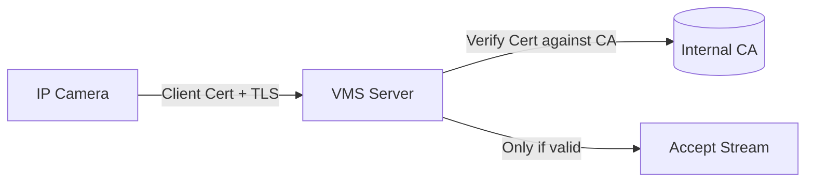
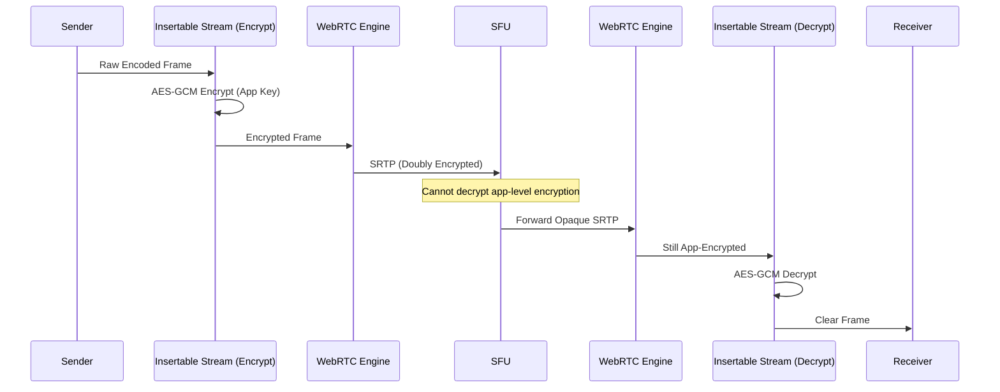

# Video Streaming Security: Principal Architect's Guide

> **Level**: Principal Engineer / SDE-3
> **Scope**: DRM, Watermarking, Zero-Trust Pipelines, and Attack Mitigation at Scale.

---

## 🔒 Transit Security: RTSP, HLS, and Beyond

### The Missing Layer (Principal-Level Clarity)

Most VMS documentation focuses on DRM for distribution. But **contribution (camera → VMS)** security is equally critical.

| Stage | Protocol | Default Security | Secure Alternative |
| :--- | :--- | :--- | :--- |
| **Camera → VMS** | RTSP/RTP | ❌ None (plaintext) | **RTSPS + SRTP** |
| **VMS → CDN** | HTTPS | ✅ TLS | mTLS + Origin Shield |
| **CDN → Viewer** | HLS/DASH | ⚠️ TLS only | **AES-128 + DRM** |
| **WebRTC** | DTLS-SRTP | ✅ Encrypted | **E2EE (Insertable Streams)** |

---

## 🔐 RTSPS + SRTP: Securing Camera-to-VMS

### The Problem

Default RTSP/RTP is **plaintext**. Anyone on the network can:
- Sniff video streams (Wireshark captures H.264 directly)
- Steal credentials (Digest Auth is weak)
- MITM the control channel

### The Solution Stack

| Layer | Protocol | What It Secures |
| :--- | :--- | :--- |
| **Control Channel** | **RTSPS** (RTSP over TLS) | SETUP, PLAY, credentials |
| **Media Channel** | **SRTP** (Secure RTP) | Video/audio packets |
| **Key Exchange** | **DTLS-SRTP** or **SDES** | Encryption key negotiation |

### SRTP Encryption Details

```
┌─────────────────────────────────────────────────────┐
│                    SRTP Packet                       │
├─────────────────────────────────────────────────────┤
│  RTP Header (Unencrypted)                           │
│  ├── Sequence Number, Timestamp, SSRC              │
├─────────────────────────────────────────────────────┤
│  Encrypted Payload                                   │
│  ├── AES-128-CTR (Counter Mode)                     │
│  └── H.264/H.265 NAL Units (Encrypted)              │
├─────────────────────────────────────────────────────┤
│  Authentication Tag (HMAC-SHA1)                     │
│  └── Integrity check for entire packet              │
└─────────────────────────────────────────────────────┘
```

### Key Exchange Methods

| Method | Security | Use Case |
| :--- | :--- | :--- |
| **SDES** (SDP Security Descriptions) | ⚠️ Key in SDP (relies on TLS) | Simple, legacy |
| **DTLS-SRTP** | ✅ Out-of-band handshake | WebRTC, modern SIP |
| **MIKEY** (Multimedia Internet KEYing) | ✅ Dedicated key exchange | IMS, 3GPP |

### Implementation (FFmpeg/GStreamer)

```bash
# RTSPS + SRTP ingest with FFmpeg
ffmpeg -rtsp_transport tcp \
       -i "rtsps://camera.local:322/stream?srtp=1" \
       -c copy output.mp4
```

### God Mode: Camera mTLS Authentication

Beyond RTSPS, use **mTLS (Mutual TLS)** for camera identity:



**Why mTLS?**
- Camera authenticates to VMS (not just VMS to camera)
- Prevents rogue camera injection
- Standard practice in enterprise deployments

---

## 🔐 HLS Encryption: AES-128 vs Sample-AES vs CENC

### The Three Modes

| Mode | Encrypts | Standard | DRM Integration |
| :--- | :--- | :--- | :--- |
| **AES-128** | Entire TS segment | HLS native | ❌ Key URL only |
| **Sample-AES** | Individual samples (frames) | HLS native | ⚠️ Basic FairPlay |
| **CENC/cbcs** | Samples (common encryption) | MPEG-CENC | ✅ Multi-DRM (Widevine, FairPlay, PlayReady) |

### AES-128: How It Works

```
┌──────────────────────────────────────────────────────┐
│                  HLS Manifest (.m3u8)                │
├──────────────────────────────────────────────────────┤
│  #EXTM3U                                             │
│  #EXT-X-KEY:METHOD=AES-128,                          │
│             URI="https://keys.example.com/key123",   │
│             IV=0x0123456789ABCDEF0123456789ABCDEF     │
│  #EXTINF:6.0,                                        │
│  segment001.ts  ← Entire segment encrypted           │
└──────────────────────────────────────────────────────┘
```

- **Encryption**: AES-128-CBC on entire `.ts` file
- **Key Delivery**: Over HTTPS (secure, but key is exposed to player)
- **Weakness**: Key can be extracted from browser/app

### Sample-AES: Per-Frame Encryption

```
┌──────────────────────────────────────────────────────┐
│  TS Segment (Sample-AES)                             │
├──────────────────────────────────────────────────────┤
│  [PES Header] - Unencrypted                          │
│  [NAL 1: SPS] - Unencrypted (syntax needed)          │
│  [NAL 2: PPS] - Unencrypted                          │
│  [NAL 3: IDR Frame] - ✅ ENCRYPTED (AES-CBC)         │
│  [NAL 4: P-Frame] - ✅ ENCRYPTED                     │
└──────────────────────────────────────────────────────┘
```

**Advantage**: Lower decryption complexity (skip headers), works with FairPlay.

### CENC/cbcs: Multi-DRM Standard

```mermaid
graph TD
    Packager[Packager (Shaka/Unified Origin)] -->|"CENC cbcs"| Manifest[.m3u8 / .mpd]
    Manifest --> Widevine[Widevine License Server]
    Manifest --> FairPlay[FairPlay License Server]
    Manifest --> PlayReady[PlayReady License Server]
    
    Player[Player] -->|"Request License"| Widevine
    Player -->|"Decrypt with Key"| Content[Play Content]
```

**Key Insight**: CENC encrypts content ONCE. Different DRM systems use the same encrypted content but issue licenses differently.

---

## 🔐 End-to-End Encryption (E2EE) for Video Streaming

### The Problem with SFUs

WebRTC uses DTLS-SRTP for encryption, but:
- Encryption is **hop-by-hop** (Client ↔ SFU, SFU ↔ Client)
- **SFU decrypts media** to route, record, or transcode
- Server operator can see unencrypted video

### E2EE via WebRTC Insertable Streams

**Insertable Streams** (RTCRtpScriptTransform) allows JavaScript to encrypt/decrypt frames **before** WebRTC sends them:



### Code Example (Simplified)

```javascript
// Sender: Encrypt frames before WebRTC sends them
const sender = peerConnection.getSenders()[0];
const senderStreams = sender.createEncodedStreams();
const encryptTransform = new TransformStream({
  transform(frame, controller) {
    const encrypted = encryptWithAppKey(frame.data, sessionKey);
    frame.data = encrypted;
    controller.enqueue(frame);
  }
});
senderStreams.readable.pipeThrough(encryptTransform).pipeTo(senderStreams.writable);
```

### Key Management for E2EE

| Approach | How Keys Shared | Security |
| :--- | :--- | :--- |
| **Signaling Channel** | Send key over WebSocket | ⚠️ Server sees key |
| **Double Ratchet** | Signal-style key derivation | ✅ Forward secrecy |
| **MLS (Messaging Layer Security)** | Group key agreement | ✅ Enterprise-grade |

> [!TIP]
> **Research Paper**: *"SFrame: End-to-End Encryption for Real-Time Media"* (IETF Draft). Defines a frame-level encryption format compatible with Insertable Streams.

---

## 🔐 VPN Alternatives for Camera-to-VMS

### Why VPNs Are Used

- Encrypt RTSP over public internet
- Provide IP-layer security

### Better Alternatives

| Alternative | How | Advantage |
| :--- | :--- | :--- |
| **SRT (Secure Reliable Transport)** | UDP + AES-256 + ARQ | Built for video, low latency |
| **WireGuard** | Modern VPN protocol | Faster than IPSec, low overhead |
| **RTSPS + SRTP** | TLS on RTSP, SRTP on media | No VPN needed |
| **Tailscale/ZeroTier** | WireGuard-based mesh | Easy setup, NAT traversal |

### SRT Encryption Details

```bash
# SRT with AES-256 encryption
srt-live-transmit \
  "srt://source:1234?passphrase=MySecretKey123" \
  "srt://dest:5678?passphrase=MySecretKey123"
```

- **Cipher**: AES-256-CTR or AES-128-GCM
- **Key Exchange**: Passphrase → PBKDF2 → Session Key
- **Latency**: Configurable (200ms - 8s)

---

## 🧪 God Mode Techniques (Hacky but Effective)

### 1. Traffic Shaping to Defeat Analysis

Even with encryption, attackers can infer content via **traffic analysis** (bitrate patterns = scene complexity).

**Mitigation**: Pad packets to constant bitrate.

```python
# FFmpeg CBR encoding to defeat traffic analysis
ffmpeg -i input.mp4 -b:v 4M -minrate 4M -maxrate 4M -bufsize 2M output.ts
```

### 2. Certificate Pinning for Camera Auth

Don't trust public CAs for camera-VMS communication:

```python
# Python: Certificate pinning for RTSPS
import ssl
context = ssl.create_default_context()
context.load_verify_locations("camera_ca.pem")
context.verify_mode = ssl.CERT_REQUIRED
# Reject connection if cert doesn't match pinned CA
```

### 3. Key Rotation for SRTP

Rotate SRTP master key every N seconds to limit exposure:

```
Master Key Lifetime: 2^31 packets (default)
God Mode: Rotate every 10 minutes for high-security
```

### 4. Hardware Security Modules (HSM) for Key Storage

- DRM keys stored in **HSM** (not in env vars)
- Camera certs stored in **TPM** (if available)

---

## 📚 Research Papers & Standards

| Topic | Reference |
| :--- | :--- |
| **SRTP** | RFC 3711: The Secure Real-time Transport Protocol |
| **DTLS-SRTP** | RFC 5763: Framework for DTLS-SRTP Key Exchange |
| **SFrame (E2EE)** | IETF Draft: SFrame End-to-End Media Encryption |
| **CENC** | ISO/IEC 23001-7: Common Encryption (CENC) |
| **HLS Encryption** | RFC 8216: HTTP Live Streaming (Section 4.3.2.4) |
| **SRT Security** | Haivision SRT Protocol Technical Overview |
| **Traffic Analysis** | "Inferring Streaming Video Quality from Encrypted Traffic" (ACM IMC 2020) |

---

## 🛡️ The "Zero-Trust" Video Pipeline

Generic "Signed URLs" are insufficient for premium content. We implement a **defense-in-depth** strategy.

```mermaid
graph TD
    Client[Client Device] -->|1. Auth| IDP[Identity Provider]
    IDP -->|2. JWT| STS[Secure Token Service]
    STS -->|3. Short-Lived Access Token| Client
    
    Client -->|4. License Request (Encrypted)| LicenseServer[DRM License Server]
    Client -->|5. Content Request + Token| CDN[CDN Edge]
    
    subgraph "Trusted Execution Environment (TEE)"
        CDM[Content Decryption Module]
    end
    
    LicenseServer -->|6. License Keys| CDM
    CDN -->|7. Encrypted Chunks| Client
    Client -->|8. Decrypt in Hardware| CDM
```

### 1. The Token Strategy (Beyond Simple Signatures)
*   **HMAC vs Asymmetric**: Use **Ed25519** signatures for token generation (faster verification at edge than RSA).
*   **Binding**: Bind tokens to **Client IP** (with CIDR lenience for mobile capability) and **User-Agent Fingerprint**.
*   **Jitter**: Introduce random jitter to token expiration to prevent "thundering herd" renewal storms on your Auth Service.

### 2. Geoblocking 2.0 (VPN Detection)
*   **L3/L4 Checks**: Verify BGP ASN ownership (datacenter IPs vs residential).
*   **Latency Triangulation**: If IP says "London" but TCP RTT is 200ms (from Sydney), flag as proxy.
*   **TCP Fingerprinting**: Analyze TCP window size/scaling factors to detect OS mismatches (e.g., Linux stack spoofing an iPhone).

---

## 🔐 Multi-DRM Architecture (CPIX)

> **Standard**: **CPIX** (Content Protection Information Exchange) is the industry standard XML format for exchanging keys between your **Encoder/Packager** and **DRM Provider**.

### The Flow:
1.  **Key Generaton**: KMS generates a Content Key (CEK).
2.  **CPIX Document**: Packager requests CEK via CPIX API.
3.  **Encryption**: Packager encrypts video segments using `AES-128-CBC` (HLS) or `AES-128-CTR` (DASH).
4.  **Signaling**: Manifest (`.m3u8`/`.mpd`) updated with `pssh` (Protection System Specific Header) boxes.

### DRM Security Levels (The "God Mode" of Access)

| DRM System | Security Level | Implementation | Hardware Requirement | Trust |
| :--- | :--- | :--- | :--- | :--- |
| **Widevine (Google)** | **L1** | **Hardware TEE** | ARM TrustZone / Secure Enclave | High (4K Allowed) |
| **Widevine** | **L3** | Software | None | Low (SD Only) |
| **FairPlay (Apple)** | **Hardware** | Secure Enclave | Apple A-Series / T2 Chips | High |
| **PlayReady (Microsoft)**| **SL3000** | Hardware TEE | TP/Intel SGX | High |

> [!WARNING]
> **Attack Vector**: "L1 Downgrade Attack". Hackers spoof L1 capability to force a 4K stream, then exploit a TEE vulnerability (rare but catastrophic) to dump raw frames.
> **Defense**: **HDCP 2.2 Link Enforcement**. Ensure the HDMI link to the monitor is also encrypted.

---

## 🕵️ Forensic Watermarking ("A/B Variant" Technique)

**Problem**: Client-side watermarking (JavaScript overlay) is easily removed by inspecting the DOM or modifying the shader.
**Solution**: Server-Side A/B Watermarking (The "Invisible Tracker").

### The Architecture
1.  **Pre-computation**: Encoder produces **two versions** of every video segment (Segment A and Segment B).
    *   **Segment A**: Watermarked with binary "0".
    *   **Segment B**: Watermarked with binary "1".
    *   *Note: The watermark is imperceptible (steganography in high-freq luma coefficients).*
2.  **Unique Playlist Generation**: Each user gets a **unique .m3u8** manifest.
    *   User 1 Pattern: A-B-A-A (0100)
    *   User 2 Pattern: B-B-A-B (1101)
3.  **Detection**: If a pirated stream is found, analyze the sequence of A/B segments to reconstruct the User ID.

**Benefits**:
*   **Zero Latency penalty** (pre-encoded).
*   **Unbreakable**: The watermark is burnt into the pixel data of the H.264/H.265 bitstream.

### Research Paper Reference
> *“A/B Watermarking for OTT Video Delivery: Architecture and Performance”* (Streaming Video Alliance Technical Paper).
> *“Robust Video Watermarking against H.264/AVC and HEVC Compression”* (IEEE Transactions).

---

## ☠️ Advanced Attack Scenarios & Mitigations

### 1. Token Theft / Replay
*   **Attack**: User extracts `?token=xyz` from browser network tab and shares it on Reddit.
*   **Defense**: **Token Binding (DPoP)**.
    *   Use **Demonstration of Proof-of-Possession (DPoP)** at the application layer.
    *   The token is bound to a private key held in the browser's `SubtleCrypto` (non-exportable).
    *   Each request includes a signature signed by that private key. The stolen token is useless without the private key.

### 2. CDM Emulation (The "Widevine Guesser")
*   **Attack**: Using a hacked CDM (Content Decryption Module) dll/so to intercept keys.
*   **Defense**: **VMP (Verified Media Path)**.
    *   Widevine requires the browser/CDM binary to be signed.
    *   **Server-Side**: Enable **Service Certificate** verification. The license server challenges the CDM to prove it's a genuine, unmodified binary before issuing keys.

### 3. HDMI Stripping
*   **Attack**: Cheap "HDMI Splitter" strips HDCP encryption, capturing raw 4K.
*   **Defense**: **Cinavia (Audio Watermark)**.
    *   Embeds watermarks in audio track.
    *   Consumer devices (TVs, Blu-ray players) detect Cinavia. If they hear the watermark but don't see the corresponding AACS/DRM handshake, they **mute the audio**.

---

## 📊 Principal Architect Checklist for Launch

1.  **Enforce HDCP 2.2**: For all 4K/UHD content. Fallback to SD if HDCP handshake fails.
2.  **License Rotation**: Rotate encryption keys every **15 minutes** (key rotation). Forces pirates to re-hack frequently.
3.  **Concurrency Limiting**: Implement Redis-backed "Heartbeat" service.
    *   Client sends heartbeat every 30s.
    *   If active_sessions > max_allowed, revoke oldest token.
4.  **Audit TEE Specs**: Don't just say "Widevine". Specify **Widevine L1** requirement for >> 720p.
5.  **A/B Watermarking**: If offering Premium Sports/Cinema, this is mandatory for leak tracing.

---

## 🧠 Relevant Research & Standards
*   **FIPS 140-2**: Security requirements for cryptographic modules (Level 3 required for Hardware DRMs).
*   **EBU R 143**: Cybersecurity for media organizations.
*   **Motion Picture Association (MPA) Content Security Best Practices**: The "Gold Standard" checklist for getting Hollywood content.
