# Video Management System (VMS): Principal Architect's Guide

> **Level**: Principal Engineer / SDE-3
> **Scope**: IP Camera Architecture, NVR Internals, AI Analytics Pipelines, and Scale-Out Strategies.

> [!IMPORTANT]
> **The Principal Law**: **The Camera is the Edge.** All intelligence (Motion Detection, AI) should push as close to the camera as possible to reduce bandwidth and storage costs.
> **The Goal**: 10,000+ cameras on a single VMS cluster with <500ms alert latency.

---

## 🌐 Google-Scale Video Surveillance: HLD & LLD

These diagrams represent a production-grade architecture for 10,000+ cameras with real-time chat and AI analytics.

### High-Level Design (HLD)

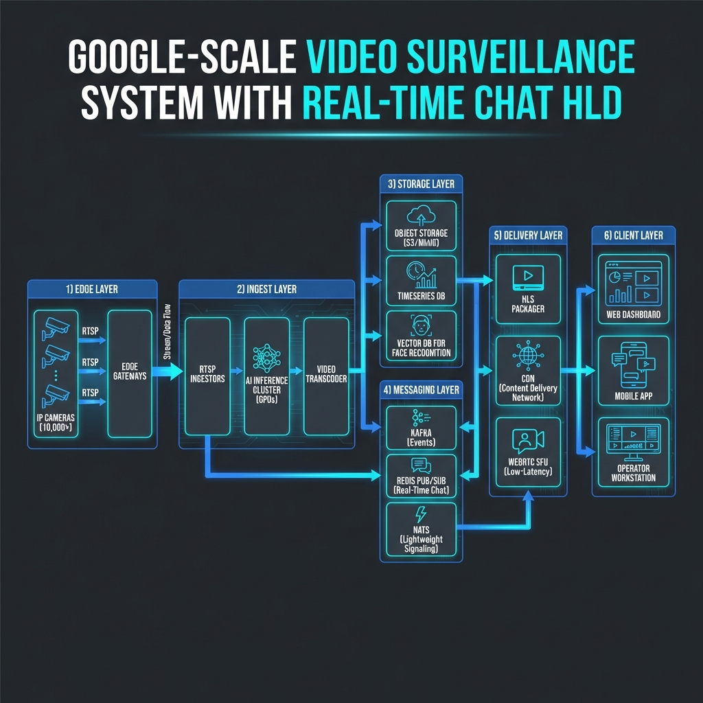

**Key Layers**:
1.  **Edge Layer**: IP Cameras → Edge Gateways (RTSP aggregation).
2.  **Ingest Layer**: RTSP Ingestors, AI Inference (GPUs), Transcoders.
3.  **Storage Layer**: Object Storage (MinIO/S3), TimeSeries DB, Vector DB (FRS).
4.  **Messaging Layer**: Kafka (Events), Redis Pub/Sub (Chat), NATS (Signaling).
5.  **Delivery Layer**: HLS Packager, CDN, WebRTC SFU.
6.  **Client Layer**: Web Dashboard, Mobile App, Operator Workstation.

### Low-Level Design (LLD)

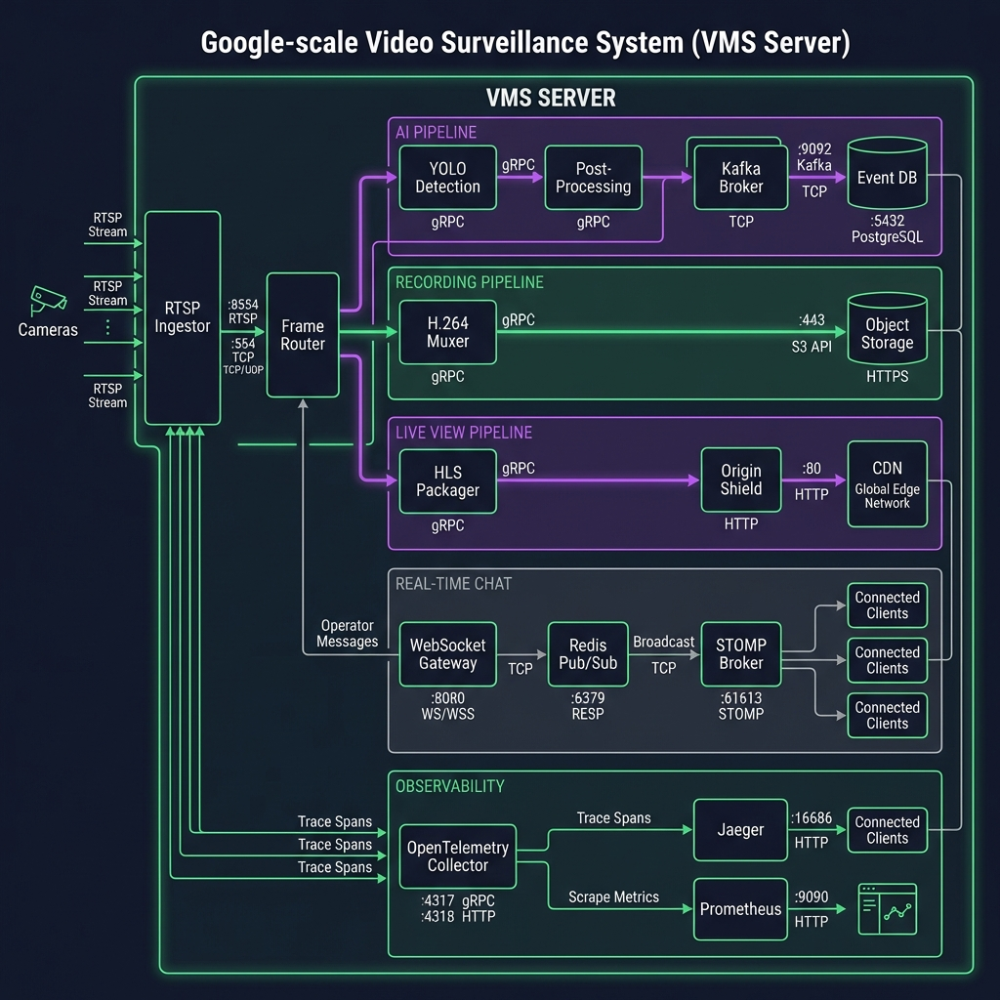

**Key Pipelines**:
1.  **AI Pipeline**: YOLO Detection → Post-Processing → Kafka → Event DB.
2.  **Recording Pipeline**: H.264 Muxer → S3 Object Storage.
3.  **Live View Pipeline**: HLS Packager → Origin Shield → CDN.
4.  **Real-Time Chat**: WebSocket Gateway → Redis Pub/Sub → STOMP Broker → Clients.
5.  **Observability**: OpenTelemetry Collector → Jaeger (Traces), Prometheus (Metrics).

---

## 🎯 End-to-End Pipeline Clarity (Step-by-Step)

> [!IMPORTANT]
> **Confused about RTSP vs HLS?** This section explains exactly when each protocol is used in the pipeline.

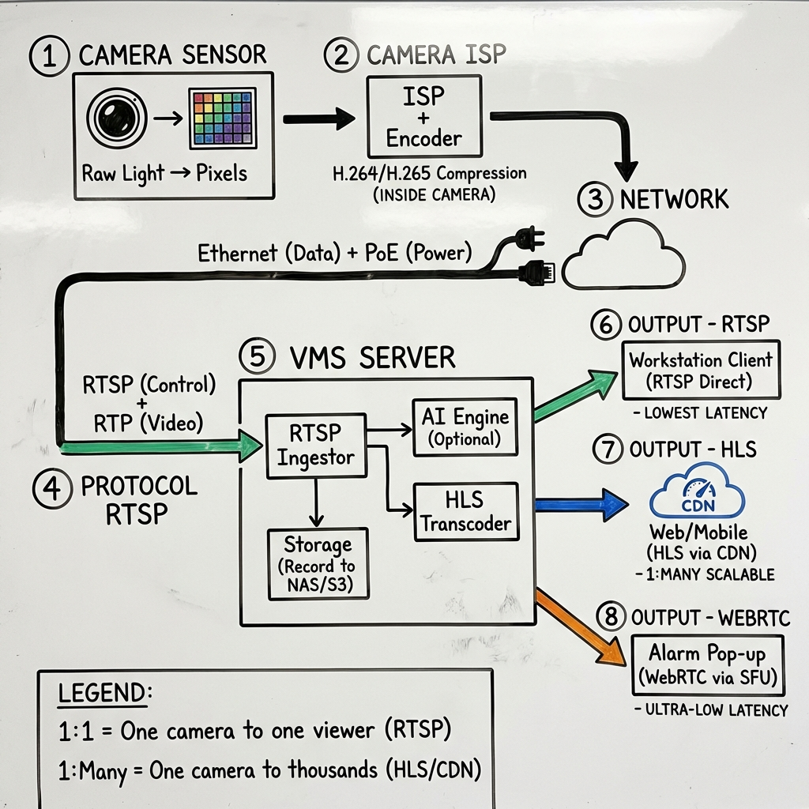

### The Complete Pipeline (Corrected)

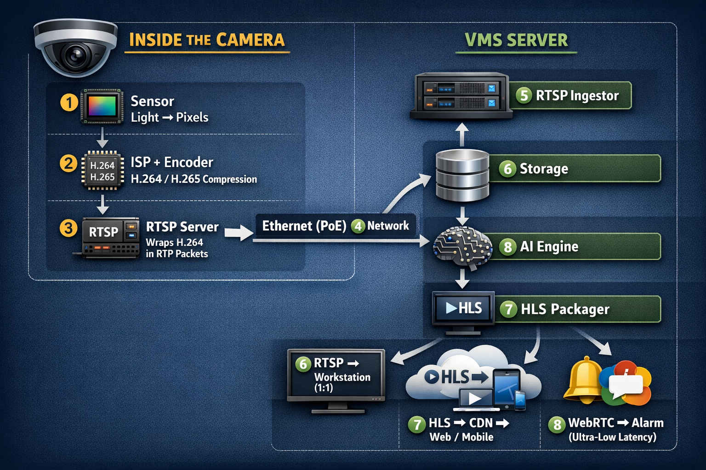

In the above image , I see first compressed i.e. correct, then wrapped with RTSP stream then it goes to Ethernet that has PoE from there it goes to VMS server where RTSP is being ingested.

> [!TIP]
> **Key Clarification**: Steps ①②③ ALL happen **inside the camera**. The camera outputs RTSP (with H.264 inside). VMS engineering starts at Step ⑤.

### Understanding the Layers

| Layer | What It Is | Examples | Role |
| :--- | :--- | :--- | :--- |
| **Codec** | Compression algorithm | H.264, H.265, AV1, VP9 | Shrinks video size |
| **Container** | File/packet format | MP4, TS, fMP4 | Packages compressed bytes |
| **Protocol** | Transport method | RTSP, RTP, HTTP | Delivers packets |
| **Distribution** | Streaming format | HLS, DASH | Enables playback |

### Industry Terminology (Pipeline Stages)

| Stage | Industry Term | Direction | Protocols | Example |
| :--- | :--- | :--- | :--- | :--- |
| **Camera captures** | **Acquisition** | — | — | Sensor → H.264 |
| **Camera → VMS** | **Contribution** | First Mile | RTSP, SRT | Camera to server |
| **VMS processes** | **Processing** | — | — | Recording, AI, Transcoding |
| **VMS → Viewers** | **Distribution** | Last Mile | HLS, DASH, WebRTC | Server to CDN to users |
| **User watches** | **Consumption** | — | — | Browser, App playback |

> [!TIP]
> In broadcast: **Contribution** = high-quality source feed (RTSP/SRT). **Distribution** = compressed delivery to viewers (HLS/DASH).

### Codec + Distribution Compatibility Matrix

| Codec | HLS | DASH | WebRTC | RTSP | Notes |
| :--- | :---: | :---: | :---: | :---: | :--- |
| **H.264** | ✅ Universal | ✅ | ✅ | ✅ | Best compatibility |
| **H.265/HEVC** | ✅ Safari, Some | ✅ | ⚠️ Limited | ✅ | 50% smaller than H.264 |
| **AV1** | ⚠️ HLS v8+ | ✅ Best | ✅ Chrome | ❌ | Royalty-free, best compression |
| **VP9** | ❌ Not supported | ✅ | ✅ | ❌ | Google codec |

> **For Surveillance**: Use **H.264 (camera) + HLS (distribution)**. Maximum compatibility. Use **DASH only if you need AV1/VP9**.

### Step 1-3: Inside the Camera (You Don't Touch This)

| Step | What Happens | Who Does It |
| :--- | :--- | :--- |
| **1. Sensor** | CMOS sensor captures light → Raw pixels (Bayer pattern) | Camera hardware |
| **2. ISP + Encoder** | Image Signal Processor (colors, exposure) → **H.264/H.265 compression** | Camera hardware |
| **3. RTSP Server** | Wraps H.264 in RTP packets, listens on `rtsp://camera-ip:554/` | Camera firmware |

> **Key Insight**: The camera **already compresses AND serves RTSP**. You receive RTP packets containing H.264, NOT raw video.

### Step 3: Network (PoE = Power + Data)

| Component | What It Does |
| :--- | :--- |
| **Ethernet Cable** | Carries compressed video data |
| **PoE (Power over Ethernet)** | Delivers 15-30W power to camera (no separate power cable) |
| **PoE Switch** | Aggregates multiple cameras, provides power + data |

### Step 4: RTSP (Camera → VMS)

**RTSP is the protocol cameras use to SEND video to the VMS.**

```
Camera ──( RTSP + RTP )──> VMS Server
```

| Protocol | Role |
| :--- | :--- |
| **RTSP** | Control channel: SETUP, PLAY, PAUSE, TEARDOWN |
| **RTP** | Media channel: Actual H.264/H.265 packets |
| **RTCP** | Stats channel: Packet loss, jitter reports |

**Why RTSP?**
- Designed for streaming from **IP cameras** (1:1 relationship)
- Low latency (~100ms)
- Supports UDP (faster) or TCP (reliable)

### Step 5: What the VMS Server Does

The VMS is the **brain** of the system:

```mermaid
graph LR
    RTSP[Camera RTSP] --> Ingest[RTSP Ingestor]
    Ingest --> Storage[(Record to NAS/S3)]
    Ingest --> AI[AI Engine (YOLO, FRS)]
    Ingest --> Transcode[HLS Transcoder]
    AI --> Events[(Event DB)]
```

| VMS Function | What It Does |
| :--- | :--- |
| **RTSP Ingestor** | Connects to camera, receives H.264/H.265 stream |
| **Recording** | Writes compressed video to disk (NAS, S3) |
| **AI Inference** | Decodes frames → Runs YOLO/FRS → Generates events |
| **HLS Transcoder** | Re-packages H.264 into HLS segments for web/mobile |
| **Event Bus** | Publishes alerts to dashboards (STOMP/Kafka) |

### Step 6-8: Output to Viewers (This is Where HLS Comes In)

| Output | Protocol | Latency | Scalability | Use Case |
| :--- | :--- | :--- | :--- | :--- |
| **6. Workstation** | **RTSP Direct** (from VMS or Camera) | ~100ms | 1:1 | Operator desktop client |
| **7. Web/Mobile** | **HLS** (via CDN) | 2-6s | 1:Many | Browser, iOS/Android app |
| **8. Alarm Pop-up** | **WebRTC** (via SFU) | <500ms | 1:Few | Instant alert view |

### The Complete Picture

```
┌──────────────────────────────────────────────────────────────────────────────┐
│                           CAMERA (Edge)                                       │
│  [Sensor] → [ISP] → [H.264 Encoder] → [RTSP Server]                          │
│                                           │                                   │
│                              Already Compressed!                              │
└──────────────────────────────────────────│───────────────────────────────────┘
                                           │ RTSP + RTP (1:1)
                                           ▼
┌──────────────────────────────────────────────────────────────────────────────┐
│                           VMS SERVER                                          │
│                                                                               │
│  [RTSP Ingestor] ──┬──> [Storage (NAS/S3)] ──> Playback/Export               │
│                    │                                                          │
│                    ├──> [AI Engine] ──> [Event DB] ──> [STOMP Alerts]        │
│                    │                                                          │
│                    └──> [HLS Transcoder] ──> [CDN] ──> Web/Mobile (1:Many)   │
│                                                                               │
│  [RTSP Relay] ──────────────────────────────────> Workstation (1:1)          │
│                                                                               │
│  [WebRTC SFU] ─────────────────────────────────> Alarm Pop-up (1:Few)        │
└──────────────────────────────────────────────────────────────────────────────┘
```

### Summary: When Each Protocol is Used

| Stage | Protocol | Direction | Purpose |
| :--- | :--- | :--- | :--- |
| **Camera → VMS** | **RTSP/RTP** | Ingestion | Get video from camera |
| **VMS → Workstation** | **RTSP** | Egress (1:1) | Low-latency operator view |
| **VMS → Web/Mobile** | **HLS** | Egress (1:Many) | Scalable distribution via CDN |
| **VMS → Alarm Client** | **WebRTC** | Egress (1:Few) | Ultra-low latency alerts |
| **VMS → Dashboard** | **STOMP/WS** | Events | Push notifications (no video) |

---

## 🏗️ The VMS Topology (High-Level Design)

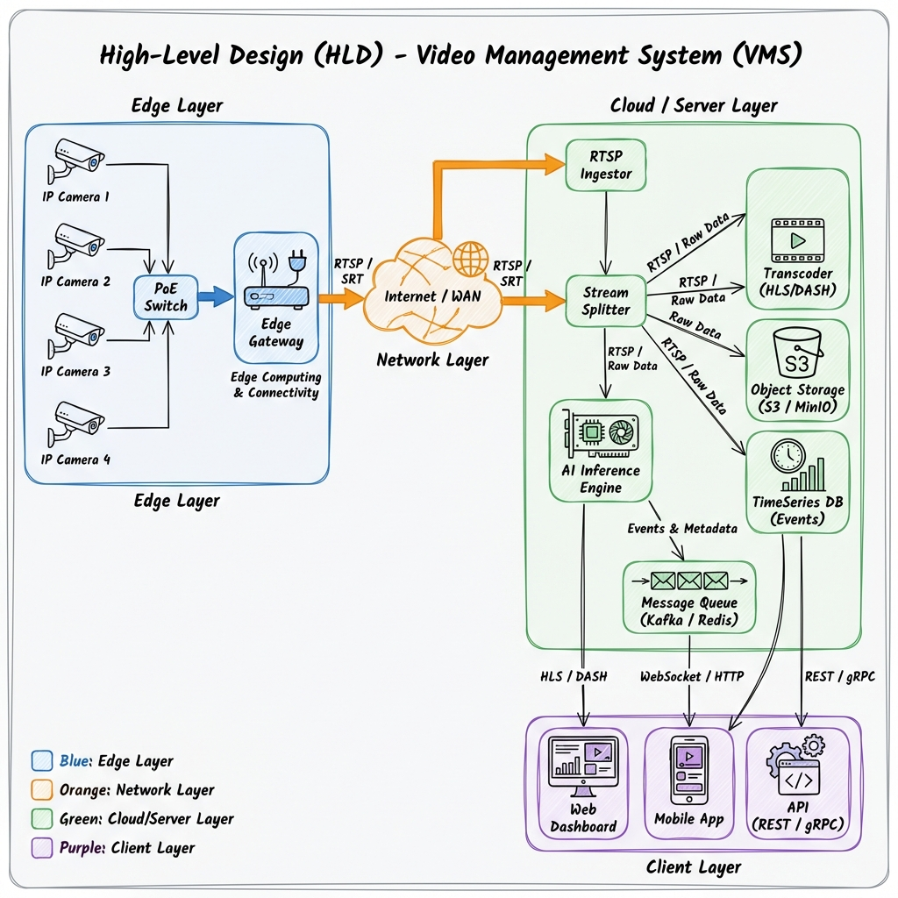

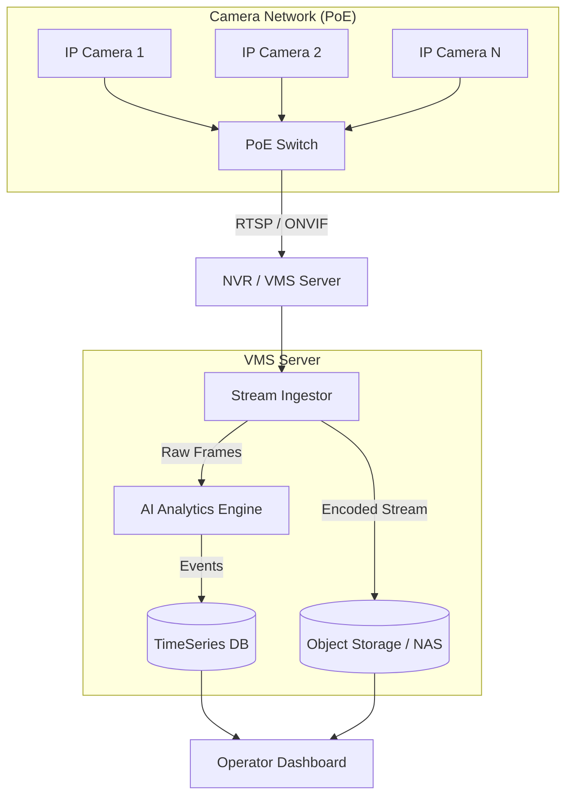
```mermaid
graph TD
    subgraph "Camera Network (PoE)"
        Cam1[IP Camera 1] --> Switch[PoE Switch]
        Cam2[IP Camera 2] --> Switch
        CamN[IP Camera N] --> Switch
    end
    
    Switch --> |RTSP / ONVIF| NVR[NVR / VMS Server]
    
    subgraph "VMS Server"
        Ingest[Stream Ingestor]
        AI[AI Analytics Engine]
        DB[(TimeSeries DB)]
        Storage[(Object Storage / NAS)]
    end
    
    NVR --> Ingest
    Ingest --> |Raw Frames| AI
    Ingest --> |Encoded Stream| Storage
    AI --> |Events| DB
    
    DB --> Dashboard[Operator Dashboard]
    Storage --> Dashboard
```

---

## 📹 Camera Fundamentals (Review for Architects)

### IP Camera vs Analog (DVR)

| Feature | IP Camera (NVR) | Analog Camera (DVR) |
| :--- | :--- | :--- |
| **Transport** | Ethernet (PoE) | Coaxial Cable |
| **Resolution** | Up to 4K+ | 720p max |
| **Power** | PoE (Single cable) | Separate power cable |
| **Scalability** | Network switches (1000+ cameras) | Dedicated DVR (8-32 channels) |
| **AI Integration** | Native (ONVIF-S profiles) | Requires external transcoding |

> [!TIP]
> **God Mode**: Use **PoE+ (802.3at)** switches for PTZ cameras (30W requirement). Standard PoE (15W) is insufficient for pan/tilt motors.

### The Lens Equation

*   **Focal Length**: Lower = Wider FOV (Fisheye ~1.6mm). Higher = Narrow/Telephoto (50mm for license plates).
*   **IR Corrected Lens**: Critical for night-time. Non-corrected lenses cause focus shift when switching to IR mode (blurry night footage).
*   **Multi-Megapixel Lens**: Required for 4K+ sensors. Standard lenses cause chromatic aberration at edges.

---

## 🔌 Analog Camera Integration (Legacy Migration)

### The Problem

Analog cameras (CVBS, HD-TVI, HD-CVI, AHD) output video over **coaxial cable**, not Ethernet. They cannot directly connect to an IP-based VMS.

### Solution 1: Video Encoder (Analog-to-IP Converter)

A **Video Encoder** (also called Video Server) takes analog input and outputs **RTSP/ONVIF** over Ethernet.

```mermaid
graph LR
    AnalogCam[Analog Camera] -->|Coax (BNC)| Encoder[Video Encoder]
    Encoder -->|Ethernet (RTSP)| Switch[PoE Switch]
    Switch --> VMS[VMS Server]
```

| Vendor | Model | Channels | Output |
| :--- | :--- | :--- | :--- |
| **Axis** | M7104 | 4 | H.264/H.265 ONVIF |
| **Hikvision** | DS-6700 Series | 1-16 | H.264 ONVIF |
| **Dahua** | DH-PFT1200 | 4 | H.264 |

**Use Case**: Gradual migration. Keep existing analog cameras, add encoder, connect to new IP VMS.

### Solution 2: Hybrid DVR/NVR

A **Hybrid Recorder** accepts both analog coax and IP Ethernet inputs.

| Type | Analog Inputs | IP Inputs | VMS Role |
| :--- | :--- | :--- | :--- |
| **Tribrid DVR** | HD-TVI + CVBS | + IP | VMS pulls from DVR API |
| **Hybrid NVR** | Via internal encoder | Native | Unified management |

**Use Case**: Small sites with mixed camera inventory.

### Solution 3: HD-Analog (HD-TVI / HD-CVI / AHD)

Modern "HD-analog" cameras output **1080p/4MP over coax** (same cable as old analog). They still require a compatible DVR or encoder.

| Standard | Max Resolution | Developer |
| :--- | :--- | :--- |
| **HD-TVI** | 8MP | Hikvision |
| **HD-CVI** | 8MP | Dahua |
| **AHD** | 8MP | Nextchip |
| **HD-SDI** | 1080p | Broadcast industry |

> [!TIP]
> **God Mode**: For Videonetics-style deployments, use **multi-codec video encoders** that expose ONVIF Profile S. This allows the VMS to treat analog cameras identically to IP cameras (same driver, same UI).

### VMS Integration Considerations

1.  **No ONVIF on Analog**: The encoder provides ONVIF, not the camera. PTZ control routes through the encoder's ONVIF extension.
2.  **Latency**: Encoding adds ~100-200ms latency vs native IP.
3.  **Power**: Analog cameras need separate power (no PoE). Consider a **PoE to Coax** adapter if cable runs are shared.
4.  **Quality Loss**: CVBS is SD (480p). Do not expect AI analytics to work well. HD-TVI/CVI can do 4MP.

---

## ⚙️ Protocol Deep Dive: ONVIF & RTSP

### ONVIF (Open Network Video Interface Forum)

*   **Purpose**: Standardized control for any IP camera (PTZ, Profiles, Events).
*   **Profiles**:
    *   **Profile S**: Streaming (Mandatory for any VMS).
    *   **Profile G**: Recording (Edge storage on camera SD card).
    *   **Profile T**: Video Analytics (AI event push).
*   **The "God Mode" Integration**: Deep SDK integration (Hikvision/Dahua SDK) unlocks 100+ features vs 30 via ONVIF. But you lose vendor portability.

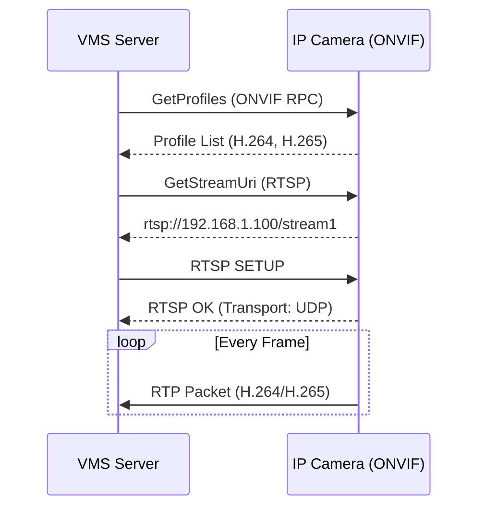
```mermaid
sequenceDiagram
    participant VMS as VMS Server
    participant Cam as IP Camera (ONVIF)
    
    VMS->>Cam: GetProfiles (ONVIF RPC)
    Cam-->>VMS: Profile List (H.264, H.265)
    
    VMS->>Cam: GetStreamUri (RTSP)
    Cam-->>VMS: rtsp://192.168.1.100/stream1
    
    VMS->>Cam: RTSP SETUP
    Cam-->>VMS: RTSP OK (Transport: UDP)
    
    loop Every Frame
        Cam->>VMS: RTP Packet (H.264/H.265)
    end
```

### RTSP Gotchas

1.  **TCP vs UDP**: UDP is lower latency but drops frames on congestion. Use TCP for reliable recording, UDP for live view.
2.  **Multicast**: Reduces camera CPU when multiple VMS instances pull the same stream. BUT requires IGMP snooping on switches.
3.  **Digest Auth**: NEVER use Basic Auth. RTSP credentials are plaintext without TLS.

---

## 🧠 AI Analytics: The "Second Brain"

The VMS is no longer just a recorder. It's an inference engine.

### The Pipeline

```mermaid
flowchart LR
    subgraph Camera
        Sensor[CMOS Sensor] --> ISP[Image Signal Processor]
        ISP --> Encoder[H.264/H.265 Encoder]
    end
    
    Encoder --> |RTP| Decoder[VMS Decoder (FFmpeg/GStreamer)]
    Decoder --> |Raw Frames (YUV/RGB)| Sampler[Frame Sampler (1 FPS)]
    
    Sampler --> Model[AI Model (YOLO/ResNet)]
    Model --> |Detections| PostProc[Post-Processor (NMS, Tracking)]
    PostProc --> |Events| EventBus[Kafka / Redis Streams]
    
    EventBus --> Dashboard
    EventBus --> Alarm[Alarm Service (SMS/Email)]
```

### Model Selection (Surveillance-Specific)

| Use Case | Model Architecture | Inference Time (GPU) | Notes |
| :--- | :--- | :--- | :--- |
| **Person/Vehicle Detection** | YOLOv8-nano | ~5ms (RTX 3090) | Best speed/accuracy tradeoff |
| **Face Recognition** | ArcFace (ResNet50) | ~15ms | Requires 112x112 aligned crop |
| **License Plate (ANPR)** | CRNN + CTC | ~20ms | Requires two-stage: Detector + OCR |
| **Anomaly Detection** | Autoencoders (Unsupervised) | ~30ms | Detects "unusual motion patterns" |

> [!WARNING]
> **The Bitrate Trap**: AI performance degrades sharply below 2 Mbps. Camera vendors demo at 6 Mbps, but integrators deploy at 1.5 Mbps to save bandwidth. The blurry frames cause missed detections.

---

## 💾 Storage Architecture: The "Cold vs Hot" Split

### Tiered Storage Strategy

| Tier | Media | Retention | Use Case |
| :--- | :--- | :--- | :--- |
| **Hot** | NVMe SSD (Local) | 1-3 Days | Live Playback, AI Inference |
| **Warm** | HDD RAID (NAS) | 7-30 Days | Forensic Review |
| **Cold** | Object Storage (S3/MinIO) | 90+ Days | Compliance Archival |

### The Math: Storage Calculation

```
Storage (GB/day/camera) = (Bitrate Mbps) * (Hrs/day) * 3600 / 8 / 1024

Example: 2 Mbps * 24 hrs * 3600 / 8 / 1024 = ~21 GB/day/camera
```

*   **100 Cameras @ 2Mbps x 30 days = 63 TB**.
*   **God Mode Savings**: Use **Event-Based Recording** (motion only). Reduces storage by 50-70%.

---

## 🔒 Security: Hardening the VMS

### The "Dahua/Hikvision Backdoor" Problem

In 2017, major camera vendors were found to have hardcoded backdoor accounts.

*   **Mitigation**:
    1.  **VLAN Segmentation**: Camera network MUST be isolated from corporate LAN.
    2.  **Disable UPNP/P2P Cloud**: These "convenience" features bypass firewalls.
    3.  **Firmware Audits**: Subscribe to NVD feeds for CVEs on camera models.
    4.  **802.1X (Port Authentication)**: Only registered cameras can connect to PoE switch.

### Encryption at Rest (GDPR/HIPAA)

*   **Disk Encryption**: LUKS (Linux) or BitLocker (Windows) on storage volumes.
*   **Database Encryption**: TDE (Transparent Data Encryption) on PostgreSQL/MySQL event DBs.

---

## 👤 Role-Based Access Control (RBAC) Architecture

### The Principal's View: Multi-Tenant VMS

In enterprise VMS, different users need different access levels.

| Role | Live View | Playback | PTZ Control | Export | Config | User Mgmt |
| :--- | :---: | :---: | :---: | :---: | :---: | :---: |
| **Super Admin** | ✅ All | ✅ All | ✅ All | ✅ | ✅ | ✅ |
| **Site Admin** | ✅ Site | ✅ Site | ✅ Site | ✅ | ⚠️ Site | ❌ |
| **Operator** | ✅ Assigned | ✅ Assigned | ⚠️ Limited | ❌ | ❌ | ❌ |
| **Viewer** | ✅ Assigned | ❌ | ❌ | ❌ | ❌ | ❌ |
| **Auditor** | ❌ | ✅ Logs Only | ❌ | ✅ Logs | ❌ | ❌ |

### Implementation Patterns

1.  **Camera Groups**: Assign cameras to logical groups (Floor 1, Parking, Entrance). Map roles to groups.
2.  **Time-Based Restrictions**: Operator can only view between 9 AM - 6 PM.
3.  **IP Whitelisting**: Restrict dashboard access to office IP ranges.
4.  **Audit Trail**: Every action (Login, View, Export, PTZ) is logged with User ID, Timestamp, Camera ID.

### Integration with Enterprise Identity

*   **LDAP/Active Directory**: Sync users from corporate directory.
*   **SAML 2.0 / OIDC**: SSO via Okta, Azure AD, Keycloak.
*   **MFA**: Require TOTP/WebAuthn for Admin roles.

```mermaid
graph TD
    User[User Login] --> IdP[Identity Provider (Keycloak/AD)]
    IdP --> |JWT Token| VMS[VMS API Gateway]
    VMS --> |Check Claims| RBAC[RBAC Engine]
    RBAC --> |Allowed Cameras| CamDB[(Camera Registry)]
    RBAC --> |Denied| Block[403 Forbidden]
```

---

## 🔲 Privacy Masking & Redaction

### The GDPR Problem

Under GDPR/CCPA, faces and license plates are **Personally Identifiable Information (PII)**. You cannot export raw footage for evidence without redaction.

### Masking Types

| Type | When Applied | Method | Use Case |
| :--- | :--- | :--- | :--- |
| **Static Mask** | Camera Config | Black rectangle overlaid on sensor region | Neighbor's window, ATM PIN pad |
| **Dynamic Mask (AI)** | On-the-fly | Face/Person detection → Blur/Pixelate | GDPR exports, public footage |
| **Selective UnMask** | Playback | Authorized user sees unmasked | Law enforcement request |

### God Mode: Selective UnMasking Workflow

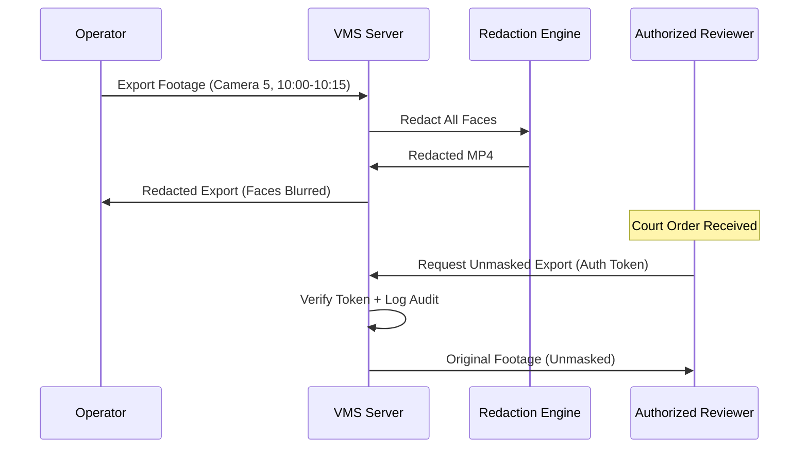
```mermaid
sequenceDiagram
    participant Operator
    participant VMS as VMS Server
    participant AI as Redaction Engine
    participant Lawyer as Authorized Reviewer

    Operator->>VMS: Export Footage (Camera 5, 10:00-10:15)
    VMS->>AI: Redact All Faces
    AI->>VMS: Redacted MP4
    VMS->>Operator: Redacted Export (Faces Blurred)
    
    Note over Lawyer: Court Order Received
    Lawyer->>VMS: Request Unmasked Export (Auth Token)
    VMS->>VMS: Verify Token + Log Audit
    VMS->>Lawyer: Original Footage (Unmasked)
```

### Technical Implementation

*   **Static Masks**: Stored as polygon coordinates per camera in config.
*   **Dynamic Masks**: Run YOLO/MediaPipe face detection + OpenCV blur kernel.
*   **Selective Unmask**: Original footage stored encrypted. Redacted version generated on export. Unmask keys held by Data Protection Officer.

---

## 📷 Multi-Sensor Cameras (Panoramic / Stitching)

### The Problem

A single-sensor camera has a fixed FOV. To cover a parking lot, you need 4 cameras. Multi-sensor cameras have 4+ lenses in one housing.

### Multi-Sensor Modes

| Mode | VMS Sees | Use Case |
| :--- | :--- | :--- |
| **Individual Streams** | 4 separate RTSP streams | AI inference on each quadrant |
| **Stitched Panorama** | 1 wide RTSP stream | Operator overview, seamless PTZ-like experience |
| **Dewarp (Fisheye)** | 1 raw fisheye + VMS dewarps client-side | Flexible PTZ on recorded footage |

### VMS Integration Challenges

1.  **Bandwidth**: 4 x 4K streams = 4 x 8 Mbps = 32 Mbps per camera. Network planning is critical.
2.  **Storage**: Stitched panorama is 8K+. Compression is less efficient at ultra-wide aspect ratios.
3.  **AI Inference**: Run inference on individual quadrants (parallel), not on stitched panorama (expensive).
4.  **ONVIF Profile M**: Specifically for multi-sensor cameras. Defines how to address each sensor.

### Fisheye Dewarp (Client-Side vs Server-Side)

*   **Server-Side Dewarp**: VMS transcodes fisheye → rectilinear. High CPU/GPU usage. Client sees normal video.
*   **Client-Side Dewarp**: VMS sends raw fisheye. Client (Web/Mobile) applies shader/warp. Lower server load. Requires capable player.

> [!TIP]
> **God Mode**: Store raw fisheye for archival. Dewarp on playback. You can "PTZ" inside recorded footage.

---

## 🎭 Advanced Camera Features (Architect Must-Know)

### 1. Corridor Mode (9:16 Aspect Ratio)
Rotate sensor 90° for hallways. Reduces wasted pixels on walls.

### 2. WDR (Wide Dynamic Range)
Handles "bright window" problem. Captures both indoor faces and outdoor sunlight without blowout.

### 3. Edge Recording (SD Card Failover)
Camera records locally to SD if network dies. VMS syncs footage when network recovers.

### 4. Audio Detection (Glass Break, Gunshot)
Microphone + AI model detects specific sounds. Triggers alert before motion is visible.

### 5. Thermal + Optical Fusion
Thermal camera detects heat signature (intruder at night). Optical camera confirms identity. AI correlates both streams.

---

## 🚗 Traffic Management & ANPR (Enterprise Module)

### Automatic Number Plate Recognition (ANPR/ALPR)

| Component | Technology | Performance |
| :--- | :--- | :--- |
| **Plate Detection** | YOLO/SSD | ~10ms per frame |
| **OCR (Character Recognition)** | CRNN + CTC Loss | ~15ms per plate |
| **Database Matching** | Redis/Elasticsearch | ~1ms per lookup |

### Traffic Violation Detection (AI-Based)

*   **Overspeeding**: Track vehicle across two points, calculate speed.
*   **Wrong-Way Driving**: Detect motion vector against lane direction.
*   **Red Light Violation**: Correlate traffic signal state (GPIO/Vision) with vehicle crossing stop line.
*   **Illegal Lane Change**: Track lateral movement across lane markings.
*   **Helmet/Seatbelt Detection**: Classify rider/driver attributes.

### E-Challan / Evidence Workflow

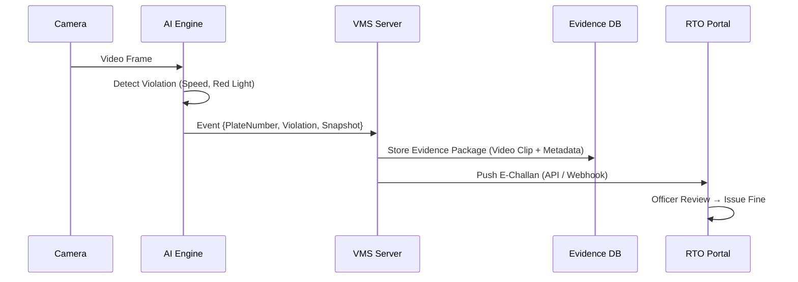
```mermaid
sequenceDiagram
    participant Camera
    participant AI as AI Engine
    participant VMS as VMS Server
    participant DB as Evidence DB
    participant RTO as RTO Portal

    Camera->>AI: Video Frame
    AI->>AI: Detect Violation (Speed, Red Light)
    AI->>VMS: Event {PlateNumber, Violation, Snapshot}
    VMS->>DB: Store Evidence Package (Video Clip + Metadata)
    VMS->>RTO: Push E-Challan (API / Webhook)
    RTO->>RTO: Officer Review → Issue Fine
```

---

## 🧑 Face Recognition System (FRS) Integration

### FRS Architecture

```mermaid
graph TD
    Camera[IP Camera] -->|RTSP| Decoder[Frame Decoder]
    Decoder -->|Frames| FaceDetect[Face Detector (MTCNN/RetinaFace)]
    FaceDetect -->|Cropped Faces| Embedding[Embedding Model (ArcFace)]
    Embedding -->|512-D Vector| VectorDB[(Vector DB (Milvus/Faiss))]
    VectorDB -->|Match| Watchlist[Watchlist Alert]
    VectorDB -->|No Match| Log[Anonymous Log]
```

### Key Features

| Feature | Description |
| :--- | :--- |
| **1:N Identification** | Match face against database of N known faces. |
| **1:1 Verification** | Confirm identity (e.g., access control badge + face). |
| **Watchlist Alerts** | Real-time notification when VIP/Blacklisted person detected. |
| **Attribute Search** | Forensic search by gender, age, glasses, mask. |
| **Liveness Detection** | Reject photos/videos held in front of camera (anti-spoofing). |

### Integration with Access Control

*   **Door Controller**: VMS sends "Access Granted" signal via GPIO/Wiegand when face matches authorized list.
*   **Visitor Management**: Capture face at reception, add to temporary whitelist.

---

## 🔍 Forensic Search (Attribute-Based)

### The Problem

"Find the person in a blue shirt who was in the parking lot between 2 PM and 3 PM yesterday."

### Solution: AI-Indexed Metadata

Every detected object is indexed with attributes:

| Object Type | Indexed Attributes |
| :--- | :--- |
| **Person** | Gender, Age Range, Top Color, Bottom Color, Bag, Hat |
| **Vehicle** | Type (Car/Truck/Bike), Color, Make, Model, Plate |
| **Face** | Embedding Vector, Glasses, Mask, Beard |

### Query Interface (SQL-like)

```sql
SELECT camera_id, timestamp, snapshot_url
FROM detections
WHERE object_type = 'person'
  AND top_color = 'blue'
  AND location = 'ParkingLot'
  AND timestamp BETWEEN '2024-01-17 14:00' AND '2024-01-17 15:00'
ORDER BY timestamp;
```

---

## 🔭 The Watchtower: VMS Observability & Monitoring

> **Context**: Unlike Netflix (1 Source → 1M Viewers), VMS is **10k Sources → Storage**.
> **The Risk**: Failure is **silent**. If a camera stops sending data, no user complains immediately. You only find out 30 days later when you need the evidence and it's missing.

### Tier 1: Camera Health (The Ingest)
This is "Is the camera working?", but deeper than just PING.

| Metric | What It Means | The "Principal" Insight |
| :--- | :--- | :--- |
| **RTSP Packet Loss** | Network quality | If > 1%, you will have artifacts. Use UDP, but switch to TCP if loss > 2%. |
| **"Pink Screen" / Frozen** | **Decoding Artifacts** | The camera is "Online" (Ping works) but the sensor is dead (sending garbage). Detect using FFmpeg `blackframe` or `silencedetect`. |
| **Connection Flapping** | Stability | If a camera reconnects > 5 times/hour, it's a "Flapper". Auto-disable it to save Ingestor CPU. |

### Tier 2: Recording Integrity (The Storage)
> [!CRITICAL]
> **The Silent Killer: Write Gaps**.
> *   **Scenario**: The disk was full/busy for 5 minutes. The VMS dropped the packets.
> *   **Metric**: `active_write_streams` vs `expected_streams`.
> *   **Alert**: "Camera 5 is Online, but BytesWritten to Disk is 0 for last 60 seconds." -> **PAGERS MUST FIRE**.

### Tier 3: AI/Analytics Health (The Brain)
For Smart City / Traffic (Videonetics) use cases.

*   **Inference Latency**: (Time Processed - Time Captured).
    *   *Rule*: If Inference Latency > 40ms (at 25fps), your queue is growing. You are dropping frames.
*   **Drift Detection**: "Camera 5 detected 0 cars in the last hour" (on a busy highway).
    *   *Meaning*: The camera has moved/tilted. The AI is running, but seeing the sky.

### 4. Logging Strategy: Events vs Noise
**Do NOT log every frame.** You will generate Petabytes of logs.
*   **Log Events**: "Connection Lost", "Motion Started", "Object Detected".
*   **Correlation ID**: Tag every frame batch with a `batch_id`. If AI fails, you can trace `batch_id` back to the specific RTSP packet.

---

## �️ The Tech Stack: Implementing "The Watchtower"

> **User Request**: "How do I actually build this? Do I use Prometheus/Grafana?"

**YES.** For a Videonetics-scale system (10,000+ cameras), `tail -f` is dead. You need an **Observability Pipeline**.

### 1. Metrics (Prometheus / VictoriaMetrics)

You need a Time-Series Database (TSDB) to track the **health trends**.

| Semantic Metric Name | Type | Labels | What it tells you |
| :--- | :--- | :--- | :--- |
| `vms_camera_status` | Gauge | `camera_id`, `site_id` | 0=Offline, 1=Online. The heartbeat. |
| `vms_rtsp_packet_loss_total` | Counter | `camera_id` | "Camera 5 is degrading." (Yellow Alert) |
| `vms_storage_write_bytes` | Rate | `disk_id` | "Is video actually landing on disk?" |
| `vms_ai_inference_seconds` | Histogram | `model="yolo"`, `gpu_id` | "Is the AI falling behind real-time?" |

> [!WARNING]
> **Cardinality Explosion**: **NEVER** use `frame_id`, `object_id`, or `timestamp` as a Prometheus Label. You will kill the server. Only use low-cardinality tags like `camera_id`, `server_ip`, `algo_type`.

### 2. Visualization (Grafana)

For 10,000 cameras, you cannot have a list. You need **Aggregated Visuals**.

#### The "NOC" Traffic Light Dashboard
*   **The Honeycomb (Polystat Plugin)**: 10,000 hexagonal cells.
    *   **Green**: Online & Recording.
    *   **Yellow**: Packet Loss > 5% OR AI Latency > 100ms.
    *   **Red**: Offline.
*   **Drill-Down**: Click a Red cell -> Opens specific Camera Dashboard (Logs + Stream).

#### The "Principal" Integration: Video in Grafana
Use the **Grafana HTML / Text Panel** or specific **RTSP Plugins** to embed a low-res MJPEG snapshot of the camera *inside* the dashboard.
*   *Why?* When the graph spikes, the operator wants to see *what* is happening (e.g., "Oh, the camera is covered by a spider web").

### 3. Distributed Tracing (OpenTelemetry)

> **User Question**: "Is OpenTelemetry overkill?"
> **Answer**: For *Streaming*? Yes. For *AI Analytics*? **NO.**

When a VIP Face Alert fails to fire, you need to know **WHY**.

**The Span Structure**:
```text
TraceID: frame_xyz_123
├── Span: Ingest (RTSP Receive) [2ms]
├── Span: Decode (H.264 -> Raw) [5ms]
├── Span: Inference (YOLOv8)    [15ms]
│   └── Attributes: { confidence: 0.85, objects: 3 }
├── Span: Post-Process (NMS)    [1ms]
└── Span: Database Write        [500ms] ⚠️ (SLOW!)
```

**The Value**:
*   "Why is latency high?" -> OpenTelemetry shows the `Database Write` span is taking 500ms (Disk Bottleneck), not the GPU (Inference).
*   Without OTel, you would blame the AI model erroneously.

### 4. Logs (Loki vs ELK)

*   **ELK (Elasticsearch)**: good for full-text search. Expensive for high throughput.
*   **Loki (Grafana)**: **Perfect for VMS.**
    *   *Why?* Loki does *not* index the log text, only the labels (`camera_id`).
    *   VMS logs are high-volume ("Connection quality 80%..."). You rarely search the text, you filter by `camera_id="cam_5"` and `level="error"`. Loki is 10x cheaper here.

### Summary: The Videonetics Stack
*   **Metrics**: Prometheus (Health).
*   **Vis**: Grafana (NOC Wall).
*   **Trace**: OpenTelemetry (AI Pipeline debugging).
*   **Logs**: Loki (Cost-effective storage).

---

## �🖥️ Video Walls & Multi-Monitor Layouts

### Operator Workstation Architecture

```mermaid
graph TD
    subgraph "VMS Server"
        Stream[Live Streams]
        Layout[Layout Engine]
    end
    
    subgraph "Operator PC"
        GPU[GPU (NVIDIA)]
        Monitor1[Monitor 1: 4x4 Grid]
        Monitor2[Monitor 2: 2x2 Grid + Map]
        Monitor3[Monitor 3: Alert Queue]
    end
    
    Stream --> Layout
    Layout -->|WebSocket| GPU
    GPU --> Monitor1
    GPU --> Monitor2
    GPU --> Monitor3
```

### Layout Features

*   **Drag-and-Drop**: Operator arranges cameras on virtual wall.
*   **Patrol Mode**: Auto-cycle through camera list every N seconds.
*   **Event Pop-Up**: When alert fires, camera auto-pops to full screen.
*   **Fisheye Dewarp Widget**: PTZ controls overlaid on dewarped fisheye.

---

## ⚡ High Availability (HA) & Failover

### Failover Architecture

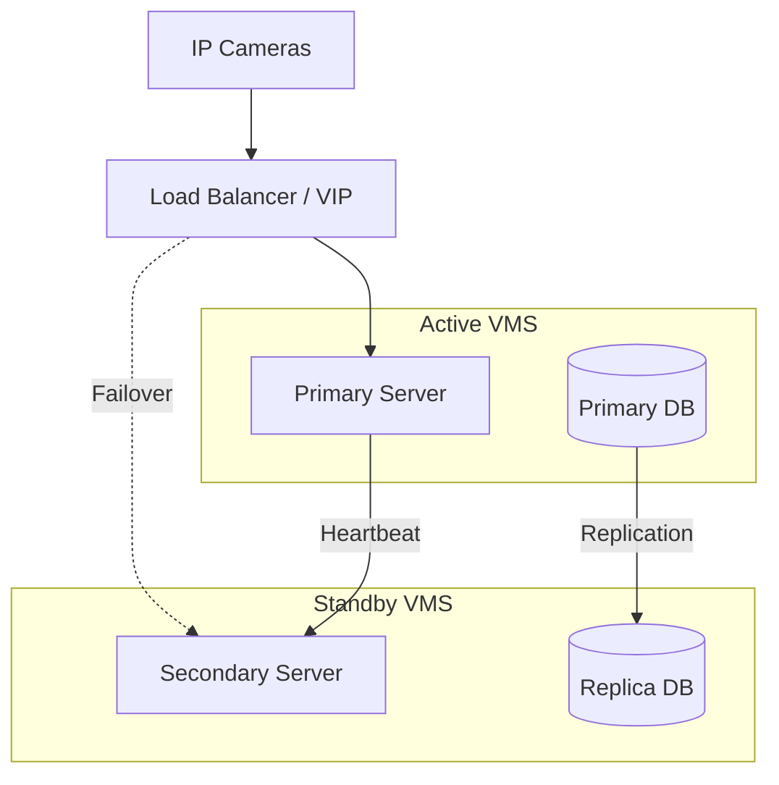
```mermaid
graph TD
    subgraph "Active VMS"
        Primary[Primary Server]
        DB1[(Primary DB)]
    end
    
    subgraph "Standby VMS"
        Secondary[Secondary Server]
        DB2[(Replica DB)]
    end
    
    Primary -->|Heartbeat| Secondary
    DB1 -->|Replication| DB2
    
    Cameras[IP Cameras] --> LB[Load Balancer / VIP]
    LB --> Primary
    LB -.->|Failover| Secondary
```

### Failover Triggers

*   **Server Down**: Heartbeat timeout (5 seconds).
*   **Service Crash**: Systemd watchdog restarts, LB reroutes.
*   **Storage Full**: Redirect recording to secondary NAS.

### Edge Failover (Camera-Side)

If VMS is unreachable:
1.  Camera records to local SD card.
2.  When VMS recovers, camera pushes stored footage (Gap-Fill).

---

## 🏭 Edge Computing Architecture

### Edge vs Server AI

| Factor | Edge (Camera/NVR) | Server (Datacenter) |
| :--- | :--- | :--- |
| **Latency** | ~50ms (Local) | ~200ms (Network) |
| **Bandwidth** | Metadata only (KB/s) | Full stream (Mbps) |
| **Model Size** | TinyYOLO, MobileNet | YOLOv8-Large, ResNet152 |
| **Hardware** | ARM/NPU (Ambarella, Hailo) | NVIDIA GPU |
| **Use Case** | Motion/Person filter | Complex analytics (FRS, ANPR) |

### Hybrid Pipeline

```mermaid
graph LR
    Camera[Smart Camera (Edge AI)] -->|Motion Event| VMS[VMS Server]
    VMS -->|"Fetch Clip (Only when motion)"| Camera
    VMS -->|Full Inference| GPU[GPU Server]
    GPU -->|Detections| DB[(Event DB)]
```

**God Mode**: Edge camera sends only motion-triggered clips. Server runs heavy AI. Bandwidth reduced by 80%.

---

## ✅ Principal Architect Checklist

1.  **Baseline Bitrate**: Mandate minimum 2 Mbps for any AI-enabled camera. No exceptions.
2.  **PoE Budget**: Calculate total power draw. An overloaded PoE switch drops cameras silently.
3.  **ONVIF Profile T**: Require this for any camera intended for edge AI.
4.  **NTP Sync**: All cameras MUST sync to a central NTP server. Timestamp drift breaks forensic timelines.
5.  **Retention Policy**: Define HOT/WARM/COLD tiers and automate lifecycle transitions (e.g., S3 Lifecycle Rules).

---

## 📖 Research Papers & Standards

*   **ONVIF Core Specification 23.06**: The authoritative protocol spec.
*   **ETSI EN 303 645**: Baseline cybersecurity standard for IoT (applies to cameras).
*   **NIST SP 800-82** (Rev. 3): Guide to ICS Security (VMS is critical infrastructure).
*   **"Compressed Domain Object Detection"** (CVPR 2020): Performing AI inference directly on H.264/H.265 motion vectors (avoids full decode). 10x faster.

---

## ☁️ VSAAS (Video Surveillance as a Service): Cloud Architecture

### High-Level Design (HLD)

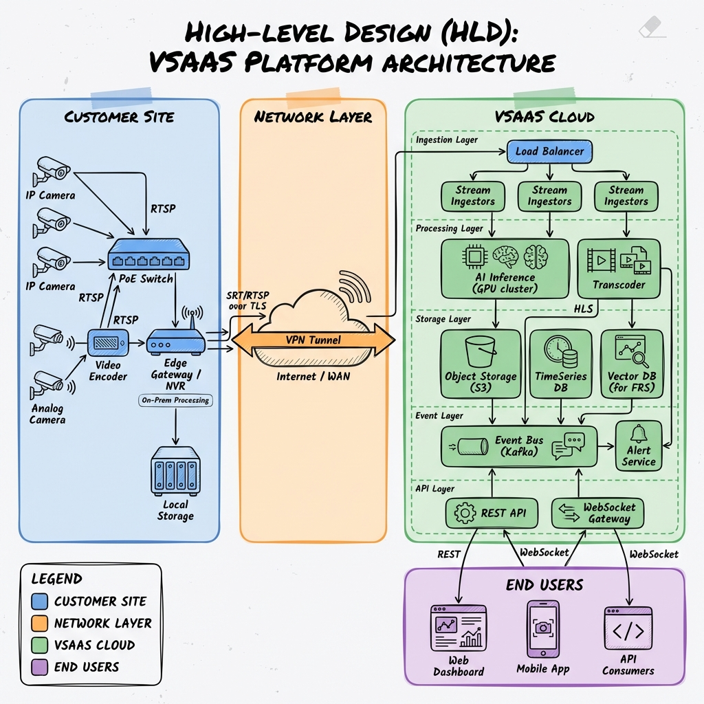

### Low-Level Design (LLD)

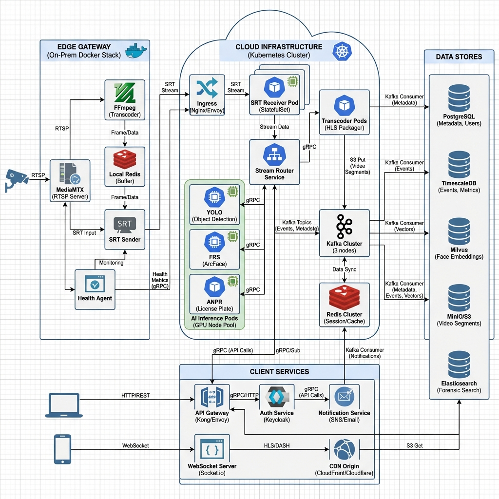

### The Shift from On-Prem to Cloud

| Aspect | On-Prem VMS | VSAAS (Cloud) |
| :--- | :--- | :--- |
| **Storage** | Local NAS/SAN | S3 / Azure Blob / GCS |
| **Compute** | Bare Metal / VM | Docker / Kubernetes |
| **Ingestion** | RTSP over LAN | **SRT over WAN** / RTSP over VPN |
| **Scaling** | Buy More Servers | Auto-Scale Groups |
| **Access** | VPN / Port Forward | HTTPS / WebRTC |
| **Cost Model** | CAPEX | OPEX (Pay-per-stream) |

### Cloud Architecture (AWS Example)

```mermaid
graph TD
    subgraph "Edge (Customer Site)"
        Camera[IP Camera] -->|RTSP| Gateway[Edge Gateway (Docker)]
        Gateway -->|SRT Encrypted| WAN((Internet))
    end
    
    subgraph "AWS Cloud"
        WAN --> Kinesis[Kinesis Video Streams]
        Kinesis --> Lambda[Lambda (Frame Extraction)]
        Lambda --> Rekognition[Rekognition / Custom YOLO]
        Rekognition --> EventBridge[EventBridge (Alerts)]
        Kinesis --> S3[(S3 Archive)]
        
        EventBridge --> SNS[SNS (Push Notification)]
        S3 --> HLS[HLS Packager (CloudFront)]
    end
    
    subgraph "Viewer"
        HLS --> Web[Web Player (hls.js)]
        HLS --> Mobile[Mobile App]
    end
```

### Key AWS Services for VSAAS

| Service | Purpose | Cost (Approx) |
| :--- | :--- | :--- |
| **Kinesis Video Streams** | Ingest RTSP/WebRTC, durable storage. | $0.0085/GB ingested |
| **Rekognition** | Face detection, object detection. | $0.001/image |
| **S3 Glacier** | Long-term archival (90+ days). | $0.004/GB/month |
| **CloudFront** | HLS/DASH delivery. | $0.085/GB out |

---

## 🐳 Deployment: Docker vs Bare Metal

### Bare Metal (Traditional)
*   **Use Case**: High-density NVRs (100+ cameras/server), guaranteed latency.
*   **Advantage**: No container overhead, direct NIC access (DPDK).
*   **Tooling**: Ansible for config management.

### Docker / Kubernetes
*   **Use Case**: Microservices (Ingestor, Transcoder, AI, API as separate containers).
*   **Advantage**: Easy scaling, CI/CD, resource isolation.
*   **Warning**: GPU passthrough in Docker requires `nvidia-docker`.

```yaml
# docker-compose.yml (VMS Microservice Stack)
version: "3.8"
services:
  rtsp-ingestor:
    image: bluenviron/mediamtx:latest
    ports:
      - "8554:8554" # RTSP
    volumes:
      - ./mediamtx.yml:/mediamtx.yml

  ai-inference:
    image: ultralytics/yolov8:latest
    deploy:
      resources:
        reservations:
          devices:
            - capabilities: [gpu]
    environment:
      - MODEL=yolov8n.pt

  web-dashboard:
    image: nginx:alpine
    ports:
      - "80:80"
    volumes:
      - ./frontend:/usr/share/nginx/html

  tsdb:
    image: timescale/timescaledb:latest-pg15
    environment:
      - POSTGRES_PASSWORD=secret
    volumes:
      - tsdb_data:/var/lib/postgresql/data

volumes:
  tsdb_data:
```

---

## 🌐 Real-Time Streaming: WebRTC, WebSocket, STOMP

### When to Use Each

| Protocol | Use Case | Latency | Browser Native? |
| :--- | :--- | :--- | :--- |
| **WebRTC** | Live View (Bidirectional Audio) | <500ms | ✅ Yes |
| **WebSocket + H.264** | Live View (One-Way) | ~1-2s | ⚠️ MSE Required |
| **STOMP** | Event Push (Alerts, Metadata) | ~50ms | ✅ Yes (via SockJS) |
| **HLS** | DVR Playback, Multi-Viewer | 2-10s | ✅ Yes |

### 1:Many Live View Protocol Selection

| Latency Need | Web Browser | Mobile App | Operator Workstation | Protocol |
| :--- | :---: | :---: | :---: | :--- |
| **Ultra-Low (<500ms)** | WebRTC | WebRTC | WebRTC or RTSP | **WebRTC via SFU** |
| **Low (1-3s)** | LL-HLS | LL-HLS | RTSP (native) | **LL-HLS + RTSP** |
| **Standard (3-10s)** | HLS | HLS | HLS | **HLS (CDN-friendly)** |

> [!TIP]
> **Enterprise VMS Strategy**: Workstations use **RTSP direct** (lowest latency, GPU decode). Web/Mobile use **LL-HLS**. Alarm pop-ups trigger **WebRTC** session via SFU.

### WebRTC for Live View (Low Latency)

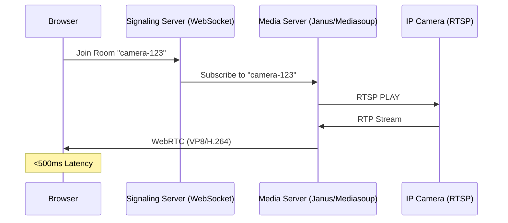
```mermaid
sequenceDiagram
    participant Browser
    participant Signaling as Signaling Server (WebSocket)
    participant SFU as Media Server (Janus/Mediasoup)
    participant Camera as IP Camera (RTSP)
    
    Browser->>Signaling: Join Room "camera-123"
    Signaling->>SFU: Subscribe to "camera-123"
    SFU->>Camera: RTSP PLAY
    Camera->>SFU: RTP Stream
    SFU->>Browser: WebRTC (VP8/H.264)
    
    Note over Browser: <500ms Latency
```

### STOMP for Events (Alert Push)

STOMP (Simple Text Oriented Messaging Protocol) runs over WebSocket.
*   **Use Case**: Push "Motion Detected on Camera 5" to dashboard instantly.
*   **Server**: RabbitMQ (STOMP plugin), Spring WebSocket.
*   **Client**: `@stomp/stompjs` (JavaScript).

```javascript
// Browser (STOMP Client)
const client = new StompJs.Client({
  brokerURL: 'wss://vms.example.com/stomp',
  onConnect: () => {
    client.subscribe('/topic/alerts', (message) => {
      console.log('Alert:', JSON.parse(message.body));
    });
  },
});
client.activate();
```

---

## 🧪 Local Development Setup (AWS Free Tier + Docker)

### Goal
Build a mini-VMS locally with:
1.  Simulated camera (FFmpeg RTSP stream).
2.  MediaMTX (Open-source RTSP server).
3.  AI inference (YOLO in Docker).
4.  Dashboard (HLS playback in browser).

### Step 1: Simulate a Camera (FFmpeg)
```bash
# Generate a test stream (loops video as RTSP)
ffmpeg -re -stream_loop -1 -i test_video.mp4 \
  -c copy -f rtsp rtsp://localhost:8554/simulated-camera
```

### Step 2: Run MediaMTX (RTSP Relay + HLS Packager)
```yaml
# mediamtx.yml
paths:
  simulated-camera:
    source: publisher
    sourceOnDemand: yes

  all:
    hlsEnabled: true
```
```bash
docker run -d -p 8554:8554 -p 8888:8888 \
  -v ./mediamtx.yml:/mediamtx.yml \
  bluenviron/mediamtx:latest
```
*   RTSP: `rtsp://localhost:8554/simulated-camera`
*   HLS: `http://localhost:8888/simulated-camera/index.m3u8`

### Step 3: AI Inference (YOLO in Docker)
```bash
docker run --gpus all -it \
  -v ./frames:/frames \
  ultralytics/yolov8:latest \
  yolo detect predict source=/frames model=yolov8n.pt
```

### Step 4: Dashboard (hls.js)
```html
<script src="https://cdn.jsdelivr.net/npm/hls.js@latest"></script>
<video id="video" controls></video>
<script>
  const video = document.getElementById('video');
  const hls = new Hls();
  hls.loadSource('http://localhost:8888/simulated-camera/index.m3u8');
  hls.attachMedia(video);
</script>
```

### AWS Free Tier Considerations
*   **Kinesis Video Streams**: 1GB ingested free/month (very limited).
*   **EC2 t2.micro**: 750 hours/month (good for dev).
*   **S3**: 5GB storage free.
*   **Rekognition**: 5000 images/month free (face detection).

> [!TIP]
> For serious development, use LocalStack to mock Kinesis/S3 locally.

---

## 🔗 Related Documents
*   [Live Streaming Architecture](./live-streaming-architecture-guide.md)
*   [Video Security (DRM)](./video-streaming-security-architecture.md)
*   [SRT Protocol](./srt-protocol-guide.md)